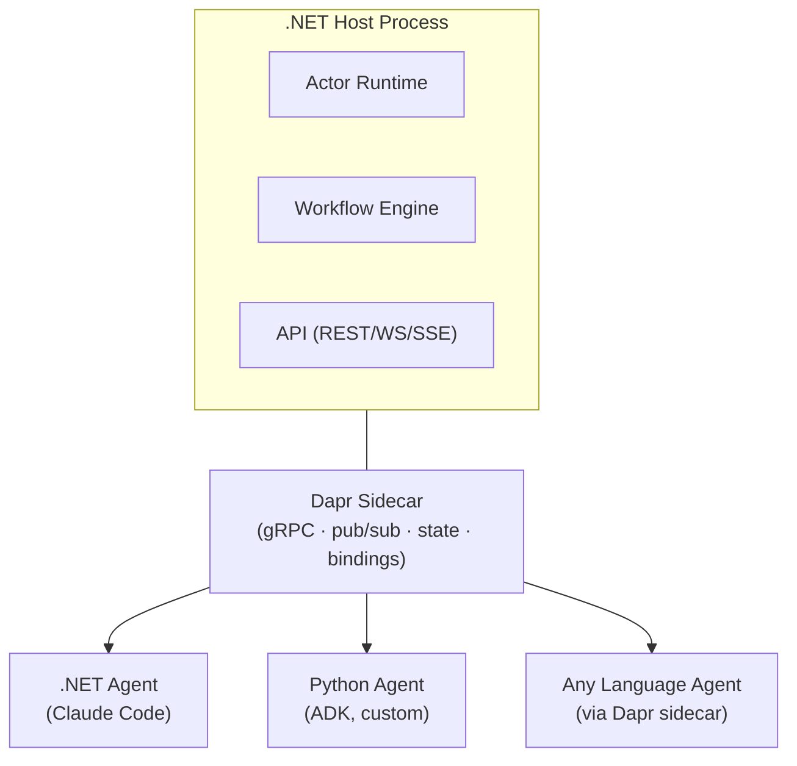
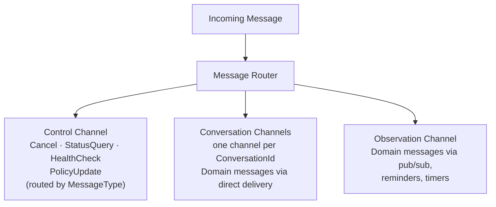
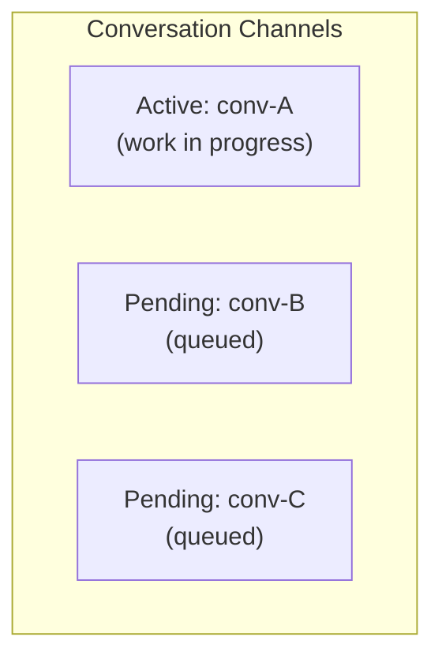
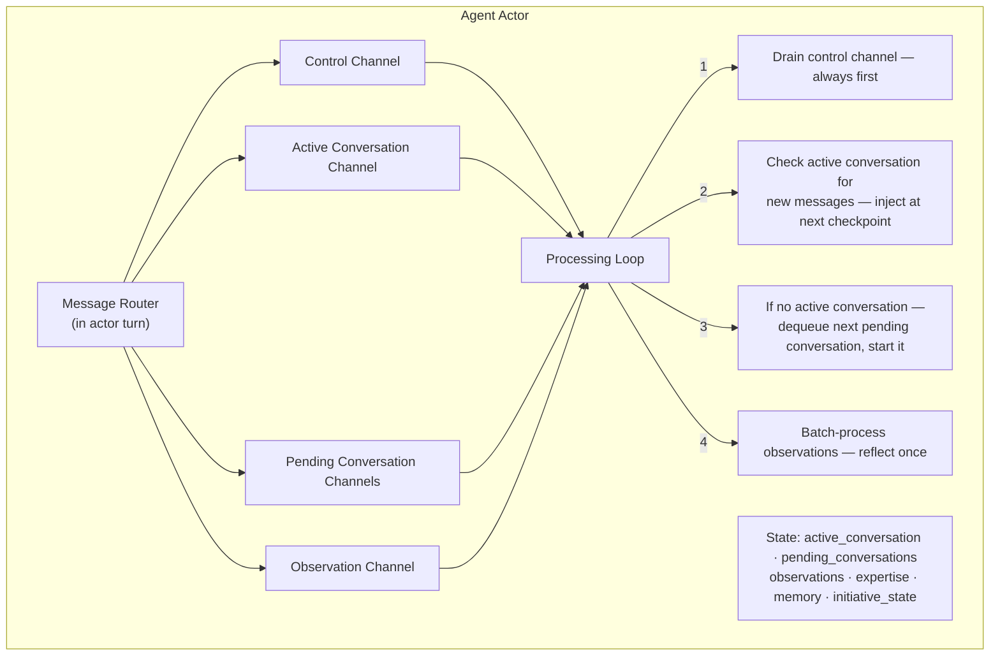
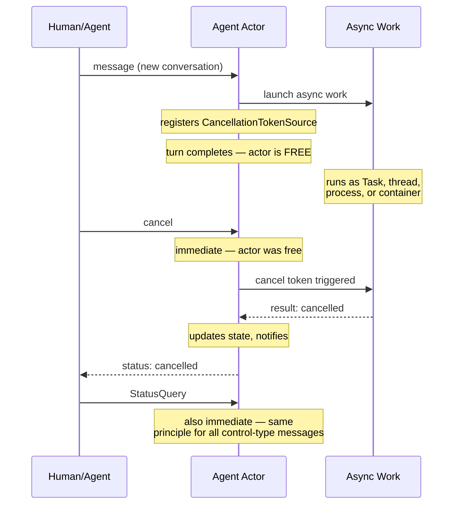
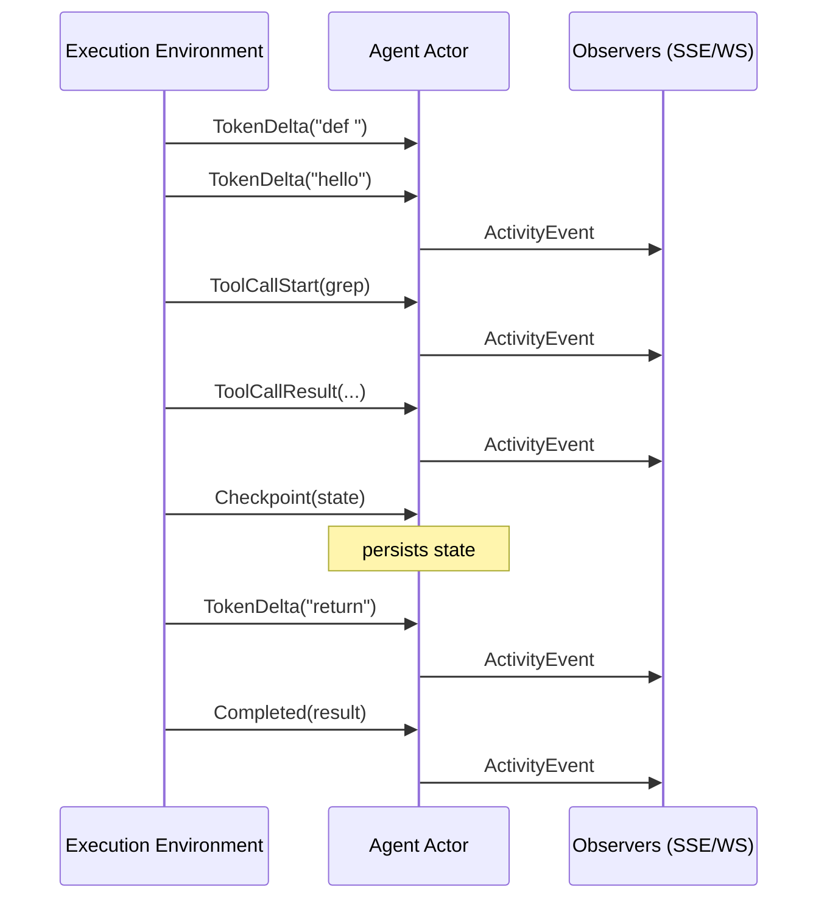
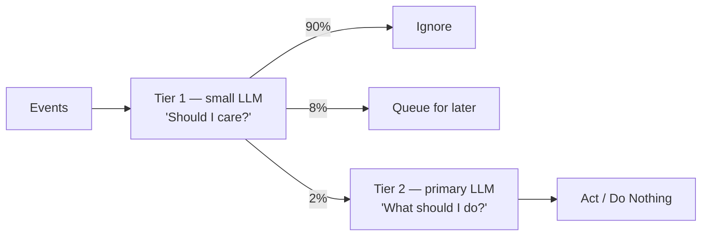
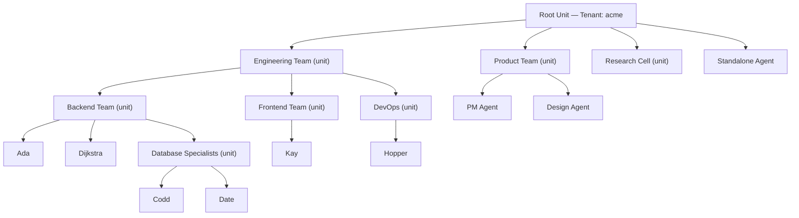
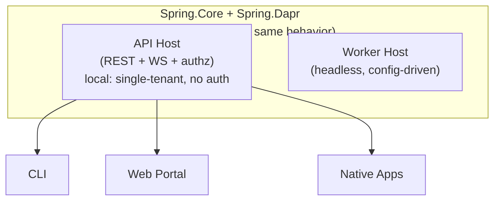
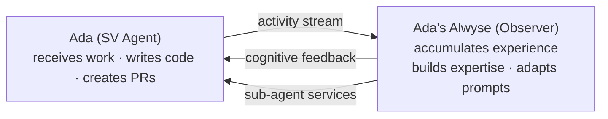

# Spring Voyage V2 — Architecture Plan

**Status:** Draft  
**Last updated:** 2026-04-08

---

## 1. Context & Problem Statement

### What v1 Taught Us

Spring Voyage v1 is a working proof-of-concept: Claude-powered agents collaborating on GitHub repositories. It works — but its architecture has fundamental limitations that prevent it from becoming the general-purpose AI team platform it needs to be.

**v1 limitations driving v2:**

1. **GitHub-centric by design.** The entire model — issues as work items, labels as state, PRs as output, webhooks as events — is hardwired to software engineering on GitHub. A product management team working with documents, a creative team working with Figma, a people management team working with messages — none of these fit v1's model.
2. **Flat team structure only.** v1 has one organizational unit: a team of expert agents with a team leader. No nested teams, no communities, no ad-hoc gatherings, no self-organizing groups.
3. **Single-human interaction model.** v1 assumes one user. Multiple humans interacting with the same agent or team — with different permission levels — isn't supported.
4. **Brittle, baked-in state machine.** The v1 state machine (READY → IN_PROGRESS → DONE with label-based transitions) is fragile and hardcoded. Different work patterns need different workflows — from explicit step-by-step orchestration to fully LLM-driven coordination.
5. **Poor observability.** Observing agent work and errors requires admin platform access and log diving. No structured activity streams, no agent-to-agent observation, no dashboard-level insight into what agents are thinking and deciding.
6. **Multi-tenancy as afterthought.** No clean tenant upgrades, no tenant-scoped access control, single-user assumption throughout.
7. **Human-in-the-loop only.** v1 agents wait for assignments, do work, wait for review. No initiative, no continuous operation, no autonomous decision-making.
8. **Python runtime issues.** Despite thousands of tests, many errors surface only at runtime. Type safety at the infrastructure/plumbing layer would reduce this class of bugs.
9. **Manual concurrency scaling.** To handle concurrent work of the same type, v1 required defining multiple identical agents (e.g., three backend engineers). If all were busy, work queued. No dynamic scaling, no elasticity.

### What v1 Got Right (and we carry forward)

- The core insight: AI agents collaborating through external tools (Claude Code) with worktree isolation
- Brain/Hands separation (implicit in v1, explicit in v2)
- The general flow: receive work → plan → execute → deliver → learn
- Agent memory (persistent learning across conversations)
- Prompt assembly patterns
- Web dashboard concept (activity feed, agent status, analytics)

---

## 2. Vision & Goals

Spring Voyage V2 is a general-purpose AI agent orchestration platform. It enables autonomous AI agents — organized into composable groups called **units** — to collaborate on any domain: software engineering, product management, creative work, research, operations, and more.

Agents connect to external systems through pluggable **connectors**, communicate via typed **messages**, take **initiative** to act autonomously, and can be observed by humans and other agents in real-time.

### Design Goals

Each goal directly addresses a v1 limitation:


| Goal                                                                                               | Addresses                                 |
| -------------------------------------------------------------------------------------------------- | ----------------------------------------- |
| **Domain-agnostic.** Agents work with any external system, not just GitHub.                        | v1 limitation #1 (GitHub-centric)         |
| **Composable.** Units nest recursively. A unit appears as a single agent to its parent.            | v1 limitation #2 (flat teams)             |
| **Multi-human.** Multiple humans interact with agents at different permission levels.              | v1 limitation #3 (single-human)           |
| **Flexible orchestration.** From rigid workflows to fully autonomous — each unit chooses.          | v1 limitation #4 (brittle state machine)  |
| **Observable.** Humans see what agents are doing, thinking, deciding, and spending — in real-time. | v1 limitation #5 (poor observability)     |
| **Multi-tenant.** Clean isolation, scoped access, federation-ready.                                | v1 limitation #6 (afterthought)           |
| **Self-organizing.** Agents take initiative, operate continuously, and make autonomous decisions.  | v1 limitation #7 (human-in-the-loop only) |
| **Type-safe infrastructure.** .NET infrastructure layer with Dapr building blocks.                 | v1 limitation #8 (Python runtime issues)  |
| **Elastic.** Agents clone dynamically to handle concurrent work. No manual agent duplication.      | v1 limitation #9 (manual scaling)         |
| **Cost-aware.** Every LLM call, every initiative reflection, every action has a tracked cost.      | New requirement                           |


---

## 3. Terminology


| Term                      | Description                                                                                                                  |
| ------------------------- | ---------------------------------------------------------------------------------------------------------------------------- |
| **Agent**                 | An autonomous AI-powered entity. Not necessarily a "worker" — can be an observer, advisor, monitor, researcher.              |
| **Unit**                  | A group of agents performing together. A unit IS an agent (composite pattern). Contains agents and/or other units.           |
| **Connector**             | A pluggable adapter bridging an external system (GitHub, Slack, Figma, etc.) to the unit.                                    |
| **Message**               | A typed communication between addressable entities.                                                                          |
| **Address**               | A globally-unique routable identity (namespaced by tenant + unit path).                                                      |
| **Topic**                 | A named pub/sub channel for event distribution.                                                                              |
| **Package**               | An installable bundle of skills, connectors, workflows, templates, or config.                                                |
| **Activation**            | What causes an agent to wake up and act.                                                                                     |
| **Workflow**              | A durable, structured execution plan for a unit.                                                                             |
| **Directory**             | A registry of agent expertise, queryable within and across units.                                                            |
| **Mailbox**               | An agent's inbound message system with prioritized channels.                                                                 |
| **Initiative**            | An agent's capacity to autonomously decide to act without external triggers.                                                 |
| **Boundary**              | The interface a unit exposes when acting as a member of a parent unit. Controls what is visible, projected, or encapsulated. |
| **Tenant**                | An isolated organizational unit. Contains a root unit. Maps to a Dapr namespace.                                             |
| **Observer**              | An agent that subscribes to another agent's activity stream (with permission).                                               |
| **Execution Environment** | An isolated runtime (container) where an agent's delegated work runs. Separate from the agent actor.                         |
| **Clone**                 | A platform-managed copy of an agent, spawned to handle concurrent work. Governed by the agent's cloning policy.              |
| **A2A**                   | Agent-to-Agent protocol. Open standard for cross-framework agent communication.                                              |


---

## 4. Infrastructure: Dapr + Language-Agnostic Architecture

### Why Dapr

Dapr is a distributed application runtime that provides building blocks as a sidecar process. It is language-agnostic — our application talks to the Dapr sidecar via gRPC/HTTP, and Dapr handles the infrastructure with pluggable components swappable via YAML configuration.


| Dapr Building Block    | What it provides                                                                                                                                                          |
| ---------------------- | ------------------------------------------------------------------------------------------------------------------------------------------------------------------------- |
| **Actors**             | Virtual actors for agents, units, connectors. Turn-based concurrency (natural mailbox). Reminders and timers for scheduled activation. Automatic activation/deactivation. |
| **Workflows**          | Durable orchestration: task chaining, fan-out/fan-in, parallel execution, monitoring patterns. Built on actors. Automatic recovery from failures.                         |
| **Pub/Sub**            | Pluggable pub/sub with 30+ broker backends. At-least-once delivery. Topic-based routing. Dead letter support.                                                             |
| **State Management**   | Pluggable state stores (PostgreSQL, Redis, Cosmos, etc.) for agent state, memory, unit state.                                                                             |
| **Bindings**           | Input/output connectors to external systems — cron schedules, HTTP webhooks, SMTP, cloud services.                                                                        |
| **Secrets**            | Pluggable secret stores (local files, Azure Key Vault, Kubernetes secrets, HashiCorp Vault).                                                                              |
| **Service Invocation** | Secure service-to-service calls with mTLS, retries, observability.                                                                                                        |
| **Configuration**      | Dynamic configuration with subscription to changes.                                                                                                                       |
| **A2A**                | Agent-to-agent communication protocol support.                                                                                                                            |


### Language-Agnostic Agent Architecture via Dapr Sidecar

The Dapr sidecar pattern makes the platform language-agnostic. Any process that can speak HTTP/gRPC to `localhost:3500` participates as a first-class citizen.

**.NET (C#) — Infrastructure layer (fixed):**

- Actor lifecycle (Dapr virtual actors)
- Message routing and addressing
- Pub/sub management
- State persistence
- Workflow orchestration (Dapr Workflows)
- Multi-tenancy and security (mTLS, RBAC, namespace isolation)
- API surface (REST, WebSocket, SSE)
- Container/execution environment management
- Observability pipeline

**Agent brain logic — language-agnostic:**

The agent's "brain" (AI reasoning, LLM calls, prompt assembly) can be implemented in any language. The choice depends on the execution pattern:

- **.NET agents:** Agents that delegate execution to a tool (e.g., Claude Code CLI) can be pure .NET. The .NET actor dispatches work to the execution environment container; the tool drives the agentic loop. Also suitable when using the Anthropic .NET SDK or Azure OpenAI SDK directly.
- **Python agents:** When direct LLM SDK integration is needed (e.g., custom prompt assembly, tool-calling loops) or when using AI frameworks (Google ADK, LangGraph, LangChain). Python processes communicate via the Dapr sidecar.
- **Other languages:** Any language with HTTP/gRPC client capabilities can serve as an agent brain via the sidecar.




### Dapr Agents Framework

Dapr Agents is a Python framework for building AI agents on top of Dapr workflows and actors. For Python-based agents, it provides:

- Flexible agentic patterns (tool calling, reasoning loops, ReAct)
- Durable task execution with state management built on Dapr Workflows
- Support for invoking other agents as tools (agent-to-agent delegation)
- Failure recovery and compensation

For Python-based agents, we should evaluate Dapr Agents as an alternative to a custom agent loop. For .NET-based agents, we build our own on Dapr actors.

**Tool provisioning:** Each agent definition includes a tool manifest specifying which tools are available in its execution environment.

**Process isolation:** Each execution environment runs in a container (Podman/Docker). No shared filesystem. Explicit mount points for workspace access.

**Security:** Sandboxed execution by default — no network access, no filesystem access beyond the mounted workspace. Explicit permission grants for network, filesystem, and secret access via the agent definition.

---

## 5. The Fundamental Abstraction: IAddressable

### Core Types

```csharp
record Address(string Scheme, string Path);  // path: ("agent", "engineering-team/ada")
                                              // direct: ("agent", "@f47ac10b-...")

enum MessageType
{
    Domain,        // agent interprets Payload; platform routes by delivery mechanism
    Cancel,        // platform triggers CancellationTokenSource for active conversation
    StatusQuery,   // platform actor responds directly with current state
    HealthCheck,   // platform responds with liveness status
    PolicyUpdate   // platform applies runtime policy changes to actor state
}

record Message
{
    Guid Id { get; init; }                    // unique — deduplication, ack, audit
    Address From { get; init; }
    Address To { get; init; }
    MessageType Type { get; init; }          // platform action or Domain (agent interprets)
    string? ConversationId { get; init; }     // correlates related messages
    JsonElement Payload { get; init; }        // typed per MessageType / domain convention
    DateTimeOffset Timestamp { get; init; }
}
```

**Routing is fully platform-controlled.** The sender does not specify priority or urgency — the platform determines which mailbox channel a message enters based on two things:

1. `**MessageType`** — control types (`Cancel`, `StatusQuery`, `HealthCheck`, `PolicyUpdate`) always route to the **control channel**. The platform has built-in behavior for each.
2. **Delivery mechanism** — for `Domain` messages, the platform uses the delivery context:
  - **Direct message** (actor method call) → **conversation channel** (by `ConversationId`)
  - **Pub/sub subscription** → **observation channel** (batched for initiative processing)
  - **Reminder / timer** → **observation channel** (initiative triggers)
  - **Input binding** (external event via connector) → **conversation channel** (new work)

This means no sender can escalate their own message priority. The platform is the sole authority on routing. Domain-specific semantics (e.g., "implement-feature", "review-pr") are structured data within the `Payload`, defined by domain packages as conventions. The platform never inspects the Payload of a `Domain` message.

`ReceiveAsync` returns `Task<Message?>` — nullable response. Control queries (e.g., `StatusQuery`) may return a synchronous response. `Domain` messages return `null`; results flow back as separate messages.

### Interface Design: Lean Core + Composable Capabilities

```csharp
// Identity — "I can be addressed"
interface IAddressable
{
    Address Address { get; }
}

// Core messaging — "I can be addressed AND I can process messages"
interface IMessageReceiver : IAddressable
{
    Task<Message?> ReceiveAsync(Message message);
}

// Composable capability interfaces — entities implement what applies
interface IExpertiseProvider
{
    ExpertiseProfile GetExpertise();
}

// Uses .NET-native IObservable<T> (System namespace) with Rx.NET 6.x operators
interface IActivityObservable
{
    IObservable<ActivityEvent> ActivityStream { get; }
}

interface ICapabilityProvider
{
    IReadOnlyList<string> Capabilities { get; }
}
```

`IActivityObservable` leverages the .NET built-in `IObservable<T>` interface and System.Reactive (Rx.NET 6.x). Consumers use Rx.NET operators — `.Where()`, `.Buffer()`, `.Throttle()`, `.Select()`, `.Merge()` — to filter, combine, and transform activity streams. This is strictly better than `IAsyncEnumerable` for observation because Rx.NET provides backpressure, windowing, time-based operators, and hot observable semantics (multiple subscribers share a single stream) out of the box.

**Who implements what:**


| Entity    | IMessageReceiver | IExpertiseProvider | IActivityObservable | ICapabilityProvider      |
| --------- | ---------------- | ------------------ | ------------------- | ------------------------ |
| Agent     | Yes              | Yes                | Yes                 | Yes                      |
| Unit      | Yes              | Yes (aggregated)   | Yes (aggregated)    | Yes (union or projected) |
| Human     | Yes              | No                 | No                  | No                       |
| Connector | Yes              | No                 | Yes                 | Yes                      |


### Dapr Actor Mapping

All four actor types implement `IMessageReceiver` (and therefore `IAddressable`). Each maps to a Dapr virtual actor:


| Actor              | Represents                | Key Responsibilities                                                     |
| ------------------ | ------------------------- | ------------------------------------------------------------------------ |
| **AgentActor**     | Single AI entity          | Runtime state, cognition (AI calls), pub/sub subscriptions, mailbox      |
| **UnitActor**      | Composite agent (a group) | Member management, policies, expertise directory, orchestration dispatch |
| **ConnectorActor** | External system bridge    | Event translation, outbound skills, connection lifecycle                 |
| **HumanActor**     | Human participant         | Notification routing, permission enforcement                             |


---

## 6. Agent Mailbox & Message Processing

### The Core Question: How Does an Agent Handle Concurrent Messages?

Dapr actors provide turn-based concurrency — one message processed at a time. But agents need to handle multiple concerns simultaneously: working on an active conversation while receiving status updates, cancellations, or messages from different sources.

### Design: Partitioned Mailbox with Priority Processing

Each agent's mailbox is logically partitioned into three channel types:




**Conversation channels** replace the flat work queue. Each distinct `ConversationId` gets its own channel — a queue of related messages. At most one conversation is **active** (has work in progress); all others are **pending**.




A `Domain` message arriving via direct delivery with a new (or absent) `ConversationId` creates a new conversation channel. Follow-up messages carrying the same `ConversationId` are routed to the existing channel. Routing is determined by `MessageType` and delivery mechanism — the platform never inspects the `Payload` for routing decisions.

**Processing model:**

The processing loop is **event-driven**. All triggers — incoming messages, timer firings, subscription notifications — surface as events that trigger a processing pass. There is no timer-based polling.

The agent actor maintains a **single Dapr actor turn** for state consistency, but uses structured processing within that turn:




**Key behaviors:**

1. **Control messages are never blocked.** A cancellation or other control message is processed even if the agent is mid-work. The actor handles it in the current turn by updating state (setting a cancellation flag). The execution environment checks these flags.
2. **Active conversation gets new messages immediately.** When a message arrives for the currently active conversation (same `ConversationId`), it is placed in that conversation's channel. The sender receives an immediate acknowledgment. The platform does not distinguish between "feedback," "clarification," or any other message type — any message on the active conversation is accumulated for the agent.

   **Message retrieval for delegated agents:** Delegated execution environments (e.g., Claude Code) drive their own agentic loop and don't naturally check back with the actor. The platform provides a `checkMessages` tool in the agent's tool manifest. The agent calls this at natural boundaries (between subtasks, after completing a step). The tool calls back to the actor, which returns any accumulated messages on the active conversation channel. This is pull-based — the agent decides when to check. The actor also includes a "messages pending" flag in checkpoint acknowledgments, hinting that the agent should call `checkMessages` soon. For hosted agents, accumulated messages are injected directly into the next LLM call.
3. **Pending conversations queue.** New conversations (new `ConversationId`) queue as pending. They are started in arrival order when the active conversation completes or is suspended.
4. **Observation messages batch.** Activity events from observed agents and pub/sub notifications accumulate. The initiative cognition loop processes them in batch — "what happened since I last looked?" — rather than one at a time. This is more efficient and produces better reasoning.

**Example flow:**

```text
msg1: implement-feature (conv-A) → creates conv-A channel, starts work → conv-A is ACTIVE
msg2: review-pr (conv-B)         → creates conv-B channel → PENDING
msg3: investigate-bug (conv-C)   → creates conv-C channel → PENDING
msg4: (conv-A)                   → routed to conv-A channel (active)
                                 → injected at next checkpoint
                                 → sender gets ack: "message received"

[conv-A completes]
→ conv-B becomes ACTIVE, work starts
```

**Conversation suspension** is a core capability. An agent can **suspend** the active conversation (e.g., blocked waiting on external input or human approval), promote the next pending conversation, and resume the original later — all with clean per-conversation state. This ensures agents are not idle when blocked.

All agents use the same mailbox model: one active conversation with suspension. For hosted agents, the active period is brief (a single LLM call), so conversations cycle quickly. For delegated agents, the active period is longer (execution environment working). The uniform model keeps the mailbox implementation simple; performance optimizations for hosted agents (e.g., bypassing the pending queue when conversations are short-lived) can be added later without changing the model.

### Asynchronous Work Dispatch & Cancellation

The actor's primary responsibility is **processing messages**. It never performs long-running work synchronously. Every work message is handled the same way: the actor validates, updates state, launches the work asynchronously, and returns — remaining immediately available for the next message.

**Asynchronous dispatch model:** When the actor processes a work message, it launches the work via one of several mechanisms — a .NET `Task`, a background thread, a child process, or a remote execution environment (container) — and registers a `CancellationTokenSource` for that work. The actor turn completes in milliseconds. The actor is then free to process any subsequent message, including cancellation and other control messages.

**Cancellation is immediate.** When a cancel message arrives, the actor is guaranteed to be available to process it (since no work runs inside the actor turn). The actor triggers the `CancellationTokenSource`, which propagates cancellation to whatever async mechanism is running the work:




This pattern applies uniformly regardless of how the work is executed:


| Dispatch Mechanism           | Cancellation Propagation                                                                                                 |
| ---------------------------- | ------------------------------------------------------------------------------------------------------------------------ |
| .NET `Task`                  | `CancellationToken` passed to async methods; aborts in-flight HTTP calls, LLM API calls, etc.                            |
| Background thread            | Token checked at processing boundaries; thread terminates gracefully.                                                    |
| Child process                | Actor sends signal (SIGTERM or side-channel); process exits and returns partial results.                                 |
| Remote execution environment | Actor sends cancel via Dapr service invocation to the container. Container process catches it and terminates gracefully. |


The actor guarantees **actor processing semantics** at all times: messages are always processed in order, state is always consistent, and no message is ever blocked behind long-running work.

### Streaming: Real-Time Output from Execution Environments

Execution environments stream tokens and events back to the actor in real-time, enabling live observation of agent work.




**Stream event types:**


| Event            | Description                                                    |
| ---------------- | -------------------------------------------------------------- |
| `TokenDelta`     | LLM token(s) generated — enables live text streaming           |
| `ThinkingDelta`  | Reasoning/thinking tokens (if model supports)                  |
| `ToolCallStart`  | Agent is invoking a tool (name, arguments)                     |
| `ToolCallResult` | Tool returned a result                                         |
| `OutputDelta`    | Stdout/stderr from delegated execution (e.g., Claude Code CLI) |
| `Checkpoint`     | State snapshot for recovery and progress tracking              |
| `Completed`      | Work finished with final result                                |


**Transport:** The execution environment publishes to a per-agent Dapr pub/sub topic (`agent/{id}/stream`). Multiple subscribers consume from this topic concurrently:

- **Agent Actor** — subscribes for state management. Processes `Checkpoint` and `Completed` events to update actor state. Projects all events to its `IObservable<ActivityEvent>` stream for agent-to-agent observation.
- **API Host** — subscribes directly to the same topic for real-time relay to connected browsers via SSE/WebSocket. This avoids routing every token through the actor, reducing latency for human observers.

This is standard Dapr pub/sub with multiple subscribers — no special bypass mechanism needed. The actor remains the authority on state; the API host is a pass-through for display.

---

## 7. Agent Model

An agent definition describes *what* the agent is — not *where* or *how* it runs. Agents are created declaratively (YAML applied via CLI or API) or programmatically (API call). The lifecycle is: **define → create → activate → run → deactivate → delete**. Dapr virtual actors handle activation/deactivation automatically — an agent actor is activated on first message and deactivated after idle timeout.

```yaml
# yaml-language-server: $schema=schemas/agent.schema.json
agent:
  id: ada
  name: Ada
  
  role: backend-engineer
  capabilities: [csharp, python, fastapi, postgresql, testing]
  
  ai:
    agent: claude                       # registered AI agent provider
    model: claude-sonnet-4-20250514
    execution: delegated                # hosted | delegated
    tool: claude-code                   # registered tool name (delegated only)
    environment:                        # container definition (delegated only)
      image: spring-agent:latest
      runtime: podman                   # podman | docker | kubernetes
    
  cloning:
    policy: ephemeral-with-memory
    attachment: attached
    max_clones: 3
    
  instructions: |
    You are a backend engineer...
    
  expertise:
    - domain: python/fastapi
      level: advanced
    - domain: postgresql
      level: intermediate
    
  activations:
    - type: message                     # direct messages
    - type: subscription
      topic: pr-reviews
      filter: "labels contains 'backend'"
    - type: reminder
      schedule: "0 9 * * MON-FRI"
      payload: { action: "daily-standup" }
    - type: binding
      component: github-webhook
      route: /issues
```

### Execution Patterns

**Pattern A: Hosted AI** (`execution: hosted`)  
The agent actor calls the AI agent provider directly (via .NET SDK or Python process). The LLM reasons, decides, and responds — but doesn't touch the filesystem or run tools. Requires `agent` and `model` in the `ai` block. Good for: routing, classification, triage, advisory, monitoring agents. Can be implemented in .NET (using Anthropic .NET SDK, Azure OpenAI SDK) or Python.

**Pattern B: Delegated Execution** (`execution: delegated`)  
The agent actor dispatches work to an execution environment (container) that launches a registered tool (e.g., `claude-code`). The tool drives the agentic loop — reading files, writing code, running tests. The actor monitors via streaming events and collects results. Requires `tool` and `environment` in the `ai` block — `tool` names the registered tool (e.g., `claude-code`), `environment` specifies the container image and runtime. Can be pure .NET — no Python process needed. Essential for: software engineering, document editing, any multi-step tool use.

**Execution environment definition** is the same for agents and units. The `ai.environment` block specifies the container:

```yaml
ai:
  environment:
    image: spring-agent:latest         # container image
    runtime: podman                    # podman | docker | kubernetes
```

Agents that don't specify `ai.environment` inherit the default from their unit's `execution` block (see Section 9). Units that use `execution: delegated` for orchestration specify their own `ai.environment` for the workflow container.

The execution pattern is fixed per agent definition. An agent is either hosted or delegated — it does not switch at runtime. When an agent needs both reasoning and tool-use (e.g., a triage agent that sometimes needs to write code), the recommended pattern is **composition via `requestHelp`**: the hosted agent reasons about the work and delegates tool-use to a delegated agent in the same unit. This is cleaner than runtime mode switching because the triage decision and the code-writing are genuinely different cognitive tasks with different tool requirements, and the unit already provides the composition mechanism.

### Agent Cloning

In v1, handling concurrent work of the same type required manually defining multiple identical agents (e.g., three backend engineers). V2 replaces this with platform-managed cloning — the platform spawns copies of an agent on demand, governed by the agent's cloning policy.

**Cloning policies** (property of the agent definition):


| Policy                  | Behavior                                                                                                                                                                       |
| ----------------------- | ------------------------------------------------------------------------------------------------------------------------------------------------------------------------------ |
| `none`                  | Singleton. Work queues if the agent is busy. The agent accumulates unique knowledge and experiences over time.                                                                 |
| `ephemeral-no-memory`   | Clone spawned from the parent's current state (instructions, capabilities, memory snapshot). Handles one conversation. Destroyed after completion. Nothing flows back.         |
| `ephemeral-with-memory` | Same as above, but the clone's experiences are sent back to the parent before destruction. The parent integrates what it deems relevant into its own memory.                   |
| `persistent`            | Clone persists independently and evolves on its own path. A persistent clone is a full agent — it can define its own cloning policy (bounded by `max_clones` and cost budget). |


**Attachment model** (how clones relate to the parent's unit):


| Mode       | Effect                                                                                                                                                                                                                                                                                                                                                               |
| ---------- | -------------------------------------------------------------------------------------------------------------------------------------------------------------------------------------------------------------------------------------------------------------------------------------------------------------------------------------------------------------------- |
| `detached` | Clones become direct members of the parent's unit — peers of the parent. The unit's orchestration strategy routes work across the parent and its clones.                                                                                                                                                                                                             |
| `attached` | The parent agent promotes itself to a unit. Clones become its members. From the enclosing unit's perspective, the parent remains a single entity (a unit IS an agent). The parent becomes the orchestrator — it stops taking work itself and only routes to its clones. If all clones are destroyed and no active cloning is needed, the parent reverts to an agent. |


**Constraints:**

- **Units cannot be cloned.** A unit already manages composition through membership. Cloning is an agent-level concept.
- **Clones inherit** the parent's instructions, capabilities, expertise, execution pattern, and (for ephemeral clones) a snapshot of the parent's memory at clone time.
- `**max_clones`** caps the number of concurrent clones. The platform will not exceed this limit regardless of work queue depth.
- **Cost budget enforcement.** Clone creation respects the unit's cost budget. If the budget is exhausted, work queues instead of spawning new clones.
- **Persistent clones can clone.** A persistent clone is a full agent with its own UUID, memory, and evolution. It can define its own cloning policy, enabling recursive scaling — bounded by `max_clones` at each level and the unit's cost budget.
- **Observability.** Clone activity is attributed to the parent agent in activity streams and cost tracking, with the clone's UUID as a sub-identifier. Persistent clones that have diverged sufficiently may be promoted to independent agents (manual operation).

**When to use which:**

- `none` — Agents where continuity and unique evolution matter: lead architects, specialized experts, agents that build long-term relationships with humans.
- `ephemeral-no-memory` — Stateless workers: formatters, linters, validators, anything where the clone's experience has no lasting value.
- `ephemeral-with-memory` — Skilled workers: the parent is a senior engineer who spawns temporary helpers. Each helper's learnings (patterns discovered, pitfalls encountered) feed back to the parent, making it better over time.
- `persistent` — Scale-out: the agent needs genuinely independent instances that build their own expertise. Each clone diverges and specializes.
- `detached` — Simple scaling within an existing unit. The unit's orchestration strategy manages routing.
- `attached` — Encapsulated scaling. The parent hides its clones behind a unit boundary. Clean abstraction for the enclosing unit.

### Role

Role serves two purposes:

1. **Multicast addressing** — `role://engineering-team/backend-engineer` routes to all agents with that role
2. **Capability signal** — other agents reason about delegation based on role

### Prompt Assembly & Platform Tools

The agent's AI needs context beyond its user-defined instructions. The actor assembles the full prompt at activation time by composing four layers:


| Layer                          | Source                                      | Content                                                                      | Mutability      |
| ------------------------------ | ------------------------------------------- | ---------------------------------------------------------------------------- | --------------- |
| **1. Platform**                | System-provided                             | Platform tool descriptions, safety constraints, behavioral guidance          | Immutable       |
| **2. Unit context**            | Injected by actor at activation             | Unit policies, peer directory snapshot, active workflow state, skill prompts | Dynamic         |
| **3. Conversation context**    | Injected by actor per invocation            | Prior messages, checkpoints, partial results for the active conversation     | Per-invocation  |
| **4. Agent instructions**      | User-defined (`instructions` in agent YAML) | Role-specific guidance, domain knowledge, personality                        | User-controlled |


For delegated execution, the composed prompt becomes the system prompt passed to the tool. For hosted execution, it becomes the system message in the LLM call.

**Layer 3 — Conversation context** is critical for delegated agents across CLI invocations. Each invocation of a tool like Claude Code starts fresh — it has no memory of prior invocations within the same conversation. The actor composes Layer 3 from: (1) prior messages exchanged in this conversation, (2) the last checkpoint state (if the previous invocation checkpointed), and (3) any partial results from prior invocations. This ensures continuity across invocations without requiring the agent to use `recallMemory` for conversation-specific state. Layer 3 is empty for new conversations and grows as conversations progress. For suspended-then-resumed conversations, Layer 3 includes the full conversation history up to the suspension point.

**Platform tools (Layer 1)** expose platform capabilities to the agent's AI as callable tools. The agent reasons in terms of actions, not messages — the platform translates tool calls into the appropriate messages and service calls internally.


| Tool             | Description                                                                                   |
| ---------------- | --------------------------------------------------------------------------------------------- |
| `checkMessages`  | Retrieve pending messages on the active conversation (delegated agents call at task boundaries) |
| `discoverPeers`  | Query the unit directory for agents with specific expertise or roles                           |
| `requestHelp`    | Ask another agent (by ID or role) for assistance on the current conversation                   |
| `storeLearning`  | Persist a learning (pattern, pitfall, insight) that persists across conversations              |
| `storeContext`   | Persist context (codebase understanding, domain knowledge) for future activations              |
| `recallMemory`   | Retrieve past learnings, context, and work history                                             |
| `checkpoint`     | Save progress on the current conversation (enables message retrieval and recovery)             |
| `reportStatus`   | Update the activity stream with current status                                                 |
| `escalate`       | Raise an issue to a human or to the unit for re-routing                                        |


Additional tools are injected based on the agent's tool manifest and the unit's connectors (e.g., a GitHub connector adds `createPR`, `pushCommit`, etc.).

---

## 8. Agent Initiative

Initiative is the agent's capacity to **autonomously decide to act** — not just respond to triggers, but originate actions.

### Initiative Levels

Initiative levels differ not just in frequency, but in **control scope** — what the agent has autonomous control over. Higher levels require more permissions.


| Level          | Control Scope                                                                                                 | Example                             |
| -------------- | ------------------------------------------------------------------------------------------------------------- | ----------------------------------- |
| **Passive**    | No initiative. Only acts when explicitly activated by external triggers.                                      | A code formatter invoked on demand  |
| **Attentive**  | Monitors events via fixed triggers. Decides *whether* to act on each event.                                   | A security scanner watching commits |
| **Proactive**  | Adjusts its own trigger frequency. Chooses actions from an allowed set. May modify its own reminder schedule. | An agent that notices untested code |
| **Autonomous** | Creates its own triggers, manages its own subscriptions and activation configuration. Full self-direction.    | A research agent tracking a field   |


### Tiered Cognition (Cost-Efficient Initiative)

Initiative is powered by a **two-tier cognition model** that keeps costs manageable:

**Tier 1 — Screening (cheap/free):**  
A small, locally-hosted LLM (e.g., Phi-3, Llama 3.1 8B, Mistral 7B) runs on platform infrastructure. It performs fast, cheap screening:

- Evaluates incoming events against agent context
- Decides: **ignore** / **queue for reflection** / **act immediately**
- Cost: effectively zero (runs on shared platform compute)

**Tier 2 — Reflection (costly, selective):**  
The agent's primary LLM (Claude, GPT-4, etc.) is invoked only when Tier 1 decides it's warranted:

- Full cognition loop: perceive → reflect → decide → act → learn
- Invoked selectively (5-20 times/day vs. 288 if polling every 5 min)
- Cost: predictable and proportional to actual value




### The Cognition Loop (Tier 2)

```
1. Perceive — What has changed since I last reflected?
   (batched observation events, new messages, time elapsed)

2. Reflect — Given my expertise, instructions, and context,
   is there something I should do?

3. Decide — What action, if any?
   • Send a message to another agent
   • Start a new conversation
   • Query the expertise directory
   • Raise an alert to a human
   • Update my own knowledge
   • Do nothing (common outcome)

4. Act — Execute the decided action

5. Learn — Record the outcome (via memory or cognitive backbone)
```

**Permission implications:** Higher initiative levels require more permissions. Proactive agents need `reminder.modify` to adjust their own schedule. Autonomous agents additionally need `topic.subscribe` to create new subscriptions and `activation.modify` to change their own activation configuration. The initiative policy acts as a permission boundary — the `max_level` implicitly caps which self-modification permissions are granted.

> **Open issue: Initiative policy granularity.** Is `max_level` sufficient as the initiative policy (each level implies a known set of capabilities), or should there be explicit per-capability flags (e.g., `can_modify_subscriptions: true`, `can_create_triggers: true`)? For now, `max_level` is the primary control.

### Initiative Policies (Unit-Level)

```yaml
unit:
  policies:
    initiative:
      max_level: proactive
      require_unit_approval: false
      tier1:
        model: phi-3-mini
        hosting: platform               # runs on platform infra
      tier2:
        max_calls_per_hour: 5
        max_cost_per_day: $3.00
      allowed_actions:
        - send-message
        - start-conversation
        - query-directory
      blocked_actions:
        - modify-connector-config
        - spawn-agent
```

When a cognitive backbone is available (see Future Work: Alwyse), the initiative loop gains pattern recognition ("this type of PR always fails review"), opportunity detection ("no one has updated docs in 3 weeks"), risk assessment, and learning from initiative outcomes. Initiative becomes genuine judgment rather than rule-based + LLM reasoning.

---

## 9. Unit Model

A unit is a composite agent — a group of agents that appears as a single `IMessageReceiver` to the outside world. The unit owns **identity** (address, membership, boundary, activity stream) and delegates **orchestration** (how incoming messages are routed to members) to a pluggable strategy.

### Unit as Entity vs. Orchestration as Strategy

The unit actor is responsible for:

- **Identity:** address, membership list, boundary configuration
- **Membership:** managing which agents and sub-units belong to the unit
- **Boundary:** controlling what is visible to the parent unit
- **Activity stream:** aggregating member activity for observation
- **Expertise directory:** maintaining the aggregated expertise of all members

The unit delegates message handling to an `**IOrchestrationStrategy`**:

```csharp
interface IOrchestrationStrategy
{
    Task<Message?> HandleMessageAsync(Message message, IUnitContext context);
}
```

Where `IUnitContext` provides access to members, directory, policies, connectors, and workflow state. The strategy decides how to route, assign, and coordinate work. The strategy can be swapped independently of the unit's identity — e.g., upgrading from rule-based to AI-orchestrated as a team matures.

```yaml
unit:
  name: engineering-team
  description: Software engineering team for the spring-voyage repo
  
  structure: hierarchical            # hierarchical | peer | custom
  
  # --- Unit AI (the unit IS an agent — same ai block pattern) ---
  # Delegated: orchestration runs in a workflow container
  ai:
    execution: delegated
    tool: software-dev-cycle         # registered workflow tool
    environment:                     # container for orchestration logic
      image: spring-workflows/software-dev-cycle:latest
      runtime: podman
  
  members:
    - agent: ada
    - agent: kay
    - agent: hopper
    - unit: database-team            # recursive composition
  
  # --- Default execution environment for member agents ---
  # Members that don't specify their own ai.environment inherit this
  execution:
    image: spring-agent:latest
    runtime: podman                  # podman | docker | kubernetes
  
  connectors:
    - type: github
      config:
        repo: savasp/spring
        webhook_secret: ${GITHUB_WEBHOOK_SECRET}
    - type: slack
      config:
        channel: "#engineering-team"
  
  packages:
    - spring-voyage/software-engineering
  
  policies:
    communication: hybrid            # through-unit | peer-to-peer | hybrid
    work_assignment: unit-assigns    # unit-assigns | self-select | capability-match
    expertise_sharing: advertise
    initiative:
      max_level: proactive
      max_actions_per_hour: 20
    
  humans:
    - identity: savasp
      permission: owner
      notifications: [slack, email]
    - identity: reviewer2
      permission: operator
      notifications: [github]
    - identity: stakeholder1
      permission: viewer
      notifications: [email]
```

**Unit AI — hosted vs. delegated:**

The unit's `ai` block follows the same pattern as an agent's `ai` block. The two execution modes are mutually exclusive:

- **Hosted** (`execution: hosted`) — the unit uses an LLM to orchestrate. Requires `agent`, `model`, `prompt`, and optionally `skills`. The LLM receives messages, reasons about routing, and sends messages to members.
- **Delegated** (`execution: delegated`) — the unit delegates orchestration to a workflow container. Requires `tool` and `environment`. The workflow container drives the orchestration logic — it may use an LLM internally, but that's the container's concern, not the unit definition's.

**Example: AI-orchestrated unit (hosted):**

```yaml
unit:
  name: research-cell
  ai:
    agent: claude
    model: claude-sonnet-4-20250514
    execution: hosted
    prompt: |
      You coordinate a research team. Route papers
      to the most relevant researcher by expertise.
    skills:
      - package: spring-voyage/research
        skill: paper-triage
  members:
    - agent: researcher-ml
    - agent: researcher-systems
```

### Orchestration Strategies

Five concrete implementations of `IOrchestrationStrategy`:


| Strategy               | Description                                                                                                                | AI Involvement | Example                                   |
| ---------------------- | -------------------------------------------------------------------------------------------------------------------------- | -------------- | ----------------------------------------- |
| **Rule-based**         | Deterministic routing by policy (round-robin, role-matching, capability-based, priority queue). No LLM.                    | None           | Load-balanced work distribution           |
| **Workflow**           | A Dapr Workflow drives the sequence. Steps invoke agents as activities. The workflow controls routing.                     | None (minimal) | CI/CD pipeline, compliance review         |
| **AI-orchestrated**    | LLM receives the message + unit context (members, directory, policies) and decides routing, assignment, and coordination.  | Full           | Software dev team with intelligent triage |
| **AI+Workflow hybrid** | Workflow provides the skeleton (phases); LLM fills in decisions within each phase (who does it, how to handle exceptions). | Partial        | Structured software dev cycle             |
| **Peer**               | Broadcast to all members. No routing. Members decide for themselves whether to act (via initiative).                       | None at unit   | Research team brainstorming               |


The AI+Workflow hybrid is recommended for structured work: reliable enough to be auditable, flexible enough to handle novel situations.

### Tenant Root Unit

Every tenant has an implicit **root unit** — the top-level container:




The root unit provides tenant-wide directory, addressing, cross-unit routing, and default policies.

### Unit Boundary

When a unit participates as a member of a parent, its **boundary** controls what is visible to the outside.

**Opacity levels:**


| Level           | Behavior                                                                                                              |
| --------------- | --------------------------------------------------------------------------------------------------------------------- |
| **Transparent** | Parent sees all members, their capabilities, expertise, and activity streams. Internal structure fully visible.       |
| **Translucent** | Parent sees a filtered/projected subset. Boundary defines what is exposed.                                            |
| **Opaque**      | Parent sees the unit as a single agent. No internal structure visible. All capabilities are synthesized from members. |


**Boundary operations:**

- **Projection** — Expose a subset of member capabilities as the unit's own. E.g., the engineering team exposes "implement feature" and "review PR" but hides internal "run CI" and "deploy staging."
- **Filtering** — Route only certain message types through the boundary. Internal status updates stay internal. Only completed results, errors, and escalations propagate outward.
- **Synthesis** — Create new virtual capabilities by combining members. E.g., "full-stack implementation" is not a capability of any single member but emerges from the combination of backend + frontend + QA agents.
- **Aggregation** — Expertise profiles are aggregated from all members. Activity streams are merged and optionally filtered before exposing to the parent.

**Deep access with permissions:** Despite encapsulation, a human or agent with appropriate permissions can address any agent at arbitrary depth. The boundary is a default, not a wall. Permission-based deep access uses the full address path (e.g., `agent://acme/engineering-team/backend-team/ada`). The boundary checks the requester's permissions before routing.

```yaml
unit:
  boundary:
    opacity: translucent
    projections:
      - capability: implement-feature
        maps_to: [ada.implement, kay.implement]
      - capability: review-code
        maps_to: [hopper.review]
    filters:
      outbound: [completed, error, escalation]
      inbound: [query, control]
    deep_access:
      policy: permission-required       # permission-required | deny-all | allow-all
```

### Organizational Patterns


| Pattern               | Description                                                 | Example                               |
| --------------------- | ----------------------------------------------------------- | ------------------------------------- |
| **Engineering Team**  | Specialized agents with defined roles working on a codebase | Backend + frontend + QA + DevOps      |
| **Product Squad**     | Cross-functional group working on a feature                 | PM + design + engineering agents      |
| **Research Cell**     | Agents autonomously monitoring a domain                     | Paper tracking, trend analysis        |
| **Support Desk**      | Agents responding to requests from multiple humans          | Customer support, internal helpdesk   |
| **Creative Studio**   | Agents collaborating on creative output                     | Writing, design, art direction        |
| **Operations Center** | Agents monitoring systems, responding to incidents          | Infrastructure alerts, SLA monitoring |
| **Ad-hoc Task Force** | Temporary unit for a specific problem                       | Incident response, sprint goal        |


This list is illustrative, not exhaustive. Any organizational pattern can be modeled through unit composition, boundary configuration, and orchestration strategy selection. The primitives — recursive units, configurable boundaries, five orchestration strategies — are the building blocks; the patterns emerge from how you compose them.

---

## 10. Workflows & External Orchestration

The orchestration strategies defined in Section 9 determine *how* a unit routes messages to members. This section covers the two workflow models (container-based and platform-internal), external workflow engine integration (A2A), and workflow patterns.

### Workflow-as-Container (Primary Model)

Domain workflows are deployed as **containers** — the same deployment model used for delegated agent execution environments. A workflow container runs its own Dapr sidecar and orchestrates by sending messages to agents in the unit. This decouples workflow evolution from platform releases: updating a workflow means deploying a new container image, not recompiling the host.

**How it works:**

1. The unit's `WorkflowStrategy` receives an incoming message.
2. The strategy dispatches to the workflow container via Dapr service invocation.
3. The workflow container orchestrates the work — calling agents as activities, waiting for events, managing state.
4. The workflow communicates with agents via the Dapr sidecar (messages, pub/sub, state).
5. On completion, the workflow reports results back to the unit actor.

**Workflow containers can use any workflow engine:**

- **Dapr Workflows** (C# or Python) — durable orchestration with the Dapr Workflow SDK
- **Temporal** — if the team prefers Temporal's model
- **Custom** — any process that can speak to the Dapr sidecar

**Example Dapr Workflow in a container** (C#):

```csharp
public class SoftwareDevCycleWorkflow : Workflow<DevCycleInput, DevCycleOutput>
{
    public override async Task<DevCycleOutput> RunAsync(
        WorkflowContext ctx, DevCycleInput input)
    {
        // Triage and classify the issue
        var triage = await ctx.CallActivityAsync<TriageResult>(
            nameof(TriageActivity), input.Issue);
        
        // Select best-fit agent by expertise
        var agent = await ctx.CallActivityAsync<AgentRef>(
            nameof(AssignByExpertiseActivity), triage);
        
        // Agent creates implementation plan
        var plan = await ctx.CallActivityAsync<Plan>(
            nameof(CreatePlanActivity), new PlanInput(agent, triage));
        
        // Human-in-the-loop: wait for plan approval
        var approval = await ctx.WaitForExternalEventAsync<Approval>(
            "plan-approval", timeout: TimeSpan.FromHours(24));
        
        // Agent implements the plan
        var pr = await ctx.CallActivityAsync<PrResult>(
            nameof(ImplementActivity), new ImplInput(agent, plan));
        
        // Fan-out: multiple reviewers
        var reviews = await Task.WhenAll(
            ctx.CallActivityAsync<ReviewResult>(nameof(ReviewActivity), pr),
            ctx.CallActivityAsync<ReviewResult>(nameof(ReviewActivity), pr));
        
        // Merge if all approved
        if (reviews.All(r => r.Approved))
            await ctx.CallActivityAsync(nameof(MergeActivity), pr);
        
        return new DevCycleOutput(pr, reviews);
    }
}
```

The unit definition references the workflow container through its `ai` block — see Section 9 for the full unit definition example.

### Platform-Internal Workflows (Dapr Workflows in Host)

A small set of workflows are compiled into the .NET host for platform-internal orchestration. These handle agent lifecycle, cloning lifecycle, and other platform concerns — not domain workflows.

Platform-internal workflows are **not** used for domain orchestration. Domain workflows always run in containers.

### External Workflow Engines via A2A

The platform supports external workflow engines as unit orchestrators via the A2A protocol:


| Engine             | Integration Pattern                                                                                                                                  |
| ------------------ | ---------------------------------------------------------------------------------------------------------------------------------------------------- |
| **Google ADK**     | An ADK agent graph runs as a Python process. Participates as a unit member or orchestrator via A2A. ADK nodes can invoke Spring agents as A2A peers. |
| **LangGraph**      | A LangGraph graph runs as a Python process. Same A2A integration. Graph nodes can be Spring agents.                                                  |
| **Custom**         | Any process that speaks A2A can orchestrate a unit or participate as a member.                                                                       |


### A2A Protocol Integration

A2A (Agent-to-Agent) is an open protocol for cross-framework agent communication. It enables:

- **External agents as unit members** — an ADK agent, LangGraph node, or AutoGen agent participates in a Spring unit via A2A, wrapped as an `A2AAgentActor : IMessageReceiver`.
- **External orchestrators** — an external workflow engine drives a Spring unit's agents via A2A.
- **Cross-platform collaboration** — Spring agents collaborate with agents built on other frameworks.

Each unit can expose an A2A endpoint. Each external agent is wrapped as an `A2AAgentActor` implementing `IMessageReceiver`, making it indistinguishable from a native agent at the messaging level.

### Workflow Patterns

All workflow patterns below are supported regardless of which workflow engine runs inside the container:


| Pattern           | Description                        | Example                                  |
| ----------------- | ---------------------------------- | ---------------------------------------- |
| Sequential        | Steps execute one after another    | triage → assign → implement → review     |
| Parallel          | Multiple steps concurrently        | tests + linting + security scan          |
| Fan-out/Fan-in    | Distribute work, aggregate results | assign to 3 agents, collect PRs          |
| Conditional       | Branch based on state              | if complexity > threshold → human review |
| Loop              | Repeat until condition met         | review cycle until approved              |
| Human-in-the-loop | Pause, wait for human input        | approval before implementing             |
| Sub-workflow      | Delegate to nested workflow        | "implement feature" is multi-step        |


---

## 11. Connectors

Connectors bridge external systems to the unit. They provide two things: **event translation** (external events → messages) and **skills** (capabilities agents can use to act on external systems).

### Connector Categories


| Category               | Examples                        | Events                         | Actions/Skills                       |
| ---------------------- | ------------------------------- | ------------------------------ | ------------------------------------ |
| **Code**               | GitHub, GitLab, Bitbucket       | Issues, PRs, commits, reviews  | Create PR, comment, merge, read code |
| **Communication**      | Slack, Teams, Discord, Email    | Messages, threads, reactions   | Send message, create channel, reply  |
| **Documents**          | Google Docs, Notion, Confluence | Edits, comments, shares        | Create/edit doc, add comment         |
| **Design**             | Figma, Canva                    | Component changes, comments    | Read designs, modify, export         |
| **Project Management** | Linear, Jira, Asana             | Task created/updated/completed | Create task, update status, assign   |
| **Knowledge**          | Web search, arxiv, wikis        | New publications, updates      | Search, summarize, bookmark          |
| **Infrastructure**     | AWS, GCP, Kubernetes            | Alerts, deployments, metrics   | Deploy, scale, configure             |


### Connector Interface

```csharp
interface IConnector : IMessageReceiver, IActivityObservable
{
    ConnectorCapabilities GetCapabilities();
    ConnectionStatus GetStatus();
}
```

### Implementation Tiers

**Simple connectors** — Dapr bindings (YAML config, no code):

```yaml
# Cron trigger, HTTP webhook, SMTP — configured, not coded
apiVersion: dapr.io/v1alpha1
kind: Component
metadata:
  name: github-webhook
spec:
  type: bindings.http
```

**Rich connectors** — Custom `ConnectorActor` (code):
For GitHub, Slack, Figma — bidirectional, stateful, domain-aware. Translates events, manages connections, provides skills.

### Connector Skills

A connector doesn't just pass events — it gives agents **skills**. The GitHub connector provides:

- Read issue details, PR diffs, file contents
- Create branches, commits, PRs
- Post comments, manage labels
- Manage project board items

These skills are surfaced to the agent's AI as available tools, making the agent capable in that domain.

**Skill discovery:** Connectors register their available skills with the unit when they are initialized. At agent activation time, the actor assembles the agent's tool manifest by combining: (1) platform tools, (2) tools from the agent's own tool manifest, and (3) skills from all connectors attached to the agent's unit. This means an agent automatically gains access to connector capabilities without explicit per-agent configuration.

---

## 12. Addressing

Every addressable entity has a globally unique UUID assigned at creation. Addresses support two forms:

### Path Addresses

Human-readable, reflect organizational structure. Namespaced by **tenant** and **unit path**.

**Scheme:** `{scheme}://{tenant}/{unit-path}/{name}`

Within a tenant, the tenant prefix is implicit. Since a unit IS an agent, both agents and units use the `agent://` scheme.

**Within-tenant path addresses:**

- `agent://engineering-team/ada`
- `agent://engineering-team/backend-team/ada` (nested)
- `agent://engineering-team` (the unit itself — it's an agent)
- `human://engineering-team/savasp`
- `connector://engineering-team/github`
- `role://engineering-team/backend-engineer` (multicast)
- `topic://engineering-team/pr-reviews`

**Cross-tenant path addresses:**

- `agent://acme/engineering-team/ada`

**System-level addresses:**

- `system://root` — tenant root unit
- `system://directory` — tenant root directory
- `system://package-registry`

### Direct Addresses (UUID)

Short, stable, independent of hierarchy depth. Use the entity's UUID directly.

**Scheme:** `{scheme}://@{uuid}`

- `agent://@f47ac10b-58cc-4372-a567-0e02b2c3d479`
- `human://@a1b2c3d4-...`
- `connector://@e5f6a7b8-...`

Direct addresses are useful when:

- The hierarchy is deep and path addresses become unwieldy
- An agent moves between units (UUID is stable, path changes)
- Programmatic references (APIs, stored state) need a stable identifier
- Cross-unit or cross-tenant messaging where the sender knows the UUID

Path and direct addresses resolve to the same entity. Both forms are interchangeable in the `From` and `To` fields of a `Message`.

### Routing Mechanism

All actors have **flat, globally-unique Dapr actor IDs** derived from their UUID. Both address forms resolve to the same actor ID — path addresses are looked up in the directory, direct addresses map to actor IDs directly. There is no multi-hop forwarding through each unit in the path.

**Resolution:** Each unit actor maintains a **local directory cache** mapping member paths to actor IDs. The root unit maintains the tenant-wide directory. Path resolution is a single lookup: the sender's unit (or root unit for cross-unit messages) resolves the full path to an actor ID in one step. Direct addresses (`@uuid`) map to actor IDs without any lookup.

**Cache invalidation:** When membership changes (agent joins/leaves a unit, unit restructured), the unit publishes a directory-change event to a system topic. Parent units subscribe and update their caches. This is eventually consistent (milliseconds) but avoids per-message directory lookups.

**Permission enforcement** happens at resolution time, not delivery time. When the directory resolves a path like `agent://engineering-team/backend-team/ada`, it evaluates each boundary along the path (engineering-team → backend-team → ada), checks the sender's permissions against each boundary's `deep_access` policy, and either returns the actor ID (permitted) or rejects the message (denied). This is one synchronous check — O(path depth) — not per-hop forwarding.

**Addressing a unit** (not a specific member) sends the message to the unit actor. The unit applies its boundary filtering and delegates to its orchestration strategy, which decides how to route the message to members.

---

## 13. Activation Model


| Trigger              | Dapr Primitive          | Description                            |
| -------------------- | ----------------------- | -------------------------------------- |
| Direct message       | Actor method call       | Another entity sends a message         |
| Pub/Sub subscription | Pub/Sub subscriber      | Agent subscribes to topics             |
| Scheduled reminder   | Actor reminder          | Durable cron-like trigger              |
| Volatile timer       | Actor timer             | In-memory periodic callback            |
| External event       | Input binding           | Dapr binding translates external event |
| Workflow step        | Workflow activity       | Workflow invokes agent as activity     |
| Initiative           | Actor reminder + Tier 1 | Cognition loop fires, Tier 1 screens   |


### Pub/Sub

Topics are namespaced by unit: `engineering-team/pr-reviews`, `research-team/papers/new-arxiv`.

Dapr pub/sub is broker-agnostic — Redis for development, Kafka or Azure Event Hubs for production, swapped via YAML.

---

## 14. Execution Modes

The agent actor (brain) and execution environment (hands) are separate — see Section 7 for execution patterns (hosted vs. delegated) and Section 6 for async dispatch, cancellation, and streaming details. This section covers the isolation modes available for execution environments.


| Mode                  | Isolation   | Startup | Best For                               |
| --------------------- | ----------- | ------- | -------------------------------------- |
| `in-process`          | None        | Instant | LLM-only agents, research, advisory    |
| `container-per-agent` | Full        | Seconds | Software engineering, tool use         |
| `ephemeral`           | Maximum     | Seconds | Untrusted code, compliance             |
| `pool`                | Full (warm) | Instant | Large-scale, mixed workloads           |
| `a2a`                 | External    | Varies  | External agents (ADK, LangGraph, etc.) |


---

## 15. Observability

Observability is a first-class architectural concern, not an afterthought.

### Structured Activity Events

Every `IActivityObservable` entity emits typed events via `IObservable<ActivityEvent>`:

```
ActivityEvent:
  timestamp: DateTimeOffset
  source: Address
  type: enum (MessageReceived, MessageSent, ConversationStarted, ConversationCompleted,
              DecisionMade, ErrorOccurred, StateChanged, InitiativeTriggered,
              ReflectionCompleted, WorkflowStepCompleted, CostIncurred,
              TokenDelta, ToolCallStart, ToolCallResult, ...)
  severity: enum (Debug, Info, Warning, Error)
  summary: string                    # human-readable one-liner
  details: JsonElement               # structured payload
  correlation_id: string             # traces related events
  cost: decimal?                     # LLM cost if applicable
```

### Rx.NET for Stream Processing

Using `IObservable<ActivityEvent>` with Rx.NET 6.x enables powerful real-time processing:

```csharp
// Batched UI updates (1-second windows)
agent.ActivityStream
    .Buffer(TimeSpan.FromSeconds(1))
    .Subscribe(batch => dashboard.Update(batch));

// Alert on errors only
agent.ActivityStream
    .Where(e => e.Severity >= Severity.Warning)
    .Subscribe(e => alertService.Notify(e));

// Merge multiple agent streams for a unit dashboard
Observable.Merge(unit.Members.Select(m => m.ActivityStream))
    .Subscribe(e => unitDashboard.Update(e));

// Cost tracking with windowed aggregation
agent.ActivityStream
    .Where(e => e.Cost.HasValue)
    .Window(TimeSpan.FromHours(1))
    .SelectMany(w => w.Sum(e => e.Cost!.Value))
    .Subscribe(hourlyCost => costTracker.Record(hourlyCost));
```

### Observation Layers


| Layer                     | What                          | How                          |
| ------------------------- | ----------------------------- | ---------------------------- |
| **Agent → Agent**         | Mentoring, quality monitoring | Pub/sub with permission      |
| **Unit → Members**        | Orchestration awareness       | Implicit (unit sees members) |
| **Human → Agent/Unit**    | Dashboard, CLI, alerts        | SSE/WebSocket + REST         |
| **Platform → Everything** | Telemetry, cost, audit        | System-wide collection       |


### Cost Observability

Every LLM call tracks cost. Roll-ups at agent, unit, and tenant level:

```
Cost Tracking:
  per_call:   { model, tokens_in, tokens_out, cost, duration }
  per_agent:  { total_cost_today, total_cost_month, initiative_cost, work_cost }
  per_unit:   { total_cost, cost_by_agent, cost_by_activity_type }
  per_tenant: { total_cost, cost_by_unit, budget_remaining }
  
Alerts:
  - Agent exceeds daily budget → pause initiative
  - Unit exceeds monthly budget → notify owner
  - Unusual cost spike → alert platform admin
```

### Delivery Channels

- **SSE/WebSocket** — real-time streaming to web dashboard
- **Pub/Sub Topics** — agent-to-agent observation
- **Persistent Store** — all events stored for replay and analytics
- **Notifications** — Slack, email, GitHub comments (via connectors)

> **Open issue: Event stream separation.** Currently, `ActivityEvent` covers both high-frequency execution events (`TokenDelta`, `ToolCallStart`) and higher-level activity events (`ConversationStarted`, `DecisionMade`). A single type simplifies the model and Rx.NET filtering handles volume. However, for very active agents the high-frequency token stream may overwhelm consumers interested only in summaries. A future revision may separate these into two streams: a high-frequency execution stream and a lower-frequency activity stream.

---

## 16. Multi-Human Participation & Permissions

### HumanActor

Represents a human participant. Routes messages to notification channels. Enforces permission level.

### Permission Model

**System-level roles:**


| Role               | Permissions                                        |
| ------------------ | -------------------------------------------------- |
| **Platform Admin** | Create/delete tenants, manage users, system config |
| **User**           | Create units, join units they're invited to        |


**Unit-level roles:**


| Role         | Permissions                                                        |
| ------------ | ------------------------------------------------------------------ |
| **Owner**    | Full control — configure, manage members, delete, set policies     |
| **Operator** | Start/stop, interact with agents, approve workflow steps, view all |
| **Viewer**   | Read-only — state, feed, metrics, agent status                     |


Permission inheritance in recursive units is **opt-in** — each unit manages its own ACL. `permissions.inherit: parent` enables it.

### Agent Permissions

Agents also have scoped access:


| Permission                          | Description                                    |
| ----------------------------------- | ---------------------------------------------- |
| `message.send`                      | Send to specified addresses/roles              |
| `directory.query`                   | Query unit/parent/root directory               |
| `topic.publish` / `topic.subscribe` | Pub/sub access                                 |
| `observe`                           | Subscribe to another agent's activity stream   |
| `workflow.participate`              | Be invoked as a workflow step                  |
| `agent.spawn`                       | Create new agents at runtime (see Future Work) |


---

## 17. Expertise Discovery

### Expertise Profiles

Each agent has an expertise profile — seeded from config, optionally evolved through a cognitive backbone (see Future Work: Alwyse):

```yaml
ExpertiseProfile:
  agent: agent://acme/engineering-team/ada
  domains:
    - name: python/fastapi
      level: expert
      source: config                 # or "cognitive" if evolved
    - name: react/nextjs
      level: novice
      source: observed               # emerged from experience
```

Default implementation: profiles stay at seeded values. With a cognitive backbone: domains level up, new domains emerge, stale expertise decays.

### Directory

The directory is a **property of the unit** — each unit maintains its members' expertise profiles. Directories compose recursively through the unit hierarchy. The root unit aggregates all.

---

## 18. Data Persistence & Configuration

### Primary Data Store: PostgreSQL

PostgreSQL is the primary relational store, carried forward from v1:

- Tenant, user, and organizational data
- Agent definitions, unit configurations, and package manifests
- Activity event history (with potential time-series optimization or archival)

### Dapr Abstraction Layers


| Data                       | Store                          | Dapr Building Block |
| -------------------------- | ------------------------------ | ------------------- |
| Tenant/User/Org            | PostgreSQL                     | Direct (EF Core)    |
| Agent/Unit definitions     | PostgreSQL                     | Direct (EF Core)    |
| Agent runtime state        | PostgreSQL (via Dapr)          | State Store         |
| Activity events            | PostgreSQL                     | Direct + Pub/Sub    |
| Dynamic configuration      | PostgreSQL (via Dapr)          | Configuration       |
| Secrets (API keys, tokens) | Key Vault / local file         | Secrets             |
| Execution artifacts        | Object storage (S3/Blob/local) | Bindings            |


**Dapr State Store** — agent runtime state (active conversation, pending conversations, observations) uses the Dapr state store abstraction, configured with PostgreSQL as the backend. This allows swapping to Redis, Cosmos DB, etc. without code changes.

**Dapr Configuration** — dynamic configuration (feature flags, policy overrides, model selection) uses the Dapr Configuration building block with subscription to changes. Agents react to config updates in real-time.

**Dapr Secrets** — API keys, webhook secrets, connector credentials via Dapr Secrets with pluggable backends: local file (development), Azure Key Vault (production), Kubernetes secrets.

---

## 19. Package System

### Domain Packages (Phase 1 Concept)

A **domain package** is a logical grouping of domain-specific content — agent templates, unit templates, skills, workflows, and connector implementations — organized by directory convention. Domain packages are how v2 remains domain-agnostic at the platform level while providing ready-to-use configurations for specific domains.

```
packages/
  software-engineering/              # Phase 1 — v1 equivalent
    agents/
      backend-engineer.yaml
      qa-engineer.yaml
      tech-lead.yaml
    units/
      engineering-team.yaml
    skills/
      triage-and-assign.md           # prompt fragment
      triage-and-assign.tools.json   # optional tool definitions
      pr-review-cycle.md
      pr-review-cycle.tools.json
    workflows/                       # workflow containers (source)
      software-dev-cycle/
        Dockerfile
        SoftwareDevCycle/            # .NET project or Python code
    execution/                       # agent execution environments (source)
      spring-agent/
        Dockerfile
    connectors/                      # compiled into host
      github/                        # Spring.Connector.GitHub project

  product-management/                # Phase 3
    agents/
      pm-agent.yaml
      design-agent.yaml
    units/
      product-squad.yaml
    skills/
      spec-review.md
      roadmap-planning.md
    connectors/
      linear/                        # or Notion, Jira

  research/                          # Later phase
    agents/
      research-agent.yaml
    skills/
      paper-analysis.md
    connectors/
      arxiv/
      web-search/
```

**Dockerfiles are source; images are runtime.** Packages include Dockerfiles for workflows and agent execution environments — they are the source of truth for how images are built. Agent and unit definitions reference pre-built images at runtime (e.g., `image: spring-workflows/software-dev-cycle:latest`). The `spring build` command bridges the gap:

```bash
# Build all images from a package's Dockerfiles
spring build packages/software-engineering

# Build a specific workflow or execution environment
spring build packages/software-engineering/workflows/software-dev-cycle

# List built images
spring images list
```

For local development, `spring apply` auto-builds if a referenced image doesn't exist locally — it locates the Dockerfile in the package, builds the image, then runs it. Production deployments always use pre-built images from a registry.

In Phase 1, domain packages are simply directories applied with `spring apply -f packages/software-engineering/units/engineering-team.yaml`. Connectors within a domain package are compiled into the host. Workflows and execution environments are deployed as containers (see Section 10).

### Skill Format & Composition

A **skill** is a bundle of a prompt fragment and optional tool definitions. Skills are how domain knowledge and domain-specific actions are packaged for reuse.

**Skill files:**

- `{skill-name}.md` — A markdown prompt fragment. Contains domain knowledge, decision criteria, procedures, and behavioral guidance. Injected into Layer 2 (unit context) of the prompt.
- `{skill-name}.tools.json` (optional) — Tool definitions in JSON schema format. Each tool specifies a name, description, and parameter schema. The platform translates tool calls into the appropriate messages and service calls.

**Composition:** When a unit or agent references skills, the skill prompt fragments are concatenated into the prompt in declaration order. The unit's `ai.prompt` is the base; skills append to it. Tool definitions from all referenced skills are merged into the agent's tool manifest.

```yaml
# Unit AI references skills — prompts and tools compose automatically
ai:
  prompt: |                          # base prompt (always included)
    You coordinate a software engineering team.
  skills:                            # appended in declaration order
    - package: spring-voyage/software-engineering
      skill: triage-and-assign       # adds triage prompt + assignToAgent tool
    - package: spring-voyage/software-engineering
      skill: pr-review-cycle         # adds review prompt + requestReview tool
```

**Example skill prompt fragment** (`triage-and-assign.md`):

```markdown
## Triage & Assignment

When you receive a new work item:
1. Classify by type: feature, bug, refactor, documentation
2. Estimate complexity: small (< 1 hour), medium (1-4 hours), large (> 4 hours)
3. Match to the best-fit agent by expertise using `discoverPeers`
4. Assign using `assignToAgent` with a clear description of the work
5. For large items, consider breaking into sub-tasks first
```

**Example tool definition** (`triage-and-assign.tools.json`):

```json
[
  {
    "name": "assignToAgent",
    "description": "Assign a work item to a specific agent in the unit",
    "parameters": {
      "type": "object",
      "required": ["agentId", "description"],
      "properties": {
        "agentId": { "type": "string", "description": "Agent ID or role to assign to" },
        "description": { "type": "string", "description": "Clear description of the work" },
        "conversationId": { "type": "string", "description": "Optional — attach to existing conversation" }
      }
    }
  }
]
```

### Package System (Phase 6)

The formal package system adds distribution and lifecycle management on top of domain packages:

```yaml
package:
  name: spring-voyage/software-engineering
  version: 1.0.0
  
  contents:
    skills:
      - triage-and-assign.md
      - pr-review-cycle.md
    workflows:
      - software-dev-cycle:latest       # container image reference
    agent_templates:
      - backend-engineer.yaml
    unit_templates:
      - engineering-team.yaml
    connectors:
      - github-connector.dll
    topics:
      - github-events.schema.json
```

**Installation:** `spring package install spring-voyage/software-engineering`

**Distribution:** NuGet for .NET code, companion manifest for declarative content. Includes versioning, dependency resolution, and a package registry.

---

## 20. Security & Multi-Tenancy

### User Authentication

Users must authenticate with the platform before using the CLI or API. Local development instances (daemon mode) bypass authentication.

**CLI authentication flow:**

```bash
spring auth
# Opens the web portal in the user's default browser.
# The portal handles:
#   1. Login (Google OAuth or other identity providers)
#   2. Account creation for new users:
#      - Minimal profile (name, email — pre-filled from identity provider)
#      - Terms of usage acceptance
#   3. On success, the portal issues a session credential back to the CLI
```

All subsequent CLI commands use the credential stored locally. The CLI rejects commands (other than `spring auth`) if the user is not authenticated.

**API tokens for non-interactive use:**

Authenticated users can generate long-lived API tokens for CI/CD, scripts, and programmatic access. Tokens are generated via the web portal or the CLI (which redirects to the web portal for the actual generation flow).

```bash
spring auth token create --name "ci-pipeline"
# Opens the web portal where the user names and confirms the token.
# The token is displayed once; the CLI stores it if requested.
```

Token management:

- The platform tracks all tokens per user (name, creation time, last used, scopes).
- A user can list and invalidate their own tokens via the portal or CLI (`spring auth token list`, `spring auth token revoke <name>`).
- A tenant admin can list and invalidate all tokens for any user in the tenant, or bulk-invalidate all tokens for all tenant users.
- Invalidated tokens are rejected immediately on next use.

**Local development exception:** When the API Host runs in daemon mode (single-tenant, `--local`), authentication is disabled. All commands execute as the implicit local user. This mode is for development and testing only.

### Dapr-Native Security

- Agent identity via Dapr
- mTLS for all service-to-service communication
- Pluggable secret stores
- Access control policies restrict actor → building block access

### Multi-Tenancy via Dapr Namespaces

- Each tenant gets a Dapr namespace
- Pub/sub, state stores, and actor identities are namespace-scoped
- The API host maps authenticated users to namespaces

### Resilience

Dapr provides pluggable resiliency policies (retries, timeouts, circuit breakers) configured per building block via YAML — no application code changes. Key resilience concerns:

- **LLM API failures** — retry with exponential backoff; circuit breaker prevents cascading failures when a provider is down. Agent falls back to queuing work.
- **Execution environment crashes** — actor detects via heartbeat/timeout, marks conversation as failed, re-queues or escalates. Checkpoints (Section 6) enable resumption from last known state.
- **Actor failures** — Dapr virtual actors are automatically reactivated on failure. State is persisted in the state store, so recovery is transparent.
- **Pub/sub delivery** — at-least-once delivery with dead letter topics for messages that repeatedly fail processing.

### Cross-Tenant Federation (Future)

When enabled, requires:

1. Explicit federation policy (both tenants opt in)
2. OAuth 2.0 authentication
3. Scoped permissions
4. Audit trail on both sides

---

## 21. Client API Surface


| API Domain                | Operations                                                              |
| ------------------------- | ----------------------------------------------------------------------- |
| **Identity & Auth**       | OAuth login, API token CRUD, token invalidation, tenant user management |
| **Unit Management**       | CRUD, configure AI/policies/connectors, manage members                  |
| **Agent Management**      | CRUD, view status, configure expertise                                  |
| **Messaging**             | Send to agents/units, read conversations                                |
| **Activity Streams**      | Subscribe via SSE/WebSocket                                             |
| **Workflow Management**   | Start/stop/inspect, approve human-in-the-loop steps                     |
| **Directory & Discovery** | Query expertise, browse capabilities                                    |
| **Package Management**    | Install/remove, browse registry                                         |
| **Observability**         | Metrics, cost tracking, audit logs                                      |
| **Admin**                 | User management, tenant config                                          |


### Hosting Modes

The API Host and Worker Host are separate binaries. The "daemon" mode is the API Host running in a single-tenant, auth-disabled configuration — not a separate binary. This simplifies local development while keeping a single codebase.




### The `spring` CLI Command

The `Spring.Cli` project produces the `spring` command-line tool:

```
spring unit list
spring agent status ada
spring message send agent://engineering-team/ada "Review PR #42"
spring activity stream --unit engineering-team
spring build packages/software-engineering
spring apply -f units/engineering-team.yaml
spring workflow status software-dev-cycle
spring images list
```

**Distribution modes:**

- **dotnet tool:** `dotnet tool install -g spring-cli`. Requires .NET SDK. Updated via `dotnet tool update -g spring-cli`.
- **Standalone executable:** Published as a self-contained single-file app via `dotnet publish`. No .NET SDK required. Distributed via GitHub releases, Homebrew, or direct download.

The command name is `spring` in both cases.

### Deployment Topology


| Environment              | Topology                                                                                                                                                                                          |
| ------------------------ | ------------------------------------------------------------------------------------------------------------------------------------------------------------------------------------------------- |
| **Local dev**            | API Host (single-tenant mode) + Dapr sidecar + Podman containers. Single machine. `spring` CLI for interaction.                                                                                   |
| **Staging / small prod** | API Host + Worker Host behind a reverse proxy. Docker Compose with Dapr sidecars. PostgreSQL + Redis.                                                                                             |
| **Production**           | Kubernetes with Dapr operator. API Host replicas behind load balancer. Worker Hosts scaled by workload. Execution environments as ephemeral pods. Kafka for pub/sub. Azure Key Vault for secrets. |


---

## 22. Unit Lifecycle: From Definition to Operation

Two paths to a running unit: **imperative** (CLI, build up step-by-step) and **declarative** (YAML, apply all at once). Both produce the same actor state. Use imperative for exploration and prototyping; declarative for reproducibility and version control.

### Path A: Imperative (CLI)

Build up a unit progressively via the CLI:

```bash
# Authenticate with the platform (required once; skipped in local dev mode)
spring auth

# Create the unit with delegated orchestration (workflow container)
spring unit create engineering-team
spring unit set engineering-team \
  --description "Software engineering team" \
  --structure hierarchical \
  --ai-execution delegated \
  --ai-tool software-dev-cycle \
  --ai-environment-image spring-workflows/software-dev-cycle:latest \
  --ai-environment-runtime podman

# Set default execution environment for member agents
spring unit set engineering-team \
  --execution-image spring-agent:latest \
  --execution-runtime podman

# Add agents (creates them if they don't exist)
spring agent create ada \
  --role backend-engineer \
  --capabilities "csharp,python,postgresql" \
  --ai-backend claude \
  --execution delegated \
  --tool claude-code

spring unit members add engineering-team ada
spring unit members add engineering-team kay
spring unit members add engineering-team hopper

# Add a connector
spring connector add github --unit engineering-team \
  --repo savasp/spring
spring connector auth github --unit engineering-team

# Set policies
spring unit set engineering-team \
  --policy communication=hybrid \
  --policy work-assignment=unit-assigns \
  --policy initiative.max-level=proactive

# Add yourself as owner
spring unit humans add engineering-team savasp --permission owner

# Activate
spring unit start engineering-team
```

Each command takes effect immediately — the unit is usable after the first `spring unit create`. You can add agents, connectors, and policies incrementally as you refine the setup.

### Path B: Declarative (YAML)

Define everything in version-controlled YAML files and apply in one step:

```yaml
# units/engineering-team.yaml
unit:
  name: engineering-team
  description: Software engineering team
  structure: hierarchical
  ai:
    execution: delegated
    tool: software-dev-cycle
    environment:
      image: spring-workflows/software-dev-cycle:latest
      runtime: podman
  members:
    - agent: agents/ada.yaml           # references agent definition file
    - agent: agents/kay.yaml
    - agent: agents/hopper.yaml
  execution:                           # default for member agents
    image: spring-agent:latest
    runtime: podman
  connectors:
    - type: github
      config:
        repo: savasp/spring
        webhook_secret: ${GITHUB_WEBHOOK_SECRET}
  policies:
    communication: hybrid
    work_assignment: unit-assigns
    initiative:
      max_level: proactive
  humans:
    - identity: savasp
      permission: owner
```

```bash
spring apply -f units/engineering-team.yaml
```

This validates all definitions, creates actors, registers subscriptions, initializes connectors, and reports status. Re-applying performs a diff and applies changes incrementally — no teardown required.

**Export:** `spring unit export engineering-team > engineering-team.yaml` captures the current state as declarative YAML, regardless of how it was built.

### Connect External Systems

Connectors that require authentication prompt during apply or can be pre-configured:

```bash
spring connector auth github --unit engineering-team
# Opens OAuth flow or accepts a token
```

Once authenticated, the connector actor begins listening for external events and translating them into messages.

### Observe and Interact

```bash
# Watch the unit's activity stream in real-time
spring activity stream --unit engineering-team

# Check agent status
spring agent status --unit engineering-team

# View cost breakdown
spring cost summary --unit engineering-team --period today

# Open the web dashboard
spring dashboard
```

### Iterate

```bash
# Imperative changes
spring agent create new-agent --role qa-engineer ...
spring unit members add engineering-team new-agent
spring unit members remove engineering-team hopper
spring unit set engineering-team --policy initiative.max-level=autonomous

# Or declarative: edit YAML and re-apply
spring apply -f units/engineering-team.yaml
```

### Teardown

```bash
spring unit delete engineering-team
```

Stops all agents, deactivates actors, cleans up subscriptions and execution environments. Agent state and activity history are retained (soft delete) for audit and potential recovery.

---

## 23. Tenant & Platform Administration

### Tenant Management

A **tenant** is an isolated organizational unit — a company, team, or project that owns units, agents, users, and resources. Tenants are the top-level boundary for access control, billing, and resource isolation.

**Tenant admin operations:**


| Operation           | CLI                                        | API                                      |
| ------------------- | ------------------------------------------ | ---------------------------------------- |
| View tenant info    | `spring tenant info`                       | `GET /api/v1/tenant`                     |
| Manage users        | `spring tenant users list/add/remove`      | `GET/POST/DELETE /api/v1/tenant/users`   |
| Set tenant policies | `spring tenant policy set ...`             | `PUT /api/v1/tenant/policies`            |
| View all units      | `spring unit list`                         | `GET /api/v1/units`                      |
| Cost dashboard      | `spring cost summary --tenant`             | `GET /api/v1/tenant/costs`               |
| Budget limits       | `spring tenant budget set --monthly $5000` | `PUT /api/v1/tenant/budget`              |
| Audit log           | `spring tenant audit`                      | `GET /api/v1/tenant/audit`               |
| API key management  | `spring tenant apikeys list/create/revoke` | `GET/POST/DELETE /api/v1/tenant/apikeys` |


**Tenant-level policies** apply defaults to all units unless overridden:

```yaml
tenant:
  policies:
    initiative:
      max_level: proactive              # no unit can exceed this
    cost:
      monthly_budget: $5000
      alert_threshold: 80%              # alert at 80% of budget
      hard_limit: true                  # enforce budget at 100%
      hard_limit_behavior: finish-current  # finish-current | stop-immediately
    execution:
      allowed_runtimes: [podman]        # restrict container runtimes
      max_containers: 50                # limit total execution environments
    connectors:
      allowed_types: [github, slack]    # restrict which connectors are available
    security:
      require_mfa: true
      session_timeout: 8h
```

**User roles within a tenant:**


| Role             | Permissions                                                                      |
| ---------------- | -------------------------------------------------------------------------------- |
| **Tenant Admin** | Full control — manage users, policies, budgets, all units                        |
| **Unit Creator** | Create and manage their own units. Cannot see other users' units unless invited. |
| **Member**       | Participate in units they're invited to. Cannot create new units.                |


### Platform Operations

The **platform** is the Spring Voyage deployment itself — the infrastructure that hosts tenants. Managed by a **platform operator** (the team or person running the deployment).

**Platform operator responsibilities:**


| Concern                 | How                                                                                                                                                                           |
| ----------------------- | ----------------------------------------------------------------------------------------------------------------------------------------------------------------------------- |
| **Deployment**          | Kubernetes + Dapr operator (production) or Docker Compose (staging). Helm chart for K8s deployment.                                                                           |
| **Upgrades**            | Rolling updates via K8s. Dapr sidecar injector handles sidecar version management. Database migrations via EF Core.                                                           |
| **Scaling**             | Horizontal scaling of API Host and Worker Host replicas. Execution environment pods scale independently. Dapr actors distribute across available hosts automatically.         |
| **Health monitoring**   | Dapr dashboard for actor/sidecar health. Standard K8s health probes on all hosts. Prometheus metrics exported by Dapr. Grafana dashboards.                                    |
| **Tenant provisioning** | `spring-admin tenant create acme --admin user@acme.com`. Creates Dapr namespace, state store schema, pub/sub consumer group, and root unit.                                   |
| **Resource limits**     | Per-tenant resource quotas (CPU, memory, storage, container count) enforced via K8s ResourceQuotas and platform-level policies.                                               |
| **Backup & recovery**   | PostgreSQL backups (pg_dump or continuous archiving). Actor state is in PostgreSQL via Dapr state store — same backup covers it. Activity event history included.             |
| **Log aggregation**     | Structured logs from all hosts and sidecars. OpenTelemetry collector → centralized logging (Loki, Elasticsearch, Azure Monitor). Dapr emits distributed traces automatically. |
| **Secret rotation**     | Dapr Secrets building block supports rotation. Connectors re-authenticate when secrets change (via Dapr Configuration change subscription).                                   |
| **Incident response**   | Platform-wide activity stream for anomaly detection. Cost spike alerts. Agent error rate monitoring. Circuit breakers on external service calls.                              |


**Platform admin CLI** (separate from tenant CLI):

```
spring-admin tenant list
spring-admin tenant create acme --admin user@acme.com
spring-admin tenant suspend acme --reason "billing overdue"
spring-admin tenant usage --period last-30d
spring-admin platform health
spring-admin platform metrics
spring-admin platform upgrade --version 2.1.0 --dry-run
```

### Platform Versioning & Migrations

Spring Voyage follows semantic versioning. Platform upgrades involve multiple layers — each with its own migration strategy:


| Layer                         | Migration Strategy                                                                                                                                                                                                                                                              |
| ----------------------------- | ------------------------------------------------------------------------------------------------------------------------------------------------------------------------------------------------------------------------------------------------------------------------------- |
| **Database schema** (EF Core) | Standard EF Core migrations. Applied automatically on startup or via `spring-admin migrate`. Backwards-compatible within a major version — additive columns, new tables. Destructive changes only on major version bumps.                                                       |
| **Actor state schema**        | Versioned serialization. Each actor state type carries a schema version. On activation, the actor detects the stored version and applies an in-place migration chain (v1→v2→v3). Old actors are migrated lazily (on first access) or eagerly via `spring-admin migrate actors`. |
| **Dapr component config**     | YAML component definitions are versioned alongside the platform. `spring-admin platform upgrade --dry-run` reports required component config changes before applying.                                                                                                           |
| **Agent/Unit definitions**    | Definition schemas are versioned. Older definitions are accepted and auto-upgraded to the current schema on apply. `spring validate -f unit.yaml` checks compatibility.                                                                                                         |
| **Workflow definitions**      | Domain workflows run in containers — updating a workflow means deploying a new container image, independent of host upgrades. Running workflow instances complete on the old container; new instances use the new image. Platform-internal workflows (compiled into the host) follow host versioning. |


**Upgrade process:**

```bash
# 1. Check compatibility
spring-admin platform upgrade --version 2.1.0 --dry-run

# 2. Apply database migrations
spring-admin migrate --version 2.1.0

# 3. Rolling update of hosts (zero-downtime)
# K8s: helm upgrade spring-voyage spring/spring-voyage --version 2.1.0
# Docker Compose: docker compose pull && docker compose up -d

# 4. Verify
spring-admin platform health
spring-admin platform version
```

### Where Tenant Data Lives

All tenant data is stored in PostgreSQL, partitioned by tenant (schema-per-tenant or row-level with tenant ID):


| Data                                    | Storage                                               | Isolation                      |
| --------------------------------------- | ----------------------------------------------------- | ------------------------------ |
| Tenant config (name, policies, budgets) | PostgreSQL (direct, EF Core)                          | Row per tenant                 |
| Users, roles, permissions               | PostgreSQL (direct, EF Core)                          | Scoped by tenant ID            |
| API keys, OAuth tokens                  | PostgreSQL (encrypted) + Dapr Secrets for master keys | Scoped by tenant ID            |
| Unit/Agent definitions                  | PostgreSQL (direct, EF Core)                          | Scoped by tenant ID            |
| Agent runtime state                     | PostgreSQL (via Dapr State Store)                     | Dapr namespace isolation       |
| Activity events & audit log             | PostgreSQL (direct)                                   | Scoped by tenant ID            |
| Pub/sub subscriptions                   | Dapr pub/sub component                                | Dapr namespace consumer groups |
| Connector credentials                   | Dapr Secrets (Key Vault / local)                      | Namespaced by tenant           |


Dapr namespaces provide runtime isolation (actors, pub/sub consumer groups, state store key prefixes). PostgreSQL provides data isolation (tenant-scoped queries, enforced at the repository layer). The combination ensures no data leakage between tenants at either the application or infrastructure level.

---

## 24. Solution Structure

```
SpringVoyage.sln
├── src/
│   ├── Spring.Core/                    # Domain: interfaces, types, no Dapr dependency
│   │   ├── Messaging/                  # IAddressable, IMessageReceiver, Message, Address
│   │   ├── Orchestration/              # IOrchestrationStrategy, IUnitContext
│   │   └── Observability/              # IActivityObservable, ActivityEvent
│   ├── Spring.Dapr/                    # Dapr implementations of Core interfaces
│   │   ├── Actors/                     # AgentActor, UnitActor, ConnectorActor, HumanActor
│   │   └── Orchestration/              # RuleBasedStrategy, WorkflowStrategy, AiStrategy, etc.
│   ├── Spring.A2A/                     # A2A protocol client + server
│   ├── Spring.Connector.GitHub/        # GitHub connector (C#)
│   ├── Spring.Connector.Slack/         # Slack connector
│   ├── Spring.Host.Api/                # Web API host (authz, multi-tenant, local dev mode)
│   ├── Spring.Host.Worker/             # Headless worker host
│   ├── Spring.Cli/                     # CLI ("spring" command)
│   └── Spring.Web/                     # Web UI
├── python/                             # Optional — for Python-based agents
│   ├── spring_agent/                   # Python agent process (or Dapr Agents-based)
│   └── spring_connectors/              # Python-side connector logic
├── dapr/
│   ├── components/                     # pubsub, state, bindings, secrets, configuration
│   └── configuration/                  # access control, resiliency
├── packages/                           # Domain packages (Dockerfiles, definitions, skills)
│   └── software-engineering/           # Phase 1
│       ├── agents/                     # Agent definition YAML
│       ├── units/                      # Unit definition YAML
│       ├── skills/                     # Prompt fragments + tool definitions
│       ├── workflows/                  # Workflow container sources
│       │   └── software-dev-cycle/
│       │       ├── Dockerfile
│       │       └── SoftwareDevCycle/
│       ├── execution/                  # Agent execution environment sources
│       │   └── spring-agent/
│       │       └── Dockerfile
│       └── connectors/                 # Compiled into host
│           └── github/
└── tests/
```

---

## 25. Cost Model

### Per-Agent Daily Cost


| Component                         | Passive    | Attentive  | Proactive  |
| --------------------------------- | ---------- | ---------- | ---------- |
| Active work (8 conversations/day) | ~$8-15     | ~$8-15     | ~$8-15     |
| Initiative screening (Tier 1)     | $0         | ~$0        | ~$0        |
| Initiative reflection (Tier 2)    | $0         | ~$0.20     | ~$0.50     |
| Memory/expertise                  | ~$0        | ~$0.10     | ~$0.20     |
| **Daily total**                   | **~$8-15** | **~$8-15** | **~$9-16** |


### Per-Unit Monthly (10 agents, proactive)


| Component           | Cost              |
| ------------------- | ----------------- |
| Agent work          | ~$2,400-4,500     |
| Initiative overhead | ~$150-200         |
| Tier 1 LLM hosting  | ~$20-50           |
| Infrastructure      | ~$50-100          |
| **Monthly total**   | **~$2,600-4,850** |


Initiative adds ~6-8% to total cost while enabling proactive value.

---

## 26. Phased Implementation

**Phase 1: Platform Foundation + Software Engineering Domain**

- .NET host with Dapr actors (AgentActor, UnitActor, ConnectorActor, HumanActor)
- `IAddressable` / `IMessageReceiver` (with `Task<Message?>` return) + message routing (flat units)
- `IOrchestrationStrategy` with three implementations: AI-orchestrated, Workflow (container-based), AI+Workflow hybrid
- Workflow-as-container model: domain workflows deployed as containers with Dapr sidecars
- Platform-internal Dapr Workflows for agent lifecycle and cloning lifecycle
- Partitioned mailbox with conversation suspension
- Four-layer prompt assembly (platform, unit context, conversation context, agent instructions)
- `checkMessages` platform tool for delegated agent message retrieval
- One connector: GitHub (C#)
- Brain/Hands: hosted + delegated execution
- User authentication (OAuth via web portal, API token management, tenant admin token controls)
- Address resolution: cached directory with event-driven invalidation, permission checks at resolution time
- Basic API host (with single-tenant local dev mode), CLI (`spring` command)
- PostgreSQL via Dapr state store + direct EF Core
- Skill format: prompt fragments + optional tool definitions, composable via declaration order
- `software-engineering` domain package (agent templates, unit templates, skills, workflow container)
- **Milestone:** v1 feature parity on new architecture
- **Delivers:** platform foundation with the software engineering domain fully operational

**Phase 2: Observability + Multi-Human**

- Structured activity events via `IObservable<ActivityEvent>` (Rx.NET)
- Streaming from execution environments (TokenDelta, ToolCall events)
- Cost tracking per agent/unit/tenant
- Multi-human RBAC (owner, operator, viewer)
- Agent cloning: `ephemeral-no-memory` and `ephemeral-with-memory` policies, detached and attached modes
- Web dashboard v2
- **Delivers:** real-time observation of agent work, multi-human participation, elastic agent scaling

**Phase 3: Initiative + Product Management Domain**

- Passive + Attentive initiative levels
- Tier 1 screening (small LLM), Tier 2 reflection
- Initiative policies, event-triggered cognition
- Cancellation flow (CancellationToken propagation to execution environments)
- `product-management` domain package with second connector (Linear, Notion, or Jira)
- **Delivers:** agents take initiative; second domain proves platform generality

**Phase 4: A2A + Additional Strategies**

- A2A protocol support (external agents as unit members, external orchestrators)
- Rule-based and Peer orchestration strategies
- External workflow engine integration via A2A (ADK, LangGraph as orchestrators)
- **Delivers:** full orchestration strategy spectrum, cross-framework interop

**Phase 5: Unit Nesting + Directory + Boundaries**

- Recursive composition (units containing units)
- Expertise directory and aggregation
- Unit boundary (opacity, projection, filtering, synthesis)
- Flat routing with hierarchy-aware permission checks
- Proactive + Autonomous initiative levels
- `persistent` cloning policy (independent clone evolution, recursive cloning)
- **Delivers:** organizational structure beyond flat teams, full cloning spectrum

**Phase 6: Platform Maturity**

- Package system (registry, install, versioning, NuGet distribution)
- `research` domain package and additional connectors
- Multi-tenancy hardening
- Federation (if needed)
- **Delivers:** production-grade multi-org platform

---

## 27. Open Design Questions

### Resolved

1. ~~**GitHub Connector**~~ — **Resolved: Rewrite in C#** for consistency with the .NET infrastructure layer. The Python v1 connector will not be carried forward.
2. ~~**Second Connector**~~ — **Resolved: should serve the product-management domain** (Phase 3). Linear, Notion, or Jira — whichever best fits the product management workflow.

### Remaining

1. **Web UI Technology** — Recommendation: React/Next.js + TypeScript. The testing ecosystem (React Testing Library, Vitest, Playwright, MSW, Storybook) is the most mature in frontend. TypeScript provides type safety. The gap with the .NET backend is bridgeable via OpenAPI codegen. Blazor stays in the .NET ecosystem and shares types, but has a smaller component library and testing ecosystem. Final decision pending evaluation.
2. **Tier 1 LLM Hosting** — In-process (ONNX/llama.cpp) vs. separate container (Ollama).
3. **Testing Strategy** — Integration tests with Dapr sidecar in CI.
4. **State Schema Evolution** — Versioned serialization for actor state changes.
5. **Rx.NET Version** — Pin to 6.x or track latest.
6. **A2A Protocol Version** — Which version to target; maturity assessment.
7. **Dapr Agents vs. Custom Python Loop** — Needs prototyping to evaluate fit.
8. **Streaming Hot Path** — Through actor (consistent) vs. direct to API host (fast). The dual-subscriber model (actor + API host both subscribe to the same Dapr pub/sub topic) is a candidate but needs validation.

### New Open Issues (from v2 plan review)

1. ~~**Active Conversation Model**~~ — **Resolved: all agents use one-active-with-suspension.** Hosted agents have brief active periods; delegated agents have longer ones. Uniform model, with performance optimizations possible later. See Section 6.
2. ~~**Prompt Assembly: Conversation Context**~~ — **Resolved: four-layer prompt model.** Conversation context (prior messages, checkpoints, partial results) is Layer 3, injected per invocation. See Section 7.
3. **Initiative Policy Granularity** — Is `max_level` sufficient (each level implies capabilities), or should there be explicit per-capability flags? See Section 8.
4. **Event Stream Separation** — Whether to split `ActivityEvent` into a high-frequency execution stream and a lower-frequency activity summary stream. See Section 15.

---

## 28. Future Work

The following capabilities are beyond the phased implementation but the architecture is designed to accommodate them. Interfaces and extension points are in place.

### 28.1 Alwyse: Cognitive Backbone

Alwyse is an optional **observer agent** that acts as each Spring Voyage agent's personal intelligence. When enabled, it replaces default implementations with cognitive equivalents:




**Integration points (designed now, implemented later):**

1. `IMemoryStore` — `AlwyseMemoryStore` replaces PostgreSQL key-value with cognitive memory
2. `ICognitionProvider` — `AlwyseCognitionProvider` powers the initiative reflect/decide steps
3. `IExpertiseTracker` — `AlwyseExpertiseTracker` evolves profiles from observed outcomes
4. `ActivityStream` observer — implicit permission to observe the agent

**Without Alwyse:** default implementations (PostgreSQL memory, LLM-based cognition, static expertise). System is fully functional.

**With Alwyse:** cognitive memory, pattern recognition, expertise evolution, sub-agent spawning. Premium enhancement.

### 28.2 Future Directions

**Expertise Marketplace**

Cross-unit expertise access with cost structures — token-based billing, expertise licensing, usage metering, SLA contracts. The directory and routing infrastructure supports this. A unit could "hire" an expert from another unit for a specific task, with metered billing and SLA guarantees.

**Dynamic Agent & Unit Creation**

Agents and units created programmatically at runtime to meet emerging needs:

- **Workload scaling** — a unit spawns additional agents when its work queue grows, decommissions when idle.
- **Specialist spawning** — an agent encountering an unfamiliar domain requests creation of a specialist agent.
- **Ad-hoc units** — agents self-organize into temporary units for complex multi-agent tasks, then dissolve.
- **Emergent structure** — the unit hierarchy evolves at runtime, not just at configuration time.

Requires the `agent.spawn` permission and respects initiative budgets/policies.

**Cross-Organization Federation**

Multiple Spring Voyage deployments (different companies/teams) federating expertise directories. Requires trust, authentication, and billing across organizational boundaries.

**Advanced Self-Organization**

Agents negotiating task allocation, forming ad-hoc sub-units for complex tasks, and reorganizing unit structure based on workload patterns. With initiative and recursive composition, a unit could restructure itself — splitting into sub-units when tasks become complex, merging back when work is done.

**Alwyse Depth**

As Alwyse matures: agents that develop genuine specialization, transfer knowledge between contexts, mentor junior agents, and build institutional memory that transcends individual agents. Initiative becomes increasingly sophisticated — agents that anticipate problems before they occur, that proactively improve the systems they work on, that develop professional relationships with humans and other agents.

**Unit Evolution**

Units that evolve their own structure over time — adding new roles, adjusting policies, refining workflows based on outcomes. The unit's AI (powered by Alwyse) learns what compositions work best for different types of work.

---

## Appendix A: Agent Definition Schema

```json
{
  "$schema": "https://json-schema.org/draft/2020-12/schema",
  "$id": "schemas/agent.schema.json",
  "title": "Agent Definition",
  "type": "object",
  "required": ["agent"],
  "properties": {
    "agent": {
      "type": "object",
      "required": ["id", "name", "role", "ai"],
      "properties": {
        "id": {
          "type": "string",
          "pattern": "^[a-z][a-z0-9-]*$",
          "description": "Unique identifier for the agent within its unit."
        },
        "name": {
          "type": "string",
          "description": "Human-readable display name."
        },
        "role": {
          "type": "string",
          "description": "Role identifier. Used for multicast addressing and capability signaling."
        },
        "capabilities": {
          "type": "array",
          "items": { "type": "string" },
          "description": "List of capability tags."
        },
        "ai": {
          "type": "object",
          "required": ["agent", "model", "execution"],
          "properties": {
            "agent": {
              "type": "string",
              "description": "Registered AI agent provider (e.g., claude, openai)."
            },
            "model": {
              "type": "string",
              "description": "Model identifier."
            },
            "execution": {
              "type": "string",
              "enum": ["hosted", "delegated"],
              "description": "hosted: actor calls AI directly. delegated: actor dispatches to execution environment."
            },
            "tool": {
              "type": "string",
              "description": "Registered tool name for delegated execution (e.g., claude-code)."
            },
            "environment": {
              "type": "object",
              "properties": {
                "image": { "type": "string", "description": "Container image for the execution environment." },
                "runtime": { "type": "string", "enum": ["podman", "docker", "kubernetes"] }
              },
              "description": "Container definition for delegated execution. Inherited from unit's execution block if not specified."
            }
          },
          "if": { "properties": { "execution": { "const": "delegated" } } },
          "then": { "required": ["tool"] }
        },
        "cloning": {
          "type": "object",
          "properties": {
            "policy": {
              "type": "string",
              "enum": ["none", "ephemeral-no-memory", "ephemeral-with-memory", "persistent"],
              "default": "none"
            },
            "attachment": {
              "type": "string",
              "enum": ["detached", "attached"],
              "description": "detached: clones join the parent's unit as peers. attached: parent promotes to a unit with clones as members."
            },
            "max_clones": {
              "type": "integer",
              "minimum": 1,
              "description": "Maximum number of concurrent clones."
            }
          },
          "if": { "not": { "properties": { "policy": { "const": "none" } } } },
          "then": { "required": ["attachment", "max_clones"] }
        },
        "instructions": {
          "type": "string",
          "description": "System prompt / instructions for the agent."
        },
        "expertise": {
          "type": "array",
          "items": {
            "type": "object",
            "required": ["domain", "level"],
            "properties": {
              "domain": { "type": "string" },
              "level": {
                "type": "string",
                "enum": ["beginner", "intermediate", "advanced", "expert"]
              }
            }
          },
          "description": "Seeded expertise profile."
        },
        "activations": {
          "type": "array",
          "items": {
            "type": "object",
            "required": ["type"],
            "properties": {
              "type": {
                "type": "string",
                "enum": ["message", "subscription", "reminder", "binding"]
              },
              "topic": { "type": "string" },
              "filter": { "type": "string" },
              "schedule": {
                "type": "string",
                "description": "Cron expression (for reminder type)."
              },
              "payload": { "type": "object" },
              "component": {
                "type": "string",
                "description": "Dapr binding component name (for binding type)."
              },
              "route": {
                "type": "string",
                "description": "Route path (for binding type)."
              }
            }
          },
          "description": "What causes this agent to activate."
        }
      }
    }
  }
}
```

## Appendix B: Unit Definition Schema

```json
{
  "$schema": "https://json-schema.org/draft/2020-12/schema",
  "$id": "schemas/unit.schema.json",
  "title": "Unit Definition",
  "type": "object",
  "required": ["unit"],
  "properties": {
    "unit": {
      "type": "object",
      "required": ["name", "structure", "members"],
      "properties": {
        "name": {
          "type": "string",
          "pattern": "^[a-z][a-z0-9-]*$",
          "description": "Unique identifier for the unit."
        },
        "description": { "type": "string" },
        "structure": {
          "type": "string",
          "enum": ["hierarchical", "peer", "custom"]
        },
        "ai": {
          "type": "object",
          "required": ["execution"],
          "properties": {
            "execution": {
              "type": "string",
              "enum": ["hosted", "delegated"],
              "description": "hosted: unit uses LLM to orchestrate. delegated: unit delegates to workflow container."
            },
            "agent": {
              "type": "string",
              "description": "Registered AI agent provider (hosted only)."
            },
            "model": {
              "type": "string",
              "description": "Model identifier (hosted only)."
            },
            "prompt": {
              "type": "string",
              "description": "Orchestration prompt (hosted only)."
            },
            "skills": {
              "type": "array",
              "items": {
                "type": "object",
                "required": ["package", "skill"],
                "properties": {
                  "package": { "type": "string" },
                  "skill": { "type": "string" }
                }
              },
              "description": "Skill references (hosted only)."
            },
            "tool": {
              "type": "string",
              "description": "Registered workflow tool name (delegated only)."
            },
            "environment": {
              "type": "object",
              "properties": {
                "image": { "type": "string", "description": "Container image." },
                "runtime": { "type": "string", "enum": ["podman", "docker", "kubernetes"] }
              },
              "description": "Container definition (delegated only)."
            }
          },
          "allOf": [
            {
              "if": { "properties": { "execution": { "const": "hosted" } } },
              "then": { "required": ["agent", "model"] }
            },
            {
              "if": { "properties": { "execution": { "const": "delegated" } } },
              "then": { "required": ["tool", "environment"] }
            }
          ]
        },
        "members": {
          "type": "array",
          "items": {
            "type": "object",
            "oneOf": [
              { "required": ["agent"], "properties": { "agent": { "type": "string" } } },
              { "required": ["unit"], "properties": { "unit": { "type": "string" } } }
            ]
          }
        },
        "execution": {
          "type": "object",
          "description": "Default execution environment for member agents that don't specify their own ai.environment.",
          "properties": {
            "image": { "type": "string", "description": "Default container image for members." },
            "runtime": {
              "type": "string",
              "enum": ["podman", "docker", "kubernetes"]
            }
          }
        },
        "connectors": {
          "type": "array",
          "items": {
            "type": "object",
            "required": ["type"],
            "properties": {
              "type": { "type": "string" },
              "config": { "type": "object" }
            }
          }
        },
        "packages": {
          "type": "array",
          "items": { "type": "string" }
        },
        "policies": {
          "type": "object",
          "properties": {
            "communication": {
              "type": "string",
              "enum": ["through-unit", "peer-to-peer", "hybrid"]
            },
            "work_assignment": {
              "type": "string",
              "enum": ["unit-assigns", "self-select", "capability-match"]
            },
            "expertise_sharing": {
              "type": "string",
              "enum": ["advertise", "on-request", "private"]
            },
            "initiative": {
              "type": "object",
              "properties": {
                "max_level": {
                  "type": "string",
                  "enum": ["passive", "attentive", "proactive", "autonomous"]
                },
                "max_actions_per_hour": { "type": "integer", "minimum": 0 }
              }
            }
          }
        },
        "humans": {
          "type": "array",
          "items": {
            "type": "object",
            "required": ["identity", "permission"],
            "properties": {
              "identity": { "type": "string" },
              "permission": {
                "type": "string",
                "enum": ["owner", "operator", "viewer"]
              },
              "notifications": {
                "type": "array",
                "items": { "type": "string" }
              }
            }
          }
        }
      }
    }
  }
}
```

