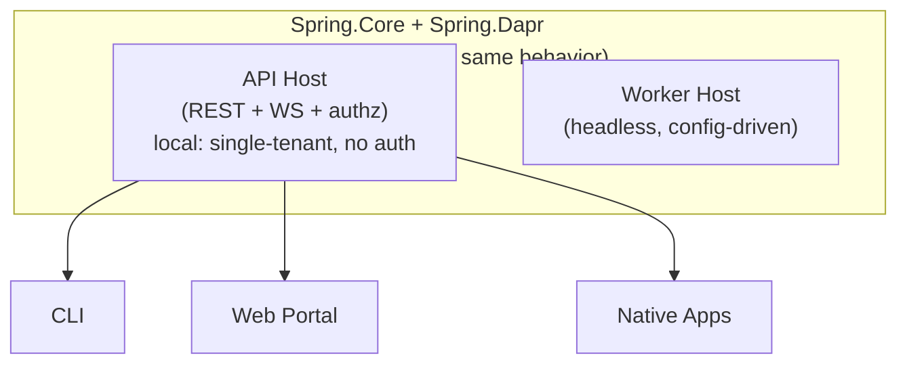

# CLI & Web

> **[Architecture Index](README.md)** | Related: [Security](security.md), [Deployment](deployment.md), [Units & Agents](units.md)

---

## Client API Surface


| API Domain                | Operations                                                              |
| ------------------------- | ----------------------------------------------------------------------- |
| **Identity & Auth**       | API token CRUD, token invalidation, user management |
| **Unit Management**       | CRUD, configure AI/policies/connectors, manage members                  |
| **Agent Management**      | CRUD, view status, configure expertise                                  |
| **Messaging**             | Send to agents/units, read conversations                                |
| **Activity Streams**      | Subscribe via SSE/WebSocket                                             |
| **Workflow Management**   | Start/stop/inspect, approve human-in-the-loop steps                     |
| **Directory & Discovery** | Query expertise, browse capabilities                                    |
| **Package Management**    | Install/remove, browse registry                                         |
| **Observability**         | Metrics, cost tracking, audit logs                                      |
| **Admin**                 | User management, tenant config                                          |


## Hosting Modes

The API Host and Worker Host are separate binaries. The "daemon" mode is the API Host running in a single-tenant, auth-disabled configuration — not a separate binary. This simplifies local development while keeping a single codebase.




## The `spring` CLI Command

The `Spring.Cli` project produces the `spring` command-line tool:

```
spring unit list
spring agent status ada
spring message send agent://engineering-team/ada "Review PR #42"
spring activity stream --unit engineering-team
spring build packages/software-engineering
spring apply -f units/engineering-team.yaml
spring workflow status software-dev-cycle
spring images list
```

**Distribution modes:**

- **dotnet tool:** `dotnet tool install -g spring-cli`. Requires .NET SDK. Updated via `dotnet tool update -g spring-cli`.
- **Standalone executable:** Published as a self-contained single-file app via `dotnet publish`. No .NET SDK required. Distributed via GitHub releases, Homebrew, or direct download.

The command name is `spring` in both cases.

## Deployment Topology


| Environment              | Topology                                                                                                                                                                                          |
| ------------------------ | ------------------------------------------------------------------------------------------------------------------------------------------------------------------------------------------------- |
| **Local dev**            | API Host (single-tenant mode) + Dapr sidecar + Podman containers. Single machine. `spring` CLI for interaction.                                                                                   |
| **Staging / small prod** | API Host + Worker Host behind a reverse proxy. Docker Compose with Dapr sidecars. PostgreSQL + Redis.                                                                                             |
| **Production**           | Kubernetes with Dapr operator. API Host replicas behind load balancer. Worker Hosts scaled by workload. Execution environments as ephemeral pods. Kafka for pub/sub. Pluggable secret store. |
