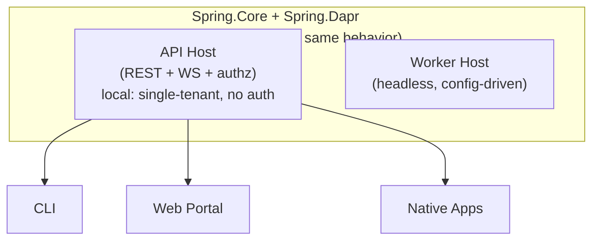

# CLI & Web

> **[Architecture Index](README.md)** | Related: [Security](security.md), [Deployment](deployment.md), [Units & Agents](units.md)

---

## Client API Surface


| API Domain                | Operations                                                              |
| ------------------------- | ----------------------------------------------------------------------- |
| **Identity & Auth**       | API token CRUD, token invalidation, user management |
| **Unit Management**       | CRUD, configure AI/policies/connectors, manage members                  |
| **Agent Management**      | CRUD, view status, configure expertise                                  |
| **Messaging**             | Send to agents/units, read conversations                                |
| **Activity Streams**      | Subscribe via SSE/WebSocket                                             |
| **Workflow Management**   | Start/stop/inspect, approve human-in-the-loop steps                     |
| **Directory & Discovery** | Query expertise, browse capabilities                                    |
| **Package Management**    | Install/remove, browse registry                                         |
| **Observability**         | Metrics, cost tracking, audit logs                                      |
| **Admin**                 | User management, tenant config                                          |


## Hosting Modes

The API Host and Worker Host are separate binaries. The "daemon" mode is the API Host running in a single-tenant, auth-disabled configuration — not a separate binary. This simplifies local development while keeping a single codebase.




## The `spring` CLI Command

The `Spring.Cli` project produces the `spring` command-line tool:

```
spring unit list
spring agent status ada
spring message send agent://engineering-team/ada "Review PR #42"
spring conversation list --unit engineering-team
spring conversation show c-1834
spring conversation send --conversation c-1834 agent://engineering-team/ada "Ship it."
spring inbox list
spring inbox respond c-1834 "Approved"
spring activity stream --unit engineering-team
spring connector catalog
spring connector bind --unit engineering-team --type github --owner my-org --repo platform
spring connector show --unit engineering-team
spring directory list
spring directory show python/fastapi
spring directory search "refactor python"
spring connector bindings github
spring build packages/software-engineering
spring apply -f units/engineering-team.yaml
spring workflow status software-dev-cycle
spring images list

# Unit / agent execution defaults (#601 B-wide)
spring unit execution get engineering-team
spring unit execution set engineering-team --image ghcr.io/my/agent:v1 --runtime podman
spring unit execution set engineering-team --tool dapr-agent --provider ollama --model llama3.2:3b
spring unit execution clear engineering-team --field image
spring unit execution clear engineering-team

spring agent execution get ada
spring agent execution set ada --image ghcr.io/my/agent-ada:v1 --hosting ephemeral
spring agent execution clear ada --field provider
spring agent create backend-eng --tool claude-code --image ghcr.io/my/agent:v1 --runtime podman

# Startup configuration report (#616)
spring system configuration                       # all subsystems, table view
spring system configuration --json                # raw JSON
spring system configuration "GitHub Connector"    # drill into one subsystem
```

The `spring system configuration` verb reads the cached startup configuration report over `GET /api/v1/system/configuration` — the same endpoint the portal's `/system/configuration` page consumes. See [Configuration](configuration.md) for the framework contract and validation policy.

### Execution verbs (#601 B-wide)

`spring unit execution` and `spring agent execution` edit the persisted `execution:` block. Both carry the same five shared fields:

| Flag         | Unit   | Agent  | Notes                                                     |
| ------------ | ------ | ------ | --------------------------------------------------------- |
| `--image`    | ✓      | ✓      | Container image reference.                                |
| `--runtime`  | ✓      | ✓      | `docker` or `podman`.                                     |
| `--tool`     | ✓      | ✓      | `claude-code` / `codex` / `gemini` / `dapr-agent` / `custom`. |
| `--provider` | ✓      | ✓      | Dapr-Agent-tool-specific.                                 |
| `--model`    | ✓      | ✓      | Dapr-Agent-tool-specific.                                 |
| `--hosting`  | —      | ✓      | `ephemeral` / `persistent`. Agent-exclusive (never inherits). |

`set` performs a **partial update** — unlisted flags keep their current values. `clear` without `--field` strips the whole block; `clear --field X` clears one field. Resolution at dispatch is agent → unit → fail; see `docs/architecture/units.md § Unit execution defaults`.

`spring agent create` picks up `--image`, `--runtime`, and `--tool` as convenience shorthands that overlay onto any `--definition` / `--definition-file` JSON body (last-writer-wins per field).

### Directory verbs

The `spring directory` family mirrors the portal's `/directory` surface over the shared `POST /api/v1/directory/search` endpoint. Every verb takes `--output table|json`, `--inside` (request the inside-the-unit boundary view), and the usual `--domain`/`--owner`/`--typed-only`/`--limit`/`--offset` filters.

| Verb | Purpose | Portal equivalent |
|------|---------|-------------------|
| `spring directory list` | Enumerate every directory entry (subject to filters + boundary). Omits the score column since there's no free-text query to rank against. | `/directory` with the search box empty. |
| `spring directory show <slug>` | Render a single entry — slug, domain, owner + display name, aggregating unit, ancestor chain breadcrumb, typed-contract flag, match reason, score, and the `projection/{slug}` path set. | Click a row on `/directory`. |
| `spring directory search "<text>"` | Free-text query matched against slug, display name, description, and tags; ranks exact slug > exact domain > text relevance > aggregated-coverage. | The search box on `/directory`. |

`show` carries the full owner-chain + projection-path detail (#553): the ancestor chain renders as a `unit://mid -> unit://root` breadcrumb reading from the closest projecting ancestor up to the highest, and each `projection/{slug}` path listed under "Projected via" identifies one surfacing ancestor. A direct hit renders both as `(direct)` with no "Projected via" block.

### Provider + Model flag validation (#598)

`spring unit create` and `spring unit create-from-template` accept `--provider` and `--model` **only when `--tool=dapr-agent`**. For any other tool (`claude-code`, `codex`, `gemini`, `custom`) the CLI rejects the combination with:

```
--provider and --model are only meaningful for --tool=dapr-agent; other tools (claude-code, codex, gemini) have their provider hardcoded in the tool CLI.
```

This mirrors the portal wizard, which hides the Provider + Model fields entirely for non-Dapr-Agent tools. See the Tool × Provider matrix in [`docs/architecture/agent-runtime.md`](agent-runtime.md) for the full rationale. When `--tool` is not supplied, the CLI does not second-guess the server's deployment default — `--provider` alone is still accepted, and the server enforces the honest contract at dispatch time.

### Inline credential flags (#626)

`spring unit create` and `spring unit create-from-template` accept three paired flags for supplying the LLM API key at unit-create time:

| Flag | Purpose |
|------|---------|
| `--api-key <value>` | Pass the key inline (one-liner form — suitable for scripts that already resolve secrets via another path). |
| `--api-key-from-file <path>` | Read the key from a file; trailing newlines are stripped. Preferred in CI because the key never reaches shell history. Mutually exclusive with `--api-key`. |
| `--save-as-tenant-default` | Boolean flag. When set, the key is written as a **tenant-scoped** secret (via `POST /api/v1/tenant/secrets`, or `PUT` when the slot already holds a value — the wizard's "override tenant default" path). When unset, the key is written as a **unit-scoped** secret (`POST /api/v1/units/{id}/secrets`) after the unit exists. |

The CLI derives the required provider from `--tool` + `--provider` using the same mapping as the wizard (`deriveRequiredCredentialProvider` in `src/Cvoya.Spring.Web/src/app/units/create/page.tsx` and `UnitCommand.DeriveRequiredCredentialProvider` in `src/Cvoya.Spring.Cli/Commands/UnitCommand.cs`). Rejection matrix:

- `--tool=custom` + `--api-key` → rejected (no declared credential contract).
- `--tool=dapr-agent --provider=ollama` + `--api-key` → rejected (Ollama is local; no API key).
- `--save-as-tenant-default` without `--api-key` / `--api-key-from-file` → rejected (no value to write).
- `--api-key` and `--api-key-from-file` together → rejected (pass exactly one).

The canonical secret names are `anthropic-api-key`, `openai-api-key`, and `google-api-key`; the CLI picks one based on the derived provider and writes it under that name on the chosen scope. The backing `ILlmCredentialResolver` reads the same names at dispatch time, so the write/read sides cannot drift.

**Example — per-unit override without touching the tenant default:**

```
# Creates unit "research" and writes a unit-scoped anthropic-api-key
# using the plaintext read from the file.
spring unit create research \
  --tool claude-code \
  --api-key-from-file ~/.secrets/anthropic-research.txt
```

**Example — rotating the tenant default while creating a unit:**

```
# When an anthropic-api-key already exists at tenant scope, this call
# PUTs the new value (rotation) before creating the unit, so every
# future unit inherits the fresh key.
spring unit create default-pilot \
  --tool claude-code \
  --api-key-from-file ./new-key.txt \
  --save-as-tenant-default
```

**Distribution modes:**

- **dotnet tool:** `dotnet tool install -g spring-cli`. Requires .NET SDK. Updated via `dotnet tool update -g spring-cli`.
- **Standalone executable:** Published as a self-contained single-file app via `dotnet publish`. No .NET SDK required. Distributed via GitHub releases, Homebrew, or direct download.

The command name is `spring` in both cases.

### Client generation pipeline

`src/Cvoya.Spring.Host.Api` emits `openapi.json` at build time (via `Microsoft.Extensions.ApiDescription.Server`). The document is committed so downstream codegen works without a running API; CI detects drift by checking that the post-build working tree is clean.

The `spring` CLI's strongly-typed HTTP client (`src/Cvoya.Spring.Cli/Generated/`) is generated from that committed `openapi.json` by [Kiota](https://github.com/microsoft/kiota) (pinned in `.config/dotnet-tools.json`, currently `1.31.1`). The `GenerateKiotaClient` MSBuild target regenerates the client before every compile; the `Generated/` tree is gitignored. `Microsoft.Kiota.Bundle` (pinned in `Directory.Packages.props`) is the runtime dependency that the generated code calls into.

The OpenAPI document carries a `servers` entry (absolute URL, development placeholder) so Kiota can embed a default base URL rather than forcing every caller to set one on the request adapter. Real callers override `BaseUrl` on the adapter at runtime; the default is only used if no override is supplied.

### GitHub App bootstrap verb (#631)

`spring github-app register` is the one-shot alternative to the ~10 manual
GitHub-docs steps for registering the App that backs the GitHub connector.
Per #616's **Option B+** distribution decision, the OSS connector stays
in-tree and this verb is the friction remover. The verb drives GitHub's
[App-from-manifest flow](https://docs.github.com/en/apps/sharing-github-apps/registering-a-github-app-from-a-manifest):
bind a loopback listener → open a pre-filled "create App" page in the
browser → receive a one-time code on the callback → exchange the code for
the PEM + webhook secret → persist.

```bash
# Default — writes to deployment/spring.env
spring github-app register --name "Spring Voyage (prod)"

# Org-owned App
spring github-app register --name "Spring Voyage (prod)" --org cvoya-com

# Persist via platform secrets (#612) instead of spring.env
spring github-app register --name "Spring Voyage (prod)" --write-secrets

# Override the derived webhook URL (e.g. when behind a webhook-relay tunnel)
spring github-app register \
  --name "Spring Voyage (dev)" \
  --webhook-url https://my-relay.ngrok-free.app/api/v1/webhooks/github

# Build manifest + print creation URL, no I/O
spring github-app register --name "Spring Voyage (prod)" --dry-run
```

| Flag | Purpose |
|------|---------|
| `--name <string>` (required) | App name on github.com. Must be globally unique; GitHub's "name already taken" error is surfaced verbatim with a suggestion to add a suffix. |
| `--org <slug>` | Register under a GitHub org (`/organizations/{org}/settings/apps/new`) instead of the user account. |
| `--webhook-url <url>` | Override the derived webhook URL. Default is `<deployment-origin>/api/v1/webhooks/github`, taken from `SPRING_API_URL` / `~/.spring/config.json`. |
| `--write-env` (default) | Append credentials to `deployment/spring.env`. Existing `GitHub__*` lines are commented out with a timestamp for audit. Multi-line PEM is newline-escaped so Podman/Compose's `--env-file` reader accepts it verbatim. |
| `--write-secrets` | Persist credentials via `spring secret --scope platform create` (#612) instead of `spring.env`. |
| `--env-path <path>` | Override the `deployment/spring.env` default written to by `--write-env`. |
| `--dry-run` | Build the manifest, print the creation URL, exit. No browser, no listener, no network I/O. |
| `--callback-timeout-seconds <int>` | How long to wait for the GitHub redirect before erroring out as resumable. Default 300 (5 min, matches GitHub's one-time-code TTL). |

**Permissions requested** — hardcoded to match the shipped connector skill
bundles: read `issues` / `pull_requests` / `contents` / `metadata`; write
`issue_comment` / `statuses` / `checks`. Webhook events: `issues`,
`pull_request`, `issue_comment`, `installation`. `public: false`.

**Port binding.** The callback listener binds to `127.0.0.1:0` (OS-assigned
ephemeral) and retries up to three times on
`HttpListenerException` — the same pattern used for the MCP test fixture
(PR #617). The chosen port is baked into the manifest's `redirect_url`
and `callback_urls` fields so GitHub redirects back to the exact loopback
slot the listener is bound on.

**Out of scope for this verb** — installing the App on specific repos/orgs
(the portal's install-link flow from PR #610 handles that; the CLI just
prints the install URL), credential rotation on an already-registered App,
OAuth-App registration, and GitHub Enterprise Server (URL is hardcoded to
`github.com`).

## Deployment Topology


| Environment              | Topology                                                                                                                                                                                          |
| ------------------------ | ------------------------------------------------------------------------------------------------------------------------------------------------------------------------------------------------- |
| **Local dev**            | API Host (single-tenant mode) + Dapr sidecar + Podman containers. Single machine. `spring` CLI for interaction.                                                                                   |
| **Staging / small prod** | API Host + Worker Host behind a reverse proxy. Docker Compose with Dapr sidecars. PostgreSQL + Redis.                                                                                             |
| **Production**           | Kubernetes with Dapr operator. API Host replicas behind load balancer. Worker Hosts scaled by workload. Execution environments as ephemeral pods. Kafka for pub/sub. Pluggable secret store. |
