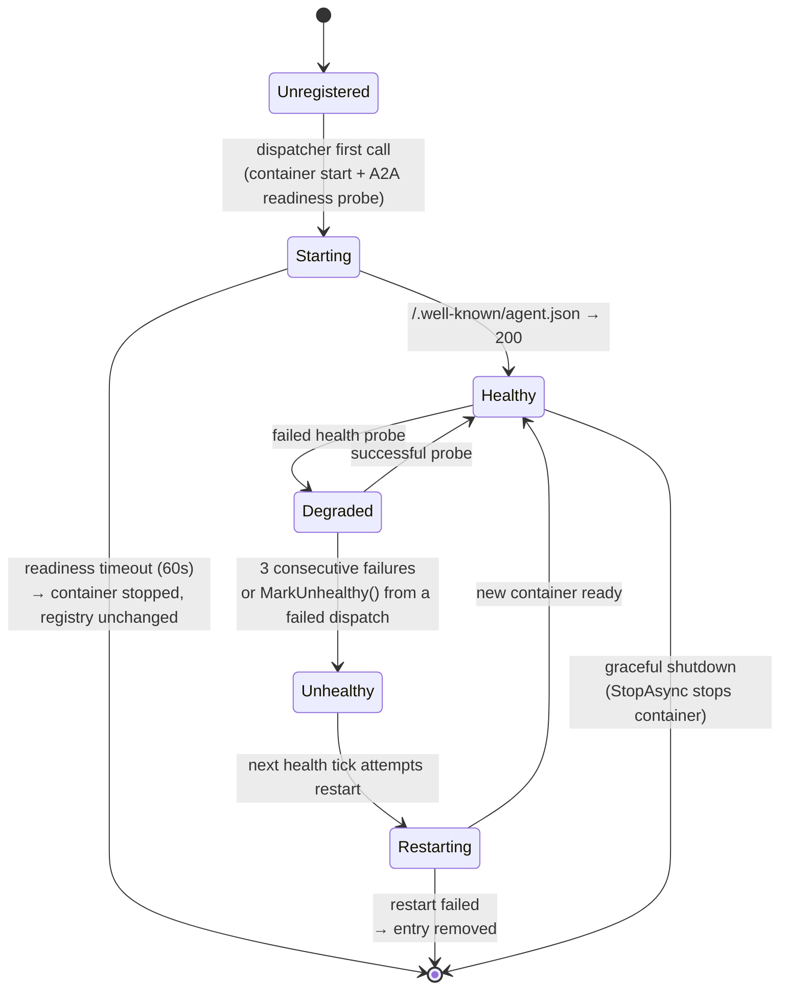

# Deployment

> **[Architecture Index](README.md)** | Related: [Infrastructure](infrastructure.md), [Workflows](workflows.md), [CLI & Web](cli-and-web.md), [Units & Agents](units.md)

---

## Deployment scope

This open-source platform targets **standalone / single-host deployments** (Docker Compose / Podman Compose on a developer machine or a single server). Hosted or Kubernetes deployments are **not in scope for this repository**.

The runtime abstractions (`IContainerRuntime`, `IExecutionDispatcher`) are deliberately backend-plural so a Kubernetes-native implementation can live in a separate downstream deployment repository, but this repository ships only the standalone runtime. Bug reports and feature requests against this repo should be for functionality that runs on the standalone target; multi-tenant hosted or K8s concerns belong in the downstream repo that consumes this codebase as a submodule.

---

## Agent Hosting Modes

Every agent is hosted in one of two modes, controlled by `AgentExecutionConfig.Hosting` (`Cvoya.Spring.Core.Execution.AgentHostingMode`):

| Mode           | Lifecycle                                                                                  | Best For                                                                 |
| -------------- | ------------------------------------------------------------------------------------------ | ------------------------------------------------------------------------ |
| **Ephemeral**  | A fresh container is started per dispatch, does its work, and is cleaned up.               | Short-lived, stateless turns. Software engineering with per-call isolation. |
| **Persistent** | A long-lived service receives messages over its lifetime. Started on first dispatch; kept alive and health-checked by `PersistentAgentRegistry`. | Reusable expensive state (warm model caches, long-lived tool connections), low-latency response. |

Both modes dispatch through `A2AExecutionDispatcher` — the same `IExecutionDispatcher` handles both branches internally. See [Workflows](workflows.md#a2a-execution-dispatch) for the dispatcher architecture and the per-tool launchers.

### Ephemeral vs Persistent — Decision Guide

| Question                                                                                 | Choose          |
| ---------------------------------------------------------------------------------------- | --------------- |
| Each call is independent — no in-memory state I want to carry between turns?             | **Ephemeral**   |
| I want the strongest isolation (clean FS, no bleed between turns, easy cancellation)?    | **Ephemeral**   |
| The model or tool takes seconds to warm up and I'm paying that cost every call?          | **Persistent**  |
| The agent maintains in-process state (a running REPL, a loaded dataset) between calls?    | **Persistent**  |
| The agent's container starts in milliseconds and the work is a one-shot turn?            | **Ephemeral**   |
| Low-latency interactive agent whose response budget is seconds, not tens of seconds?     | **Persistent**  |

Ephemeral is the default. Switch to persistent when the per-dispatch cold-start cost dominates, or when the agent is genuinely a long-lived service.

```yaml
# Agent YAML excerpt — persistent hosting
agent:
  id: ollama-researcher
  execution:
    tool: dapr-agent
    image: spring-agent-ollama:latest
    hosting: persistent   # default: ephemeral
    runtime: podman
```

---

## Persistent Agent Hosting Lifecycle

`PersistentAgentRegistry` (`Cvoya.Spring.Dapr/Execution/PersistentAgentRegistry.cs`) tracks every running persistent agent, probes its health, and restarts unhealthy containers. It is registered as a `IHostedService` so it starts with the host and stops every tracked container on graceful shutdown.

### States



### Key timings and thresholds

- **Readiness timeout:** 60 s (`A2AExecutionDispatcher.ReadinessTimeout`). If the A2A endpoint does not return 200 on `/.well-known/agent.json` within this window the container is stopped and the dispatch fails.
- **Readiness probe interval:** 500 ms during startup (`A2AExecutionDispatcher.ReadinessProbeInterval`).
- **Health-check sweep interval:** 30 s (`PersistentAgentRegistry.HealthCheckInterval`).
- **Health-probe timeout:** 5 s per request (`PersistentAgentRegistry.HealthProbeTimeout`).
- **Unhealthy threshold:** 3 consecutive failed probes (`PersistentAgentRegistry.UnhealthyThreshold`).

### Registry entry shape

Each tracked agent is a `PersistentAgentEntry`:

- `AgentId` — actor id / agent YAML `id`.
- `Endpoint` — A2A base URL (`http://localhost:8999/` today; future work will handle arbitrary port mappings).
- `ContainerId` — runtime container id for stop / restart.
- `StartedAt` — timestamp of the most recent start.
- `HealthStatus` — `Healthy` or `Unhealthy`.
- `ConsecutiveFailures` — running failure count, reset on any successful probe.
- `Definition` — the `AgentDefinition` retained so a restart can replay the original container config.

### Restart semantics

When a restart is triggered:

1. The previous container is stopped (best-effort; failure to stop does not block restart).
2. The retained `AgentDefinition` is used to build a fresh `ContainerConfig` (same image, with `host.docker.internal:host-gateway` added so the container can reach the host MCP server).
3. The new container is started and probed against the same endpoint.
4. On success the entry is updated in place — same `AgentId`, new `ContainerId`, `StartedAt` refreshed, failure count zeroed.
5. On failure the entry is removed from the registry so the next dispatch will take the "Unregistered → Starting" path again.

A restart needs the agent definition to be available on the entry; an entry with `Definition = null` (exotic test-only path) is removed rather than restarted.

### Dispatch-path integration

`A2AExecutionDispatcher.DispatchPersistentAsync`:

1. Asks the registry for an endpoint. `TryGetEndpoint` only returns healthy entries — degraded / unhealthy agents behave like "not yet started".
2. If there is no healthy endpoint, starts the container via `StartPersistentAgentAsync`, which waits for readiness and registers the new entry.
3. Assembles the prompt and calls the agent via the A2A client (`A2AClient.SendMessageAsync`).
4. On any exception (other than `OperationCanceledException`) calls `MarkUnhealthy(agentId)` so the next health tick will attempt a restart.

---

## Container Runtime Requirements

Persistent and ephemeral containers are launched through the same `IContainerRuntime` abstraction. Two runtimes ship in-tree:

- **`PodmanRuntime`** (default) — uses `podman` on the host.
- **`DockerRuntime`** — uses `docker` on the host.

Selection is driven by `ContainerRuntime:RuntimeType` in configuration (values: `"podman"` or `"docker"`, defaulting to `podman`).

### Host requirements

- **Podman or Docker installed** on the host running the Spring Voyage Worker / API. The runtime binary must be on `PATH`.
- **Network reachability** for `host.docker.internal` — Linux hosts need Podman 4.1+ or an explicit `--add-host=host.docker.internal:host-gateway` (which the dispatcher adds automatically). This is how the in-container agent tool reaches the host's MCP server.
- **TCP port 8999 free on `localhost`** — persistent agent containers publish their A2A endpoint on this port. (Future work will introduce per-agent port allocation; see `A2AExecutionDispatcher.SidecarPort`.)
- **Writable temp directory** — each launcher materialises a per-invocation working directory under `Path.GetTempPath()` before the container starts.

### Dapr sidecar bootstrap

Workflow containers (not agent containers) typically need their own Dapr sidecar. `ContainerLifecycleManager` + `DaprSidecarManager` (both in `Cvoya.Spring.Dapr.Execution`) compose this flow:

1. Create a bridge network (`spring-net-<guid>`).
2. Start the Dapr sidecar container (`daprio/daprd:latest`) with the app id, ports, and components path the workflow needs.
3. Wait for the sidecar to report healthy.
4. Start the workflow container on the same network so app-to-sidecar traffic stays in-network.
5. Tear down sidecar and network when the app container exits.

`WorkflowOrchestrationStrategy` drives this pattern for every workflow dispatch (see [Workflows](workflows.md#workflow-as-container-primary-model)). Agent containers, by contrast, do **not** get a per-container Dapr sidecar — they speak A2A directly to the dispatcher and reach platform services via the host-level MCP server.

---

## Solution Structure

The solution follows a layered architecture with clean separation between domain abstractions and infrastructure:

- **`Cvoya.Spring.Core`** — Domain interfaces and types. No Dapr or infrastructure dependencies. Defines `IAddressable`, `IMessageReceiver`, `IOrchestrationStrategy`, `IActivityObservable`, `IExecutionDispatcher`, `IAgentToolLauncher`, `IAgentDefinitionProvider`, `IUnitPolicyEnforcer`, `ISecretStore`/`ISecretRegistry`/`ISecretResolver`, and all domain models.
- **`Cvoya.Spring.Dapr`** — Dapr implementations: actors (`AgentActor`, `UnitActor`, `ConnectorActor`, `HumanActor`), orchestration strategies (`AiOrchestrationStrategy`, `WorkflowOrchestrationStrategy`), `A2AExecutionDispatcher`, per-tool launchers (`ClaudeCodeLauncher`, `CodexLauncher`, `GeminiLauncher`, `DaprAgentLauncher`), `PersistentAgentRegistry`, `DaprStateBackedSecretStore`, state management, and routing.
- **`Cvoya.Spring.A2A`** — A2A protocol client and server for cross-framework agent communication.
- **`Cvoya.Spring.Connector.GitHub`** — GitHub connector with webhook handling and skills.
- **`Cvoya.Spring.Host.Api`** — ASP.NET Core API host (REST, WebSocket, SSE, auth, local dev mode).
- **`Cvoya.Spring.Host.Worker`** — Headless worker host for Dapr actors and workflows. Owns EF migrations in the default deployment.
- **`Cvoya.Spring.Cli`** — The `spring` command-line tool.
- **`Cvoya.Spring.Web`** — Next.js/React web dashboard.
- **`agents/a2a-sidecar/`** — Language-agnostic Python adapter that wraps any stdin/stdout CLI behind an A2A endpoint; bundled into CLI agent container images.
- **`packages/`** — Domain packages with agent/unit definitions, skills, workflow containers, and execution environments.
- **`dapr/`** — Dapr component configuration (pub/sub, state, bindings, secrets, resiliency).
