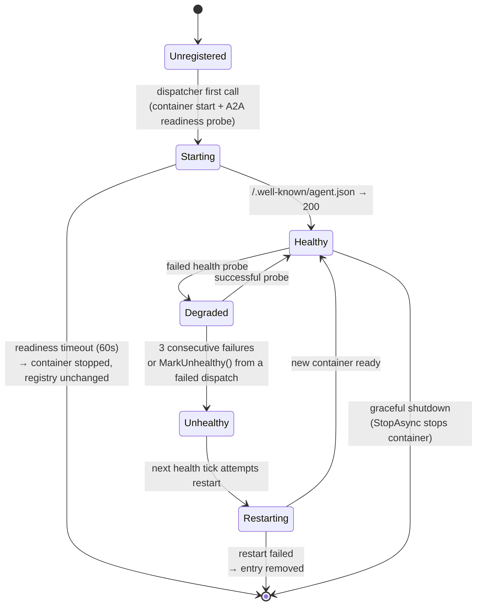

# Deployment

> **[Architecture Index](README.md)** | Related: [Infrastructure](infrastructure.md), [Workflows](workflows.md), [CLI & Web](cli-and-web.md), [Units & Agents](units.md)

---

## Agent Hosting Modes

Every agent is hosted in one of two modes, controlled by `AgentExecutionConfig.Hosting` (`Cvoya.Spring.Core.Execution.AgentHostingMode`):

| Mode           | Lifecycle                                                                                  | Best For                                                                 |
| -------------- | ------------------------------------------------------------------------------------------ | ------------------------------------------------------------------------ |
| **Ephemeral**  | A fresh container is started per dispatch, does its work, and is cleaned up.               | Short-lived, stateless turns. Software engineering with per-call isolation. |
| **Persistent** | A long-lived service receives messages over its lifetime. Started on first dispatch; kept alive and health-checked by `PersistentAgentRegistry`. | Reusable expensive state (warm model caches, long-lived tool connections), low-latency response. |

Both modes dispatch through `A2AExecutionDispatcher` — the same `IExecutionDispatcher` handles both branches internally. See [Workflows](workflows.md#a2a-execution-dispatch) for the dispatcher architecture and the per-tool launchers.

### Ephemeral vs Persistent — Decision Guide

| Question                                                                                 | Choose          |
| ---------------------------------------------------------------------------------------- | --------------- |
| Each call is independent — no in-memory state I want to carry between turns?             | **Ephemeral**   |
| I want the strongest isolation (clean FS, no bleed between turns, easy cancellation)?    | **Ephemeral**   |
| The model or tool takes seconds to warm up and I'm paying that cost every call?          | **Persistent**  |
| The agent maintains in-process state (a running REPL, a loaded dataset) between calls?    | **Persistent**  |
| The agent's container starts in milliseconds and the work is a one-shot turn?            | **Ephemeral**   |
| Low-latency interactive agent whose response budget is seconds, not tens of seconds?     | **Persistent**  |

Ephemeral is the default. Switch to persistent when the per-dispatch cold-start cost dominates, or when the agent is genuinely a long-lived service.

```yaml
# Agent YAML excerpt — persistent hosting
agent:
  id: ollama-researcher
  execution:
    tool: dapr-agent
    image: spring-agent-ollama:latest
    hosting: persistent   # default: ephemeral
    runtime: podman
```

---

## Persistent Agent Hosting Lifecycle

`PersistentAgentRegistry` (`Cvoya.Spring.Dapr/Execution/PersistentAgentRegistry.cs`) tracks every running persistent agent, probes its health, and restarts unhealthy containers. It is registered as a `IHostedService` so it starts with the host and stops every tracked container on graceful shutdown.

### States



### Key timings and thresholds

- **Readiness timeout:** 60 s (`A2AExecutionDispatcher.ReadinessTimeout`). If the A2A endpoint does not return 200 on `/.well-known/agent.json` within this window the container is stopped and the dispatch fails.
- **Readiness probe interval:** 500 ms during startup (`A2AExecutionDispatcher.ReadinessProbeInterval`).
- **Health-check sweep interval:** 30 s (`PersistentAgentRegistry.HealthCheckInterval`).
- **Health-probe timeout:** 5 s per request (`PersistentAgentRegistry.HealthProbeTimeout`).
- **Unhealthy threshold:** 3 consecutive failed probes (`PersistentAgentRegistry.UnhealthyThreshold`).

### Registry entry shape

Each tracked agent is a `PersistentAgentEntry`:

- `AgentId` — actor id / agent YAML `id`.
- `Endpoint` — A2A base URL (`http://localhost:8999/` today; future work will handle arbitrary port mappings).
- `ContainerId` — runtime container id for stop / restart.
- `StartedAt` — timestamp of the most recent start.
- `HealthStatus` — `Healthy` or `Unhealthy`.
- `ConsecutiveFailures` — running failure count, reset on any successful probe.
- `Definition` — the `AgentDefinition` retained so a restart can replay the original container config.

### Restart semantics

When a restart is triggered:

1. The previous container is stopped (best-effort; failure to stop does not block restart).
2. The retained `AgentDefinition` is used to build a fresh `ContainerConfig` (same image, with `host.docker.internal:host-gateway` added so the container can reach the host MCP server).
3. The new container is started and probed against the same endpoint.
4. On success the entry is updated in place — same `AgentId`, new `ContainerId`, `StartedAt` refreshed, failure count zeroed.
5. On failure the entry is removed from the registry so the next dispatch will take the "Unregistered → Starting" path again.

A restart needs the agent definition to be available on the entry; an entry with `Definition = null` (exotic test-only path) is removed rather than restarted.

### Dispatch-path integration

`A2AExecutionDispatcher.DispatchPersistentAsync`:

1. Asks the registry for an endpoint. `TryGetEndpoint` only returns healthy entries — degraded / unhealthy agents behave like "not yet started".
2. If there is no healthy endpoint, starts the container via `StartPersistentAgentAsync`, which waits for readiness and registers the new entry.
3. Assembles the prompt and calls the agent via the A2A client (`A2AClient.SendMessageAsync`).
4. On any exception (other than `OperationCanceledException`) calls `MarkUnhealthy(agentId)` so the next health tick will attempt a restart.

---

## Container Runtime Requirements

Persistent and ephemeral containers are launched through the same `IContainerRuntime` abstraction. The **worker process never holds the host container binary**: its only `IContainerRuntime` binding is `DispatcherClientContainerRuntime`, which forwards every call to the `spring-dispatcher` service over HTTP. See [Dispatcher service](#dispatcher-service) below.

The dispatcher's backend is `PodmanRuntime` (OSS default) — a thin wrapper around `ProcessContainerRuntime` that shells out to `podman`. `DockerRuntime` ships in-tree alongside `PodmanRuntime` for operators who prefer Docker, and downstream deployment repositories targeting Kubernetes plug in their own backend behind the same HTTP contract.

Selection of the dispatcher's own backend is driven by `ContainerRuntime:RuntimeType` in the dispatcher host's configuration (values: `"podman"` or `"docker"`, defaulting to `podman`).

### Host requirements

- **Podman on the dispatcher host only.** The worker, API, and web hosts do NOT need `podman` on PATH — they speak to the dispatcher over HTTP.
- **The dispatcher needs a reachable container socket.** In the OSS standalone deployment the dispatcher container bind-mounts the host's rootless podman socket (`/run/user/${UID}/podman/podman.sock`) at `/run/podman/podman.sock` and uses `podman-remote` against it.
- **Network reachability** for `host.docker.internal` — Linux hosts need Podman 4.1+ or an explicit `--add-host=host.docker.internal:host-gateway` (which the dispatcher adds automatically). This is how the in-container agent tool reaches the host's MCP server.
- **TCP port 8999 free on `localhost`** — persistent agent containers publish their A2A endpoint on this port. (Future work will introduce per-agent port allocation; see `A2AExecutionDispatcher.SidecarPort`.)
- **Writable temp directory** on the dispatcher host — each launcher materialises a per-invocation working directory under `Path.GetTempPath()` before the container starts.

---

## Dispatcher service

See [ADR 0012](../decisions/0012-spring-dispatcher-service-extraction.md) for the decision record behind extracting container-runtime ownership into the dispatcher.

`spring-dispatcher` (project: `src/Cvoya.Spring.Dispatcher/`) owns the host container runtime in OSS deployments. The worker's `IContainerRuntime` binding is `DispatcherClientContainerRuntime` (project: `src/Cvoya.Spring.Dapr/Execution/DispatcherClientContainerRuntime.cs`) and nothing else — the worker cannot launch a sibling container without the dispatcher's cooperation.

```text
spring-worker
└── IContainerRuntime = DispatcherClientContainerRuntime    (only binding)
    └── HTTP → spring-dispatcher
        └── IContainerRuntime = PodmanRuntime               (OSS backend)
            └── podman-remote → host podman socket
```

### HTTP contract

| Method | Path                        | Purpose |
| ------ | --------------------------- | ------- |
| POST   | `/v1/containers`            | Run (blocking) or start (detached) a container. `detached=true` returns as soon as the container is up; `detached=false` waits for exit and returns stdout/stderr/exitCode. |
| DELETE | `/v1/containers/{id}`       | Stop and remove a running container. 404 is treated as a no-op (already gone) to keep parity with the in-process runtime. |
| GET    | `/health`                   | Unauthenticated liveness. |

Request and response bodies are JSON. The request shape is close to `Cvoya.Spring.Core.Execution.ContainerConfig` — `image`, `command`, `env`, `mounts`, `workdir`, `timeoutSeconds`, `network`, `labels`, `extraHosts`, `detached`. The response is `{ id, exitCode?, stdout?, stderr? }`.

### Authentication and tenant scoping

Every request must carry an `Authorization: Bearer <token>` header. Tokens are opaque strings configured at deploy time via `Dispatcher__Tokens__<token>__TenantId=<tenant>` — the token maps to the tenant scope the request can assert. Unauthenticated requests are rejected 401; tokens that do not match the configured map are rejected 401; cross-tenant calls (once tenant-aware scoping is wired into the dispatcher's authorisation layer) are rejected 403.

The OSS single-host deployment typically ships one token scoped to the `default` tenant. Multi-tenant Kubernetes deployments — where each worker/tenant pair needs its own token and the dispatcher enforces cross-tenant isolation — are out of scope for this repository and belong in a downstream deployment repo.

### Why a service seam

The prior attempt (PR #506) mounted the host's podman socket into every worker so the worker could shell out to `podman run`. Two problems ended that approach:

- Mounting a container-runtime socket into every worker breaks tenant isolation in any shared-host deployment.
- The worker is the wrong process to hold runtime credentials: it runs agent-submitted state through the dispatch path and is the process least-deserving of sibling-container launch rights.

Extracting the runtime to a separate service means the worker's container-launch surface is an HTTP-level contract the dispatcher fully mediates. Credentials stay on one host process; the worker simply asks "please run this image". The HTTP contract is intentionally backend-plural so a K8s-native backend (for example, one that calls the Kubernetes API to spin up a Pod) can be implemented in a downstream deployment repository without changing the worker's binding.

### Dapr sidecar bootstrap

Workflow containers (not agent containers) typically need their own Dapr sidecar. `ContainerLifecycleManager` + `DaprSidecarManager` (both in `Cvoya.Spring.Dapr.Execution`) compose this flow:

1. Create a bridge network (`spring-net-<guid>`).
2. Start the Dapr sidecar container (`daprio/daprd:latest`) with the app id, ports, and components path the workflow needs.
3. Wait for the sidecar to report healthy.
4. Start the workflow container on the same network so app-to-sidecar traffic stays in-network.
5. Tear down sidecar and network when the app container exits.

`WorkflowOrchestrationStrategy` drives this pattern for every workflow dispatch (see [Workflows](workflows.md#workflow-as-container-primary-model)). Agent containers, by contrast, do **not** get a per-container Dapr sidecar — they speak A2A directly to the dispatcher and reach platform services via the host-level MCP server.

---

## Release and Image Publishing

### `spring-agent` container image

The `spring-agent` image (Claude Code runtime, `packages/software-engineering/execution/spring-agent/Dockerfile`) is published to `ghcr.io/cvoya-com/spring-agent` by the `Release spring-agent image` GitHub Actions workflow. The workflow is scoped to git tag pushes — day-to-day CI does not push to the registry.

### Tag → GHCR flow

1. A maintainer pushes a semver-style tag to `main` (e.g. `git tag v0.1.0 && git push origin v0.1.0`). The tag pattern `v*` gates the workflow.
2. `.github/workflows/release-spring-agent-image.yml` runs on `ubuntu-latest` with `permissions: packages: write`. It authenticates to GHCR using the per-job `GITHUB_TOKEN` — no PAT or long-lived secret is involved.
3. The workflow parses `ARG CLAUDE_CODE_VERSION=<x.y.z>` out of the Dockerfile (single source of truth for the pinned CLI version) and passes it back through as a `--build-arg` so image contents and the workflow's `claude-<version>` tag can never drift.
4. `docker/build-push-action` builds the image for `linux/amd64` + `linux/arm64` via QEMU + Buildx and pushes four tags:
   - `<git-tag>` (e.g. `v0.1.0`)
   - `<semver>` (e.g. `0.1.0`, with the leading `v` stripped)
   - `claude-<baked-version>` (e.g. `claude-2.1.98`) so operators can pin on CLI revision instead of platform release
   - `latest` — rolls forward to every published release
5. OCI labels (`org.opencontainers.image.*` + `com.cvoya.spring-agent.claude-code-version`) are stamped onto the manifest so `docker inspect` shows the source commit and CLI version.

A manual `workflow_dispatch` input is also available for republishing an existing tag without cutting a new git ref — useful if a transient registry failure interrupts the original run.

### Operator pull examples

```bash
# Pull by platform release
docker pull ghcr.io/cvoya-com/spring-agent:v0.1.0

# Pull by baked Claude Code CLI revision
docker pull ghcr.io/cvoya-com/spring-agent:claude-2.1.98

# Sanity-check the baked CLI
docker run --rm ghcr.io/cvoya-com/spring-agent:v0.1.0 --version
```

Consumers that want the Dockerfile's `--build-arg CLAUDE_CODE_VERSION=<x.y.z>` escape hatch can continue to build locally; the published image covers the default (pinned) version for operators who don't need a custom CLI build.

---

## Solution Structure

The solution follows a layered architecture with clean separation between domain abstractions and infrastructure:

- **`Cvoya.Spring.Core`** — Domain interfaces and types. No Dapr or infrastructure dependencies. Defines `IAddressable`, `IMessageReceiver`, `IOrchestrationStrategy`, `IActivityObservable`, `IExecutionDispatcher`, `IAgentToolLauncher`, `IAgentDefinitionProvider`, `IUnitPolicyEnforcer`, `ISecretStore`/`ISecretRegistry`/`ISecretResolver`, and all domain models.
- **`Cvoya.Spring.Dapr`** — Dapr implementations: actors (`AgentActor`, `UnitActor`, `ConnectorActor`, `HumanActor`), orchestration strategies (`AiOrchestrationStrategy`, `WorkflowOrchestrationStrategy`), `A2AExecutionDispatcher`, per-tool launchers (`ClaudeCodeLauncher`, `CodexLauncher`, `GeminiLauncher`, `DaprAgentLauncher`), `PersistentAgentRegistry`, `DaprStateBackedSecretStore`, state management, and routing.
- **`Cvoya.Spring.A2A`** — A2A protocol client and server for cross-framework agent communication.
- **`Cvoya.Spring.Connector.GitHub`** — GitHub connector with webhook handling and skills.
- **`Cvoya.Spring.Host.Api`** — ASP.NET Core API host (REST, WebSocket, SSE, auth, local dev mode).
- **`Cvoya.Spring.Host.Worker`** — Headless worker host for Dapr actors and workflows. Owns EF migrations in the default deployment.
- **`Cvoya.Spring.Dispatcher`** — ASP.NET service that owns the host container runtime (podman). Workers talk to it over HTTP via `DispatcherClientContainerRuntime`; see the [Dispatcher service](#dispatcher-service) section above. OSS ships the podman backend only.
- **`Cvoya.Spring.Cli`** — The `spring` command-line tool.
- **`Cvoya.Spring.Web`** — Next.js/React web dashboard.
- **`agents/a2a-sidecar/`** — Language-agnostic Python adapter that wraps any stdin/stdout CLI behind an A2A endpoint; bundled into CLI agent container images.
- **`packages/`** — Domain packages with agent/unit definitions, skills, workflow containers, and execution environments.
- **`dapr/`** — Dapr component configuration (pub/sub, state, bindings, secrets, resiliency).
