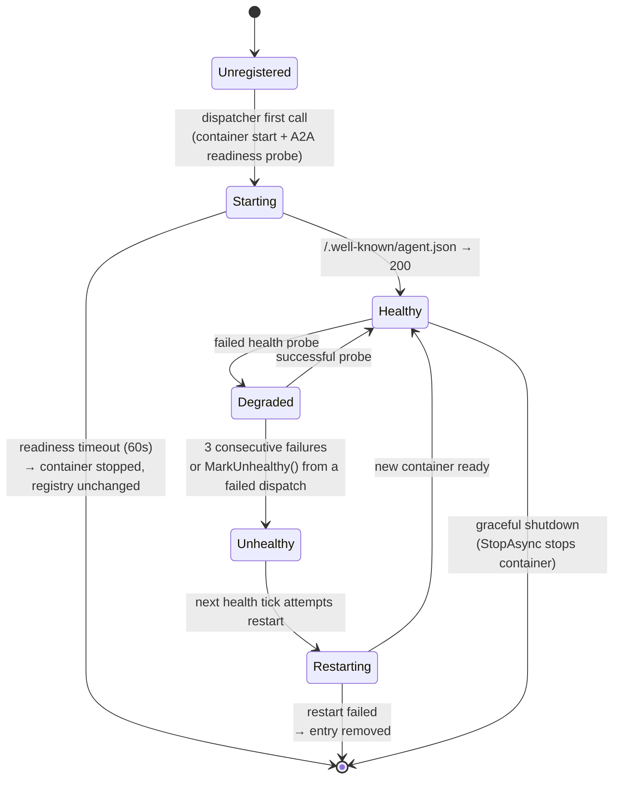
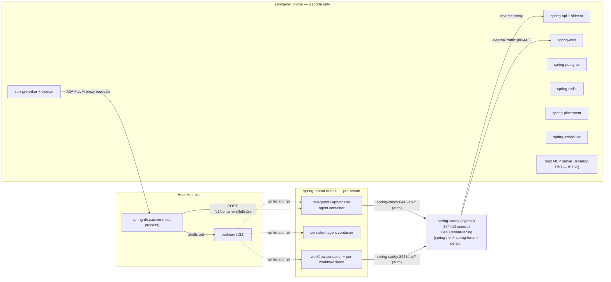

# Deployment

> **[Architecture Index](README.md)** | Related: [Infrastructure](infrastructure.md), [Workflows](workflows.md), [CLI & Web](cli-and-web.md), [Units](units.md), [Agents](agents.md)

---

## Agent Hosting Modes

Every agent is hosted in one of two modes, controlled by `AgentExecutionConfig.Hosting` (`Cvoya.Spring.Core.Execution.AgentHostingMode`):

| Mode           | Lifecycle                                                                                  | Best For                                                                 |
| -------------- | ------------------------------------------------------------------------------------------ | ------------------------------------------------------------------------ |
| **Ephemeral**  | A fresh container is started per dispatch, does its work, and is cleaned up.               | Short-lived, stateless turns. Software engineering with per-call isolation. |
| **Persistent** | A long-lived service receives messages over its lifetime. Started on first dispatch; kept alive and health-checked by `PersistentAgentRegistry`. | Reusable expensive state (warm model caches, long-lived tool connections), low-latency response. |

Both modes dispatch through `A2AExecutionDispatcher` — the same `IExecutionDispatcher` handles both branches internally. See [Workflows](workflows.md#a2a-execution-dispatch) for the dispatcher architecture and the per-tool launchers.

### Ephemeral vs Persistent — Decision Guide

| Question                                                                                 | Choose          |
| ---------------------------------------------------------------------------------------- | --------------- |
| Each call is independent — no in-memory state I want to carry between turns?             | **Ephemeral**   |
| I want the strongest isolation (clean FS, no bleed between turns, easy cancellation)?    | **Ephemeral**   |
| The model or tool takes seconds to warm up and I'm paying that cost every call?          | **Persistent**  |
| The agent maintains in-process state (a running REPL, a loaded dataset) between calls?    | **Persistent**  |
| The agent's container starts in milliseconds and the work is a one-shot turn?            | **Ephemeral**   |
| Low-latency interactive agent whose response budget is seconds, not tens of seconds?     | **Persistent**  |

Ephemeral is the default. Switch to persistent when the per-dispatch cold-start cost dominates, or when the agent is genuinely a long-lived service.

```yaml
# Agent YAML excerpt — persistent hosting
agent:
  id: ollama-researcher
  execution:
    tool: dapr-agent
    image: spring-agent-ollama:latest
    hosting: persistent   # default: ephemeral
    runtime: podman
```

---

## Persistent Agent Hosting Lifecycle

`PersistentAgentRegistry` (`Cvoya.Spring.Dapr/Execution/PersistentAgentRegistry.cs`) tracks every running persistent agent, probes its health, and restarts unhealthy containers. It is registered as a `IHostedService` so it starts with the host and stops every tracked container on graceful shutdown.

### States



### Key timings and thresholds

- **Readiness timeout:** 60 s (`A2AExecutionDispatcher.ReadinessTimeout`). If the A2A endpoint does not return 200 on `/.well-known/agent.json` within this window the container is stopped and the dispatch fails.
- **Readiness probe interval:** 500 ms during startup (`A2AExecutionDispatcher.ReadinessProbeInterval`).
- **Health-check sweep interval:** 30 s (`PersistentAgentRegistry.HealthCheckInterval`).
- **Health-probe timeout:** 5 s per request (`PersistentAgentRegistry.HealthProbeTimeout`).
- **Unhealthy threshold:** 3 consecutive failed probes (`PersistentAgentRegistry.UnhealthyThreshold`).

### Registry entry shape

Each tracked agent is a `PersistentAgentEntry`:

- `AgentId` — actor id / agent YAML `id`.
- `Endpoint` — A2A base URL (`http://localhost:8999/` today; future work will handle arbitrary port mappings).
- `ContainerId` — runtime container id for stop / restart.
- `StartedAt` — timestamp of the most recent start.
- `HealthStatus` — `Healthy` or `Unhealthy`.
- `ConsecutiveFailures` — running failure count, reset on any successful probe.
- `Definition` — the `AgentDefinition` retained so a restart can replay the original container config.

### Restart semantics

When a restart is triggered:

1. The previous container is stopped (best-effort; failure to stop does not block restart).
2. The retained `AgentDefinition` is used to build a fresh `ContainerConfig` (same image, with `host.docker.internal:host-gateway` added so the container can reach the host MCP server).
3. The new container is started and probed against the same endpoint.
4. On success the entry is updated in place — same `AgentId`, new `ContainerId`, `StartedAt` refreshed, failure count zeroed.
5. On failure the entry is removed from the registry so the next dispatch will take the "Unregistered → Starting" path again.

A restart needs the agent definition to be available on the entry; an entry with `Definition = null` (exotic test-only path) is removed rather than restarted.

### Dispatch-path integration

`A2AExecutionDispatcher.DispatchPersistentAsync`:

1. Asks the registry for an endpoint. `TryGetEndpoint` only returns healthy entries — degraded / unhealthy agents behave like "not yet started".
2. If there is no healthy endpoint, starts the container via `StartPersistentAgentAsync`, which waits for readiness and registers the new entry.
3. Assembles the prompt and calls the agent via the A2A client (`A2AClient.SendMessageAsync`).
4. On any exception (other than `OperationCanceledException`) calls `MarkUnhealthy(agentId)` so the next health tick will attempt a restart.

---

## Container Runtime Requirements

Persistent and ephemeral containers are launched through the same `IContainerRuntime` abstraction. The **worker process never holds the host container binary**: its only `IContainerRuntime` binding is `DispatcherClientContainerRuntime`, which forwards every call to the `spring-dispatcher` service over HTTP. See [Dispatcher service](#dispatcher-service) below.

The dispatcher's backend is `PodmanRuntime` (OSS default) — a thin wrapper around `ProcessContainerRuntime` that shells out to `podman`. `DockerRuntime` ships in-tree alongside `PodmanRuntime` for operators who prefer Docker, and downstream deployment repositories targeting Kubernetes plug in their own backend behind the same HTTP contract.

Selection of the dispatcher's own backend is driven by `ContainerRuntime:RuntimeType` in the dispatcher host's configuration (values: `"podman"` or `"docker"`, defaulting to `podman`).

### Host requirements

- **Podman on the dispatcher host only.** The worker, API, and web hosts do NOT need `podman` on PATH — they speak to the dispatcher over HTTP. Spring container images do not ship the `podman` CLI.
- **The dispatcher runs as a host process** (issue [#1063](https://github.com/cvoya-com/spring-voyage/issues/1063)). It invokes the local `podman` binary directly rather than reaching a bind-mounted socket from inside a container. Running on the host removes the rootless-socket passthrough that fails on macOS arm64 / libkrun and gives Linux/macOS/Windows a single topology. The dispatcher is owned by [`deployment/spring-voyage-host.sh`](../../deployment/spring-voyage-host.sh).
- **.NET 10 SDK on the dispatcher host.** The host script publishes `Cvoya.Spring.Dispatcher` once on first start and reuses the published binary on subsequent starts (`--rebuild` forces a republish).
- **Network reachability** for `host.containers.internal` (Podman) / `host.docker.internal` (Docker) — Linux hosts need Podman 4.1+ or an explicit `--add-host=host.docker.internal:host-gateway` for the worker/API containers to reach the dispatcher process on the host. This is the same DNS name in-container agent tools use to reach the host's MCP server.
- **TCP port 8999 free on `localhost`** — persistent agent containers publish their A2A endpoint on this port. (Future work will introduce per-agent port allocation; see `A2AExecutionDispatcher.SidecarPort`.)
- **Writable workspace root on the dispatcher host** — the dispatcher materialises every per-invocation agent workspace under `Dispatcher:WorkspaceRoot` (default `~/.spring-voyage/workspaces`) and bind-mounts it into the agent container. Because the dispatcher is a host process, the path it writes is the path the host's podman uses for the bind-mount — no shared volume is needed. Workers no longer write any workspace files of their own — see [Per-invocation workspace materialisation](#per-invocation-workspace-materialisation) below and issue #1042.

---

## Dispatcher service

See [ADR 0012](../decisions/0012-spring-dispatcher-service-extraction.md) for the decision record behind extracting container-runtime ownership into the dispatcher.

`spring-dispatcher` (project: `src/Cvoya.Spring.Dispatcher/`) owns the host container runtime in OSS deployments. The worker's `IContainerRuntime` binding is `DispatcherClientContainerRuntime` (project: `src/Cvoya.Spring.Dapr/Execution/DispatcherClientContainerRuntime.cs`) and nothing else — the worker cannot launch a sibling container without the dispatcher's cooperation.

```text
spring-worker (container)
└── IContainerRuntime = DispatcherClientContainerRuntime    (only binding)
    └── HTTP → host.containers.internal:${SPRING_DISPATCHER_PORT}
        └── spring-dispatcher (host process — see #1063)
            └── IContainerRuntime = PodmanRuntime           (OSS backend)
                └── podman → local socket on the host
```

The dispatcher is a host process rather than a container because the rootless Podman socket cannot be reliably bind-mounted into a container on macOS arm64 / libkrun, and a single topology across Linux/macOS/Windows is the only way the local dev experience stays predictable. See [issue #1063](https://github.com/cvoya-com/spring-voyage/issues/1063) for the architectural decision and [`deployment/spring-voyage-host.sh`](../../deployment/spring-voyage-host.sh) for the lifecycle script that owns the process. Whether the dispatcher could move *back* into a container reliably across hosts is tracked as a `needs-thinking` task.

### HTTP contract

| Method | Path                              | Purpose |
| ------ | --------------------------------- | ------- |
| POST   | `/v1/containers`                  | Run (blocking) or start (detached) a container. `detached=true` returns as soon as the container is up; `detached=false` waits for exit and returns stdout/stderr/exitCode. |
| GET    | `/v1/containers/{id}/logs`        | Read combined stdout/stderr (tail-bounded). |
| POST   | `/v1/containers/{id}/probe`       | Run a one-shot HTTP probe (`wget --spider`) inside the named container's network namespace. Returns `{ healthy: bool }`. Used by `DaprSidecarManager` to poll `/v1.0/healthz` on a sidecar without holding a worker-side container CLI binding. |
| DELETE | `/v1/containers/{id}`             | Stop and remove a running container. 404 is treated as a no-op (already gone) to keep parity with the in-process runtime. |
| POST   | `/v1/images/pull`                 | Pull an image into the dispatcher's local image store. 504 ↔ `TimeoutException`, 502 ↔ `InvalidOperationException` so `PullImageActivity`'s existing classification keeps working. |
| POST   | `/v1/networks`                    | Create a container network. Idempotent: a second create with the same name returns 200, not 409. |
| DELETE | `/v1/networks/{name}`             | Remove a container network. Idempotent: removing a missing network returns 204, not 404. |
| GET    | `/health`                         | Unauthenticated liveness. |

Request and response bodies are JSON. The container request shape is close to `Cvoya.Spring.Core.Execution.ContainerConfig` — `image`, `command`, `env`, `mounts`, `workdir`, `timeoutSeconds`, `network`, `labels`, `extraHosts`, `detached`, plus an optional `workspace: { mountPath, files }` envelope (see below). The container response is `{ id, exitCode?, stdout?, stderr? }`. The probe surface is deliberately narrower than a generic `exec`: a URL string and a boolean answer, no shell expansion, no stdout capture — sufficient for sidecar health polling, no general-purpose RCE seam (see [ADR 0012](../decisions/0012-spring-dispatcher-service-extraction.md)).

### Per-invocation workspace materialisation

Agent launchers (`ClaudeCodeLauncher`, `CodexLauncher`, `GeminiLauncher`, `DaprAgentLauncher`) describe the workspace they need as **pure data** — a `WorkspaceFiles` map keyed by relative path plus a `WorkspaceMountPath` — and the dispatcher materialises that workspace on its own host filesystem before launching the agent container. Concretely, when a `POST /v1/containers` request includes a `workspace` envelope:

1. The dispatcher creates a unique subdirectory under `Dispatcher:WorkspaceRoot` (`spring-ws-<guid>`).
2. It writes each requested file into the subdirectory, creating parent directories as needed. Absolute paths and `..` traversals are rejected with `400 workspace_invalid`.
3. It synthesises a bind-mount spec `<host-subdir>:<mountPath>` and appends it to the container's mounts.
4. It defaults `workdir` to `mountPath` if the request did not specify one.
5. For blocking runs (`detached=false`) it deletes the subdirectory after the runtime returns. For detached starts (`detached=true`) it tracks the subdirectory against the returned container id and deletes it when `DELETE /v1/containers/{id}` arrives.

This is why workers no longer carry the workspace mount themselves: the worker's filesystem is private to the worker container, so any path the worker created would be invisible to the host's podman that the dispatcher actually shells out against. Issue #1042 captured the failure mode (`exit code 125, no such file or directory` on every Claude Code dispatch) and ADR'd into "the dispatcher owns workspace materialisation" because the dispatcher is the one process that already has the right filesystem view. With the dispatcher running as a host process (#1063), the workspace root is a normal directory under the operator's home (`~/.spring-voyage/workspaces`) — no shared volume, no SELinux relabel, no socket mount.

### Authentication and tenant scoping

Every request must carry an `Authorization: Bearer <token>` header. Tokens are opaque strings configured at deploy time via `Dispatcher__Tokens__<token>__TenantId=<tenant>` — the token maps to the tenant scope the request can assert. Unauthenticated requests are rejected 401; tokens that do not match the configured map are rejected 401; cross-tenant calls (once tenant-aware scoping is wired into the dispatcher's authorisation layer) are rejected 403.

The OSS single-host deployment typically ships one token scoped to the `default` tenant. Multi-tenant Kubernetes deployments — where each worker/tenant pair needs its own token and the dispatcher enforces cross-tenant isolation — are out of scope for this repository and belong in a downstream deployment repo.

### Why a service seam

The prior attempt (PR #506) mounted the host's podman socket into every worker so the worker could shell out to `podman run`. Two problems ended that approach:

- Mounting a container-runtime socket into every worker breaks tenant isolation in any shared-host deployment.
- The worker is the wrong process to hold runtime credentials: it runs agent-submitted state through the dispatch path and is the process least-deserving of sibling-container launch rights.

Extracting the runtime to a separate service means the worker's container-launch surface is an HTTP-level contract the dispatcher fully mediates. Credentials stay on one host process; the worker simply asks "please run this image". The HTTP contract is intentionally backend-plural so a K8s-native backend (for example, one that calls the Kubernetes API to spin up a Pod) can be implemented in a downstream deployment repository without changing the worker's binding.

### Dapr sidecar bootstrap

Workflow containers (not agent containers) typically need their own Dapr sidecar. `ContainerLifecycleManager` + `DaprSidecarManager` (both in `Cvoya.Spring.Dapr.Execution`) compose this flow, with **every** container operation routed through the dispatcher (Stage 2 of [#522](https://github.com/cvoya-com/spring-voyage/issues/522) — the worker no longer holds any podman/docker binding of its own):

1. Create a per-workflow bridge network (`spring-net-<guid>`) via `POST /v1/networks` and idempotently ensure the per-tenant bridge (`spring-tenant-<id>`, OSS = `spring-tenant-default`) exists.
2. Start the Dapr sidecar container (`daprio/daprd:latest`) on the per-workflow bridge with the app id, ports, and components path the workflow or `dapr-agent` workload needs (`POST /v1/containers`, detached). When the app’s primary network is not the tenant bridge, the sidecar is **dual-attached** to that primary network and to `spring-tenant-<id>` so `daprd` can still resolve placement, scheduler, and Redis after OSS `deploy.sh` / `docker-compose` attach those services to the tenant network (interim single-tenant topology; ADR 0028 / [#1166](https://github.com/cvoya-com/spring-voyage/issues/1166)). Image and health knobs (`Image`, `HealthTimeout`, `HealthPollInterval`, `ComponentsPath`, optional `DelegatedDaprAgentComponentsPath`) bind from the `Dapr:Sidecar` config section — see `DaprSidecarOptions`.
3. Poll the sidecar's `/v1.0/healthz` from inside its container via `POST /v1/containers/{id}/probe` until healthy or the configured timeout elapses.
4. Start the workflow container dual-attached to the per-workflow bridge **and** the per-tenant bridge (`POST /v1/containers` carries `network` + `additionalNetworks`, detached). App-to-sidecar traffic stays in-network on `spring-net-<guid>`; the tenant attach is what lets the workflow container reach tenant infrastructure (Ollama, peer agents) by uniform DNS — ADR 0028 / [#1166](https://github.com/cvoya-com/spring-voyage/issues/1166).
5. Tear down sidecar (`DELETE /v1/containers/{id}`), workflow container, and the per-workflow bridge (`DELETE /v1/networks/{name}`) when the app container exits. The per-tenant bridge is shared platform-wide and is **not** torn down here — it lives for the lifetime of the deployment.

`WorkflowOrchestrationStrategy` drives this pattern for every workflow dispatch (see [Workflows](workflows.md#workflow-as-container-primary-model)). Agents whose definition uses `execution.tool: dapr-agent` use the same sidecar + dual-attach path for both ephemeral and persistent hosting so the in-container Dapr agent can run workflows. Other tools (for example Claude Code) use a detached app container without a per-container `daprd`, speak A2A to the dispatcher, and reach platform services via the host-level MCP server.

---

## Topology

Spring Voyage runs every business-tenant-aware container on a **per-tenant network** (`spring-tenant-<id>`) and reserves `spring-net` for platform services. The dispatcher (host process) is the only process that bridges platform→tenant traffic; tenant→platform traffic flows through the public Web API behind Caddy ingress (OSS) or K8s ingress (cloud). The worker stays single-network on `spring-net` as a structural constraint — dual-homing would let every actor in the worker reach every tenant's namespace, defeating the isolation.

**OSS uses a single `spring-tenant-default` network.** The reference `docker-compose` attaches `spring-postgres`, `spring-redis`, `spring-placement`, and `spring-scheduler` to that bridge as well as to `spring-net`, matching `deploy.sh`, so Dapr sidecars and tenant-scoped app containers resolve the same hostnames for state and the control plane. `spring-caddy` is also dual-attached to `spring-tenant-default` so agent and workflow containers can reach the authenticated REST API at `http://spring-caddy:8443/api/...` from inside the tenant network without crossing onto `spring-net` — ADR 0028 Decision D / [#1169](https://github.com/cvoya-com/spring-voyage/issues/1169). Cloud uses one network per tenant; the K8s mapping is namespace-per-tenant with the dispatcher as the control-plane bridge and ingress as the data-plane entry point.

Rationale, alternatives rejected, and the decision history that produced this topology live in [ADR 0028 — Tenant-scoped runtime topology](../decisions/0028-tenant-scoped-runtime-topology.md). Execution status (which sub-issues land each part of the work) lives on [#1165](https://github.com/cvoya-com/spring-voyage/issues/1165).



### Service inventory

| Service                                    | Tenancy                                                                                | Why                                                                                       |
| ------------------------------------------ | -------------------------------------------------------------------------------------- | ----------------------------------------------------------------------------------------- |
| `spring-postgres`                          | platform; row-level isolation via `ITenantScopedEntity`                                | Already correct; never per-tenant DB                                                      |
| `spring-redis`                             | platform                                                                               | Topic names carry tenant id at the application layer                                      |
| `spring-placement`, `spring-scheduler`     | platform                                                                               | Dapr control plane; always platform                                                       |
| `spring-api`, `spring-web`                 | platform                                                                               | Stateless, multi-tenant by request                                                        |
| `spring-caddy`                             | platform (ingress — external + tenant→platform); dual-attached to `spring-net` + `spring-tenant-default` | Single authenticated entry point; tenant containers reach it at `http://spring-caddy:8443` from the tenant bridge (ADR 0028 Decision D, [#1169](https://github.com/cvoya-com/spring-voyage/issues/1169)) |
| `spring-worker` (+ sidecar)                | platform; single-network on `spring-net`                                               | Tenancy enforced at actor layer; **must not** dual-home onto tenant networks              |
| `spring-dispatcher` (host process)         | platform; tenant-aware via `Dispatcher__Tokens__<token>__TenantId` (see ADR 0012)      | Only cross-network bridge; terminal architecture extends its proxy surface (see #1170)    |
| Agent containers (all hosting modes)       | **tenant** (`spring-tenant-<id>`)                                                      | Tracked in #1165; bug-fix slice rides #1160 implementation                                |
| Workflow containers + per-workflow `daprd` | **tenant** (`spring-tenant-<id>`)                                                      | Tracked in #1166                                                                          |
| Ollama                                     | OSS: single instance on `spring-tenant-default`; cloud: per tenant                     | Decided (ADR 0028 Decision C); cloud optimizations in #1164                               |
| Host MCP server                            | TBD (currently host-level; reached via `host.containers.internal` from agent containers) | Tracked in #1167 (`needs-thinking`); decision needed before tenant-specific MCP tools land |
| Connectors                                 | platform (in-process today; if ever containerized, would join the tenant network)      | No change today; rule recorded for future                                                 |

---

## Release and Image Publishing

### `spring-agent` container image

The `spring-agent` image (Claude Code runtime, `packages/software-engineering/execution/spring-agent/Dockerfile`) is published to `ghcr.io/cvoya-com/spring-agent` by the `Release spring-agent image` GitHub Actions workflow. The workflow is scoped to git tag pushes — day-to-day CI does not push to the registry.

### Tag → GHCR flow

1. A maintainer pushes a semver-style tag to `main` (e.g. `git tag v0.1.0 && git push origin v0.1.0`). The tag pattern `v*` gates the workflow.
2. `.github/workflows/release-spring-agent-image.yml` runs on `ubuntu-latest` with `permissions: packages: write`. It authenticates to GHCR using the per-job `GITHUB_TOKEN` — no PAT or long-lived secret is involved.
3. The workflow parses `ARG CLAUDE_CODE_VERSION=<x.y.z>` out of the Dockerfile (single source of truth for the pinned CLI version) and passes it back through as a `--build-arg` so image contents and the workflow's `claude-<version>` tag can never drift.
4. `docker/build-push-action` builds the image for `linux/amd64` + `linux/arm64` via QEMU + Buildx and pushes four tags:
   - `<git-tag>` (e.g. `v0.1.0`)
   - `<semver>` (e.g. `0.1.0`, with the leading `v` stripped)
   - `claude-<baked-version>` (e.g. `claude-2.1.98`) so operators can pin on CLI revision instead of platform release
   - `latest` — rolls forward to every published release
5. OCI labels (`org.opencontainers.image.*` + `com.cvoya.spring-agent.claude-code-version`) are stamped onto the manifest so `docker inspect` shows the source commit and CLI version.

A manual `workflow_dispatch` input is also available for republishing an existing tag without cutting a new git ref — useful if a transient registry failure interrupts the original run.

### Operator pull examples

```bash
# Pull by platform release
docker pull ghcr.io/cvoya-com/spring-agent:v0.1.0

# Pull by baked Claude Code CLI revision
docker pull ghcr.io/cvoya-com/spring-agent:claude-2.1.98

# Sanity-check the baked CLI
docker run --rm ghcr.io/cvoya-com/spring-agent:v0.1.0 --version
```

Consumers that want the Dockerfile's `--build-arg CLAUDE_CODE_VERSION=<x.y.z>` escape hatch can continue to build locally; the published image covers the default (pinned) version for operators who don't need a custom CLI build.

---

## Solution Structure

The solution follows a layered architecture with clean separation between domain abstractions and infrastructure:

- **`Cvoya.Spring.Core`** — Domain interfaces and types. No Dapr or infrastructure dependencies. Defines `IAddressable`, `IMessageReceiver`, `IOrchestrationStrategy`, `IActivityObservable`, `IExecutionDispatcher`, `IAgentToolLauncher`, `IAgentDefinitionProvider`, `IUnitPolicyEnforcer`, `ISecretStore`/`ISecretRegistry`/`ISecretResolver`, and all domain models.
- **`Cvoya.Spring.Dapr`** — Dapr implementations: actors (`AgentActor`, `UnitActor`, `ConnectorActor`, `HumanActor`), orchestration strategies (`AiOrchestrationStrategy`, `WorkflowOrchestrationStrategy`), `A2AExecutionDispatcher`, per-tool launchers (`ClaudeCodeLauncher`, `CodexLauncher`, `GeminiLauncher`, `DaprAgentLauncher`), `PersistentAgentRegistry`, `DaprStateBackedSecretStore`, state management, and routing.
- **`Cvoya.Spring.A2A`** — A2A protocol client and server for cross-framework agent communication.
- **`Cvoya.Spring.Connector.GitHub`** — GitHub connector with webhook handling and skills.
- **`Cvoya.Spring.Host.Api`** — ASP.NET Core API host (REST, WebSocket, SSE, auth, local dev mode).
- **`Cvoya.Spring.Host.Worker`** — Headless worker host for Dapr actors and workflows. Owns EF migrations in the default deployment.
- **`Cvoya.Spring.Dispatcher`** — ASP.NET service that owns the host container runtime (podman). Workers talk to it over HTTP via `DispatcherClientContainerRuntime`; see the [Dispatcher service](#dispatcher-service) section above. OSS ships the podman backend only.
- **`Cvoya.Spring.Cli`** — The `spring` command-line tool.
- **`Cvoya.Spring.Web`** — Next.js/React web dashboard.
- **`agents/a2a-sidecar/`** — Language-agnostic Python adapter that wraps any stdin/stdout CLI behind an A2A endpoint; bundled into CLI agent container images.
- **`packages/`** — Domain packages with agent/unit definitions, skills, workflow containers, and execution environments.
- **`dapr/`** — Dapr component configuration (pub/sub, state, bindings, secrets, resiliency).
