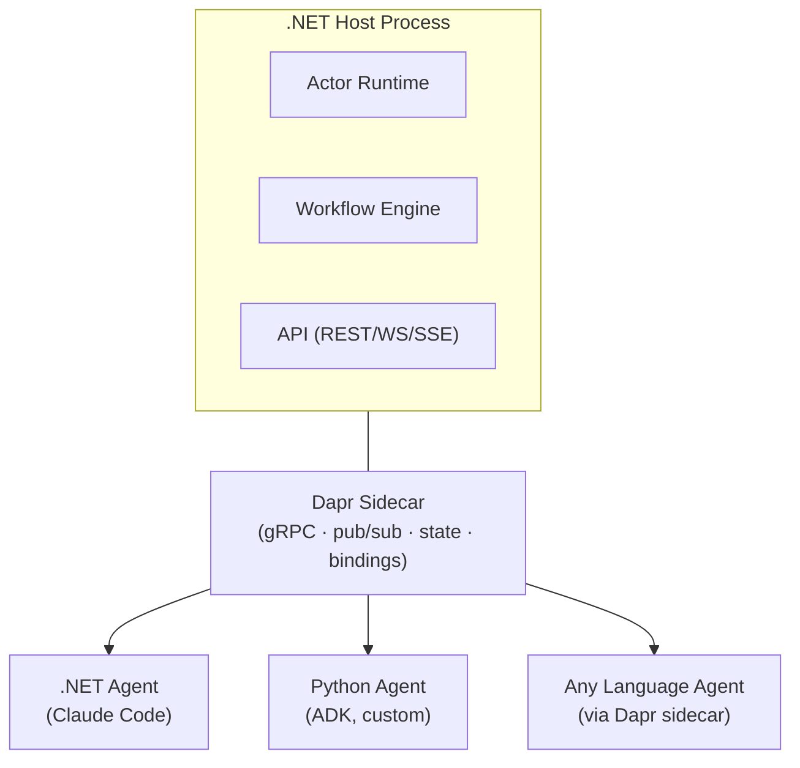

# Infrastructure

> **[Architecture Index](README.md)** | Related: [Messaging](messaging.md), [Deployment](deployment.md), [Units](units.md), [Agents](agents.md)

---

## Dapr + Language-Agnostic Architecture

### Why Dapr

Dapr is a distributed application runtime that provides building blocks as a sidecar process. It is language-agnostic — our application talks to the Dapr sidecar via gRPC/HTTP, and Dapr handles the infrastructure with pluggable components swappable via YAML configuration.


| Dapr Building Block    | What it provides                                                                                                                                                          |
| ---------------------- | ------------------------------------------------------------------------------------------------------------------------------------------------------------------------- |
| **Actors**             | Virtual actors for agents, units, connectors. Turn-based concurrency (natural mailbox). Reminders and timers for scheduled activation. Automatic activation/deactivation. |
| **Workflows**          | Durable orchestration: task chaining, fan-out/fan-in, parallel execution, monitoring patterns. Built on actors. Automatic recovery from failures.                         |
| **Pub/Sub**            | Pluggable pub/sub with 30+ broker backends. At-least-once delivery. Topic-based routing. Dead letter support.                                                             |
| **State Management**   | Pluggable state stores (PostgreSQL, Redis, Cosmos, etc.) for agent state, memory, unit state.                                                                             |
| **Bindings**           | Input/output connectors to external systems — cron schedules, HTTP webhooks, SMTP, cloud services.                                                                        |
| **Secrets**            | Pluggable secret stores (local files, Azure Key Vault, Kubernetes secrets, HashiCorp Vault).                                                                              |
| **Service Invocation** | Secure service-to-service calls with mTLS, retries, observability.                                                                                                        |
| **Configuration**      | Dynamic configuration with subscription to changes.                                                                                                                       |
| **A2A**                | Agent-to-agent communication protocol support.                                                                                                                            |


### Language-Agnostic Agent Architecture via Dapr Sidecar

The Dapr sidecar pattern makes the platform language-agnostic. Any process that can speak HTTP/gRPC to `localhost:3500` participates as a first-class citizen.

**.NET (C#) — Infrastructure layer (fixed):**

- Actor lifecycle (Dapr virtual actors)
- Message routing and addressing
- Pub/sub management
- State persistence
- Workflow orchestration (Dapr Workflows)
- Security (mTLS, RBAC)
- API surface (REST, WebSocket, SSE)
- Container/execution environment management
- Observability pipeline

**Agent brain logic — language-agnostic:**

The agent's "brain" (AI reasoning, LLM calls, prompt assembly) can be implemented in any language. The choice depends on the execution pattern:

- **.NET agents:** Agents that delegate execution to a tool (e.g., Claude Code CLI) can be pure .NET. The .NET actor dispatches work to the execution environment container; the tool drives the agentic loop. Also suitable when using the Anthropic .NET SDK or Azure OpenAI SDK directly.
- **Python agents:** When direct LLM SDK integration is needed (e.g., custom prompt assembly, tool-calling loops) or when using AI frameworks (Google ADK, LangGraph, LangChain). Python processes communicate via the Dapr sidecar.
- **Other languages:** Any language with HTTP/gRPC client capabilities can serve as an agent brain via the sidecar.




### Dapr Agents Framework

Dapr Agents is a Python framework for building AI agents on top of Dapr workflows and actors. For Python-based agents, it provides:

- Flexible agentic patterns (tool calling, reasoning loops, ReAct)
- Durable task execution with state management built on Dapr Workflows
- Support for invoking other agents as tools (agent-to-agent delegation)
- Failure recovery and compensation

For Python-based agents, we should evaluate Dapr Agents as an alternative to a custom agent loop. For .NET-based agents, we build our own on Dapr actors.

**Tool provisioning:** Each agent definition includes a tool manifest specifying which tools are available in its execution environment.

**Process isolation:** Each execution environment runs in a container (Podman/Docker). No shared filesystem. Explicit mount points for workspace access.

**Security:** Sandboxed execution by default — no network access, no filesystem access beyond the mounted workspace. Explicit permission grants for network, filesystem, and secret access via the agent definition.

---

## The Fundamental Abstraction: IAddressable

### Core Types

```csharp
record Address(string Scheme, string Path);  // path: ("agent", "engineering-team/ada")
                                              // direct: ("agent", "@f47ac10b-...")

enum MessageType
{
    Domain,        // agent interprets Payload; platform routes by delivery mechanism
    Cancel,        // platform triggers CancellationTokenSource for active conversation
    StatusQuery,   // platform actor responds directly with current state
    HealthCheck,   // platform responds with liveness status
    PolicyUpdate   // platform applies runtime policy changes to actor state
}

record Message
{
    Guid Id { get; init; }                    // unique — deduplication, ack, audit
    Address From { get; init; }
    Address To { get; init; }
    MessageType Type { get; init; }          // platform action or Domain (agent interprets)
    string? ConversationId { get; init; }     // correlates related messages
    JsonElement Payload { get; init; }        // typed per MessageType / domain convention
    DateTimeOffset Timestamp { get; init; }
}
```

**Routing is fully platform-controlled.** The sender does not specify priority or urgency — the platform determines which mailbox channel a message enters based on two things:

1. **`MessageType`** — control types (`Cancel`, `StatusQuery`, `HealthCheck`, `PolicyUpdate`) always route to the **control channel**. The platform has built-in behavior for each.
2. **Delivery mechanism** — for `Domain` messages, the platform uses the delivery context:
  - **Direct message** (actor method call) → **conversation channel** (by `ConversationId`)
  - **Pub/sub subscription** → **observation channel** (batched for initiative processing)
  - **Reminder / timer** → **observation channel** (initiative triggers)
  - **Input binding** (external event via connector) → **conversation channel** (new work)

This means no sender can escalate their own message priority. The platform is the sole authority on routing. Domain-specific semantics (e.g., "implement-feature", "review-pr") are structured data within the `Payload`, defined by domain packages as conventions. The platform never inspects the Payload of a `Domain` message.

`ReceiveAsync` returns `Task<Message?>` — nullable response. Control queries (e.g., `StatusQuery`) may return a synchronous response. `Domain` messages return `null`; results flow back as separate messages.

### Interface Design: Lean Core + Composable Capabilities

```csharp
// Identity — "I can be addressed"
interface IAddressable
{
    Address Address { get; }
}

// Core messaging — "I can be addressed AND I can process messages"
interface IMessageReceiver : IAddressable
{
    Task<Message?> ReceiveAsync(Message message);
}

// Composable capability interfaces — entities implement what applies
interface IExpertiseProvider
{
    ExpertiseProfile GetExpertise();
}

// Uses .NET-native IObservable<T> (System namespace) with Rx.NET 6.x operators
interface IActivityObservable
{
    IObservable<ActivityEvent> ActivityStream { get; }
}

interface ICapabilityProvider
{
    IReadOnlyList<string> Capabilities { get; }
}
```

`IActivityObservable` leverages the .NET built-in `IObservable<T>` interface and System.Reactive (Rx.NET 6.x). Consumers use Rx.NET operators — `.Where()`, `.Buffer()`, `.Throttle()`, `.Select()`, `.Merge()` — to filter, combine, and transform activity streams. This is strictly better than `IAsyncEnumerable` for observation because Rx.NET provides backpressure, windowing, time-based operators, and hot observable semantics (multiple subscribers share a single stream) out of the box.

**Who implements what:**


| Entity    | IMessageReceiver | IExpertiseProvider | IActivityObservable | ICapabilityProvider      |
| --------- | ---------------- | ------------------ | ------------------- | ------------------------ |
| Agent     | Yes              | Yes                | Yes                 | Yes                      |
| Unit      | Yes              | Yes (aggregated)   | Yes (aggregated)    | Yes (union or projected) |
| Human     | Yes              | No                 | No                  | No                       |
| Connector | Yes              | No                 | Yes                 | Yes                      |


### Dapr Actor Mapping

All four actor types implement `IMessageReceiver` (and therefore `IAddressable`). Each maps to a Dapr virtual actor:


| Actor              | Represents                | Key Responsibilities                                                     |
| ------------------ | ------------------------- | ------------------------------------------------------------------------ |
| **AgentActor**     | Single AI entity          | Runtime state, cognition (AI calls), pub/sub subscriptions, mailbox      |
| **UnitActor**      | Composite agent (a group) | Member management, policies, expertise directory, orchestration dispatch |
| **ConnectorActor** | External system bridge    | Event translation, outbound skills, connection lifecycle                 |
| **HumanActor**     | Human participant         | Notification routing, permission enforcement                             |


---

## Data Persistence & Configuration

### Primary Data Store: PostgreSQL

PostgreSQL is the primary relational store, carried forward from v1:

- User and organizational data
- Agent definitions, unit configurations, and package manifests
- Activity event history (with potential time-series optimization or archival)

### Dapr Abstraction Layers


| Data                       | Store                          | Dapr Building Block |
| -------------------------- | ------------------------------ | ------------------- |
| User/Org                   | PostgreSQL                     | Direct (EF Core)    |
| Agent/Unit definitions     | PostgreSQL                     | Direct (EF Core)    |
| Agent runtime state        | PostgreSQL (via Dapr)          | State Store         |
| Activity events            | PostgreSQL                     | Direct + Pub/Sub    |
| Dynamic configuration      | PostgreSQL (via Dapr)          | Configuration       |
| Secrets (API keys, tokens) | Key Vault / local file         | Secrets             |
| Execution artifacts        | Object storage (S3/Blob/local) | Bindings            |


**Dapr State Store** — agent runtime state (active conversation, pending conversations, observations) uses the Dapr state store abstraction, configured with PostgreSQL as the backend. This allows swapping to Redis, Cosmos DB, etc. without code changes.

**Dapr Configuration** — dynamic configuration (feature flags, policy overrides, model selection) uses the Dapr Configuration building block with subscription to changes. Agents react to config updates in real-time.

**Dapr Secrets** — API keys, webhook secrets, connector credentials via Dapr Secrets with pluggable backends: local file (development), Azure Key Vault (production), Kubernetes secrets.
