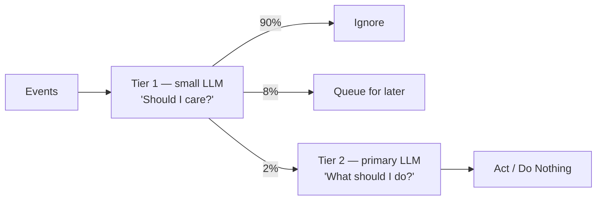

# Initiative

> **[Architecture Index](README.md)** | Related: [Units & Agents](units.md), [Messaging](messaging.md), [Observability](observability.md)

---

## Agent Initiative

Initiative is the agent's capacity to **autonomously decide to act** — not just respond to triggers, but originate actions.

### Initiative Levels

Initiative levels differ not just in frequency, but in **control scope** — what the agent has autonomous control over. Higher levels require more permissions.


| Level          | Control Scope                                                                                                 | Example                             |
| -------------- | ------------------------------------------------------------------------------------------------------------- | ----------------------------------- |
| **Passive**    | No initiative. Only acts when explicitly activated by external triggers.                                      | A code formatter invoked on demand  |
| **Attentive**  | Monitors events via fixed triggers. Decides *whether* to act on each event.                                   | A security scanner watching commits |
| **Proactive**  | Adjusts its own trigger frequency. Chooses actions from an allowed set. May modify its own reminder schedule. | An agent that notices untested code |
| **Autonomous** | Creates its own triggers, manages its own subscriptions and activation configuration. Full self-direction.    | A research agent tracking a field   |


### Tiered Cognition (Cost-Efficient Initiative)

Initiative is powered by a **two-tier cognition model** that keeps costs manageable:

**Tier 1 — Screening (cheap/free):**
A small, locally-hosted LLM (e.g., Phi-3, Llama 3.1 8B, Mistral 7B) runs on platform infrastructure. It performs fast, cheap screening:

- Evaluates incoming events against agent context
- Decides: **ignore** / **queue for reflection** / **act immediately**
- Cost: effectively zero (runs on shared platform compute)

**Tier 2 — Reflection (costly, selective):**
The agent's primary LLM (Claude, GPT-4, etc.) is invoked only when Tier 1 decides it's warranted:

- Full cognition loop: perceive → reflect → decide → act → learn
- Invoked selectively (5-20 times/day vs. 288 if polling every 5 min)
- Cost: predictable and proportional to actual value




### The Cognition Loop (Tier 2)

```
1. Perceive — What has changed since I last reflected?
   (batched observation events, new messages, time elapsed)

2. Reflect — Given my expertise, instructions, and context,
   is there something I should do?

3. Decide — What action, if any?
   • Send a message to another agent
   • Start a new conversation
   • Query the expertise directory
   • Raise an alert to a human
   • Update my own knowledge
   • Do nothing (common outcome)

4. Act — Execute the decided action

5. Learn — Record the outcome (via memory or cognitive backbone)
```

**Permission implications:** Higher initiative levels require more permissions. Proactive agents need `reminder.modify` to adjust their own schedule. Autonomous agents additionally need `topic.subscribe` to create new subscriptions and `activation.modify` to change their own activation configuration. The initiative policy acts as a permission boundary — the `max_level` implicitly caps which self-modification permissions are granted.

> **Open issue: Initiative policy granularity.** Is `max_level` sufficient as the initiative policy (each level implies a known set of capabilities), or should there be explicit per-capability flags (e.g., `can_modify_subscriptions: true`, `can_create_triggers: true`)? For now, `max_level` is the primary control.

### Initiative Policies (Unit-Level)

```yaml
unit:
  policies:
    initiative:
      max_level: proactive
      require_unit_approval: false
      tier1:
        model: phi-3-mini
        hosting: platform               # runs on platform infra
      tier2:
        max_calls_per_hour: 5
        max_cost_per_day: $3.00
      allowed_actions:
        - send-message
        - start-conversation
        - query-directory
      blocked_actions:
        - modify-connector-config
        - spawn-agent
```

When a cognitive backbone is available (see [Open Questions — Future Work](open-questions.md)), the initiative loop gains pattern recognition ("this type of PR always fails review"), opportunity detection ("no one has updated docs in 3 weeks"), risk assessment, and learning from initiative outcomes. Initiative becomes genuine judgment rather than rule-based + LLM reasoning.

### Initiative evaluator (Proactive / Autonomous)

`IAgentInitiativeEvaluator` (`Cvoya.Spring.Core/Initiative/IAgentInitiativeEvaluator.cs`) is the DI-swappable governance seam that answers, per observed signal and proposed `InitiativeAction`, whether the agent should:

- **`ActAutonomously`** — act immediately without asking for confirmation (reserved for `Autonomous` agents on reversible, in-budget actions that pass every policy gate).
- **`ActWithConfirmation`** — act, but surface a proposal to a human or the unit's approval channel first. This is the universal outcome for `Proactive` agents, and the fail-closed fallback for `Autonomous` agents when any enforcement layer cannot resolve.
- **`Defer`** — take no action on this signal. Returned for `Passive` / `Attentive` (Reactive baseline) agents, for empty signal batches, and for policy-lookup failures.

`DefaultAgentInitiativeEvaluator` composes four existing enforcement layers in a fail-closed order:

1. `IAgentPolicyStore.GetEffectiveLevelAsync` — derives the effective level from the agent's own policy composed with the enclosing unit's `InitiativePolicy.MaxLevel` ceiling (see [PR #250](https://github.com/cvoya-com/spring-voyage/pull/473)).
2. `IUnitPolicyEnforcer.EvaluateInitiativeActionAsync` — unit-level action allow / block overlay.
3. `IUnitPolicyEnforcer.EvaluateCostAsync` — per-invocation / per-hour / per-day cost caps (#474 / #248) on the action's estimated cost.
4. `InitiativePolicy.RequireUnitApproval` — operator override that forces confirmation even for Autonomous agents.

A throw in any of those layers downgrades the result by one step (`ActAutonomously` → `ActWithConfirmation` with `FailedClosed = true`; a failed policy lookup drops all the way to `Defer`). A hard deny is surfaced as `ActWithConfirmation` with the enforcer's reason so the operator still sees the proposal and can flip the policy if it was misconfigured.

**No snapshot.** The evaluator re-reads policy on every call. Bumping a unit's `MaxLevel` from `Proactive` to `Autonomous` at runtime takes effect on the next evaluation — the caller does not need to invalidate a cache.

**Reversibility.** `InitiativeAction.IsReversible = false` always forces confirmation, regardless of initiative level. The action model intentionally uses a boolean rather than a severity scale so the evaluator stays simple and the call site carries the reversibility judgement (the caller knows whether it is drafting an internal note or triggering an external side-effect).

### Runtime wiring (PR #552)

`AgentActor.DispatchReflectionActionAsync` is the single call site that consults the evaluator. The flow is:

1. `RunInitiativeCheckAsync` drains the `ObservationChannel` and hands the batch to `IInitiativeEngine.ProcessObservationsAsync`. The engine still owns Tier-1 screening, Tier-2 reflection, and the agent-scoped allow / block list via `ApplyPolicyToOutcome`.
2. When the engine returns `ShouldAct = true`, the actor runs the cross-cutting unit skill-invocation gate (`IUnitPolicyEnforcer.EvaluateSkillInvocationAsync`) — a gate orthogonal to the initiative layer because it governs any skill call, not just initiative-driven ones.
3. The actor translates the outcome via the registered `IReflectionActionHandler`, producing a concrete `Message` with a real target address.
4. The actor calls `IAgentInitiativeEvaluator.EvaluateAsync` with the translated action, the agent id, and the drained observation batch as signals. The evaluator owns every initiative-specific enforcement layer (unit initiative-action allow / block list, cost caps, boundary / hierarchy / cloning as they come online). The caller does **not** re-run any of those gates.
5. The three-valued decision drives dispatch:
   - `Defer` — no routing, no activity event (per the "Defer is silent" contract); a single info log line keeps the decision traceable internally.
   - `ActWithConfirmation` — the translated message is **not** routed inline. A `ActivityEventType.ReflectionActionProposed` event surfaces the proposal (with the translated target, conversation id, reason, effective level, and `FailedClosed` flag) so a human / parent-unit owner can approve it through the observability surface. If the evaluator itself throws, the actor surfaces the same proposal event with `FailedClosed = true`.
   - `ActAutonomously` — the translated message is routed through `MessageRouter` and a `ActivityEventType.ReflectionActionDispatched` event is emitted (the pre-evaluator Reactive baseline path, unchanged for Passive / Attentive agents because they never reach this branch).

This wiring makes the acceptance criteria from PR #552 observable end-to-end: a Proactive unit emits a proposal from an Rx signal without an inbound message, an Autonomous unit skips confirmation for in-budget reversible actions, and a Reactive unit is indistinguishable from the pre-evaluator baseline because the evaluator short-circuits to `Defer` for every Passive / Attentive call.
