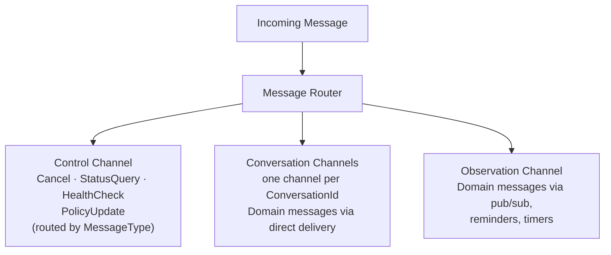
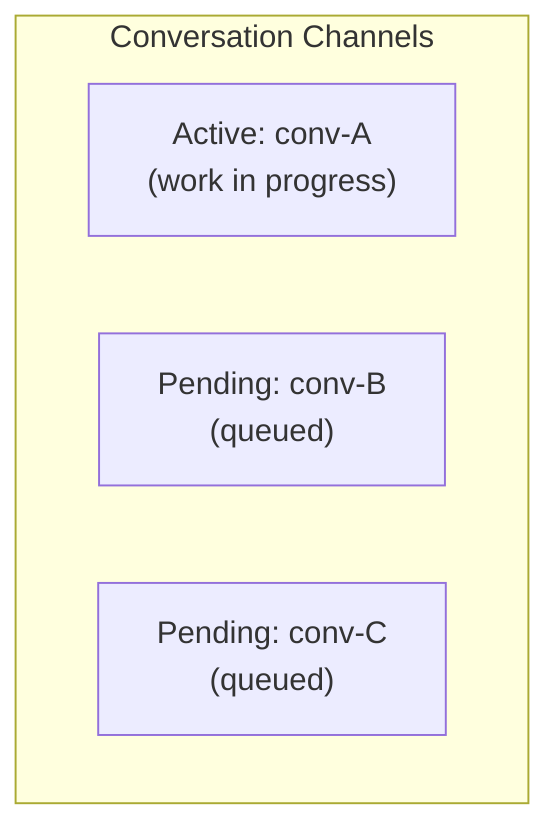
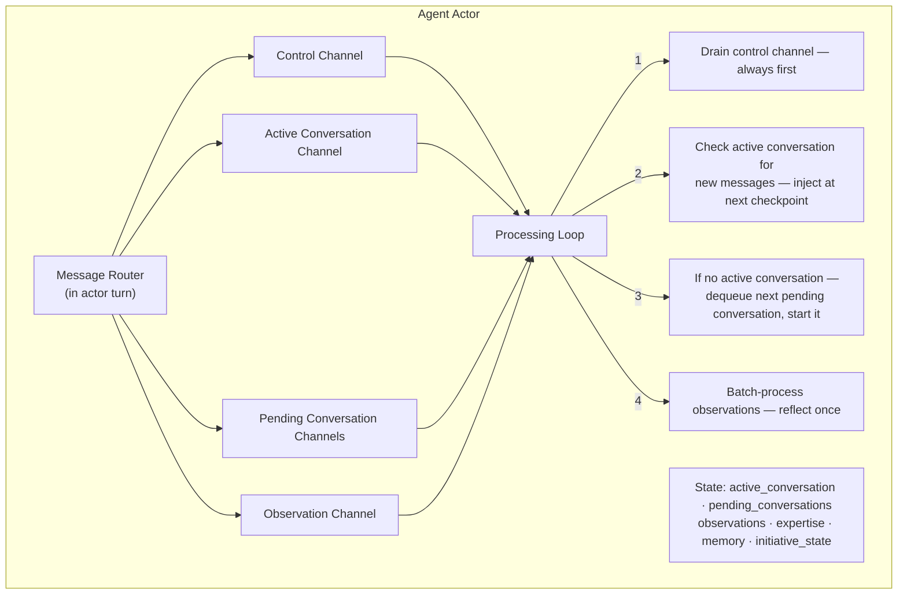
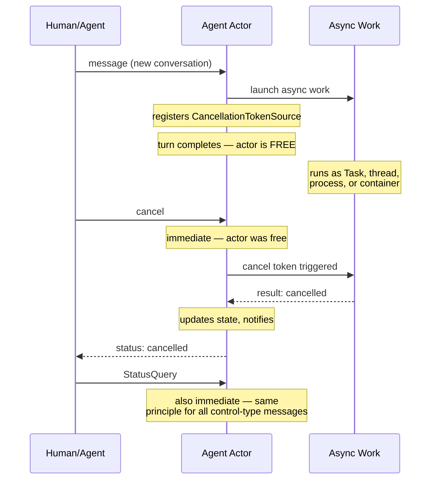
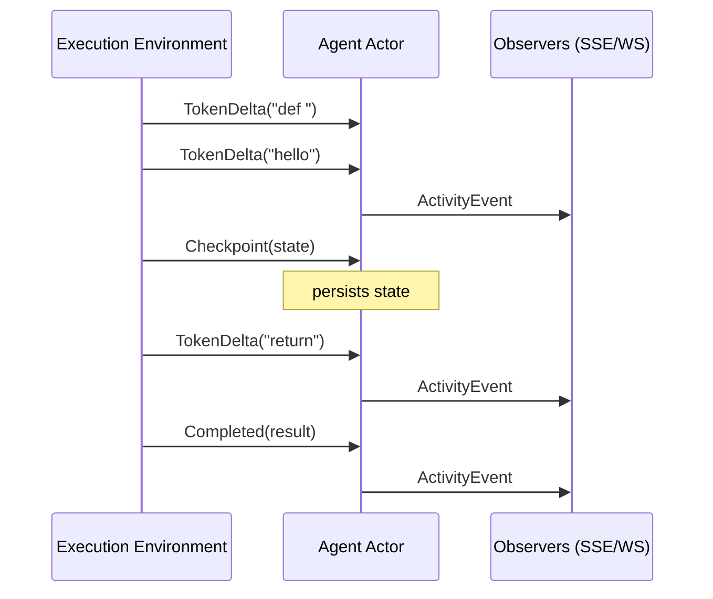

# Messaging

> **[Architecture Index](README.md)** | Related: [Infrastructure](infrastructure.md), [Units & Agents](units.md), [Initiative](initiative.md)

---

## Agent Mailbox & Message Processing

### The Core Question: How Does an Agent Handle Concurrent Messages?

Dapr actors provide turn-based concurrency — one message processed at a time. But agents need to handle multiple concerns simultaneously: working on an active conversation while receiving status updates, cancellations, or messages from different sources.

### Design: Partitioned Mailbox with Priority Processing

Each agent's mailbox is logically partitioned into three channel types:




**Conversation channels** replace the flat work queue. Each distinct `ConversationId` gets its own channel — a queue of related messages. At most one conversation is **active** (has work in progress); all others are **pending**.




A `Domain` message arriving via direct delivery with a new (or absent) `ConversationId` creates a new conversation channel. Follow-up messages carrying the same `ConversationId` are routed to the existing channel. Routing is determined by `MessageType` and delivery mechanism — the platform never inspects the `Payload` for routing decisions.

**Processing model:**

The processing loop is **event-driven**. All triggers — incoming messages, timer firings, subscription notifications — surface as events that trigger a processing pass. There is no timer-based polling.

The agent actor maintains a **single Dapr actor turn** for state consistency, but uses structured processing within that turn:




**Key behaviors:**

1. **Control messages are never blocked.** A cancellation or other control message is processed even if the agent is mid-work. The actor handles it in the current turn by updating state (setting a cancellation flag). The execution environment checks these flags.
2. **Active conversation gets new messages immediately.** When a message arrives for the currently active conversation (same `ConversationId`), it is placed in that conversation's channel. The sender receives an immediate acknowledgment. The platform does not distinguish between "feedback," "clarification," or any other message type — any message on the active conversation is accumulated for the agent.

   **Message retrieval for delegated agents:** Delegated execution environments (e.g., Claude Code) drive their own agentic loop and don't naturally check back with the actor. The platform provides a `checkMessages` tool in the agent's tool manifest. The agent calls this at natural boundaries (between subtasks, after completing a step). The tool calls back to the actor, which returns any accumulated messages on the active conversation channel. This is pull-based — the agent decides when to check. The actor also includes a "messages pending" flag in checkpoint acknowledgments, hinting that the agent should call `checkMessages` soon. For hosted agents, accumulated messages are injected directly into the next LLM call.
3. **Pending conversations queue.** New conversations (new `ConversationId`) queue as pending. They are started in arrival order when the active conversation completes or is suspended.
4. **Observation messages batch.** Activity events from observed agents and pub/sub notifications accumulate. The initiative cognition loop processes them in batch — "what happened since I last looked?" — rather than one at a time. This is more efficient and produces better reasoning.

**Example flow:**

```text
msg1: implement-feature (conv-A) → creates conv-A channel, starts work → conv-A is ACTIVE
msg2: review-pr (conv-B)         → creates conv-B channel → PENDING
msg3: investigate-bug (conv-C)   → creates conv-C channel → PENDING
msg4: (conv-A)                   → routed to conv-A channel (active)
                                 → injected at next checkpoint
                                 → sender gets ack: "message received"

[conv-A completes]
→ conv-B becomes ACTIVE, work starts
```

**Conversation suspension** is a core capability. An agent can **suspend** the active conversation (e.g., blocked waiting on external input or human approval), promote the next pending conversation, and resume the original later — all with clean per-conversation state. This ensures agents are not idle when blocked.

All agents use the same mailbox model: one active conversation with suspension. The active period spans the full lifetime of a container-based agent run, which can be long (minutes to hours). The uniform model keeps the mailbox implementation simple.

### Asynchronous Work Dispatch & Cancellation

The actor's primary responsibility is **processing messages**. It never performs long-running work synchronously. Every work message is handled the same way: the actor validates, updates state, launches the work asynchronously, and returns — remaining immediately available for the next message.

**Asynchronous dispatch model:** When the actor processes a work message, it launches the work via one of several mechanisms — a .NET `Task`, a background thread, a child process, or a remote execution environment (container) — and registers a `CancellationTokenSource` for that work. The actor turn completes in milliseconds. The actor is then free to process any subsequent message, including cancellation and other control messages.

**Cancellation is immediate.** When a cancel message arrives, the actor is guaranteed to be available to process it (since no work runs inside the actor turn). The actor triggers the `CancellationTokenSource`, which propagates cancellation to whatever async mechanism is running the work:




This pattern applies uniformly regardless of how the work is executed:


| Dispatch Mechanism           | Cancellation Propagation                                                                                                 |
| ---------------------------- | ------------------------------------------------------------------------------------------------------------------------ |
| .NET `Task`                  | `CancellationToken` passed to async methods; aborts in-flight HTTP calls, LLM API calls, etc.                            |
| Background thread            | Token checked at processing boundaries; thread terminates gracefully.                                                    |
| Child process                | Actor sends signal (SIGTERM or side-channel); process exits and returns partial results.                                 |
| Remote execution environment | Actor sends cancel via Dapr service invocation to the container. Container process catches it and terminates gracefully. |


The actor guarantees **actor processing semantics** at all times: messages are always processed in order, state is always consistent, and no message is ever blocked behind long-running work.

### Streaming: Real-Time Output from Execution Environments

Execution environments stream tokens and events back to the actor in real-time, enabling live observation of agent work.




**Stream event types** (for lightweight platform LLM calls via `IAiProvider`; agent container tool-use shows up through the container's own stdout/stderr and higher-level completion signals):


| Event           | Description                                          |
| --------------- | ---------------------------------------------------- |
| `TokenDelta`    | LLM token(s) generated — enables live text streaming |
| `ThinkingDelta` | Reasoning/thinking tokens (if model supports)        |
| `Checkpoint`    | State snapshot for recovery and progress tracking   |
| `Completed`     | Work finished with final result                      |


**Transport:** The execution environment publishes to a per-agent Dapr pub/sub topic (`agent/{id}/stream`). Multiple subscribers consume from this topic concurrently:

- **Agent Actor** — subscribes for state management. Processes `Checkpoint` and `Completed` events to update actor state. Projects all events to its `IObservable<ActivityEvent>` stream for agent-to-agent observation.
- **API Host** — subscribes directly to the same topic for real-time relay to connected browsers via SSE/WebSocket. This avoids routing every token through the actor, reducing latency for human observers.

This is standard Dapr pub/sub with multiple subscribers — no special bypass mechanism needed. The actor remains the authority on state; the API host is a pass-through for display.

---

## Addressing

Every addressable entity has a globally unique UUID assigned at creation. Addresses support two forms:

### Path Addresses

Human-readable, reflect organizational structure. Namespaced by **unit path**.

**Scheme:** `{scheme}://{unit-path}/{name}`

Since a unit IS an agent, both agents and units use the `agent://` scheme.

**Within-tenant path addresses:**

- `agent://engineering-team/ada`
- `agent://engineering-team/backend-team/ada` (nested)
- `agent://engineering-team` (the unit itself — it's an agent)
- `human://engineering-team/savasp`
- `connector://engineering-team/github`
- `role://engineering-team/backend-engineer` (multicast)
- `topic://engineering-team/pr-reviews`

**System-level addresses:**

- `system://root` — tenant root unit
- `system://directory` — tenant root directory
- `system://package-registry`

### Direct Addresses (UUID)

Short, stable, independent of hierarchy depth. Use the entity's UUID directly.

**Scheme:** `{scheme}://@{uuid}`

- `agent://@f47ac10b-58cc-4372-a567-0e02b2c3d479`
- `human://@a1b2c3d4-...`
- `connector://@e5f6a7b8-...`

Direct addresses are useful when:

- The hierarchy is deep and path addresses become unwieldy
- An agent moves between units (UUID is stable, path changes)
- Programmatic references (APIs, stored state) need a stable identifier
- Cross-unit messaging where the sender knows the UUID

Path and direct addresses resolve to the same entity. Both forms are interchangeable in the `From` and `To` fields of a `Message`.

### Routing Mechanism

All actors have **flat, globally-unique Dapr actor IDs** derived from their UUID. Both address forms resolve to the same actor ID — path addresses are looked up in the directory, direct addresses map to actor IDs directly. There is no multi-hop forwarding through each unit in the path.

**Resolution:** Each unit actor maintains a **local directory cache** mapping member paths to actor IDs. The root unit maintains the platform-wide directory. Path resolution is a single lookup: the sender's unit (or root unit for cross-unit messages) resolves the full path to an actor ID in one step. Direct addresses (`@uuid`) map to actor IDs without any lookup.

**`human://` skips the directory by design.** Humans are addressed 1:1 by their identifier — the path IS the human actor id, so there is no routing indirection that a directory lookup could add. The platform has no general flow that registers humans in the directory, so insisting on a directory hit (as the router did before #1037) would either force an artificial registration step or break legitimate scenarios such as the LocalDev worker routing an agent's response back to `human://local-dev-user`. `MessageRouter` therefore short-circuits `human://` resolution alongside the existing `@uuid` short-circuit; only `agent://`, `unit://`, and `connector://` paths consult the directory.

**Cache invalidation:** When membership changes (agent joins/leaves a unit, unit restructured), the unit publishes a directory-change event to a system topic. Parent units subscribe and update their caches. This is eventually consistent (milliseconds) but avoids per-message directory lookups.

**Permission enforcement** happens at resolution time, not delivery time. When the directory resolves a path like `agent://engineering-team/backend-team/ada`, it evaluates each boundary along the path (engineering-team → backend-team → ada), checks the sender's permissions against each boundary's `deep_access` policy, and either returns the actor ID (permitted) or rejects the message (denied). This is one synchronous check — O(path depth) — not per-hop forwarding.

**Addressing a unit** (not a specific member) sends the message to the unit actor. The unit applies its boundary filtering and delegates to its orchestration strategy, which decides how to route the message to members.

**Nested dispatch.** A unit's members may themselves be units (`unit://`). Because `IUnitActor` inherits the shared `IAgent` mailbox contract, a parent unit's strategy may pick a sub-unit and forward the message through `IUnitContext.SendAsync` without branching on scheme — `IAgentProxyResolver` maps the scheme to the right actor type and the sub-unit runs its own orchestration turn. Depth is bounded to 64 levels; see [Units & Agents — Nested Units](units.md#nested-units-units-as-members-of-units) for membership invariants and cycle-detection semantics.

---

## Activation Model


| Trigger              | Dapr Primitive          | Description                            |
| -------------------- | ----------------------- | -------------------------------------- |
| Direct message       | Actor method call       | Another entity sends a message         |
| Pub/Sub subscription | Pub/Sub subscriber      | Agent subscribes to topics             |
| Scheduled reminder   | Actor reminder          | Durable cron-like trigger              |
| Volatile timer       | Actor timer             | In-memory periodic callback            |
| External event       | Input binding           | Dapr binding translates external event |
| Workflow step        | Workflow activity       | Workflow invokes agent as activity     |
| Initiative           | Actor reminder + Tier 1 | Cognition loop fires, Tier 1 screens   |


### Pub/Sub

Topics are namespaced by unit: `engineering-team/pr-reviews`, `research-team/papers/new-arxiv`.

Dapr pub/sub is broker-agnostic — Redis for development, Kafka or Azure Event Hubs for production, swapped via YAML.

---

## Conversation Surfaces

A conversation is **not a stored entity** — it is a projection over the activity event stream. Every message envelope persists its `ConversationId` as the `CorrelationId` on the resulting observability event; `IConversationQueryService` materialises summaries, threads, and inbox rows by grouping events on that id. See `src/Cvoya.Spring.Core/Observability/ConversationQueryModels.cs` for the projection contract and `src/Cvoya.Spring.Host.Api/Endpoints/ConversationEndpoints.cs` for the HTTP surface.

The same projection feeds two equivalent surfaces:

| Surface       | CLI                                                              | Portal                                                                                            |
| ------------- | ---------------------------------------------------------------- | ------------------------------------------------------------------------------------------------- |
| List          | `spring conversation list [--unit] [--agent] [--status] [--participant]` | `/conversations` (with the same query-string filter shape; see `src/Cvoya.Spring.Web/src/app/conversations/page.tsx`). |
| Show          | `spring conversation show <id>`                                  | `/conversations/<id>` — full role-attributed thread (#410).                                       |
| Send          | `spring conversation send --conversation <id> <addr> <text>`     | Composer at the bottom of `/conversations/<id>`.                                                  |
| Inbox         | `spring inbox list`                                              | "Awaiting you" panel on `/conversations`.                                                         |

The portal is **not** a separate event source. It consumes the activity SSE stream (`/api/stream/activity`, see [Streaming](#streaming-real-time-output-from-execution-environments)) and uses the same conversation endpoints the CLI consumes — there is no portal-only data path. UI/CLI parity is enforced by `CONVENTIONS.md § ui-cli-parity` and validated by `npm test` and `dotnet test`.

The conversation thread view cross-links each event back to the activity surface (`/activity?source=…`) and the activity surface deep-links any event with a non-null `correlationId` into `/conversations/<id>`. The two surfaces stay separate by design — activity is the raw timeline, conversations is the chat-shaped projection — but they share the underlying stream and are always one click apart. See `docs/design/portal-exploration.md` § 5.3 for the wireframes.
