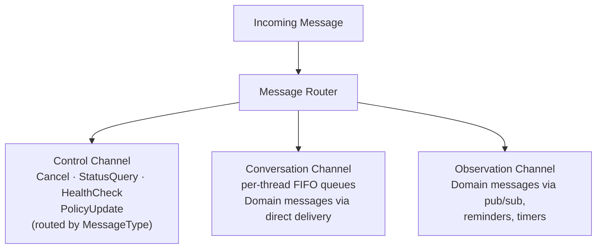
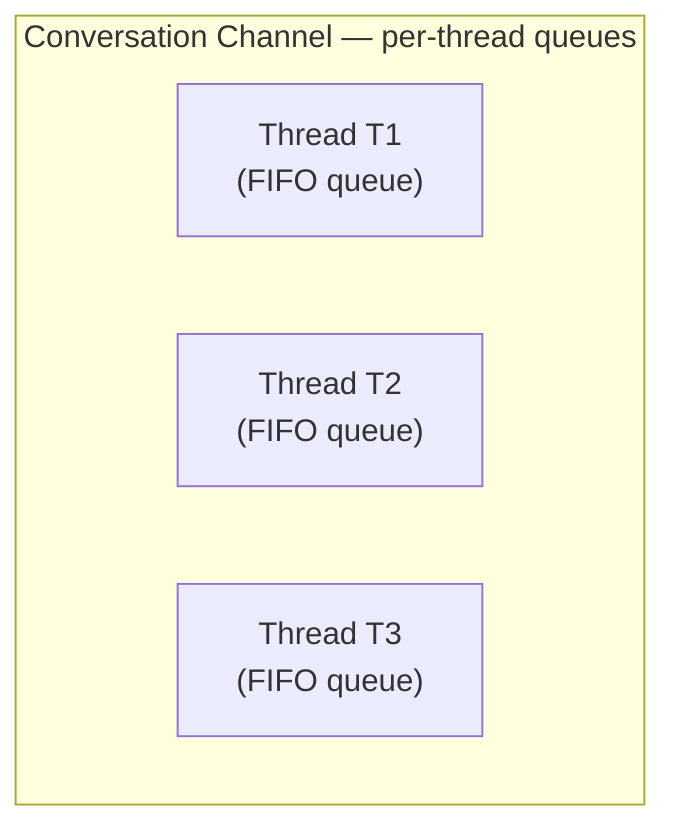
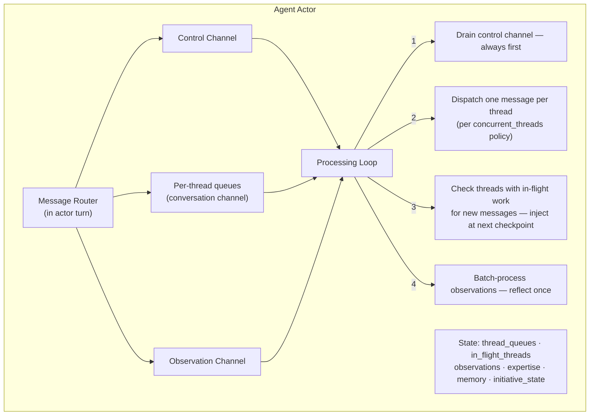
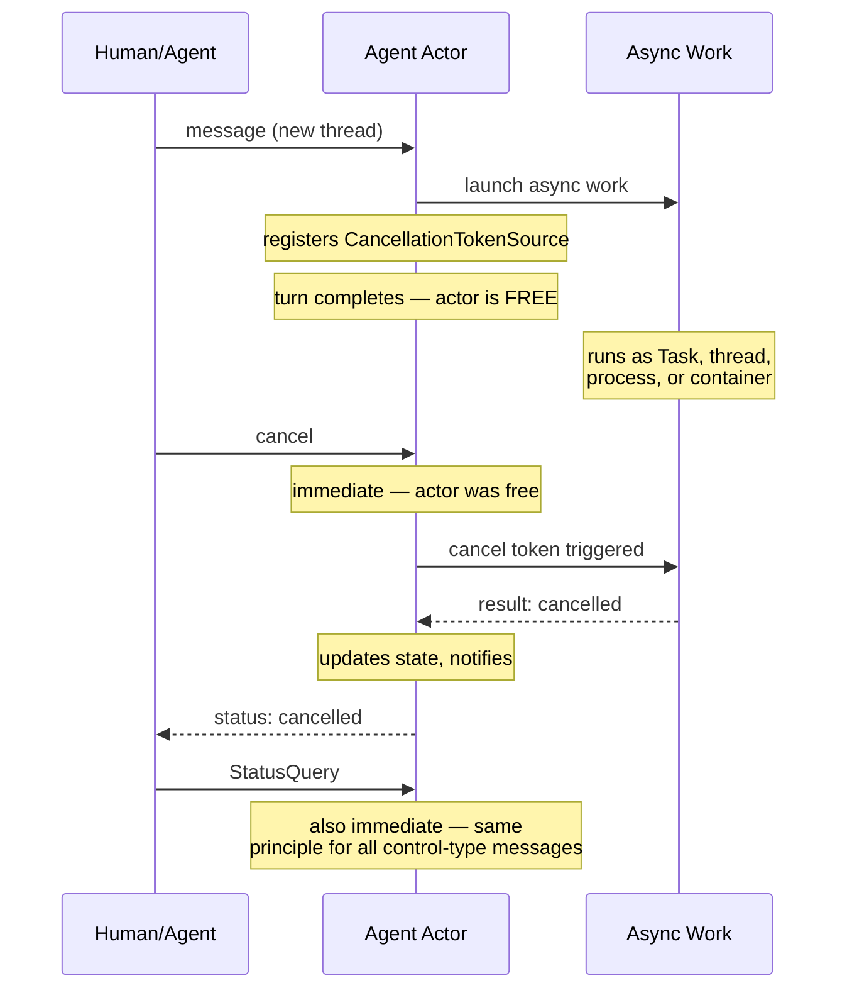
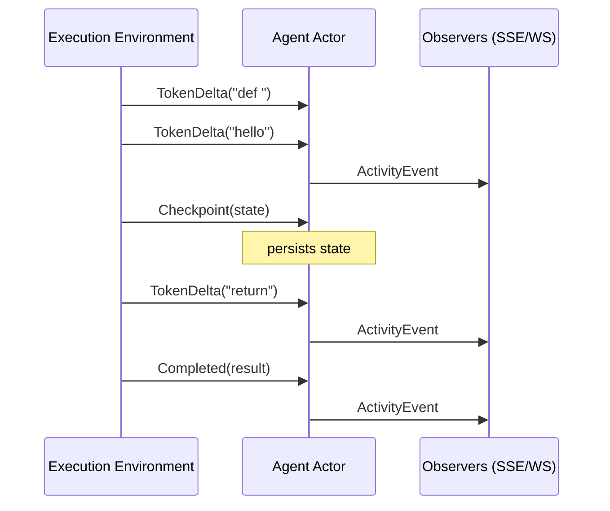

# Messaging

> **[Architecture Index](README.md)** | Related: [Infrastructure](infrastructure.md), [Units](units.md), [Agents](agents.md), [Initiative](initiative.md), [Thread Model](thread-model.md)

---

Messages in Spring Voyage are exchanged across **threads** — the system-level participant-set relationship that uniquely identifies a set of two or more participants and their lifelong shared exchanges. Each thread carries a single ordered, append-only **Timeline** that is the canonical shared record of what happened in the thread (messages, participant state changes, retractions, and system events). Each agent has its own per-agent **`AgentMemory`** that the agent reads while operating in any thread; per-thread visibility of memory entries is governed by the thread's `ThreadMemoryPolicy`.

The participant-set model and its design rationale are settled in [`docs/architecture/thread-model.md`](thread-model.md) and ratified in [ADR-0030](../decisions/0030-thread-model.md). This document covers the runtime mechanics — how messages are dispatched onto an agent's mailbox, how cancellation propagates, how streams flow back from the execution environment, how the Timeline is materialised, and how `AgentMemory` is offered as an MCP tool surface.

---

## Agent Mailbox & Message Processing

### The Core Question: How Does an Agent Handle Concurrent Messages?

Dapr actors provide turn-based concurrency — one message processed at a time. But agents need to handle multiple concerns simultaneously: working on threads while receiving status updates, cancellations, or messages from different sources.

### Design: Partitioned Mailbox with Priority Processing

Each agent's mailbox is logically partitioned into three channel types. The control and observation channels carry forward unchanged from [ADR-0018](../decisions/0018-partitioned-mailbox.md); the per-thread message channel is reframed by [ADR-0030](../decisions/0030-thread-model.md), which supersedes ADR-0018's single-active-conversation-slot semantics:




**Conversation channel — per-thread queues.** Behind the conversation channel, each distinct `ThreadId` has its own FIFO queue. There is **no single "active conversation slot"** gating dispatch across threads: by default the agent processes its threads concurrently, with up to N `on_message` calls in flight (one per thread) for an agent participating in N threads. Per-thread FIFO is preserved within each thread; concurrency is across distinct threads only.

The agent / unit definition carries a **`concurrent_threads: bool`** flag (default **`true`**). When set to `false`, the agent processes threads serially: at most one `on_message` call is in flight across all threads the agent participates in. This is the right opt-out for resource-bound agents, LLM-context-bound agents that cannot multiplex cleanly, or agents with strict ordering needs across threads.




A `Domain` message arriving via direct delivery with a new (or absent) `ThreadId` creates a new per-thread queue. Follow-up messages carrying the same `ThreadId` are routed to the existing queue. Routing is determined by `MessageType` and delivery mechanism — the platform never inspects the `Payload` for routing decisions.

**Processing model:**

The processing loop is **event-driven**. All triggers — incoming messages, timer firings, subscription notifications — surface as events that trigger a processing pass. There is no timer-based polling.

The agent actor maintains a **single Dapr actor turn** for state consistency, but uses structured processing within that turn:




**Key behaviors:**

1. **Control messages are never blocked.** A cancellation or other control message is processed even if the agent is mid-work. The actor handles it in the current turn by updating state (setting a cancellation flag). The execution environment checks these flags.
2. **One message per `on_message` invocation.** The platform delivers exactly one message per dispatch; multiple queued messages on the same thread are **not** auto-batched by the platform. The SDK exposes a `peek_pending(thread_id)` accessor (mirroring the `checkMessages` tool below) so the agent **chooses** whether to drain pending messages into the current turn or process them sequentially. Default agent behaviour, where an SDK provides one, is sequential — one-message-per-turn — with the agent free to opt into batching.
3. **In-flight thread receives new messages immediately.** When a message arrives for a thread the agent is currently processing (same `ThreadId`), it is placed in that thread's FIFO queue. The sender receives an immediate acknowledgment. The platform does not distinguish between "feedback," "clarification," or any other message type — any message on a thread the agent is working in is accumulated for the agent.

   **Message retrieval for delegated agents:** Delegated execution environments (e.g., Claude Code) drive their own agentic loop and don't naturally check back with the actor. The platform provides a `checkMessages` tool in the agent's tool manifest. The agent calls this at natural boundaries (between subtasks, after completing a step). The tool calls back to the actor, which returns any accumulated messages on the agent's current thread. This is pull-based — the agent decides when to check. The actor also includes a "messages pending" flag in checkpoint acknowledgments, hinting that the agent should call `checkMessages` soon. For hosted agents, accumulated messages are injected directly into the next LLM call.
4. **Concurrent threads are dispatched in parallel by default.** When a message arrives on a thread the agent is not currently processing and `concurrent_threads` is `true` (the default), the runtime issues a fresh `on_message` invocation for that thread without waiting for in-flight work on other threads to drain. When `concurrent_threads` is `false`, the runtime queues the new thread until the in-flight invocation completes.
5. **Observation messages batch.** Activity events from observed agents and pub/sub notifications accumulate. The initiative cognition loop processes them in batch — "what happened since I last looked?" — rather than one at a time. This is more efficient and produces better reasoning.

**Example flow (`concurrent_threads: true`):**

```text
msg1: implement-feature (T1) → creates T1 queue, runtime issues on_message(T1)
msg2: review-pr (T2)         → creates T2 queue, runtime issues on_message(T2)
                                (concurrent with T1's in-flight call)
msg3: investigate-bug (T3)   → creates T3 queue, runtime issues on_message(T3)
                                (concurrent with T1 and T2)
msg4: (T1)                   → routed to T1's FIFO queue
                                → injected at next checkpoint
                                → sender gets ack: "message received"
```

**Per-thread FIFO** is the documented promise: messages on the same thread dequeue in arrival order. The platform does not promise causal ordering across threads — different participant sets can race — but does promise per-thread FIFO, which is the only ordering an agent reasoning about "what just happened in this thread" can sensibly use.

**Thread suspension** carries forward from ADR-0018 at thread grain: an agent can suspend an in-flight thread (e.g., blocked waiting on external input or human approval), let the runtime move other threads forward, and resume the original later — all with clean per-thread state. Suspension is at thread grain because that is the right grain for "I am blocked on user input here, let me work on something else."

**Operator-driven close (#1038).** A thread can also be closed explicitly by an operator via `IAgentActor.CloseThreadAsync(id, reason)` (surfaced as `POST /api/v1/threads/{id}/close` and `spring thread close <id>`). The close path cancels any in-flight dispatch on that thread via its `CancellationTokenSource`, removes the per-thread queue, emits a `ThreadClosed` activity event correlated to the thread, and promotes any subsequent dispatch on other threads. The operation is idempotent — closing an unknown id is a no-op.

**Auto-clear on dispatch failure (#1036).** When the off-turn `RunDispatchAsync` task observes a non-zero `ExitCode` on the dispatcher response (or an unhandled exception), the actor emits an `ErrorOccurred` event with the exit code + first stderr line, still routes the failure response back to the original sender, and then self-invokes `ClearThreadDispatchAsync` via `IActorProxyFactory` so the state mutation runs on a fresh actor turn (the off-turn dispatch task must not touch `StateManager` directly). The clear helper removes the in-flight pointer for that thread, emits a `StateChanged` Active→Idle event, and lets the next per-thread dispatch proceed — so a single failed dispatch no longer permanently bricks an agent.

### Asynchronous Work Dispatch & Cancellation

The actor's primary responsibility is **processing messages**. It never performs long-running work synchronously. Every work message is handled the same way: the actor validates, updates state, launches the work asynchronously, and returns — remaining immediately available for the next message.

**Asynchronous dispatch model:** When the actor processes a work message, it launches the work via one of several mechanisms — a .NET `Task`, a background thread, a child process, or a remote execution environment (container) — and registers a `CancellationTokenSource` for that work. The actor turn completes in milliseconds. The actor is then free to process any subsequent message, including cancellation and other control messages.

**Cancellation is immediate.** When a cancel message arrives, the actor is guaranteed to be available to process it (since no work runs inside the actor turn). The actor triggers the `CancellationTokenSource`, which propagates cancellation to whatever async mechanism is running the work:




This pattern applies uniformly regardless of how the work is executed:


| Dispatch Mechanism           | Cancellation Propagation                                                                                                 |
| ---------------------------- | ------------------------------------------------------------------------------------------------------------------------ |
| .NET `Task`                  | `CancellationToken` passed to async methods; aborts in-flight HTTP calls, LLM API calls, etc.                            |
| Background thread            | Token checked at processing boundaries; thread terminates gracefully.                                                    |
| Child process                | Actor sends signal (SIGTERM or side-channel); process exits and returns partial results.                                 |
| Remote execution environment | Actor sends cancel via Dapr service invocation to the container. Container process catches it and terminates gracefully. |


The actor guarantees **actor processing semantics** at all times: messages are always processed in order, state is always consistent, and no message is ever blocked behind long-running work.

### Streaming: Real-Time Output from Execution Environments

Execution environments stream tokens and events back to the actor in real-time, enabling live observation of agent work.




**Stream event types** (for lightweight platform LLM calls via `IAiProvider`; agent container tool-use shows up through the container's own stdout/stderr and higher-level completion signals):


| Event           | Description                                          |
| --------------- | ---------------------------------------------------- |
| `TokenDelta`    | LLM token(s) generated — enables live text streaming |
| `ThinkingDelta` | Reasoning/thinking tokens (if model supports)        |
| `Checkpoint`    | State snapshot for recovery and progress tracking   |
| `Completed`     | Work finished with final result                      |


**Transport:** The execution environment publishes to a per-agent Dapr pub/sub topic (`agent/{id}/stream`). Multiple subscribers consume from this topic concurrently:

- **Agent Actor** — subscribes for state management. Processes `Checkpoint` and `Completed` events to update actor state. Projects all events to its `IObservable<ActivityEvent>` stream for agent-to-agent observation.
- **API Host** — subscribes directly to the same topic for real-time relay to connected browsers via SSE/WebSocket. This avoids routing every token through the actor, reducing latency for human observers.

This is standard Dapr pub/sub with multiple subscribers — no special bypass mechanism needed. The actor remains the authority on state; the API host is a pass-through for display.

---

## Addressing

Every addressable entity (agent, unit, human, connector) has a stable `Guid` identity assigned at creation. The `Address` record carries that identity plus a scheme: `(Scheme, Guid)`. The canonical wire form is `scheme:<32-hex-no-dash>` — for example `agent:8c5fab2a8e7e4b9c92f1d8a3b4c5d6e7`.

Full identifier conventions — wire forms, parser rules, the asymmetric "emit one form, parse many" contract, the JSON-vs-URL split, manifest local symbols, and the `OssTenantIds.Default` constant — live in [Identifiers](identifiers.md). The summary below covers what the messaging layer specifically does with addresses.

### Address shape

`Address` is a record with two fields: `Scheme` (e.g. `agent`, `unit`, `human`, `connector`) and `Id` (`Guid`). Examples:

- `agent:8c5fab2a8e7e4b9c92f1d8a3b4c5d6e7`
- `unit:dd55c4ea8d725e43a9df88d07af02b69`
- `human:f47ac10b58cc4372a5670e02b2c3d479`
- `connector:a1b2c3d4e5f6789012345678901234ab`

Since a unit IS an agent (composite pattern; see [Units](units.md)), `unit:<id>` and `agent:<id>` both reach the same actor when `<id>` belongs to a unit; the `unit:` scheme is used when the caller wants to reason about the unit-as-an-orchestrator, the `agent:` scheme when the caller wants to treat it as an opaque agent. The directory resolves both to the same actor.

There is no path form (`agent://team/ada` does not parse), no navigation form, no `@<uuid>` form. The shape is uniform: scheme + id.

`Address.Path` is a convenience accessor that returns the no-dash hex on its own (Dapr `ActorId` construction, log correlation, dictionary keys). The canonical render is `Address.ToString()` → `scheme:<id>`.

### Routing

All actors have **flat, globally-unique Dapr actor ids** derived from their `Guid`. The directory resolves an `Address` to an actor id in a single lookup; messages dispatch directly to that actor. There is no multi-hop forwarding through a chain of units.

The directory is the source of truth for what `Guid` belongs to which scheme. Each unit caches the (id → actor) mappings it dispatches against; directory mutation events keep caches fresh with millisecond-grade consistency. When membership changes (an agent joins or leaves a unit, a unit is restructured) the unit publishes a directory-change event to a system topic; subscribers refresh their caches.

`human:` short-circuits the directory by design. Humans are addressed 1:1 by identity — the `Guid` is the human's actor id, so there is no routing indirection a directory lookup could add. The platform has no general flow that registers humans in the directory, so insisting on a directory hit would either force an artificial registration step or break legitimate scenarios such as the LocalDev worker routing an agent's response back to a local human. `MessageRouter` short-circuits `human:` resolution; `agent:`, `unit:`, and `connector:` schemes consult the directory.

**Permission enforcement** happens at resolution time, not delivery time. The directory walks the membership graph from the addressed actor toward the tenant root — the membership graph IS the addressing fabric (see [Units — Nested Units](units.md#nested-units-units-as-members-of-units)) — and at each membership edge evaluates the boundary's `deep_access` policy against the sender's permissions. The walk returns either an actor id (permitted) or a structured deny (rejected). This is one synchronous check whose cost is O(membership depth), not per-hop forwarding.

**Addressing a unit** (rather than a specific member) sends the message to the unit actor. The unit applies its boundary filtering and delegates to its orchestration strategy, which picks a member to handle the message.

**Nested dispatch.** A unit's members may themselves be units. Because `IUnitActor` inherits the shared `IAgent` mailbox contract, a parent unit's strategy may pick a sub-unit and forward the message through `IUnitContext.SendAsync` without branching on scheme — `IAgentProxyResolver` maps the scheme to the right actor type and the sub-unit runs its own orchestration turn. Membership-graph depth is bounded to 64 levels; see [Units — Nested Units](units.md#nested-units-units-as-members-of-units) for membership invariants and cycle-detection semantics.

**Multicast addressing** continues to dispatch a single domain message to every actor that matches a routing pattern (e.g. all members of a unit advertising a given role); the multicast resolution itself happens above the directory and ultimately produces a set of `(scheme, Guid)` addresses, each routed individually.

---

## Activation Model


| Trigger              | Dapr Primitive          | Description                            |
| -------------------- | ----------------------- | -------------------------------------- |
| Direct message       | Actor method call       | Another entity sends a message         |
| Pub/Sub subscription | Pub/Sub subscriber      | Agent subscribes to topics             |
| Scheduled reminder   | Actor reminder          | Durable cron-like trigger              |
| Volatile timer       | Actor timer             | In-memory periodic callback            |
| External event       | Input binding           | Dapr binding translates external event |
| Workflow step        | Workflow activity       | Workflow invokes agent as activity     |
| Initiative           | Actor reminder + Tier 1 | Cognition loop fires, Tier 1 screens   |


### Pub/Sub

Topics are namespaced by tenant + owner Guid + topic name: `{tenant-id-no-dash}/{owner-id-no-dash}/{topic}`. The owner is the unit (or other addressable) that anchors the topic. System topics use the literal prefix `system/` — `system/directory-changed`, `system/activity`. Topic names are case-insensitive, lowercase by convention; the platform does not validate topic content beyond its routing role.

Dapr pub/sub is broker-agnostic — Redis for development, Kafka or Azure Event Hubs for production, swapped via YAML.

---

## Thread Timeline

Every thread has a single, ordered, timestamped **Timeline** of all artifacts it accumulates. The Timeline is the canonical shared record of what happened in the thread, in what order, and is **append-only at the platform level** — edits and retractions appear as new Timeline events that reference the prior artifact, not as in-place mutations.

**Artifact types.**

| Type | Description |
|------|-------------|
| **Message** | A user, agent, or initiative message exchanged between participants. Initiative messages are normal messages — not a separate primitive — distinguishable only by sender role and by optional `context` UX-hint metadata (see below). |
| **`ParticipantStateChanged`** | A participant transitioned through the per-(thread, participant) state machine (`added → active → removed → re-added`). Carries `(thread, participant, from_state, to_state, timestamp)`. |
| **Retraction** | The agent marked a previously-sent message as retracted via the `message.retract` MCP tool. Soft — the original message is preserved on the Timeline for audit; the surface renders it with a strikethrough plus the agent's stated reason. |
| **System events** | Platform-emitted events that belong on the shared record (e.g., thread close). |

Tasks are **not** Timeline artifacts — they are memory entries on each agent's `AgentMemory` (see [Agent Memory](#agent-memory) below). The collaboration surface renders task state by reading the agent's task-shaped memory entries, not by walking Timeline artifacts.

**Per-thread FIFO** is the ordering invariant on the Timeline.

**Ordering, append-only, persistence.** The activity-event projection is the implementation of the Timeline; every artifact lands as one event. Existing query services materialise Timeline views by grouping events on `ThreadId`.

### Per-participant view — read-time filter

The per-participant view of the Timeline is a **read-time filter**, not a separate copy. Every participant of the thread sees the full membership set + every participant's *current* state at all times; only the *historical Timeline* is filtered.

For a participant `P` viewing thread `T`'s Timeline, an entry `E` is visible iff **either**:

1. `E` is a `ParticipantStateChanged` event whose target is `P`. P always sees their own state transitions — they need to know they were removed and re-added, even when the events flank a blackout window.

   **OR**

2. `P`'s state at `E.timestamp` is `active`, where state is determined by the most-recent `ParticipantStateChanged` event affecting `P` with timestamp **strictly less than** `E.timestamp` (default `active` if `P` is a member and no state-change event has occurred yet).

The strict-less-than rule is load-bearing at the moment of removal: at `t_leave`, the most-recent affecting event is the leave event itself — but `<` excludes it, so P's state at `t_leave` is computed from before the leave (`active`). The leave event itself is captured cleanly by clause 1, and entries strictly after `t_leave` get state `removed`. See [`docs/architecture/thread-model.md` § 6](thread-model.md) and [ADR-0030](../decisions/0030-thread-model.md) for the precise rule and pseudocode.

### Participant state machine

Each `(thread, participant)` pair has a per-thread state machine: **`added → active → removed → re-added`**. A removed participant does not see new activity until re-added; on re-add, the read-time filter restricts them to Timeline content from periods when they were `active`. A removed participant's thread-scoped memory entries are not purged — they are frozen at the moment of removal and resume accumulating when re-added.

Membership-set changes (a participant who has never been a member of this thread joins) are a different operation: they produce a *different participant set*, hence a *different thread*. The engagement (UX) may stitch across distinct threads transparently, but the underlying threads are distinct.

### Initiative messages and the `context` UX hint

An initiative-driven agent message (task completed; reminder fired; observation digest summary) is a normal Timeline message. It may carry optional UX-hint metadata in the payload's `context` field:

```text
context: { kind: "task_update" | "reminder" | "observation" | "spontaneous",
           task: "#name"?,
           originating_message: <id>? }
```

The hint lets the engagement / collaboration surface render a header or grouping cue (e.g., a "re: #flaky-test-fix" prefix). **The platform does not branch on `context`.** The set of `kind` values is a UX vocabulary; if it ever needs to be a typed enum at the contract level, F3 / D1 will pin it.

### Retractions

A retraction is a Timeline event emitted by the agent's `message.retract(message_id, reason)` MCP tool. It references the prior message; the original is preserved (audit). The surface renders the original with a strikethrough and the agent's stated reason. This is for "I told the user something wrong; let me say so explicitly" correction. Cancelling work or re-scoping a task is **not** a retraction — that is the agent updating its memory entries via `store(memory)`. Hard delete (right-to-be-forgotten) is a separate compliance concern, out of scope for v0.1.

### Surfaces

The same Timeline projection feeds two equivalent surfaces:

| Surface | CLI | Portal |
| ------- | --- | ------ |
| List    | `spring thread list [--unit] [--agent] [--status] [--participant]` | `/threads` (with the same query-string filter shape). |
| Show    | `spring thread show <id>` | `/threads/<id>` — full role-attributed Timeline. |
| Send    | `spring thread send --thread <id> <addr> <text>` | Composer at the bottom of `/threads/<id>`. |
| Inbox   | `spring inbox list` | "Awaiting you" panel on `/threads`. |

The portal is **not** a separate event source. It consumes the activity SSE stream (`/api/stream/activity`, see [Streaming](#streaming-real-time-output-from-execution-environments)) and uses the same Timeline endpoints the CLI consumes — there is no portal-only data path. UI/CLI parity is enforced by `CONVENTIONS.md § ui-cli-parity` and validated by `npm test` and `dotnet test`.

The Timeline view cross-links each event back to the activity surface (`/activity?source=…`) and the activity surface deep-links any event with a non-null `correlationId` (the `ThreadId`) into `/threads/<id>`. The two surfaces stay separate by design — activity is the raw timeline, threads is the participant-facing Timeline — but they share the underlying stream and are always one click apart.

> The CLI verb rename (`spring conversation …` → `spring thread …`) is tracked under [#1288](https://github.com/cvoya-com/spring-voyage/issues/1288); the public-API URL move (`/api/v1/threads/{id}` as the canonical surface, no `/conversations` alias) is tracked under [#1291](https://github.com/cvoya-com/spring-voyage/issues/1291); the code-level `Conversation*` → `Thread*` rename is tracked under [#1287](https://github.com/cvoya-com/spring-voyage/issues/1287). The on-the-wire and in-code field name remains `ConversationId` until #1287 ships; the prose in this document leads the rename and uses `ThreadId` throughout.

---

## Agent Memory

Each agent has a single per-agent **`AgentMemory`** — an ordered, append-only memory store. Entries are **`MemoryEntry`** records of shape `{ id, timestamp, payload, thread_id?, threadOnly? }`. Per-thread visibility is governed by the thread's **`ThreadMemoryPolicy`** (per-thread, default `threadOnly: true` — entries do not leave the thread). The policy is the operator's privacy / trust knob and is the only memory-flow knob in v0.1.

Memory is offered to the agent through two MCP tools, both implicit in the agent's current operating context:

| Tool | Purpose |
| ---- | ------- |
| **`store(memory)`** | Append a new memory entry to the agent's `AgentMemory`. The platform stamps `thread_id` from the agent's current operating thread and `threadOnly` from the thread's `ThreadMemoryPolicy`; the agent passes only the `memory` payload. Replaces the prior `learn` / `storeLearning` tool. |
| **`recall(query)`** | Read the visible subset of the agent's `AgentMemory` for its current operating context. Visibility filter: all entries with `thread_id == current_thread`, plus all entries from other threads where `threadOnly == false`, plus all entries with `thread_id == null` (thread-less, always visible). Replaces the prior `recall` / `recallMemory` tool. |

**Tasks are memory entries** (no `task.*` MCP tools): a task is a memory entry whose payload represents a task by application or surface convention; lifecycle (created, updated, cancelled, completed) is expressed as further append-only entries that the agent's cognition or the surface interprets as updates to the prior task entry.

The full memory model — artifact uniformity, the `ThreadMemoryPolicy` resolution chain, cloning semantics, deferred features (unit recursion, cross-thread reads at the API level, multi-human permission gating, inferences with explicit provenance) — is settled in [`docs/architecture/thread-model.md` § 4](thread-model.md) and ratified in [ADR-0030](../decisions/0030-thread-model.md).

---

## Message kind discriminator

Thread messages carry an optional `kind` string that lets the engagement portal (and other consumers) classify messages semantically without inspecting the payload text. The discriminator is **convention-driven** — the platform accepts, persists, and echoes the value, but does not enforce it. Units and agents are expected to set the appropriate `kind` when sending; the platform does not validate or gate on it.

### Valid values (v0.1)

| `kind` | Meaning | Set by |
|---|---|---|
| `information` | Default. A regular status update, progress report, or result. | Anything that does not fit another kind. |
| `question` | The sender is asking a participant for clarification before proceeding. | Unit / agent asking a human or another agent. |
| `answer` | A reply to a clarifying question. | Human (`engagement answer`), or an agent responding to a question. |
| `error` | The sender encountered an error and is surfacing it on the thread for visibility. | Unit / agent on failure paths. |

### Wire shape

`POST /api/v1/tenant/threads/{id}/messages` accepts an optional `kind` field on the request body. When omitted, the server defaults to `information`. The response body echoes the accepted kind so callers can confirm what was persisted.

```json
// Request
{
  "to": { "scheme": "agent", "path": "ada" },
  "text": "Which branch should I target?",
  "kind": "question"
}

// Response
{
  "messageId": "...",
  "threadId": "...",
  "responsePayload": null,
  "kind": "question"
}
```

### CLI mapping

- `spring engagement send` — always sends `kind=information`.
- `spring engagement answer` — always sends `kind=answer`.
- `spring engagement errors` — currently filters by `eventType=ErrorOccurred` or `severity=Error` on the Timeline; future work may additionally surface messages with `kind=error`.

### Instruction to units

When a unit implementation produces a structured message, it should set `kind` appropriately:

- A clarifying question before a potentially destructive action → `kind=question`
- A human/agent reply in a clarification loop → `kind=answer`
- An error that surfaced during execution → `kind=error`
- Any other message (status, result, progress) → `kind=information` (or omit)

The discriminator is a lightweight convention. It is not a security boundary. Consumers must not make security-relevant decisions based on `kind` alone.

---

## See also

- [Thread model — participant-set design](thread-model.md) — the long-form F1 design covering naming, container/execution model, dispatch semantics, memory, tasks, participant-set changes, the Timeline, retraction UX, cold start, and migration.
- [ADR-0030 — Thread model](../decisions/0030-thread-model.md) — the durable architectural decision.
- [ADR-0018 — Three-channel partitioned mailbox](../decisions/0018-partitioned-mailbox.md) — superseded by ADR-0030 for the conversation-channel slot semantics; control + observation channel partitioning carries forward unchanged.
