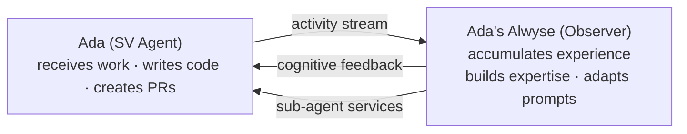

# Open Questions

> **[Architecture Index](README.md)** | Related: [Roadmap](../roadmap/README.md), [Infrastructure](infrastructure.md), [Initiative](initiative.md)

---

## Resolved

1. ~~**GitHub Connector language**~~ — Rewritten in C# for consistency with the .NET infrastructure layer. The Python v1 connector is not carried forward.
2. ~~**Second Connector**~~ — Targets the product-management domain (Linear / Notion / Jira); concrete pick scheduled with the next product-management workstream.
3. ~~**Active Conversation Model**~~ — All agents use one-active-with-suspension. The active period spans the full container-based agent run. See [Messaging](messaging.md).
4. ~~**Prompt Assembly: Conversation Context**~~ — Four-layer prompt model. Conversation context (prior messages, checkpoints, partial results) is Layer 3, injected per invocation. See [Units & Agents](units.md).
5. ~~**Web UI Technology**~~ — React + Next.js + TypeScript. Shipping in `src/Cvoya.Spring.Web`; the OpenAPI client codegen bridge to the .NET host is in place.
6. ~~**Tier 1 LLM Hosting**~~ — Out-of-process via Ollama (no in-process ONNX runtime). The Tier 1 screening provider talks to the same Ollama deployment the host uses, on a separate `BaseUrl` knob. See [Local AI with Ollama](../developer/local-ai-ollama.md).

## Remaining

1. **State Schema Evolution** — Versioned serialization for actor state changes. See [Security](security.md) (Platform Versioning & Migrations).
2. **A2A Protocol Version** — Which version to target; maturity assessment. See [Workflows](workflows.md).
3. **Streaming Hot Path** — Through actor (consistent) vs. direct to API host (fast). The dual-subscriber model (actor + API host both subscribe to the same Dapr pub/sub topic) is a candidate but needs validation. See [Messaging](messaging.md).
4. **Initiative Policy Granularity** — Is `max_level` sufficient (each level implies capabilities), or should there be explicit per-capability flags? See [Initiative](initiative.md).
5. **Event Stream Separation** — Whether to split `ActivityEvent` into a high-frequency execution stream and a lower-frequency activity summary stream. See [Observability](observability.md).

---

## Future Work

The following capabilities are beyond the phased implementation but the architecture is designed to accommodate them. Interfaces and extension points are in place.

### Alwyse: Cognitive Backbone

Alwyse is an optional **observer agent** that acts as each Spring Voyage agent's personal intelligence. When enabled, it replaces default implementations with cognitive equivalents:

**Integration points (designed now, implemented later):**

1. `IMemoryStore` — `AlwyseMemoryStore` replaces PostgreSQL key-value with cognitive memory
2. `ICognitionProvider` — `AlwyseCognitionProvider` powers the initiative reflect/decide steps
3. `IExpertiseTracker` — `AlwyseExpertiseTracker` evolves profiles from observed outcomes
4. `ActivityStream` observer — implicit permission to observe the agent

**Without Alwyse:** default implementations (PostgreSQL memory, LLM-based cognition, static expertise). System is fully functional.

**With Alwyse:** cognitive memory, pattern recognition, expertise evolution, sub-agent spawning. Premium enhancement.

### Future Directions

**Expertise Marketplace**

Cross-unit expertise access with cost structures — token-based billing, expertise licensing, usage metering, SLA contracts. The directory and routing infrastructure supports this. A unit could "hire" an expert from another unit for a specific task, with metered billing and SLA guarantees.

**Dynamic Agent & Unit Creation**

Agents and units created programmatically at runtime to meet emerging needs:

- **Workload scaling** — a unit spawns additional agents when its work queue grows, decommissions when idle.
- **Specialist spawning** — an agent encountering an unfamiliar domain requests creation of a specialist agent.
- **Ad-hoc units** — agents self-organize into temporary units for complex multi-agent tasks, then dissolve.
- **Emergent structure** — the unit hierarchy evolves at runtime, not just at configuration time.

Requires the `agent.spawn` permission and respects initiative budgets/policies.

**Cross-Organization Federation**

Multiple Spring Voyage deployments (different companies/teams) federating expertise directories. Requires trust, authentication, and billing across organizational boundaries.

**Advanced Self-Organization**

Agents negotiating task allocation, forming ad-hoc sub-units for complex tasks, and reorganizing unit structure based on workload patterns. With initiative and recursive composition, a unit could restructure itself — splitting into sub-units when tasks become complex, merging back when work is done.

**Alwyse Depth**

As Alwyse matures: agents that develop genuine specialization, transfer knowledge between contexts, mentor junior agents, and build institutional memory that transcends individual agents. Initiative becomes increasingly sophisticated — agents that anticipate problems before they occur, that proactively improve the systems they work on, that develop professional relationships with humans and other agents.

**Unit Evolution**

Units that evolve their own structure over time — adding new roles, adjusting policies, refining workflows based on outcomes. The unit's AI (powered by Alwyse) learns what compositions work best for different types of work.
