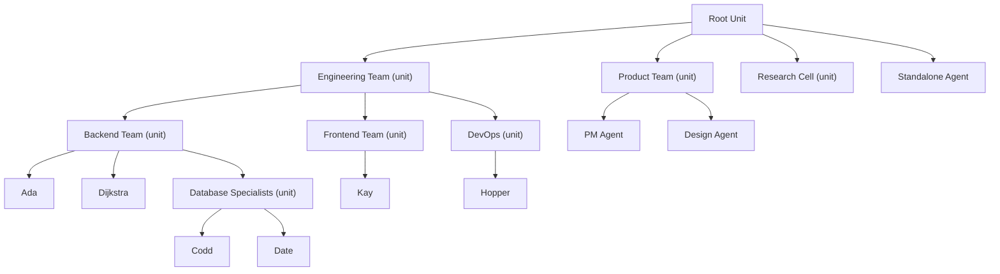

# Unit Policies

> **[Architecture Index](README.md)** | Related: [Units](units.md), [Agents](agents.md), [Orchestration](orchestration.md), [Initiative](initiative.md), [Security](security.md)

This document describes the **unit policy framework** — the governance layer that constrains what agents inside a unit may do. Policies are distinct from orchestration strategies (which control routing) and from unit boundary rules (which control visibility). A unit is a trust boundary: policies on it cannot be escaped by per-agent overrides.

For the root unit (the deployment-wide container), see [Root Unit](#root-unit) below.

---

## Unit Policy Framework

`UnitPolicy` (`Cvoya.Spring.Core/Policies/UnitPolicy.cs`) is the aggregate governance record attached to a unit; it is a record with six optional sub-policies, each a nullable slot:

| Dimension                            | Type                    | What it constrains                                                                                                                                 |
| ------------------------------------ | ----------------------- | -------------------------------------------------------------------------------------------------------------------------------------------------- |
| **Skill** (`Skill`)                  | `SkillPolicy`           | Which tools (skills) agents in the unit may invoke. Allow-list and/or block-list, case-insensitive.                                                |
| **Model** (`Model`)                  | `ModelPolicy`           | Which AI models agents may run under. Same allow/block shape as `SkillPolicy`.                                                                     |
| **Cost** (`Cost`)                    | `CostPolicy`            | Per-invocation, per-hour, and per-day cost caps (rolling windows). Pre-call check before dispatch.                                                 |
| **Execution mode** (`ExecutionMode`) | `ExecutionModePolicy`   | Pins or whitelists `AgentExecutionMode` (`Auto` / `OnDemand`). A `Forced` mode coerces the dispatch.                                               |
| **Initiative** (`Initiative`)        | `InitiativePolicy`      | Unit-level DENY-overlay on per-agent reflection-action policy (allowed / blocked action types).                                                    |
| **Label routing** (`LabelRouting`)   | `LabelRoutingPolicy`    | Trigger-label → member-path map consumed by `LabelRoutedOrchestrationStrategy` (#389). Routing input, not a governance constraint; enforcers ignore the slot. |

A `null` slot means "no constraint at this unit along this dimension". An all-`null` policy (`UnitPolicy.Empty`) is equivalent to "this unit does not govern member agents" and repositories may treat it as a row deletion.

The label-routing slot is intentionally carried on `UnitPolicy` rather than invented as a separate top-level concept: every operator-facing policy edit already flows through `spring unit policy` (#453) and the unified `/api/v1/units/{id}/policy` endpoint, so adding the sixth slot keeps the surface small. Enforcers (`IUnitPolicyEnforcer`) walk only the first five governance slots — `LabelRouting` is consulted by the orchestration strategy, never by governance checks.

Unit policy wins over per-membership overrides and the agent's own declarations. A unit is a trust boundary: a unit that blocks a skill, pins an execution mode, or denies a model cannot be escaped by a per-agent override.

### `IUnitPolicyEnforcer` and `DefaultUnitPolicyEnforcer`

`IUnitPolicyEnforcer` (`Cvoya.Spring.Core/Policies/IUnitPolicyEnforcer.cs`) is the narrow, DI-swappable enforcement seam. One method per dimension — no generic `Evaluate(action)` dispatch, so call sites stay precise:

- `EvaluateSkillInvocationAsync(agentId, toolName, ct)` — called by `McpServer` before every tool invocation.
- `EvaluateModelAsync(agentId, modelId, ct)` — called by `AgentActor.ApplyUnitPoliciesAsync` before dispatch.
- `EvaluateCostAsync(agentId, projectedCost, ct)` — called pre-dispatch and on reflection turns; sums the rolling cost window via `ICostQueryService`.
- `EvaluateExecutionModeAsync(agentId, mode, ct)` — strict check; fails when a forcing unit coerces away from the requested mode.
- `ResolveExecutionModeAsync(agentId, mode, ct)` — coercion-aware resolution; callers that accept coercion (e.g. the actor) use this so a forcing unit's `Forced` value is returned instead of a deny.
- `EvaluateInitiativeActionAsync(agentId, actionType, ct)` — called by the initiative engine before emitting a reflection action.

`DefaultUnitPolicyEnforcer` (`Cvoya.Spring.Core/Policies/DefaultUnitPolicyEnforcer.cs`) is the OSS default — registered via `TryAddScoped<IUnitPolicyEnforcer, DefaultUnitPolicyEnforcer>()` so a private-cloud host can layer audit logging or tenant-scoped caches by registering a decorator before the default call.

#### Evaluation Chain

For every dimension, the enforcer walks **every unit the agent is a member of** (via `IUnitMembershipRepository.ListByAgentAsync`), loads that unit's policy (`IUnitPolicyRepository.GetAsync`), and applies the per-dimension evaluator. Rules:

1. **First deny short-circuits.** As soon as one unit denies, the enforcer returns that `PolicyDecision` with the denying unit id recorded on `DenyingUnitId` — subsequent units are not consulted.
2. **Missing policy = allow.** A unit with a `null` slot along the evaluated dimension contributes nothing; only non-`null` slots can deny.
3. **Skill / Model:** block-list wins over allow-list. A tool or model present in `Blocked` is always denied; a non-`null` `Allowed` then further restricts the allowed set. Matching is case-insensitive.
4. **Cost:** per-invocation cap is checked first (no database call). Per-hour and per-day caps query `ICostQueryService` once per window (sums are memoised across units in the same call). The tightest breached cap wins.
5. **Execution mode:** two passes — first any `Forced` mode wins (returns an allow decision with the coerced mode); only after every unit has been checked for forcing does the `Allowed` whitelist denial fire.
6. **Initiative:** a DENY overlay. A unit's `BlockedActions` blocks the action even if the agent's own policy allows it; a unit's `AllowedActions`, when non-`null`, tightens the allowed set but does not broaden the agent's own allow list. The agent-level initiative gate is evaluated separately by the initiative engine — the enforcer only speaks for the unit.
7. **Agents without unit membership:** zero memberships returns `PolicyDecision.Allowed` — there is no unit to consult.
8. **Thrown errors at the enforcer level:** the callers in `AgentActor` log a warning and proceed as "allowed" so a policy-store outage never silently drops dispatches. Deny outcomes are never thrown; they are returned as `PolicyDecision`.

#### Integration Points

- **Skill invocation** — `McpServer` consults `EvaluateSkillInvocationAsync` on every MCP tool call before the tool runs.
- **Agent dispatch (`AgentActor.ApplyUnitPoliciesAsync`)** — model, cost, and execution-mode evaluators run in sequence before every turn. An allowed execution-mode resolution whose `Mode` differs from the requested mode rewrites the effective `AgentMetadata` so downstream dispatch uses the coerced mode.
- **Initiative reflection** — before emitting a reflection action the engine checks `EvaluateSkillInvocationAsync` (for the tool) and `EvaluateInitiativeActionAsync` (for the action class) to keep the initiative surface policy-aware.

#### Operator Surface

Operators edit unit policies through two equivalent paths:

- **HTTP** — unified `GET / PUT /api/v1/units/{id}/policy` with the five optional dimension slots. The empty response shape is always returned for units that have never had a policy persisted, so callers never need to branch on 404 vs empty-policy.
- **CLI** (#453) — `spring unit policy <dimension> get|set|clear <unit>` for each of `skill`, `model`, `cost`, `execution-mode`, `initiative`, and `label-routing` (#389). `set` accepts either per-dimension typed flags (e.g. `--allowed`, `--max-per-hour`, `--forced`, `--trigger label=member-path`) or a YAML fragment via `-f`. `get` prints the current slot plus the effective-policy inheritance chain; today the chain has a single hop because parent-unit overlay is tracked under #414.

Both paths share the same wire contract — the CLI never mints a per-dimension endpoint. `set` and `clear` read the current policy, mutate only the target slot, and PUT the merged result so the other four slots are preserved across a dimension-scoped edit.

See [Security](security.md) for how unit policies compose with other authorization surfaces (permissions, RBAC, secret access policies).

---

## Root Unit

Every deployment has an implicit **root unit** — the top-level container:

The root unit provides the platform-wide directory, addressing, cross-unit routing, and default policies.

---

## See Also

- [Units](units.md) — unit entity model, membership, nested units
- [Agents](agents.md) — agent model; agent-level cloning policy
- [Orchestration](orchestration.md) — unit boundary; execution defaults resolution chain
- [Initiative](initiative.md) — agent initiative levels; how initiative policy interacts with unit policy
- [Security](security.md) — permissions, RBAC, secrets stack; how policies compose with authorization
