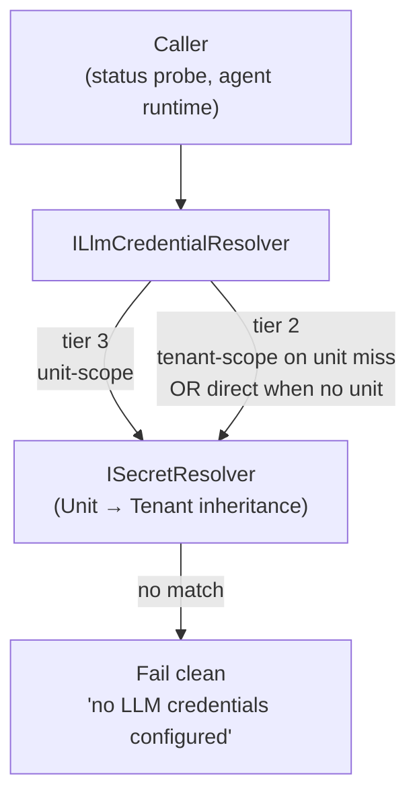
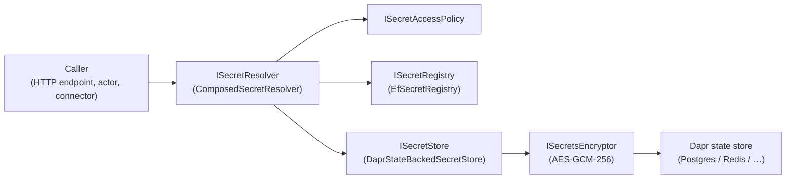

# Security

> **[Architecture Index](README.md)** | Related: [Infrastructure](infrastructure.md), [Units](units.md), [Policies](policies.md), [Deployment](deployment.md)
>
> **Note:** Multi-tenancy, OAuth/SSO, tenant administration, and platform operations are commercial extensions developed in the private repository. This document covers the OSS security model.

---

## Multi-Human Participation & Permissions

### HumanActor

Represents a human participant. Routes messages to notification channels. Enforces permission level.

### Permission Model

**System-level roles:**


| Role               | Permissions                                        |
| ------------------ | -------------------------------------------------- |
| **Platform Admin** | Create/delete tenants, manage users, system config |
| **User**           | Create units, join units they're invited to        |


**Unit-level roles:**


| Role         | Permissions                                                        |
| ------------ | ------------------------------------------------------------------ |
| **Owner**    | Full control — configure, manage members, delete, set policies     |
| **Operator** | Start/stop, interact with agents, approve workflow steps, view all |
| **Viewer**   | Read-only — state, feed, metrics, agent status                     |


### Hierarchy-aware permission resolution (#414)

See [ADR 0013](../decisions/0013-hierarchy-aware-permission-resolution.md) for the decision record (inheritance-by-default, nearest-grant-wins, fail-closed, relationship to boundary opacity).

Permission resolution for a `(humanId, unitId)` pair is **hierarchy-aware by default**: grants on an ancestor unit cascade down to descendant units, subject to a per-unit inheritance flag that plays the role of an opaque boundary for the permission layer. `IPermissionService` exposes two resolvers:

| API                                    | Scope                                                                                                                                           |
| -------------------------------------- | ----------------------------------------------------------------------------------------------------------------------------------------------- |
| `ResolvePermissionAsync`               | Direct grant only — returns whatever is recorded on the target unit, ignoring ancestors. Kept for the unit-editor surfaces and audit lookups. |
| `ResolveEffectivePermissionAsync`      | Walks the parent chain. Used by `PermissionHandler`, `MessageRouter`, and the activity-stream SSE endpoint — anywhere the platform authorizes a real request against a unit.  |

Resolution rules:

1. **Direct grants win.** An explicit grant on the target unit is authoritative — including a deliberate downgrade. A child that grants a human `Viewer` is never silently promoted to `Owner` because the parent happens to grant `Owner`.
2. **Nearest ancestor grant wins.** If the target unit has no direct grant, the resolver walks nearest ancestor first and returns the first non-`null` grant it finds. Depth does not amplify permissions — a parent granting `Operator` cascades as `Operator`, not as `Owner`.
3. **Isolation stops inheritance.** Each unit carries a `UnitPermissionInheritance` flag (`Inherit` by default, `Isolated` to opt out). An isolated unit is the permission-layer analogue of an **opaque boundary** (#413): ancestor authority does not flow through it. Direct grants on the isolated unit still apply; direct grants on its own descendants still cascade through it.
4. **Fail closed.** If the platform cannot read the inheritance flag on a hop (e.g. a state-store outage), the walk treats that hop as `Isolated` and blocks the ancestor grant. A confused-deputy risk is more expensive than an extra unauthorized response.
5. **Depth bounded.** The walk is capped at `UnitActor.MaxCycleDetectionDepth` (64) so a pathological graph cannot silently promote a caller.

The walk honours the boundary opacity rules landed in PR #497 by following the same "opaque = invisible to the outside" philosophy: a unit that is opaque from the permission perspective (`Isolated`) does not admit ancestor authority, just as an opaque expertise boundary does not admit ancestor-level projection. Explicit grants (both on the unit itself and on its descendants) are what the permission layer considers "private" to the isolated subtree.

Configuration:

- **HTTP** — `GET / PUT /api/v1/units/{id}/humans/{humanId}` for direct grants (unchanged). The inheritance flag is edited through the unit actor's `SetPermissionInheritanceAsync` (CLI/portal surface follow-up).
- **Default** — newly created units are `Inherit`. An operator explicitly opts out by setting `Isolated`.

### Agent Permissions

Agents also have scoped access:


| Permission                          | Description                                    |
| ----------------------------------- | ---------------------------------------------- |
| `message.send`                      | Send to specified addresses/roles              |
| `directory.query`                   | Query unit/parent/root directory               |
| `topic.publish` / `topic.subscribe` | Pub/sub access                                 |
| `observe`                           | Subscribe to another agent's activity stream   |
| `workflow.participate`              | Be invoked as a workflow step                  |
| `agent.spawn`                       | Create new agents at runtime (see Future Work) |


---

## Security & Multi-Tenancy

### User Authentication

Users must authenticate with the platform before using the CLI or API. Local development instances (daemon mode) bypass authentication.

**CLI authentication flow:**

```bash
spring auth
# Opens the web portal in the user's default browser.
# The portal handles:
#   1. Login (Google OAuth or other identity providers)
#   2. Account creation for new users:
#      - Minimal profile (name, email — pre-filled from identity provider)
#      - Terms of usage acceptance
#   3. On success, the portal issues a session credential back to the CLI
```

All subsequent CLI commands use the credential stored locally. The CLI rejects commands (other than `spring auth`) if the user is not authenticated.

**API tokens for non-interactive use:**

Authenticated users can generate long-lived API tokens for CI/CD, scripts, and programmatic access. Tokens are generated via the web portal or the CLI (which redirects to the web portal for the actual generation flow).

```bash
spring auth token create --name "ci-pipeline"
# Opens the web portal where the user names and confirms the token.
# The token is displayed once; the CLI stores it if requested.
```

Token management:

- The platform tracks all tokens per user (name, creation time, last used, scopes).
- A user can list and invalidate their own tokens via the portal or CLI (`spring auth token list`, `spring auth token revoke <name>`).
- A tenant admin can list and invalidate all tokens for any user in the tenant, or bulk-invalidate all tokens for all tenant users.
- Invalidated tokens are rejected immediately on next use.

**Local development exception:** When the API Host runs in daemon mode (single-tenant, `--local`), authentication is disabled. All commands execute as the implicit local user. This mode is for development and testing only.

### Dapr-Native Security

- Agent identity via Dapr
- mTLS for all service-to-service communication
- Pluggable secret stores
- Access control policies restrict actor → building block access

---

## Config tiers

Spring Voyage distinguishes three tiers of configuration so every piece of sensitive material lives where it can be rotated, audited, and scoped independently. The **Secrets Stack** below is the tier-2 / tier-3 machinery; **tier-1** (platform-deploy config) stays in `IConfiguration` and exists outside the database.

| Tier | Surface | Examples | Owner |
|------|---------|----------|-------|
| **Tier 1 — platform-deploy** | `IConfiguration` / env / `spring.env` / `appsettings.json` | `ConnectionStrings__SpringDb`, Dapr component wiring, `DataProtection__KeysPath`, `GitHub__AppId` / `GitHub__PrivateKeyPem` / `GitHub__WebhookSecret` (identity of the Spring Voyage instance itself) | Ops team at deploy time |
| **Tier 2 — tenant-default** | `SecretScope.Tenant` rows in the registry | LLM provider API keys (`anthropic-api-key`, `openai-api-key`, `google-api-key`), tenant-wide observability tokens | Tenant admin post-deploy via `spring secret --scope tenant` / Tenant defaults panel |
| **Tier 3 — unit-override** | `SecretScope.Unit` rows in the registry | Per-unit variants of any tier-2 credential | Unit operator via `spring secret --scope unit` / unit Secrets tab |

### Why the split matters

- **LLM API keys are tier-2, not tier-1.** They describe a workload (this tenant's preferred Claude / OpenAI account), not the deployment (this server, bound to this GitHub App). Treating them as environment variables is structurally wrong — they cannot vary per-tenant (needed for hosted multi-tenant), cannot be scoped per-unit (needed for "this team uses a different key"), and cannot be rotated without a container restart. Tier-2 / tier-3 storage carries versioning, inheritance, and audit hooks for free. See issue #615 for the full migration rationale.
- **GitHub App credentials are tier-1.** They identify the Spring Voyage *instance itself* as a GitHub App — the keypair and webhook secret are issued by GitHub against this platform identity, not against a tenant's workload. They stay in env/startup config. Narrower validation work for tier-1 is tracked separately (see #609 / #616).
- **GitHub App installation enumeration is single-tenant in OSS.** The default `IGitHubInstallationsClient` calls `GET /app/installations` with the App-level JWT, so any operator on the deployment sees every installation the App has been granted — fine for self-hosted single-tenant set-ups where the operator already controls the GitHub App. Multi-tenant deployments (commercial / cloud) override `IGitHubInstallationsClient` with an OAuth-session-aware implementation that calls `GET /user/installations` against the operator's session and filters the aggregated `/list-repositories` response to installations the operator can see. The portal's create-unit wizard never exposes a raw "App installation" picker — installation ids ride along on each repository row, so the only enumeration the operator ever sees is repositories they could reach in GitHub directly. ([#1133](https://github.com/cvoya-com/spring-voyage/issues/1133))

### Tier-2 resolution chain

[`ILlmCredentialResolver`](../../src/Cvoya.Spring.Core/Execution/ILlmCredentialResolver.cs) is the canonical interface every LLM-credential consumer reads through (the credential-status probe that feeds the Execution panels, the agent runtime at turn-dispatch time, and any future provider wrapper). Its default implementation delegates to [`ISecretResolver`](../../src/Cvoya.Spring.Core/Secrets/ISecretResolver.cs), which already encodes the Unit → Tenant inheritance from [ADR 0003](../decisions/0003-secret-inheritance-unit-to-tenant.md):



There is **no environment-variable fallback**. Credentials must be set at tenant scope (default) or unit scope (override) — the platform fails cleanly when neither is configured. The private cloud host swaps in its own tenant-scoped `ILlmCredentialResolver` via DI (per-tenant Key Vault, BYOK).

The resolver **never throws** on a missing credential. Consumers that require a value surface a fail-clean operator error whose text names the exact secret the resolver looked for and points at both the unit and tenant surfaces — e.g. *"no LLM credentials configured for this unit; set via `spring secret --scope unit` or configure tenant defaults at `spring secret --scope tenant create anthropic-api-key …` / the portal's Tenant defaults panel."*

### Credential status endpoint — key-free by design

`GET /api/v1/system/credentials/{provider}/status` (PR #627) powers both the PR #627 status banner and the #626 inline credential flow in the unit-creation wizard. The response shape is intentionally narrow:

```
{ "provider": "anthropic", "resolvable": true, "source": "tenant", "suggestion": null }
```

**The browser never receives the tenant-default plaintext.** The endpoint evaluates the resolver chain server-side and drops the plaintext on the floor before writing the response. Even when a tenant default is resolvable, the portal only sees `resolvable: true` + `source: "tenant"`. This is load-bearing for the wizard's override flow (#626 §3): the **Override** button clears the input and asks the operator for a fresh value rather than rendering the existing key — there is no portal surface that can read a tenant-default value back, full stop. The only path plaintext leaves the server is via the server-side `ISecretResolver.ResolveAsync` seam at dispatch time, which is reached by the agent runtime, not the browser.

When a deployment needs to read a tenant-default value back (for instance, to port it to a new tenant), operators use the CLI's secret-management verbs against the registry directly — subject to `ISecretAccessPolicy`, which in the cloud host is tenant-admin-gated. The portal never offers a "reveal" button.

### Credential validation endpoint — per runtime

`POST /api/v1/agent-runtimes/{id}/validate-credential` extends the status pattern with a lightweight verification path for a **caller-supplied** credential. The wizard hits it when the operator types a new key, before the key ever touches the registry — a typo is caught at the wizard step, not at the first agent-dispatch attempt. Each agent runtime plugin owns its own `ValidateCredentialAsync` hook; the endpoint delegates to that hook and records the outcome in the credential-health store.

```
POST /api/v1/agent-runtimes/claude/validate-credential
{ "credential": "sk-ant-…", "secretName": "api-key" }
→ { "valid": true, "status": "Valid", "errorMessage": null }
```

The request body is write-only — the key crosses the wire exactly once and the server never persists it. The response body carries the verdict, a `CredentialHealthStatus` (`Valid` / `Invalid` / `Revoked` / `Expired` / `Unknown`), and an operator-facing error string on failure. **The response never echoes the key.** The live model list is fetched separately via `GET /api/v1/agent-runtimes/{id}/models` (seed / tenant-configured) or `POST /api/v1/agent-runtimes/{id}/refresh-models` (live upstream lookup). The per-runtime `IAgentRuntime.ValidateCredentialAsync` is the DI seam the private cloud host replaces if it wants to route validation through a tenant egress gateway.

## Secrets Stack

Spring Voyage ships a three-layer secrets stack — **registry**, **store**, and **resolver** — plus an access-policy seam. All three layers are defined in `Cvoya.Spring.Core/Secrets/` so a private-cloud host can substitute any layer (e.g. routing writes to Azure Key Vault) without touching call sites.



### Layers

| Layer                      | Default implementation           | Responsibility                                                                                       |
| -------------------------- | -------------------------------- | ---------------------------------------------------------------------------------------------------- |
| `ISecretStore`             | `DaprStateBackedSecretStore`     | Opaque plaintext K/V store. Writes return an opaque `storeKey`; reads return plaintext.             |
| `ISecretRegistry`          | `EfSecretRegistry`               | Structural metadata: maps `SecretRef(scope, owner, name, version)` to `SecretPointer(storeKey, origin)`. |
| `ISecretResolver`          | `ComposedSecretResolver`         | Sole server-side surface for plaintext reads. Composes access policy + registry + store.            |
| `ISecretAccessPolicy`      | `AllowAllSecretAccessPolicy` (OSS) | Per-scope authorization. Private cloud substitutes a tenant-admin / role-aware implementation.   |
| `ISecretsEncryptor`        | `SecretsEncryptor`               | AES-GCM-256 envelope encryption applied by the store before it ever touches Dapr.                  |

HTTP endpoints never return plaintext. The only path that surfaces a plaintext value is `ISecretResolver.ResolveAsync`; endpoints accept plaintext on `POST` / `PUT` and never echo it back.

### At-rest encryption

Every `DaprStateBackedSecretStore.WriteAsync` wraps the plaintext in a versioned AES-GCM envelope before handing it to Dapr:

```
[version(1)][nonce(12)][ciphertext(N)][auth tag(16)]   →   base64
```

- **Version 1** is AES-GCM-256 with a per-write 12-byte random nonce.
- **Associated data** is `"{tenantId}:{storeKey}"` — a ciphertext cannot be transplanted across tenants or across store keys. Authentication fails on read if either changes.
- **Pre-encryption legacy values** (plain UTF-8 strings persisted before the envelope existed) are still readable and are re-enveloped on the next write.
- **Platform-scoped secrets** use the literal string `"platform"` as the AAD tenant id.

Key sources (priority order):

1. `SPRING_SECRETS_AES_KEY` environment variable (base64-encoded 32-byte key).
2. `Secrets:AesKeyFile` config pointing at a file containing the base64-encoded key.
3. An ephemeral in-memory key, only when `Secrets:AllowEphemeralDevKey=true`. Intended for `dotnet run` only; restarts render existing envelopes unreadable.

If none is configured the encryptor refuses to start. A startup self-check also rejects obviously weak keys (all zeros, ascending sentinel patterns, `"testtest…"`, etc.). Detailed key rotation and operational guidance: [OSS Secret Store: At-Rest Encryption & Per-Tenant Components](../developer/secret-store.md).

### Per-tenant component isolation

By default all tenants share a single Dapr component (`Secrets:StoreComponent`, defaulting to `statestore`). Operators can set `Secrets:ComponentNameFormat` (e.g. `"statestore-{tenantId}"`) to route each tenant to a dedicated component at call time — defense in depth on top of the registry's tenant filter.

### Multi-version coexistence and rotation

Registry entries are row-per-version. The unique identifier is `(TenantId, Scope, OwnerId, Name, Version)`:

- **`RegisterAsync(ref, storeKey, origin)`** — creates a brand-new chain at version 1, wiping any prior versions for the same triple.
- **`RotateAsync(ref, newStoreKey, newOrigin, ...)`** — appends a new row at `max(Version) + 1` and returns a `SecretRotation` summary. Old versions are retained so a caller pinned to an earlier version can still resolve it. The pre-A5 "immediately delete previous slot" policy was intentionally inverted for multi-version coexistence; the deprecated delete callback parameter is kept for signature compatibility but never invoked.
- **`ListVersionsAsync(ref)`** — returns newest-first per-version metadata (version, origin, creation timestamp, current flag).
- **`PruneAsync(ref, keep, deletePrunedStoreKeyAsync, ct)`** — removes all but the most recent `keep` versions; the current (latest) version is always retained. Platform-owned rows have their store slots reclaimed via the delegate; `ExternalReference` rows never touch the backing store. Retention is also surfaced as `Secrets:VersionRetention` — documentary today; a scheduler will enforce it in a future wave.
- **`DeleteAsync(ref)`** — removes every version. The caller (HTTP endpoint) is responsible for calling `ISecretStore.DeleteAsync` for `PlatformOwned` versions; `ExternalReference` versions leave the backing slot untouched.

Resolvers accept an explicit `version` pin. `ResolveWithPathAsync(ref, version, ct)` returns a `SecretResolution` whose `Path` identifies the provenance — `Direct`, `InheritedFromTenant`, or `NotFound`. Pinned reads never silently return a different version: if the requested version does not exist at the requested scope (and, where applicable, the inheritance scope), the resolver returns `NotFound`.

### Origin (platform-owned vs external reference)

Every registry pointer carries a `SecretOrigin`:

- **`PlatformOwned`** — the platform wrote the plaintext via `ISecretStore.WriteAsync` and owns the opaque key. Store-layer mutations (rotate, delete, overwrite) are safe.
- **`ExternalReference`** — the caller supplied a store key to externally-managed material (e.g. a Key Vault id). The platform only records the pointer. Deletes and rotations must **never** mutate the backing slot — in a Key Vault-backed store that would destroy a customer-owned secret.

`DELETE` endpoints gate store-layer deletion on `SecretOrigin` so removing a secret never destroys external state.

### Unit → Tenant inheritance

`ComposedSecretResolver` transparently falls through from `SecretScope.Unit` to `SecretScope.Tenant` when the unit entry is missing. The fall-through:

1. Is gated on `Secrets:InheritTenantFromUnit` (default `true`; set to `false` for strict scope isolation).
2. Consults `ISecretAccessPolicy.IsAuthorizedAsync(Read, scope, ownerId)` at **both** the unit and the tenant scope. A denial at either scope returns `NotFound`, never a silently-masked tenant value. This is the "no privilege escalation via inheritance" guarantee.
3. Uses the same version pin on both lookups. A caller asking for `(Unit, u, name, v=3)` that misses at the unit scope only finds the tenant row if the tenant chain also has version 3.
4. Fires only in the Unit → Tenant direction. Platform → Tenant and Tenant → Platform do **not** chain; Platform is an admin-only boundary.

See ADR [`0003-secret-inheritance-unit-to-tenant.md`](../decisions/0003-secret-inheritance-unit-to-tenant.md) for the full rationale, rejected alternatives, and revisit criteria.

### Per-agent secrets

The OSS contract stops at unit scope. `SecretScope.Agent` does **not** exist, and the resolver has no agent-aware logic. Operators who need per-agent isolation today spin up a single-agent unit and use tenant-scoped secrets only for explicitly-shared material. The rationale and future-trigger criteria are captured in ADR [`0004-per-agent-secrets.md`](../decisions/0004-per-agent-secrets.md).

### Rotation primitives surface

| Operation                    | Endpoint                                            | Registry call                    |
| ---------------------------- | --------------------------------------------------- | -------------------------------- |
| Create new chain (v1)        | `POST /.../secrets`                                  | `RegisterAsync`                  |
| Rotate (append new version)  | `PUT /.../secrets/{name}`                            | `RotateAsync`                    |
| List versions                | `GET /.../secrets/{name}/versions`                   | `ListVersionsAsync`              |
| Prune old versions           | `POST /.../secrets/{name}/prune?keep=N`              | `PruneAsync`                     |
| Delete chain                 | `DELETE /.../secrets/{name}`                         | `DeleteAsync`                    |

Each scope (`unit`, `tenant`, `platform`) mirrors the set under its own path prefix.

### Audit logging via DI decoration

`ISecretResolver` and `ISecretRegistry` are both registered with `TryAddScoped` so a downstream host can wrap them with audit / RBAC / metrics decorators using a manual `Replace` on the container. The decorator observes:

- The requested `SecretRef`, version pin, and returned `SecretResolution` (including the resolve path — `Direct`, `InheritedFromTenant`, or `NotFound`).
- Rotation transitions (`SecretRotation` from `RotateAsync`) rich enough to emit a complete event without any decorator-private state.

Decorators MUST NOT mutate the inner call shape and MUST NOT log plaintext — `SecretResolution.Value` is the one field that never belongs in an audit record. The full pattern, with worked examples for both the resolver and the registry, lives at [Secret Audit Logging: DI Decoration Pattern](../developer/secret-audit.md).

### Resilience

Dapr provides pluggable resiliency policies (retries, timeouts, circuit breakers) configured per building block via YAML — no application code changes. Key resilience concerns:

- **LLM API failures** — retry with exponential backoff; circuit breaker prevents cascading failures when a provider is down. Agent falls back to queuing work.
- **Execution environment crashes** — actor detects via heartbeat/timeout, marks conversation as failed, re-queues or escalates. Checkpoints (see [Messaging](messaging.md)) enable resumption from last known state.
- **Actor failures** — Dapr virtual actors are automatically reactivated on failure. State is persisted in the state store, so recovery is transparent.
- **Pub/sub delivery** — at-least-once delivery with dead letter topics for messages that repeatedly fail processing.

---

## Default tenant bootstrap (#676)

The OSS schema treats tenant identity as a value (`tenant_id` on every `ITenantScopedEntity`) rather than a row in a `tenants` table. The OSS default tenant id — `Cvoya.Spring.Core.Tenancy.OssTenantIds.Default`, a deterministic v5 UUID — is materialised the moment the first tenant-scoped row lands. The `DefaultTenantBootstrapService` hosted service in `Cvoya.Spring.Dapr.Tenancy` exists to give the platform a uniform place to drive that first write per subsystem, and to surface a single audit log per startup that names every contributor. See [Identifiers § 5](identifiers.md#5-the-oss-default-tenant-id) for the constant and its derivation.

**Lifecycle.** Mirrors `DatabaseMigrator`: runs once during `IHostedService.StartAsync`, no-ops in `StopAsync`, registered in **exactly one** host per deployment via the explicit `services.AddCvoyaSpringDefaultTenantBootstrap()` extension. The OSS Worker owns the registration. Gated by `Tenancy:BootstrapDefaultTenant` (default `true`); set the flag to `false` to make the service a strict no-op (used by integration test harnesses that pre-seed and by private-cloud topologies that drive tenant provisioning out-of-band).

**Seed providers.** Every component that contributes startup data implements `Cvoya.Spring.Core.Tenancy.ITenantSeedProvider`:

| Member | Purpose |
| --- | --- |
| `string Id` | Stable kebab-case identifier; used in audit logs. |
| `int Priority` | Ascending order for the bootstrap pass. Recommended slots: 0–99 platform infrastructure, 100–199 platform content, 200–299 private overlays. |
| `Task ApplySeedsAsync(string tenantId, CancellationToken ct)` | Applies the seed. The tenant row already exists when this is called. |

The bootstrap service iterates every DI-registered `ITenantSeedProvider` in `Priority` order (ties broken by `Id` ordinal) and aborts the host on any provider exception so a broken seed surfaces loudly rather than half-applying.

**Idempotency contract.** The bootstrap runs on every startup. Implementations MUST be idempotent — every call after the first MUST be a no-op against rows the provider itself owns. Implementations upsert by a `(tenant_id, <natural-key>)` pair owned by the provider and MUST NOT overwrite columns the operator may have edited after the seed landed (description text, custom labels, policy overrides, …). Treat the seed as initial data, not a source of truth — the operator wins after the first install.

**Tenant-scope bypass.** The bootstrap pass is wrapped in an `ITenantScopeBypass.BeginBypass("default-tenant bootstrap")` scope so the audit trail matches the rest of the system-admin paths and a private-cloud override (e.g. a permission-checked `TenantScopeBypass`) gates it uniformly with the migrator.

**OSS providers shipped today.** `FileSystemSkillBundleSeedProvider` (priority `10`) wraps the on-disk `FileSystemSkillBundleResolver` so the bundle layer participates in the bootstrap pass. The Phase 2 sub-issues add per-tenant install tables for agent runtimes, connector types, and skill-bundle bindings; each lands as an additional `ITenantSeedProvider` implementation without touching the bootstrap caller.

---

## Extension Points for Commercial Features

The OSS platform is designed for extensibility via dependency injection. Commercial extensions add:

- **Multi-tenancy** — tenant isolation via Dapr namespaces, tenant-scoped repositories, tenant administration CLI
- **OAuth/SSO/SAML** — identity provider integration beyond API token auth
- **Platform operations** — `spring-admin` CLI for tenant provisioning, platform upgrades, resource quota management
- **Cross-tenant federation** — inter-deployment agent communication
- **Billing and budgets** — tenant-level cost limits and billing integration

All core abstractions are defined as interfaces in `Cvoya.Spring.Core`. Extensions override default implementations by registering their own services after the default registrations. The OSS codebase has no `TenantId` on any entity — extensions add tenant-scoped wrappers around repositories and services.
