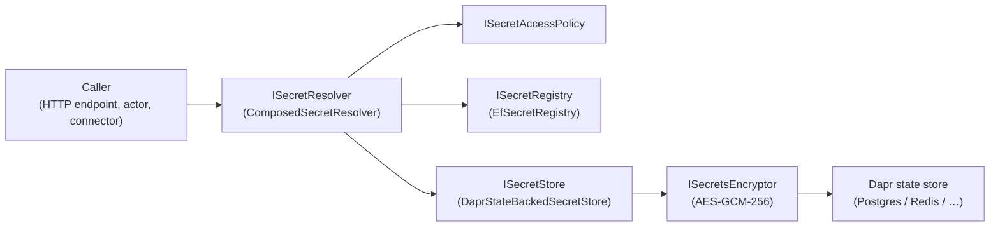

# Security

> **[Architecture Index](README.md)** | Related: [Infrastructure](infrastructure.md), [Units & Agents](units.md), [Deployment](deployment.md)
>
> **Note:** Multi-tenancy, OAuth/SSO, tenant administration, and platform operations are commercial extensions developed in the private repository. This document covers the OSS security model.

---

## Multi-Human Participation & Permissions

### HumanActor

Represents a human participant. Routes messages to notification channels. Enforces permission level.

### Permission Model

**System-level roles:**


| Role               | Permissions                                        |
| ------------------ | -------------------------------------------------- |
| **Platform Admin** | Create/delete tenants, manage users, system config |
| **User**           | Create units, join units they're invited to        |


**Unit-level roles:**


| Role         | Permissions                                                        |
| ------------ | ------------------------------------------------------------------ |
| **Owner**    | Full control — configure, manage members, delete, set policies     |
| **Operator** | Start/stop, interact with agents, approve workflow steps, view all |
| **Viewer**   | Read-only — state, feed, metrics, agent status                     |


Permission inheritance in recursive units is **opt-in** — each unit manages its own ACL. `permissions.inherit: parent` enables it.

### Agent Permissions

Agents also have scoped access:


| Permission                          | Description                                    |
| ----------------------------------- | ---------------------------------------------- |
| `message.send`                      | Send to specified addresses/roles              |
| `directory.query`                   | Query unit/parent/root directory               |
| `topic.publish` / `topic.subscribe` | Pub/sub access                                 |
| `observe`                           | Subscribe to another agent's activity stream   |
| `workflow.participate`              | Be invoked as a workflow step                  |
| `agent.spawn`                       | Create new agents at runtime (see Future Work) |


---

## Security & Multi-Tenancy

### User Authentication

Users must authenticate with the platform before using the CLI or API. Local development instances (daemon mode) bypass authentication.

**CLI authentication flow:**

```bash
spring auth
# Opens the web portal in the user's default browser.
# The portal handles:
#   1. Login (Google OAuth or other identity providers)
#   2. Account creation for new users:
#      - Minimal profile (name, email — pre-filled from identity provider)
#      - Terms of usage acceptance
#   3. On success, the portal issues a session credential back to the CLI
```

All subsequent CLI commands use the credential stored locally. The CLI rejects commands (other than `spring auth`) if the user is not authenticated.

**API tokens for non-interactive use:**

Authenticated users can generate long-lived API tokens for CI/CD, scripts, and programmatic access. Tokens are generated via the web portal or the CLI (which redirects to the web portal for the actual generation flow).

```bash
spring auth token create --name "ci-pipeline"
# Opens the web portal where the user names and confirms the token.
# The token is displayed once; the CLI stores it if requested.
```

Token management:

- The platform tracks all tokens per user (name, creation time, last used, scopes).
- A user can list and invalidate their own tokens via the portal or CLI (`spring auth token list`, `spring auth token revoke <name>`).
- A tenant admin can list and invalidate all tokens for any user in the tenant, or bulk-invalidate all tokens for all tenant users.
- Invalidated tokens are rejected immediately on next use.

**Local development exception:** When the API Host runs in daemon mode (single-tenant, `--local`), authentication is disabled. All commands execute as the implicit local user. This mode is for development and testing only.

### Dapr-Native Security

- Agent identity via Dapr
- mTLS for all service-to-service communication
- Pluggable secret stores
- Access control policies restrict actor → building block access

---

## Secrets Stack

Spring Voyage ships a three-layer secrets stack — **registry**, **store**, and **resolver** — plus an access-policy seam. All three layers are defined in `Cvoya.Spring.Core/Secrets/` so a private-cloud host can substitute any layer (e.g. routing writes to Azure Key Vault) without touching call sites.



### Layers

| Layer                      | Default implementation           | Responsibility                                                                                       |
| -------------------------- | -------------------------------- | ---------------------------------------------------------------------------------------------------- |
| `ISecretStore`             | `DaprStateBackedSecretStore`     | Opaque plaintext K/V store. Writes return an opaque `storeKey`; reads return plaintext.             |
| `ISecretRegistry`          | `EfSecretRegistry`               | Structural metadata: maps `SecretRef(scope, owner, name, version)` to `SecretPointer(storeKey, origin)`. |
| `ISecretResolver`          | `ComposedSecretResolver`         | Sole server-side surface for plaintext reads. Composes access policy + registry + store.            |
| `ISecretAccessPolicy`      | `AllowAllSecretAccessPolicy` (OSS) | Per-scope authorization. Private cloud substitutes a tenant-admin / role-aware implementation.   |
| `ISecretsEncryptor`        | `SecretsEncryptor`               | AES-GCM-256 envelope encryption applied by the store before it ever touches Dapr.                  |

HTTP endpoints never return plaintext. The only path that surfaces a plaintext value is `ISecretResolver.ResolveAsync`; endpoints accept plaintext on `POST` / `PUT` and never echo it back.

### At-rest encryption

Every `DaprStateBackedSecretStore.WriteAsync` wraps the plaintext in a versioned AES-GCM envelope before handing it to Dapr:

```
[version(1)][nonce(12)][ciphertext(N)][auth tag(16)]   →   base64
```

- **Version 1** is AES-GCM-256 with a per-write 12-byte random nonce.
- **Associated data** is `"{tenantId}:{storeKey}"` — a ciphertext cannot be transplanted across tenants or across store keys. Authentication fails on read if either changes.
- **Pre-encryption legacy values** (plain UTF-8 strings persisted before the envelope existed) are still readable and are re-enveloped on the next write.
- **Platform-scoped secrets** use the literal string `"platform"` as the AAD tenant id.

Key sources (priority order):

1. `SPRING_SECRETS_AES_KEY` environment variable (base64-encoded 32-byte key).
2. `Secrets:AesKeyFile` config pointing at a file containing the base64-encoded key.
3. An ephemeral in-memory key, only when `Secrets:AllowEphemeralDevKey=true`. Intended for `dotnet run` only; restarts render existing envelopes unreadable.

If none is configured the encryptor refuses to start. A startup self-check also rejects obviously weak keys (all zeros, ascending sentinel patterns, `"testtest…"`, etc.). Detailed key rotation and operational guidance: [OSS Secret Store: At-Rest Encryption & Per-Tenant Components](../developer/secret-store.md).

### Per-tenant component isolation

By default all tenants share a single Dapr component (`Secrets:StoreComponent`, defaulting to `statestore`). Operators can set `Secrets:ComponentNameFormat` (e.g. `"statestore-{tenantId}"`) to route each tenant to a dedicated component at call time — defense in depth on top of the registry's tenant filter.

### Multi-version coexistence and rotation

Registry entries are row-per-version. The unique identifier is `(TenantId, Scope, OwnerId, Name, Version)`:

- **`RegisterAsync(ref, storeKey, origin)`** — creates a brand-new chain at version 1, wiping any prior versions for the same triple.
- **`RotateAsync(ref, newStoreKey, newOrigin, ...)`** — appends a new row at `max(Version) + 1` and returns a `SecretRotation` summary. Old versions are retained so a caller pinned to an earlier version can still resolve it. The pre-A5 "immediately delete previous slot" policy was intentionally inverted for multi-version coexistence; the deprecated delete callback parameter is kept for signature compatibility but never invoked.
- **`ListVersionsAsync(ref)`** — returns newest-first per-version metadata (version, origin, creation timestamp, current flag).
- **`PruneAsync(ref, keep, deletePrunedStoreKeyAsync, ct)`** — removes all but the most recent `keep` versions; the current (latest) version is always retained. Platform-owned rows have their store slots reclaimed via the delegate; `ExternalReference` rows never touch the backing store. Retention is also surfaced as `Secrets:VersionRetention` — documentary today; a scheduler will enforce it in a future wave.
- **`DeleteAsync(ref)`** — removes every version. The caller (HTTP endpoint) is responsible for calling `ISecretStore.DeleteAsync` for `PlatformOwned` versions; `ExternalReference` versions leave the backing slot untouched.

Resolvers accept an explicit `version` pin. `ResolveWithPathAsync(ref, version, ct)` returns a `SecretResolution` whose `Path` identifies the provenance — `Direct`, `InheritedFromTenant`, or `NotFound`. Pinned reads never silently return a different version: if the requested version does not exist at the requested scope (and, where applicable, the inheritance scope), the resolver returns `NotFound`.

### Origin (platform-owned vs external reference)

Every registry pointer carries a `SecretOrigin`:

- **`PlatformOwned`** — the platform wrote the plaintext via `ISecretStore.WriteAsync` and owns the opaque key. Store-layer mutations (rotate, delete, overwrite) are safe.
- **`ExternalReference`** — the caller supplied a store key to externally-managed material (e.g. a Key Vault id). The platform only records the pointer. Deletes and rotations must **never** mutate the backing slot — in a Key Vault-backed store that would destroy a customer-owned secret.

`DELETE` endpoints gate store-layer deletion on `SecretOrigin` so removing a secret never destroys external state.

### Unit → Tenant inheritance

`ComposedSecretResolver` transparently falls through from `SecretScope.Unit` to `SecretScope.Tenant` when the unit entry is missing. The fall-through:

1. Is gated on `Secrets:InheritTenantFromUnit` (default `true`; set to `false` for strict scope isolation).
2. Consults `ISecretAccessPolicy.IsAuthorizedAsync(Read, scope, ownerId)` at **both** the unit and the tenant scope. A denial at either scope returns `NotFound`, never a silently-masked tenant value. This is the "no privilege escalation via inheritance" guarantee.
3. Uses the same version pin on both lookups. A caller asking for `(Unit, u, name, v=3)` that misses at the unit scope only finds the tenant row if the tenant chain also has version 3.
4. Fires only in the Unit → Tenant direction. Platform → Tenant and Tenant → Platform do **not** chain; Platform is an admin-only boundary.

See ADR [`0003-secret-inheritance-unit-to-tenant.md`](../decisions/0003-secret-inheritance-unit-to-tenant.md) for the full rationale, rejected alternatives, and revisit criteria.

### Per-agent secrets

The OSS contract stops at unit scope. `SecretScope.Agent` does **not** exist, and the resolver has no agent-aware logic. Operators who need per-agent isolation today spin up a single-agent unit and use tenant-scoped secrets only for explicitly-shared material. The rationale and future-trigger criteria are captured in ADR [`0004-per-agent-secrets.md`](../decisions/0004-per-agent-secrets.md).

### Rotation primitives surface

| Operation                    | Endpoint                                            | Registry call                    |
| ---------------------------- | --------------------------------------------------- | -------------------------------- |
| Create new chain (v1)        | `POST /.../secrets`                                  | `RegisterAsync`                  |
| Rotate (append new version)  | `PUT /.../secrets/{name}`                            | `RotateAsync`                    |
| List versions                | `GET /.../secrets/{name}/versions`                   | `ListVersionsAsync`              |
| Prune old versions           | `POST /.../secrets/{name}/prune?keep=N`              | `PruneAsync`                     |
| Delete chain                 | `DELETE /.../secrets/{name}`                         | `DeleteAsync`                    |

Each scope (`unit`, `tenant`, `platform`) mirrors the set under its own path prefix.

### Audit logging via DI decoration

`ISecretResolver` and `ISecretRegistry` are both registered with `TryAddScoped` so a downstream host can wrap them with audit / RBAC / metrics decorators using a manual `Replace` on the container. The decorator observes:

- The requested `SecretRef`, version pin, and returned `SecretResolution` (including the resolve path — `Direct`, `InheritedFromTenant`, or `NotFound`).
- Rotation transitions (`SecretRotation` from `RotateAsync`) rich enough to emit a complete event without any decorator-private state.

Decorators MUST NOT mutate the inner call shape and MUST NOT log plaintext — `SecretResolution.Value` is the one field that never belongs in an audit record. The full pattern, with worked examples for both the resolver and the registry, lives at [Secret Audit Logging: DI Decoration Pattern](../developer/secret-audit.md).

### Resilience

Dapr provides pluggable resiliency policies (retries, timeouts, circuit breakers) configured per building block via YAML — no application code changes. Key resilience concerns:

- **LLM API failures** — retry with exponential backoff; circuit breaker prevents cascading failures when a provider is down. Agent falls back to queuing work.
- **Execution environment crashes** — actor detects via heartbeat/timeout, marks conversation as failed, re-queues or escalates. Checkpoints (see [Messaging](messaging.md)) enable resumption from last known state.
- **Actor failures** — Dapr virtual actors are automatically reactivated on failure. State is persisted in the state store, so recovery is transparent.
- **Pub/sub delivery** — at-least-once delivery with dead letter topics for messages that repeatedly fail processing.

---

## Extension Points for Commercial Features

The OSS platform is designed for extensibility via dependency injection. Commercial extensions add:

- **Multi-tenancy** — tenant isolation via Dapr namespaces, tenant-scoped repositories, tenant administration CLI
- **OAuth/SSO/SAML** — identity provider integration beyond API token auth
- **Platform operations** — `spring-admin` CLI for tenant provisioning, platform upgrades, resource quota management
- **Cross-tenant federation** — inter-deployment agent communication
- **Billing and budgets** — tenant-level cost limits and billing integration

All core abstractions are defined as interfaces in `Cvoya.Spring.Core`. Extensions override default implementations by registering their own services after the default registrations. The OSS codebase has no `TenantId` on any entity — extensions add tenant-scoped wrappers around repositories and services.
