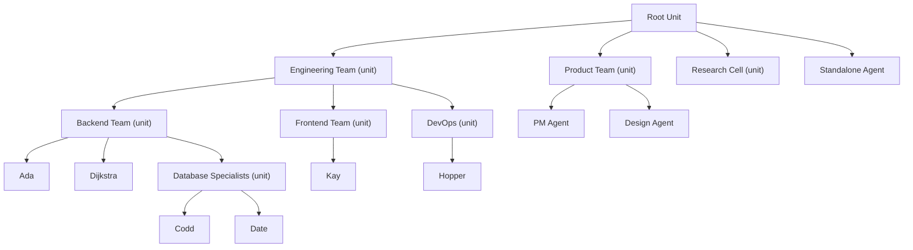

# Units & Agents

> **[Architecture Index](README.md)** | Related: [Messaging](messaging.md), [Infrastructure](infrastructure.md), [Initiative](initiative.md), [Workflows](workflows.md)

---

## Agent Model

An agent definition describes *what* the agent is — not *where* or *how* it runs. Agents are created declaratively (YAML applied via CLI or API) or programmatically (API call). The lifecycle is: **define → create → activate → run → deactivate → delete**. Dapr virtual actors handle activation/deactivation automatically — an agent actor is activated on first message and deactivated after idle timeout.

```yaml
# yaml-language-server: $schema=schemas/agent.schema.json
agent:
  id: ada
  name: Ada
  
  role: backend-engineer
  capabilities: [csharp, python, fastapi, postgresql, testing]
  
  ai:
    agent: claude                       # registered AI agent provider
    model: claude-sonnet-4-20250514
    execution: delegated                # hosted | delegated
    tool: claude-code                   # registered tool name (delegated only)
    environment:                        # container definition (delegated only)
      image: spring-agent:latest
      runtime: podman                   # podman | docker | kubernetes
    
  cloning:
    policy: ephemeral-with-memory
    attachment: attached
    max_clones: 3
    
  instructions: |
    You are a backend engineer...
    
  expertise:
    - domain: python/fastapi
      level: advanced
    - domain: postgresql
      level: intermediate
    
  activations:
    - type: message                     # direct messages
    - type: subscription
      topic: pr-reviews
      filter: "labels contains 'backend'"
    - type: reminder
      schedule: "0 9 * * MON-FRI"
      payload: { action: "daily-standup" }
    - type: binding
      component: github-webhook
      route: /issues
```

### Execution Patterns

**Pattern A: Hosted AI** (`execution: hosted`)
The agent actor calls the AI agent provider directly (via .NET SDK or Python process). The LLM reasons, decides, and responds — but doesn't touch the filesystem or run tools. Requires `agent` and `model` in the `ai` block. Good for: routing, classification, triage, advisory, monitoring agents. Can be implemented in .NET (using Anthropic .NET SDK, Azure OpenAI SDK) or Python.

**Pattern B: Delegated Execution** (`execution: delegated`)
The agent actor dispatches work to an execution environment (container) that launches a registered tool (e.g., `claude-code`). The tool drives the agentic loop — reading files, writing code, running tests. The actor monitors via streaming events and collects results. Requires `tool` and `environment` in the `ai` block — `tool` names the registered tool (e.g., `claude-code`), `environment` specifies the container image and runtime. Can be pure .NET — no Python process needed. Essential for: software engineering, document editing, any multi-step tool use.

**Execution environment definition** is the same for agents and units. The `ai.environment` block specifies the container:

```yaml
ai:
  environment:
    image: spring-agent:latest         # container image
    runtime: podman                    # podman | docker | kubernetes
```

Agents that don't specify `ai.environment` inherit the default from their unit's `execution` block (see Unit Model below). Units that use `execution: delegated` for orchestration specify their own `ai.environment` for the workflow container.

The execution pattern is fixed per agent definition. An agent is either hosted or delegated — it does not switch at runtime. When an agent needs both reasoning and tool-use (e.g., a triage agent that sometimes needs to write code), the recommended pattern is **composition via `requestHelp`**: the hosted agent reasons about the work and delegates tool-use to a delegated agent in the same unit. This is cleaner than runtime mode switching because the triage decision and the code-writing are genuinely different cognitive tasks with different tool requirements, and the unit already provides the composition mechanism.

### Agent Cloning

In v1, handling concurrent work of the same type required manually defining multiple identical agents (e.g., three backend engineers). V2 replaces this with platform-managed cloning — the platform spawns copies of an agent on demand, governed by the agent's cloning policy.

**Cloning policies** (property of the agent definition):


| Policy                  | Behavior                                                                                                                                                                       |
| ----------------------- | ------------------------------------------------------------------------------------------------------------------------------------------------------------------------------ |
| `none`                  | Singleton. Work queues if the agent is busy. The agent accumulates unique knowledge and experiences over time.                                                                 |
| `ephemeral-no-memory`   | Clone spawned from the parent's current state (instructions, capabilities, memory snapshot). Handles one conversation. Destroyed after completion. Nothing flows back.         |
| `ephemeral-with-memory` | Same as above, but the clone's experiences are sent back to the parent before destruction. The parent integrates what it deems relevant into its own memory.                   |
| `persistent`            | Clone persists independently and evolves on its own path. A persistent clone is a full agent — it can define its own cloning policy (bounded by `max_clones` and cost budget). |


**Attachment model** (how clones relate to the parent's unit):


| Mode       | Effect                                                                                                                                                                                                                                                                                                                                                               |
| ---------- | -------------------------------------------------------------------------------------------------------------------------------------------------------------------------------------------------------------------------------------------------------------------------------------------------------------------------------------------------------------------- |
| `detached` | Clones become direct members of the parent's unit — peers of the parent. The unit's orchestration strategy routes work across the parent and its clones.                                                                                                                                                                                                             |
| `attached` | The parent agent promotes itself to a unit. Clones become its members. From the enclosing unit's perspective, the parent remains a single entity (a unit IS an agent). The parent becomes the orchestrator — it stops taking work itself and only routes to its clones. If all clones are destroyed and no active cloning is needed, the parent reverts to an agent. |


**Constraints:**

- **Units cannot be cloned.** A unit already manages composition through membership. Cloning is an agent-level concept.
- **Clones inherit** the parent's instructions, capabilities, expertise, execution pattern, and (for ephemeral clones) a snapshot of the parent's memory at clone time.
- **`max_clones`** caps the number of concurrent clones. The platform will not exceed this limit regardless of work queue depth.
- **Cost budget enforcement.** Clone creation respects the unit's cost budget. If the budget is exhausted, work queues instead of spawning new clones.
- **Persistent clones can clone.** A persistent clone is a full agent with its own UUID, memory, and evolution. It can define its own cloning policy, enabling recursive scaling — bounded by `max_clones` at each level and the unit's cost budget.
- **Observability.** Clone activity is attributed to the parent agent in activity streams and cost tracking, with the clone's UUID as a sub-identifier. Persistent clones that have diverged sufficiently may be promoted to independent agents (manual operation).

**When to use which:**

- `none` — Agents where continuity and unique evolution matter: lead architects, specialized experts, agents that build long-term relationships with humans.
- `ephemeral-no-memory` — Stateless workers: formatters, linters, validators, anything where the clone's experience has no lasting value.
- `ephemeral-with-memory` — Skilled workers: the parent is a senior engineer who spawns temporary helpers. Each helper's learnings (patterns discovered, pitfalls encountered) feed back to the parent, making it better over time.
- `persistent` — Scale-out: the agent needs genuinely independent instances that build their own expertise. Each clone diverges and specializes.
- `detached` — Simple scaling within an existing unit. The unit's orchestration strategy manages routing.
- `attached` — Encapsulated scaling. The parent hides its clones behind a unit boundary. Clean abstraction for the enclosing unit.

### Role

Role serves two purposes:

1. **Multicast addressing** — `role://engineering-team/backend-engineer` routes to all agents with that role
2. **Capability signal** — other agents reason about delegation based on role

### Prompt Assembly & Platform Tools

The agent's AI needs context beyond its user-defined instructions. The actor assembles the full prompt at activation time by composing four layers:


| Layer                          | Source                                      | Content                                                                      | Mutability      |
| ------------------------------ | ------------------------------------------- | ---------------------------------------------------------------------------- | --------------- |
| **1. Platform**                | System-provided                             | Platform tool descriptions, safety constraints, behavioral guidance          | Immutable       |
| **2. Unit context**            | Injected by actor at activation             | Unit policies, peer directory snapshot, active workflow state, skill prompts | Dynamic         |
| **3. Conversation context**    | Injected by actor per invocation            | Prior messages, checkpoints, partial results for the active conversation     | Per-invocation  |
| **4. Agent instructions**      | User-defined (`instructions` in agent YAML) | Role-specific guidance, domain knowledge, personality                        | User-controlled |


For delegated execution, the composed prompt becomes the system prompt passed to the tool. For hosted execution, it becomes the system message in the LLM call.

**Layer 3 — Conversation context** is critical for delegated agents across CLI invocations. Each invocation of a tool like Claude Code starts fresh — it has no memory of prior invocations within the same conversation. The actor composes Layer 3 from: (1) prior messages exchanged in this conversation, (2) the last checkpoint state (if the previous invocation checkpointed), and (3) any partial results from prior invocations. This ensures continuity across invocations without requiring the agent to use `recallMemory` for conversation-specific state. Layer 3 is empty for new conversations and grows as conversations progress. For suspended-then-resumed conversations, Layer 3 includes the full conversation history up to the suspension point.

**Platform tools (Layer 1)** expose platform capabilities to the agent's AI as callable tools. The agent reasons in terms of actions, not messages — the platform translates tool calls into the appropriate messages and service calls internally.


| Tool             | Description                                                                                   |
| ---------------- | --------------------------------------------------------------------------------------------- |
| `checkMessages`  | Retrieve pending messages on the active conversation (delegated agents call at task boundaries) |
| `discoverPeers`  | Query the unit directory for agents with specific expertise or roles                           |
| `requestHelp`    | Ask another agent (by ID or role) for assistance on the current conversation                   |
| `storeLearning`  | Persist a learning (pattern, pitfall, insight) that persists across conversations              |
| `storeContext`   | Persist context (codebase understanding, domain knowledge) for future activations              |
| `recallMemory`   | Retrieve past learnings, context, and work history                                             |
| `checkpoint`     | Save progress on the current conversation (enables message retrieval and recovery)             |
| `reportStatus`   | Update the activity stream with current status                                                 |
| `escalate`       | Raise an issue to a human or to the unit for re-routing                                        |


Additional tools are injected based on the agent's tool manifest and the unit's connectors (e.g., a GitHub connector adds `createPR`, `pushCommit`, etc.).

---

## Unit Model

A unit is a composite agent — a group of agents that appears as a single `IMessageReceiver` to the outside world. The unit owns **identity** (address, membership, boundary, activity stream) and delegates **orchestration** (how incoming messages are routed to members) to a pluggable strategy.

### Unit as Entity vs. Orchestration as Strategy

The unit actor is responsible for:

- **Identity:** address, membership list, boundary configuration
- **Membership:** managing which agents and sub-units belong to the unit
- **Boundary:** controlling what is visible to the parent unit
- **Activity stream:** aggregating member activity for observation
- **Expertise directory:** maintaining the aggregated expertise of all members

The unit delegates message handling to an **`IOrchestrationStrategy`**:

```csharp
interface IOrchestrationStrategy
{
    Task<Message?> HandleMessageAsync(Message message, IUnitContext context);
}
```

Where `IUnitContext` provides access to members, directory, policies, connectors, and workflow state. The strategy decides how to route, assign, and coordinate work. The strategy can be swapped independently of the unit's identity — e.g., upgrading from rule-based to AI-orchestrated as a team matures.

```yaml
unit:
  name: engineering-team
  description: Software engineering team for the spring-voyage repo
  
  structure: hierarchical            # hierarchical | peer | custom
  
  # --- Unit AI (the unit IS an agent — same ai block pattern) ---
  # Delegated: orchestration runs in a workflow container
  ai:
    execution: delegated
    tool: software-dev-cycle         # registered workflow tool
    environment:                     # container for orchestration logic
      image: spring-workflows/software-dev-cycle:latest
      runtime: podman
  
  members:
    - agent: ada
    - agent: kay
    - agent: hopper
    - unit: database-team            # recursive composition
  
  # --- Default execution environment for member agents ---
  # Members that don't specify their own ai.environment inherit this
  execution:
    image: spring-agent:latest
    runtime: podman                  # podman | docker | kubernetes
  
  connectors:
    - type: github
      config:
        repo: savasp/spring
        webhook_secret: ${GITHUB_WEBHOOK_SECRET}
    - type: slack
      config:
        channel: "#engineering-team"
  
  packages:
    - spring-voyage/software-engineering
  
  policies:
    communication: hybrid            # through-unit | peer-to-peer | hybrid
    work_assignment: unit-assigns    # unit-assigns | self-select | capability-match
    expertise_sharing: advertise
    initiative:
      max_level: proactive
      max_actions_per_hour: 20
    
  humans:
    - identity: savasp
      permission: owner
      notifications: [slack, email]
    - identity: reviewer2
      permission: operator
      notifications: [github]
    - identity: stakeholder1
      permission: viewer
      notifications: [email]
```

**Unit AI — hosted vs. delegated:**

The unit's `ai` block follows the same pattern as an agent's `ai` block. The two execution modes are mutually exclusive:

- **Hosted** (`execution: hosted`) — the unit uses an LLM to orchestrate. Requires `agent`, `model`, `prompt`, and optionally `skills`. The LLM receives messages, reasons about routing, and sends messages to members.
- **Delegated** (`execution: delegated`) — the unit delegates orchestration to a workflow container. Requires `tool` and `environment`. The workflow container drives the orchestration logic — it may use an LLM internally, but that's the container's concern, not the unit definition's.

**Example: AI-orchestrated unit (hosted):**

```yaml
unit:
  name: research-cell
  ai:
    agent: claude
    model: claude-sonnet-4-20250514
    execution: hosted
    prompt: |
      You coordinate a research team. Route papers
      to the most relevant researcher by expertise.
    skills:
      - package: spring-voyage/research
        skill: paper-triage
  members:
    - agent: researcher-ml
    - agent: researcher-systems
```

### Orchestration Strategies

Five concrete implementations of `IOrchestrationStrategy`:


| Strategy               | Description                                                                                                                | AI Involvement | Example                                   |
| ---------------------- | -------------------------------------------------------------------------------------------------------------------------- | -------------- | ----------------------------------------- |
| **Rule-based**         | Deterministic routing by policy (round-robin, role-matching, capability-based, priority queue). No LLM.                    | None           | Load-balanced work distribution           |
| **Workflow**           | A Dapr Workflow drives the sequence. Steps invoke agents as activities. The workflow controls routing.                     | None (minimal) | CI/CD pipeline, compliance review         |
| **AI-orchestrated**    | LLM receives the message + unit context (members, directory, policies) and decides routing, assignment, and coordination.  | Full           | Software dev team with intelligent triage |
| **AI+Workflow hybrid** | Workflow provides the skeleton (phases); LLM fills in decisions within each phase (who does it, how to handle exceptions). | Partial        | Structured software dev cycle             |
| **Peer**               | Broadcast to all members. No routing. Members decide for themselves whether to act (via initiative).                       | None at unit   | Research team brainstorming               |


The AI+Workflow hybrid is recommended for structured work: reliable enough to be auditable, flexible enough to handle novel situations.

### Root Unit

Every deployment has an implicit **root unit** — the top-level container:




The root unit provides the platform-wide directory, addressing, cross-unit routing, and default policies.

### Unit Boundary

When a unit participates as a member of a parent, its **boundary** controls what is visible to the outside.

**Opacity levels:**


| Level           | Behavior                                                                                                              |
| --------------- | --------------------------------------------------------------------------------------------------------------------- |
| **Transparent** | Parent sees all members, their capabilities, expertise, and activity streams. Internal structure fully visible.       |
| **Translucent** | Parent sees a filtered/projected subset. Boundary defines what is exposed.                                            |
| **Opaque**      | Parent sees the unit as a single agent. No internal structure visible. All capabilities are synthesized from members. |


**Boundary operations:**

- **Projection** — Expose a subset of member capabilities as the unit's own. E.g., the engineering team exposes "implement feature" and "review PR" but hides internal "run CI" and "deploy staging."
- **Filtering** — Route only certain message types through the boundary. Internal status updates stay internal. Only completed results, errors, and escalations propagate outward.
- **Synthesis** — Create new virtual capabilities by combining members. E.g., "full-stack implementation" is not a capability of any single member but emerges from the combination of backend + frontend + QA agents.
- **Aggregation** — Expertise profiles are aggregated from all members. Activity streams are merged and optionally filtered before exposing to the parent.

**Deep access with permissions:** Despite encapsulation, a human or agent with appropriate permissions can address any agent at arbitrary depth. The boundary is a default, not a wall. Permission-based deep access uses the full address path (e.g., `agent://acme/engineering-team/backend-team/ada`). The boundary checks the requester's permissions before routing.

```yaml
unit:
  boundary:
    opacity: translucent
    projections:
      - capability: implement-feature
        maps_to: [ada.implement, kay.implement]
      - capability: review-code
        maps_to: [hopper.review]
    filters:
      outbound: [completed, error, escalation]
      inbound: [query, control]
    deep_access:
      policy: permission-required       # permission-required | deny-all | allow-all
```

### Organizational Patterns


| Pattern               | Description                                                 | Example                               |
| --------------------- | ----------------------------------------------------------- | ------------------------------------- |
| **Engineering Team**  | Specialized agents with defined roles working on a codebase | Backend + frontend + QA + DevOps      |
| **Product Squad**     | Cross-functional group working on a feature                 | PM + design + engineering agents      |
| **Research Cell**     | Agents autonomously monitoring a domain                     | Paper tracking, trend analysis        |
| **Support Desk**      | Agents responding to requests from multiple humans          | Customer support, internal helpdesk   |
| **Creative Studio**   | Agents collaborating on creative output                     | Writing, design, art direction        |
| **Operations Center** | Agents monitoring systems, responding to incidents          | Infrastructure alerts, SLA monitoring |
| **Ad-hoc Task Force** | Temporary unit for a specific problem                       | Incident response, sprint goal        |


This list is illustrative, not exhaustive. Any organizational pattern can be modeled through unit composition, boundary configuration, and orchestration strategy selection. The primitives — recursive units, configurable boundaries, five orchestration strategies — are the building blocks; the patterns emerge from how you compose them.

---

## Expertise Discovery

### Expertise Profiles

Each agent has an expertise profile — seeded from config, optionally evolved through a cognitive backbone (see [Open Questions — Future Work](open-questions.md)):

```yaml
ExpertiseProfile:
  agent: agent://acme/engineering-team/ada
  domains:
    - name: python/fastapi
      level: expert
      source: config                 # or "cognitive" if evolved
    - name: react/nextjs
      level: novice
      source: observed               # emerged from experience
```

Default implementation: profiles stay at seeded values. With a cognitive backbone: domains level up, new domains emerge, stale expertise decays.

### Directory

The directory is a **property of the unit** — each unit maintains its members' expertise profiles. Directories compose recursively through the unit hierarchy. The root unit aggregates all.

---

## Unit Lifecycle: From Definition to Operation

Two paths to a running unit: **imperative** (CLI, build up step-by-step) and **declarative** (YAML, apply all at once). Both produce the same actor state. Use imperative for exploration and prototyping; declarative for reproducibility and version control.

### Path A: Imperative (CLI)

Build up a unit progressively via the CLI:

```bash
# Authenticate with the platform (required once; skipped in local dev mode)
spring auth

# Create the unit with delegated orchestration (workflow container)
spring unit create engineering-team
spring unit set engineering-team \
  --description "Software engineering team" \
  --structure hierarchical \
  --ai-execution delegated \
  --ai-tool software-dev-cycle \
  --ai-environment-image spring-workflows/software-dev-cycle:latest \
  --ai-environment-runtime podman

# Set default execution environment for member agents
spring unit set engineering-team \
  --execution-image spring-agent:latest \
  --execution-runtime podman

# Add agents (creates them if they don't exist)
spring agent create ada \
  --role backend-engineer \
  --capabilities "csharp,python,postgresql" \
  --ai-backend claude \
  --execution delegated \
  --tool claude-code

spring unit members add engineering-team ada
spring unit members add engineering-team kay
spring unit members add engineering-team hopper

# Add a connector
spring connector add github --unit engineering-team \
  --repo savasp/spring
spring connector auth github --unit engineering-team

# Set policies
spring unit set engineering-team \
  --policy communication=hybrid \
  --policy work-assignment=unit-assigns \
  --policy initiative.max-level=proactive

# Add yourself as owner
spring unit humans add engineering-team savasp --permission owner

# Activate
spring unit start engineering-team
```

Each command takes effect immediately — the unit is usable after the first `spring unit create`. You can add agents, connectors, and policies incrementally as you refine the setup.

### Path B: Declarative (YAML)

Define everything in version-controlled YAML files and apply in one step:

```yaml
# units/engineering-team.yaml
unit:
  name: engineering-team
  description: Software engineering team
  structure: hierarchical
  ai:
    execution: delegated
    tool: software-dev-cycle
    environment:
      image: spring-workflows/software-dev-cycle:latest
      runtime: podman
  members:
    - agent: agents/ada.yaml           # references agent definition file
    - agent: agents/kay.yaml
    - agent: agents/hopper.yaml
  execution:                           # default for member agents
    image: spring-agent:latest
    runtime: podman
  connectors:
    - type: github
      config:
        repo: savasp/spring
        webhook_secret: ${GITHUB_WEBHOOK_SECRET}
  policies:
    communication: hybrid
    work_assignment: unit-assigns
    initiative:
      max_level: proactive
  humans:
    - identity: savasp
      permission: owner
```

```bash
spring apply -f units/engineering-team.yaml
```

This validates all definitions, creates actors, registers subscriptions, initializes connectors, and reports status. Re-applying performs a diff and applies changes incrementally — no teardown required.

**Export:** `spring unit export engineering-team > engineering-team.yaml` captures the current state as declarative YAML, regardless of how it was built.

### Connect External Systems

Connectors that require authentication prompt during apply or can be pre-configured:

```bash
spring connector auth github --unit engineering-team
# Opens OAuth flow or accepts a token
```

Once authenticated, the connector actor begins listening for external events and translating them into messages.

### Observe and Interact

```bash
# Watch the unit's activity stream in real-time
spring activity stream --unit engineering-team

# Check agent status
spring agent status --unit engineering-team

# View cost breakdown
spring cost summary --unit engineering-team --period today

# Open the web dashboard
spring dashboard
```

### Iterate

```bash
# Imperative changes
spring agent create new-agent --role qa-engineer ...
spring unit members add engineering-team new-agent
spring unit members remove engineering-team hopper
spring unit set engineering-team --policy initiative.max-level=autonomous

# Or declarative: edit YAML and re-apply
spring apply -f units/engineering-team.yaml
```

### Teardown

```bash
spring unit delete engineering-team
```

Stops all agents, deactivates actors, cleans up subscriptions and execution environments. Agent state and activity history are retained (soft delete) for audit and potential recovery.

---

## Appendix A: Agent Definition Schema

```json
{
  "$schema": "https://json-schema.org/draft/2020-12/schema",
  "$id": "schemas/agent.schema.json",
  "title": "Agent Definition",
  "type": "object",
  "required": ["agent"],
  "properties": {
    "agent": {
      "type": "object",
      "required": ["id", "name", "role", "ai"],
      "properties": {
        "id": {
          "type": "string",
          "pattern": "^[a-z][a-z0-9-]*$",
          "description": "Unique identifier for the agent within its unit."
        },
        "name": {
          "type": "string",
          "description": "Human-readable display name."
        },
        "role": {
          "type": "string",
          "description": "Role identifier. Used for multicast addressing and capability signaling."
        },
        "capabilities": {
          "type": "array",
          "items": { "type": "string" },
          "description": "List of capability tags."
        },
        "ai": {
          "type": "object",
          "required": ["agent", "model", "execution"],
          "properties": {
            "agent": {
              "type": "string",
              "description": "Registered AI agent provider (e.g., claude, openai)."
            },
            "model": {
              "type": "string",
              "description": "Model identifier."
            },
            "execution": {
              "type": "string",
              "enum": ["hosted", "delegated"],
              "description": "hosted: actor calls AI directly. delegated: actor dispatches to execution environment."
            },
            "tool": {
              "type": "string",
              "description": "Registered tool name for delegated execution (e.g., claude-code)."
            },
            "environment": {
              "type": "object",
              "properties": {
                "image": { "type": "string", "description": "Container image for the execution environment." },
                "runtime": { "type": "string", "enum": ["podman", "docker", "kubernetes"] }
              },
              "description": "Container definition for delegated execution. Inherited from unit's execution block if not specified."
            }
          },
          "if": { "properties": { "execution": { "const": "delegated" } } },
          "then": { "required": ["tool"] }
        },
        "cloning": {
          "type": "object",
          "properties": {
            "policy": {
              "type": "string",
              "enum": ["none", "ephemeral-no-memory", "ephemeral-with-memory", "persistent"],
              "default": "none"
            },
            "attachment": {
              "type": "string",
              "enum": ["detached", "attached"],
              "description": "detached: clones join the parent's unit as peers. attached: parent promotes to a unit with clones as members."
            },
            "max_clones": {
              "type": "integer",
              "minimum": 1,
              "description": "Maximum number of concurrent clones."
            }
          },
          "if": { "not": { "properties": { "policy": { "const": "none" } } } },
          "then": { "required": ["attachment", "max_clones"] }
        },
        "instructions": {
          "type": "string",
          "description": "System prompt / instructions for the agent."
        },
        "expertise": {
          "type": "array",
          "items": {
            "type": "object",
            "required": ["domain", "level"],
            "properties": {
              "domain": { "type": "string" },
              "level": {
                "type": "string",
                "enum": ["beginner", "intermediate", "advanced", "expert"]
              }
            }
          },
          "description": "Seeded expertise profile."
        },
        "activations": {
          "type": "array",
          "items": {
            "type": "object",
            "required": ["type"],
            "properties": {
              "type": {
                "type": "string",
                "enum": ["message", "subscription", "reminder", "binding"]
              },
              "topic": { "type": "string" },
              "filter": { "type": "string" },
              "schedule": {
                "type": "string",
                "description": "Cron expression (for reminder type)."
              },
              "payload": { "type": "object" },
              "component": {
                "type": "string",
                "description": "Dapr binding component name (for binding type)."
              },
              "route": {
                "type": "string",
                "description": "Route path (for binding type)."
              }
            }
          },
          "description": "What causes this agent to activate."
        }
      }
    }
  }
}
```

## Appendix B: Unit Definition Schema

```json
{
  "$schema": "https://json-schema.org/draft/2020-12/schema",
  "$id": "schemas/unit.schema.json",
  "title": "Unit Definition",
  "type": "object",
  "required": ["unit"],
  "properties": {
    "unit": {
      "type": "object",
      "required": ["name", "structure", "members"],
      "properties": {
        "name": {
          "type": "string",
          "pattern": "^[a-z][a-z0-9-]*$",
          "description": "Unique identifier for the unit."
        },
        "description": { "type": "string" },
        "structure": {
          "type": "string",
          "enum": ["hierarchical", "peer", "custom"]
        },
        "ai": {
          "type": "object",
          "required": ["execution"],
          "properties": {
            "execution": {
              "type": "string",
              "enum": ["hosted", "delegated"],
              "description": "hosted: unit uses LLM to orchestrate. delegated: unit delegates to workflow container."
            },
            "agent": {
              "type": "string",
              "description": "Registered AI agent provider (hosted only)."
            },
            "model": {
              "type": "string",
              "description": "Model identifier (hosted only)."
            },
            "prompt": {
              "type": "string",
              "description": "Orchestration prompt (hosted only)."
            },
            "skills": {
              "type": "array",
              "items": {
                "type": "object",
                "required": ["package", "skill"],
                "properties": {
                  "package": { "type": "string" },
                  "skill": { "type": "string" }
                }
              },
              "description": "Skill references (hosted only)."
            },
            "tool": {
              "type": "string",
              "description": "Registered workflow tool name (delegated only)."
            },
            "environment": {
              "type": "object",
              "properties": {
                "image": { "type": "string", "description": "Container image." },
                "runtime": { "type": "string", "enum": ["podman", "docker", "kubernetes"] }
              },
              "description": "Container definition (delegated only)."
            }
          },
          "allOf": [
            {
              "if": { "properties": { "execution": { "const": "hosted" } } },
              "then": { "required": ["agent", "model"] }
            },
            {
              "if": { "properties": { "execution": { "const": "delegated" } } },
              "then": { "required": ["tool", "environment"] }
            }
          ]
        },
        "members": {
          "type": "array",
          "items": {
            "type": "object",
            "oneOf": [
              { "required": ["agent"], "properties": { "agent": { "type": "string" } } },
              { "required": ["unit"], "properties": { "unit": { "type": "string" } } }
            ]
          }
        },
        "execution": {
          "type": "object",
          "description": "Default execution environment for member agents that don't specify their own ai.environment.",
          "properties": {
            "image": { "type": "string", "description": "Default container image for members." },
            "runtime": {
              "type": "string",
              "enum": ["podman", "docker", "kubernetes"]
            }
          }
        },
        "connectors": {
          "type": "array",
          "items": {
            "type": "object",
            "required": ["type"],
            "properties": {
              "type": { "type": "string" },
              "config": { "type": "object" }
            }
          }
        },
        "packages": {
          "type": "array",
          "items": { "type": "string" }
        },
        "policies": {
          "type": "object",
          "properties": {
            "communication": {
              "type": "string",
              "enum": ["through-unit", "peer-to-peer", "hybrid"]
            },
            "work_assignment": {
              "type": "string",
              "enum": ["unit-assigns", "self-select", "capability-match"]
            },
            "expertise_sharing": {
              "type": "string",
              "enum": ["advertise", "on-request", "private"]
            },
            "initiative": {
              "type": "object",
              "properties": {
                "max_level": {
                  "type": "string",
                  "enum": ["passive", "attentive", "proactive", "autonomous"]
                },
                "max_actions_per_hour": { "type": "integer", "minimum": 0 }
              }
            }
          }
        },
        "humans": {
          "type": "array",
          "items": {
            "type": "object",
            "required": ["identity", "permission"],
            "properties": {
              "identity": { "type": "string" },
              "permission": {
                "type": "string",
                "enum": ["owner", "operator", "viewer"]
              },
              "notifications": {
                "type": "array",
                "items": { "type": "string" }
              }
            }
          }
        }
      }
    }
  }
}
```
