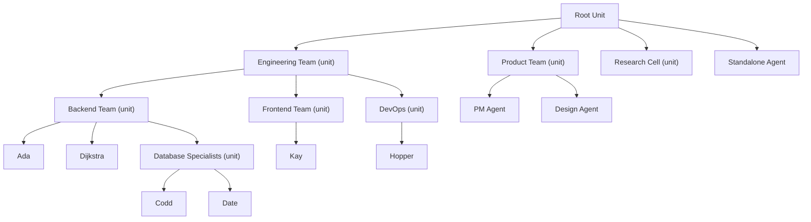

# Units & Agents

> **[Architecture Index](README.md)** | Related: [Messaging](messaging.md), [Infrastructure](infrastructure.md), [Initiative](initiative.md), [Workflows](workflows.md)

---

## Agent Model

An agent definition describes *what* the agent is — not *where* or *how* it runs. Agents are created declaratively (YAML applied via CLI or API) or programmatically (API call). The lifecycle is: **define → create → activate → run → deactivate → delete**. Dapr virtual actors handle activation/deactivation automatically — an agent actor is activated on first message and deactivated after idle timeout.

```yaml
# yaml-language-server: $schema=schemas/agent.schema.json
agent:
  id: ada
  name: Ada
  
  role: backend-engineer
  capabilities: [csharp, python, fastapi, postgresql, testing]
  
  ai:
    agent: claude                       # registered AI agent provider
    model: claude-sonnet-4-6
    tool: claude-code                   # registered agent tool
    environment:                        # container definition
      image: spring-agent:latest
      runtime: podman                   # podman | docker | kubernetes
    
  cloning:
    policy: ephemeral-with-memory
    attachment: attached
    max_clones: 3
    
  instructions: |
    You are a backend engineer...
    
  expertise:
    - domain: python/fastapi
      level: advanced
    - domain: postgresql
      level: intermediate
    
  activations:
    - type: message                     # direct messages
    - type: subscription
      topic: pr-reviews
      filter: "labels contains 'backend'"
    - type: reminder
      schedule: "0 9 * * MON-FRI"
      payload: { action: "daily-standup" }
    - type: binding
      component: github-webhook
      route: /issues
```

### Execution Pattern

The agent actor dispatches work to an execution environment (container) that launches a registered agent tool (e.g., `claude-code`). The tool drives the agentic loop — reading files, writing code, running tests, invoking MCP servers the platform exposes. The actor monitors via streaming events and collects results. Requires `tool` and `environment` in the `ai` block — `tool` names the registered agent tool, `environment` specifies the container image and runtime. Essential for: software engineering, document editing, any multi-step tool use.

Spring Voyage does **not** implement its own in-platform tool-use loop. The `Hosted` execution mode that previously sat alongside delegation was removed — see [ADR 0021 — Spring Voyage is not an agent runtime](../decisions/0021-spring-voyage-is-not-an-agent-runtime.md).

**Execution environment definition** is the same for agents and units. The `ai.environment` block specifies the container:

```yaml
ai:
  environment:
    image: spring-agent:latest         # container image
    runtime: podman                    # podman | docker | kubernetes
```

Agents that don't specify `execution.<field>` inherit the default from their parent unit's `execution` block (see Unit Model below). This is implemented end-to-end per the "Unit execution defaults and the agent → unit → fail resolution chain" section below — the `IAgentDefinitionProvider` merges the unit-level block onto the agent-declared block at dispatch time, and both HTTP / CLI surfaces edit the same persisted JSON document the resolver reads.

**Lightweight LLM calls** (routing decisions, classification, summarisation) remain in-platform via `IAiProvider.CompleteAsync` / `StreamCompleteAsync`. These are utility calls — no multi-turn loop, no tool use — and do not constitute agent execution.

### Agent Cloning

In v1, handling concurrent work of the same type required manually defining multiple identical agents (e.g., three backend engineers). V2 replaces this with platform-managed cloning — the platform spawns copies of an agent on demand, governed by the agent's cloning policy.

**Cloning policies** (property of the agent definition):


| Policy                  | Behavior                                                                                                                                                                       |
| ----------------------- | ------------------------------------------------------------------------------------------------------------------------------------------------------------------------------ |
| `none`                  | Singleton. Work queues if the agent is busy. The agent accumulates unique knowledge and experiences over time.                                                                 |
| `ephemeral-no-memory`   | Clone spawned from the parent's current state (instructions, capabilities, memory snapshot). Handles one conversation. Destroyed after completion. Nothing flows back.         |
| `ephemeral-with-memory` | Same as above, but the clone's experiences are sent back to the parent before destruction. The parent integrates what it deems relevant into its own memory.                   |
| `persistent`            | Clone persists independently and evolves on its own path. A persistent clone is a full agent — it can define its own cloning policy (bounded by `max_clones` and cost budget). |


**Attachment model** (how clones relate to the parent's unit):


| Mode       | Effect                                                                                                                                                                                                                                                                                                                                                               |
| ---------- | -------------------------------------------------------------------------------------------------------------------------------------------------------------------------------------------------------------------------------------------------------------------------------------------------------------------------------------------------------------------- |
| `detached` | Clones become direct members of the parent's unit — peers of the parent. The unit's orchestration strategy routes work across the parent and its clones.                                                                                                                                                                                                             |
| `attached` | The parent agent promotes itself to a unit. Clones become its members. From the enclosing unit's perspective, the parent remains a single entity (a unit IS an agent). The parent becomes the orchestrator — it stops taking work itself and only routes to its clones. If all clones are destroyed and no active cloning is needed, the parent reverts to an agent. |


**Constraints:**

- **Units cannot be cloned.** A unit already manages composition through membership. Cloning is an agent-level concept.
- **Clones inherit** the parent's instructions, capabilities, expertise, execution pattern, and (for ephemeral clones) a snapshot of the parent's memory at clone time.
- **`max_clones`** caps the number of concurrent clones. The platform will not exceed this limit regardless of work queue depth.
- **Cost budget enforcement.** Clone creation respects the unit's cost budget. If the budget is exhausted, work queues instead of spawning new clones.
- **Persistent clones can clone.** A persistent clone is a full agent with its own UUID, memory, and evolution. It can define its own cloning policy, enabling recursive scaling — bounded by `max_clones` at each level and the unit's cost budget.
- **Observability.** Clone activity is attributed to the parent agent in activity streams and cost tracking, with the clone's UUID as a sub-identifier. Persistent clones that have diverged sufficiently may be promoted to independent agents (manual operation).

**When to use which:**

- `none` — Agents where continuity and unique evolution matter: lead architects, specialized experts, agents that build long-term relationships with humans.
- `ephemeral-no-memory` — Stateless workers: formatters, linters, validators, anything where the clone's experience has no lasting value.
- `ephemeral-with-memory` — Skilled workers: the parent is a senior engineer who spawns temporary helpers. Each helper's learnings (patterns discovered, pitfalls encountered) feed back to the parent, making it better over time.
- `persistent` — Scale-out: the agent needs genuinely independent instances that build their own expertise. Each clone diverges and specializes.
- `detached` — Simple scaling within an existing unit. The unit's orchestration strategy manages routing.
- `attached` — Encapsulated scaling. The parent hides its clones behind a unit boundary. Clean abstraction for the enclosing unit.

#### Persistent Cloning Policy (#416)

The enum above tells the lifecycle workflow which memory shape to use for a single clone. A **persistent cloning policy** (`AgentCloningPolicy`) is the governance record attached to the agent — or tenant-wide as the default — that constrains every clone request an operator makes. It is consulted by `IAgentCloningPolicyEnforcer` before the clone endpoint schedules the lifecycle workflow.

| Slot | Type | What it constrains |
| ---- | ---- | ------------------ |
| `AllowedPolicies` | `IReadOnlyList<CloningPolicy>?` | Allow-list over the memory-shape enum. `null` = any. |
| `AllowedAttachmentModes` | `IReadOnlyList<AttachmentMode>?` | Allow-list over `detached` / `attached`. `null` = any. |
| `MaxClones` | `int?` | Concurrent-clone cap. The lifecycle workflow's `ValidateCloneRequestActivity` enforces this; the enforcer forwards the resolved value. |
| `MaxDepth` | `int?` | Recursive-cloning cap. `0` disables cloning entirely at this scope; `null` defers to the platform default. |
| `Budget` | `decimal?` | Per-clone cost budget forwarded to the validation activity. |

**Resolution order.** The enforcer walks agent-scoped policy first and tenant-scoped second. Numeric caps (`MaxClones`, `MaxDepth`, `Budget`) collapse to the **tightest non-null value** across the two scopes so a tenant ceiling cannot be relaxed by an agent-scoped override. Allow-list slots intersect — a request is accepted only if every scope that set the list contains the requested value.

**Unit-boundary honouring (PR #497).** A detached clone is registered as a peer in the parent's unit. When the parent's unit has opaque boundary rules (`UnitBoundary.Opacities` non-empty), creating a detached clone would surface a new addressable entity through that wall. The enforcer refuses detached clone requests whose source agent is a member of such a unit and returns a `boundary` deny with an actionable message: switch to `--attachment-mode attached`, or widen the boundary.

**Operator surface.**

- **HTTP** — `GET / PUT / DELETE /api/v1/agents/{id}/cloning-policy` and `/api/v1/tenant/cloning-policy`. The empty shape is always returned for scopes that have never had a policy persisted so callers never need to branch on 404 vs empty-policy.
- **CLI** — `spring agent clone policy get|set|clear` with `--scope agent|tenant`. `set` accepts per-flag edits (`--allowed-policy`, `--allowed-attachment`, `--max-clones`, `--max-depth`, `--budget`) or a YAML fragment via `-f`. `clear` removes the policy row.
- **Portal** — tracked as [#534](https://github.com/cvoya-com/spring-voyage/issues/534) (backend + CLI ship here; the portal tab lands as a follow-up).

**Storage.** Policies persist via `IAgentCloningPolicyRepository`, backed in the OSS default by the shared `IStateStore` under `Agent:CloningPolicy:{id}` / `Tenant:CloningPolicy:{tenantId}`. An all-null policy (`AgentCloningPolicy.Empty`) is represented as a deleted row so the store reflects scopes that actually have a policy. A private-cloud host can layer a tenant-scoped wrapper via `TryAdd*` without reshaping persistence.

### Role

Role serves two purposes:

1. **Multicast addressing** — `role://engineering-team/backend-engineer` routes to all agents with that role
2. **Capability signal** — other agents reason about delegation based on role

### Prompt Assembly & Platform Tools

The agent's AI needs context beyond its user-defined instructions. The actor assembles the full prompt at activation time by composing four layers:


| Layer                          | Source                                      | Content                                                                      | Mutability      |
| ------------------------------ | ------------------------------------------- | ---------------------------------------------------------------------------- | --------------- |
| **1. Platform**                | System-provided                             | Platform tool descriptions, safety constraints, behavioral guidance          | Immutable       |
| **2. Unit context**            | Injected by actor at activation             | Unit policies, peer directory snapshot, active workflow state, skill prompts | Dynamic         |
| **3. Conversation context**    | Injected by actor per invocation            | Prior messages, checkpoints, partial results for the active conversation     | Per-invocation  |
| **4. Agent instructions**      | User-defined (`instructions` in agent YAML) | Role-specific guidance, domain knowledge, personality                        | User-controlled |


The composed prompt becomes the system prompt handed to the execution environment (typically written to `AGENTS.md` / `CLAUDE.md` in the container's working directory or passed via `SPRING_SYSTEM_PROMPT`).

**Layer 3 — Conversation context** is critical for delegated agents across CLI invocations. Each invocation of a tool like Claude Code starts fresh — it has no memory of prior invocations within the same conversation. The actor composes Layer 3 from: (1) prior messages exchanged in this conversation, (2) the last checkpoint state (if the previous invocation checkpointed), and (3) any partial results from prior invocations. This ensures continuity across invocations without requiring the agent to use `recallMemory` for conversation-specific state. Layer 3 is empty for new conversations and grows as conversations progress. For suspended-then-resumed conversations, Layer 3 includes the full conversation history up to the suspension point.

**Platform tools (Layer 1)** expose platform capabilities to the agent's AI as callable tools. The agent reasons in terms of actions, not messages — the platform translates tool calls into the appropriate messages and service calls internally.


| Tool             | Description                                                                                   |
| ---------------- | --------------------------------------------------------------------------------------------- |
| `checkMessages`  | Retrieve pending messages on the active conversation (delegated agents call at task boundaries) |
| `discoverPeers`  | Query the unit directory for agents with specific expertise or roles                           |
| `requestHelp`    | Ask another agent (by ID or role) for assistance on the current conversation                   |
| `storeLearning`  | Persist a learning (pattern, pitfall, insight) that persists across conversations              |
| `storeContext`   | Persist context (codebase understanding, domain knowledge) for future activations              |
| `recallMemory`   | Retrieve past learnings, context, and work history                                             |
| `checkpoint`     | Save progress on the current conversation (enables message retrieval and recovery)             |
| `reportStatus`   | Update the activity stream with current status                                                 |
| `escalate`       | Raise an issue to a human or to the unit for re-routing                                        |


Additional tools are injected based on the agent's tool manifest and the unit's connectors (e.g., a GitHub connector adds `createPR`, `pushCommit`, etc.).

---

## Unit Model

A unit is a composite agent — a group of agents that appears as a single `IMessageReceiver` to the outside world. The unit owns **identity** (address, membership, boundary, activity stream) and delegates **orchestration** (how incoming messages are routed to members) to a pluggable strategy.

### Unit as Entity vs. Orchestration as Strategy

The unit actor is responsible for:

- **Identity:** address, membership list, boundary configuration
- **Membership:** managing which agents and sub-units belong to the unit
- **Boundary:** controlling what is visible to the parent unit
- **Activity stream:** aggregating member activity for observation
- **Expertise directory:** maintaining the aggregated expertise of all members

### Nested Units (Units as Members of Units)

Members of a unit may be either agents (`agent://`) or sub-units (`unit://`). Nesting lets you compose larger organizations from smaller ones — a platform team contains a database team, which contains individual agents — without teaching the routing layer anything special about depth. Because `IUnitActor` inherits the shared `IAgent` contract (see [Messaging](messaging.md)), a sub-unit plugged into a parent's member list receives messages through exactly the same mailbox seam that an agent member would. A parent's orchestration strategy treats both schemes uniformly: it picks one member, dispatches via `IUnitContext.SendAsync`, and the `IAgentProxyResolver` looks up the right actor type. If the selected member is a `unit://`, it runs its own orchestration turn transparently.

Membership has two invariants:

1. **Agents are leaves with M:N memberships.** An agent may belong to any number of units. Each `(unit, agent)` edge is stored as a row in the `unit_memberships` table with optional per-membership config overrides (model, specialty, enabled, execution mode). The pre-#160 1:N `parentUnit` pointer is preserved on the `AgentMetadata` / `AgentResponse` wire shape but is derived server-side from the membership list (first row by `CreatedAt`) — there is no authoritative 1:N invariant any more. **Unit-typed members stay 1:N** per #217: a sub-unit has exactly one parent unit, and nesting lives on the unit-unit axis.
2. **Unit membership is acyclic.** The graph of `unit://` members must be a DAG — no unit may contain itself, directly or transitively.

**Cycle detection.** Every call to `IUnitActor.AddMemberAsync` with a `unit://` member walks the candidate's sub-unit graph before persisting the new edge. The walk:

- Rejects a self-loop (adding a unit to itself).
- Rejects a back-edge of any depth — e.g., if `A` already contains `B`, adding `A` to `B` fails; if `A` → `B` → `C` already exists, adding `A` to `C` fails.
- Is bounded by a maximum nesting depth of 64. Exceeding the bound is itself treated as a cycle signal — the add is rejected with the path walked so far.
- Is read-only and resilient to concurrent modifications: if a sub-unit is deleted mid-walk, or the directory cannot be read, the traversal treats that path as a dead end and continues. Side-cycles in the sub-graph that do not close back on the parent are ignored.
- Resolves each candidate path through `IDirectoryService` and reads the sub-unit's member list through a typed `IUnitActor` proxy, so the walk reflects live actor state, not a stale cache.
- Does **not** run for `agent://` members — agents cannot introduce a cycle because they are leaves.

A rejected add surfaces a `CyclicMembershipException` carrying the parent unit, the candidate member, and the full ordered cycle path. The HTTP API projects this as a 409 Conflict `ProblemDetails` response with `parentUnit`, `candidateMember`, and `cyclePath` fields so callers can show a precise diagnostic.

Removing a `unit://` member is a straightforward state write — no cycle check is needed because removing an edge cannot introduce one.

The unit delegates message handling to an **`IOrchestrationStrategy`**:

```csharp
interface IOrchestrationStrategy
{
    Task<Message?> HandleMessageAsync(Message message, IUnitContext context);
}
```

Where `IUnitContext` provides access to members, directory, policies, connectors, and workflow state. The strategy decides how to route, assign, and coordinate work. The strategy can be swapped independently of the unit's identity — e.g., upgrading from rule-based to AI-orchestrated as a team matures.

```yaml
unit:
  name: engineering-team
  description: Software engineering team for the spring-voyage repo
  
  structure: hierarchical            # hierarchical | peer | custom
  
  # --- Unit AI (the unit IS an agent — same ai block pattern) ---
  # Delegated: orchestration runs in a workflow container
  ai:
    execution: delegated
    tool: software-dev-cycle         # registered workflow tool
    environment:                     # container for orchestration logic
      image: spring-workflows/software-dev-cycle:latest
      runtime: podman
  
  members:
    - agent: ada
    - agent: kay
    - agent: hopper
    - unit: database-team            # recursive composition
  
  # --- Default execution block for member agents (#601 B-wide) ---
  # Members that don't declare a given field inherit from this block
  # per the agent → unit → fail resolution chain. Every field is
  # independently optional — a unit may carry just `image`, or just
  # `runtime`, and leave the rest to each agent.
  execution:
    image: spring-agent:latest
    runtime: podman                  # docker | podman
    tool: claude-code                # claude-code | codex | gemini | dapr-agent | custom
    provider: anthropic              # dapr-agent only (#598 gating)
    model: claude-sonnet             # dapr-agent only (#598 gating)
  
  connectors:
    - type: github
      config:
        repo: savasp/spring
        webhook_secret: ${GITHUB_WEBHOOK_SECRET}
    - type: slack
      config:
        channel: "#engineering-team"
  
  packages:
    - spring-voyage/software-engineering
  
  policies:
    communication: hybrid            # through-unit | peer-to-peer | hybrid
    work_assignment: unit-assigns    # unit-assigns | self-select | capability-match
    expertise_sharing: advertise
    initiative:
      max_level: proactive
      max_actions_per_hour: 20
    
  humans:
    - identity: savasp
      permission: owner
      notifications: [slack, email]
    - identity: reviewer2
      permission: operator
      notifications: [github]
    - identity: stakeholder1
      permission: viewer
      notifications: [email]
```

**Unit AI:**

A unit's `ai` block describes how the unit orchestrates its members. Two flavours:

- **AI-orchestrated** — the unit uses a lightweight LLM call to decide routing (see `AiOrchestrationStrategy` and [ADR 0021](../decisions/0021-spring-voyage-is-not-an-agent-runtime.md)). Requires `agent`, `model`, `prompt`, and optionally `skills`. No multi-turn tool loop in the platform; this is a single prompt that returns a routing decision.
- **Workflow** — the unit delegates orchestration to a workflow container. Requires `tool` and `environment`. The workflow container drives the sequence — it may invoke agents as activities.

**Example: AI-orchestrated unit:**

```yaml
unit:
  name: research-cell
  ai:
    agent: claude
    model: claude-sonnet-4-6
    prompt: |
      You coordinate a research team. Route papers
      to the most relevant researcher by expertise.
    skills:
      - package: spring-voyage/research
        skill: paper-triage
  members:
    - agent: researcher-ml
    - agent: researcher-systems
```

### Orchestration Strategies

Three concrete implementations of `IOrchestrationStrategy` ship today. Each is registered under its own DI key in `AddCvoyaSpringDapr` (`"ai"` is the unkeyed default; `"workflow"` and `"label-routed"` are selected explicitly). `UnitActor` resolves the strategy per message through `IOrchestrationStrategyResolver`, which consults the unit's declared strategy key from the manifest and — when one isn't declared — falls back to policy-based inference and finally the unkeyed default (#491).

| Strategy (DI key)              | Concrete type                            | How it routes                                                                                                                                                          | AI Involvement | Example                                   |
| ------------------------------ | ---------------------------------------- | ---------------------------------------------------------------------------------------------------------------------------------------------------------------------- | -------------- | ----------------------------------------- |
| **AI-orchestrated** (`ai`)     | `AiOrchestrationStrategy`                | A single LLM call receives the message + member list and returns the target member address. Default strategy.                                                          | Full           | Software dev team with intelligent triage |
| **Workflow** (`workflow`)      | `WorkflowOrchestrationStrategy`          | Runs a workflow container (with a co-launched Dapr sidecar). The container drives the sequence; its stdout decides routing.                                            | None (minimal) | CI/CD pipeline, compliance review         |
| **Label-routed** (`label-routed`) | `LabelRoutedOrchestrationStrategy`    | Reads the unit's `UnitPolicy.LabelRouting` slot, matches payload labels against the trigger map (case-insensitive set intersection; first payload label hit wins), forwards to the mapped member. Drops the message when the unit has no label-routing policy, the payload carries no labels, or the matched path is not a current member. | None           | GitHub issue triage where humans assign work by label (#389) |

The strategy pattern is intentionally open — a host can register its own `IOrchestrationStrategy` under a new DI key without touching core code.

Matching semantics and design rationale for label routing are captured in [ADR-0007](../decisions/0007-label-routing-match-semantics.md). Status-label roundtrip (the connector applying `AddOnAssign` / `RemoveOnAssign` after a successful assignment) is wired via the activity-event bus as described in [ADR-0009](../decisions/0009-github-label-roundtrip-via-activity-event.md): the strategy publishes a `DecisionMade` event with `decision = "LabelRouted"` and the GitHub connector subscribes to it. The per-message resolution protocol that honours the manifest key is captured in [ADR-0010](../decisions/0010-manifest-orchestration-strategy-selector.md).

**Workflow patterns within a workflow strategy** — sequential, parallel, fan-out/fan-in, conditional, human-in-the-loop — are driven by the workflow engine inside the container; see [Workflows](workflows.md) for the full pattern catalogue.

#### Selecting a strategy from YAML

A unit manifest can pin the strategy explicitly via an `orchestration.strategy` key (#491). The value is the DI key the platform should resolve — `ai`, `workflow`, `label-routed`, or any key a host has registered under `AddKeyedScoped<IOrchestrationStrategy, ...>` / `AddKeyedSingleton<...>`:

```yaml
unit:
  name: issue-triage
  orchestration:
    strategy: label-routed
  members:
    - agent: backend-engineer
    - agent: qa-engineer
```

`UnitCreationService` persists the declared key onto the unit's `UnitDefinitions.Definition` JSON at manifest ingestion, alongside the `expertise:` seed written by PR-BOUND-1b. On each domain message `UnitActor` consults `IOrchestrationStrategyResolver`, which resolves in the following precedence:

1. **Manifest key** — the `orchestration.strategy` value, when a DI registration matches.
2. **Policy inference** — `label-routed`, when `UnitPolicy.LabelRouting` is non-null on a unit whose manifest did not declare a strategy (ADR-0007 revisit criterion). An operator who has already configured label routing through `spring unit policy label-routing set` does not need to also add an `orchestration` block to the manifest.
3. **Unkeyed default** — the `IOrchestrationStrategy` registered without a key (the platform's `ai` strategy by default; a private-cloud host can override via `TryAdd*`).

An unknown manifest key (declared but not registered in DI) is a misconfiguration, not a routing bug: the resolver logs a warning, drops to the policy inference, and then to the unkeyed default so messages keep flowing while the operator corrects the manifest. The resolver creates a fresh DI scope per message so scoped strategies — `LabelRoutedOrchestrationStrategy` in particular — pick up hot `IUnitPolicyRepository` edits without actor recycling.

#### Direct API / CLI surface

The manifest-persisted `orchestration.strategy` slot is also addressable directly, without needing a full `spring apply` re-apply (#606):

- `GET /api/v1/units/{id}/orchestration` — returns `{ "strategy": "..." }` or `{ "strategy": null }` when no key is declared.
- `PUT /api/v1/units/{id}/orchestration` with body `{ "strategy": "ai" | "workflow" | "label-routed" }` — writes the slot in place, preserving every other property on the unit's `Definition` JSON.
- `DELETE /api/v1/units/{id}/orchestration` — strips the slot so the resolver falls back to policy inference / the unkeyed default.

Writes fire `IOrchestrationStrategyCacheInvalidator.Invalidate(actorId)` so the per-message resolver picks up the change on the next dispatch instead of waiting for the provider cache's TTL. The same `IUnitOrchestrationStore` seam is consumed by `UnitCreationService` at manifest ingestion, so a YAML apply and a direct `PUT` produce wire-identical on-disk shape.

CLI parity for the three verbs:

```
spring unit orchestration get <unit>
spring unit orchestration set <unit> --strategy {ai|workflow|label-routed} [--label-routing <file>]
spring unit orchestration clear <unit>
```

`set --label-routing <file>` is a UI-parity convenience that co-applies a `UnitPolicy.LabelRouting` block through the existing `/api/v1/units/{id}/policy` endpoint so a scripted operator can edit strategy + label routing in one invocation (matching the Orchestration portal tab's two-card layout). Host-registered custom strategy keys are tracked under #605 — today the CLI whitelists only the platform-offered set so `--help` stays authoritative.

### Unit Policy Framework

A unit is a governance boundary, not only an orchestration scope. `UnitPolicy` (`Cvoya.Spring.Core/Policies/UnitPolicy.cs`) is the aggregate governance record attached to a unit; it is a record with six optional sub-policies, each a nullable slot:

| Dimension                            | Type                    | What it constrains                                                                                                                                 |
| ------------------------------------ | ----------------------- | -------------------------------------------------------------------------------------------------------------------------------------------------- |
| **Skill** (`Skill`)                  | `SkillPolicy`           | Which tools (skills) agents in the unit may invoke. Allow-list and/or block-list, case-insensitive.                                                |
| **Model** (`Model`)                  | `ModelPolicy`           | Which AI models agents may run under. Same allow/block shape as `SkillPolicy`.                                                                     |
| **Cost** (`Cost`)                    | `CostPolicy`            | Per-invocation, per-hour, and per-day cost caps (rolling windows). Pre-call check before dispatch.                                                 |
| **Execution mode** (`ExecutionMode`) | `ExecutionModePolicy`   | Pins or whitelists `AgentExecutionMode` (`Auto` / `OnDemand`). A `Forced` mode coerces the dispatch.                                               |
| **Initiative** (`Initiative`)        | `InitiativePolicy`      | Unit-level DENY-overlay on per-agent reflection-action policy (allowed / blocked action types).                                                    |
| **Label routing** (`LabelRouting`)   | `LabelRoutingPolicy`    | Trigger-label → member-path map consumed by `LabelRoutedOrchestrationStrategy` (#389). Routing input, not a governance constraint; enforcers ignore the slot. |

A `null` slot means "no constraint at this unit along this dimension". An all-`null` policy (`UnitPolicy.Empty`) is equivalent to "this unit does not govern member agents" and repositories may treat it as a row deletion.

The label-routing slot is intentionally carried on `UnitPolicy` rather than invented as a separate top-level concept: every operator-facing policy edit already flows through `spring unit policy` (#453) and the unified `/api/v1/units/{id}/policy` endpoint, so adding the sixth slot keeps the surface small. Enforcers (`IUnitPolicyEnforcer`) walk only the first five governance slots — `LabelRouting` is consulted by the orchestration strategy, never by governance checks.

Unit policy wins over per-membership overrides and the agent's own declarations. A unit is a trust boundary: a unit that blocks a skill, pins an execution mode, or denies a model cannot be escaped by a per-agent override.

#### `IUnitPolicyEnforcer` and `DefaultUnitPolicyEnforcer`

`IUnitPolicyEnforcer` (`Cvoya.Spring.Core/Policies/IUnitPolicyEnforcer.cs`) is the narrow, DI-swappable enforcement seam. One method per dimension — no generic `Evaluate(action)` dispatch, so call sites stay precise:

- `EvaluateSkillInvocationAsync(agentId, toolName, ct)` — called by `McpServer` before every tool invocation.
- `EvaluateModelAsync(agentId, modelId, ct)` — called by `AgentActor.ApplyUnitPoliciesAsync` before dispatch.
- `EvaluateCostAsync(agentId, projectedCost, ct)` — called pre-dispatch and on reflection turns; sums the rolling cost window via `ICostQueryService`.
- `EvaluateExecutionModeAsync(agentId, mode, ct)` — strict check; fails when a forcing unit coerces away from the requested mode.
- `ResolveExecutionModeAsync(agentId, mode, ct)` — coercion-aware resolution; callers that accept coercion (e.g. the actor) use this so a forcing unit's `Forced` value is returned instead of a deny.
- `EvaluateInitiativeActionAsync(agentId, actionType, ct)` — called by the initiative engine before emitting a reflection action.

`DefaultUnitPolicyEnforcer` (`Cvoya.Spring.Core/Policies/DefaultUnitPolicyEnforcer.cs`) is the OSS default — registered via `TryAddScoped<IUnitPolicyEnforcer, DefaultUnitPolicyEnforcer>()` so a private-cloud host can layer audit logging or tenant-scoped caches by registering a decorator before the default call.

##### Evaluation chain

For every dimension, the enforcer walks **every unit the agent is a member of** (via `IUnitMembershipRepository.ListByAgentAsync`), loads that unit's policy (`IUnitPolicyRepository.GetAsync`), and applies the per-dimension evaluator. Rules:

1. **First deny short-circuits.** As soon as one unit denies, the enforcer returns that `PolicyDecision` with the denying unit id recorded on `DenyingUnitId` — subsequent units are not consulted.
2. **Missing policy = allow.** A unit with a `null` slot along the evaluated dimension contributes nothing; only non-`null` slots can deny.
3. **Skill / Model:** block-list wins over allow-list. A tool or model present in `Blocked` is always denied; a non-`null` `Allowed` then further restricts the allowed set. Matching is case-insensitive.
4. **Cost:** per-invocation cap is checked first (no database call). Per-hour and per-day caps query `ICostQueryService` once per window (sums are memoised across units in the same call). The tightest breached cap wins.
5. **Execution mode:** two passes — first any `Forced` mode wins (returns an allow decision with the coerced mode); only after every unit has been checked for forcing does the `Allowed` whitelist denial fire.
6. **Initiative:** a DENY overlay. A unit's `BlockedActions` blocks the action even if the agent's own policy allows it; a unit's `AllowedActions`, when non-`null`, tightens the allowed set but does not broaden the agent's own allow list. The agent-level initiative gate is evaluated separately by the initiative engine — the enforcer only speaks for the unit.
7. **Agents without unit membership:** zero memberships returns `PolicyDecision.Allowed` — there is no unit to consult.
8. **Thrown errors at the enforcer level:** the callers in `AgentActor` log a warning and proceed as "allowed" so a policy-store outage never silently drops dispatches. Deny outcomes are never thrown; they are returned as `PolicyDecision`.

##### Integration points

- **Skill invocation** — `McpServer` consults `EvaluateSkillInvocationAsync` on every MCP tool call before the tool runs.
- **Agent dispatch (`AgentActor.ApplyUnitPoliciesAsync`)** — model, cost, and execution-mode evaluators run in sequence before every turn. An allowed execution-mode resolution whose `Mode` differs from the requested mode rewrites the effective `AgentMetadata` so downstream dispatch uses the coerced mode.
- **Initiative reflection** — before emitting a reflection action the engine checks `EvaluateSkillInvocationAsync` (for the tool) and `EvaluateInitiativeActionAsync` (for the action class) to keep the initiative surface policy-aware.

##### Operator surface

Operators edit unit policies through two equivalent paths:

- **HTTP** — unified `GET / PUT /api/v1/units/{id}/policy` with the five optional dimension slots. The empty response shape is always returned for units that have never had a policy persisted, so callers never need to branch on 404 vs empty-policy.
- **CLI** (#453) — `spring unit policy <dimension> get|set|clear <unit>` for each of `skill`, `model`, `cost`, `execution-mode`, `initiative`, and `label-routing` (#389). `set` accepts either per-dimension typed flags (e.g. `--allowed`, `--max-per-hour`, `--forced`, `--trigger label=member-path`) or a YAML fragment via `-f`. `get` prints the current slot plus the effective-policy inheritance chain; today the chain has a single hop because parent-unit overlay is tracked under #414.

Both paths share the same wire contract — the CLI never mints a per-dimension endpoint. `set` and `clear` read the current policy, mutate only the target slot, and PUT the merged result so the other four slots are preserved across a dimension-scoped edit.

See [Security](security.md) for how unit policies compose with other authorization surfaces (permissions, RBAC, secret access policies).

### Root Unit

Every deployment has an implicit **root unit** — the top-level container:




The root unit provides the platform-wide directory, addressing, cross-unit routing, and default policies.

### Unit Boundary

When a unit participates as a member of a parent, its **boundary** controls what is visible to the outside.

**Opacity levels:**


| Level           | Behavior                                                                                                              |
| --------------- | --------------------------------------------------------------------------------------------------------------------- |
| **Transparent** | Parent sees all members, their capabilities, expertise, and activity streams. Internal structure fully visible.       |
| **Translucent** | Parent sees a filtered/projected subset. Boundary defines what is exposed.                                            |
| **Opaque**      | Parent sees the unit as a single agent. No internal structure visible. All capabilities are synthesized from members. |


**Boundary operations:**

- **Projection** — Expose a subset of member capabilities as the unit's own. E.g., the engineering team exposes "implement feature" and "review PR" but hides internal "run CI" and "deploy staging."
- **Filtering** — Route only certain message types through the boundary. Internal status updates stay internal. Only completed results, errors, and escalations propagate outward.
- **Synthesis** — Create new virtual capabilities by combining members. E.g., "full-stack implementation" is not a capability of any single member but emerges from the combination of backend + frontend + QA agents.
- **Aggregation** — Expertise profiles are aggregated from all members. Activity streams are merged and optionally filtered before exposing to the parent.

**Deep access with permissions:** Despite encapsulation, a human or agent with appropriate permissions can address any agent at arbitrary depth. The boundary is a default, not a wall. Permission-based deep access uses the full address path (e.g., `agent://acme/engineering-team/backend-team/ada`). The boundary checks the requester's permissions before routing.

**Hierarchy-aware permission resolution (#414).** Permission checks walk up the parent chain by default — a human who is `Owner` or `Operator` on a parent unit is treated as having at least that permission on every descendant unit unless something along the path blocks the walk. Each unit carries a `UnitPermissionInheritance` flag (`Inherit` by default, `Isolated` to opt out). An isolated unit is the permission-layer analogue of an opaque boundary: ancestor authority does not flow through it, but direct grants on the unit and its descendants still work normally. Direct grants always override inheritance — a child that explicitly grants `Viewer` is never silently promoted to `Owner` by a higher ancestor grant. See [Security § Hierarchy-aware permission resolution](security.md#hierarchy-aware-permission-resolution-414) for the full rules.

```yaml
unit:
  boundary:
    opacity: translucent
    projections:
      - capability: implement-feature
        maps_to: [ada.implement, kay.implement]
      - capability: review-code
        maps_to: [hopper.review]
    filters:
      outbound: [completed, error, escalation]
      inbound: [query, control]
    deep_access:
      policy: permission-required       # permission-required | deny-all | allow-all
```

#### Boundary configuration (#413)

The boundary is a declarative record attached to the unit and stored on the unit actor (`StateKeys.UnitBoundary`). It's surfaced through `IUnitBoundaryStore` and composed over the aggregator via the `BoundaryFilteringExpertiseAggregator` decorator. The boundary has three slot types, each a nullable collection — a boundary with every slot empty is equivalent to "transparent" and the decorator is a straight pass-through.

| Slot | Rule type | Effect on outside callers |
|------|-----------|---------------------------|
| `Opacities` | `BoundaryOpacityRule(DomainPattern?, OriginPattern?)` | Every matching `ExpertiseEntry` is removed from the outside view. Rules OR together. |
| `Projections` | `BoundaryProjectionRule(DomainPattern?, OriginPattern?, RenameTo?, Retag?, OverrideLevel?)` | Matching entries are rewritten (new name / description / level). First matching rule wins. Origin and path are preserved so permission checks (#414) still see the true contributor. |
| `Syntheses` | `BoundarySynthesisRule(Name, DomainPattern?, OriginPattern?, Description?, Level?)` | Matching entries are removed and replaced with a single synthesised entry attributed to the unit (`Origin = unit`, `Path = [unit]`). When no member matches the rule, the synthesised capability is **not** fabricated. |

**Matching patterns** are case-insensitive and support a single trailing `*` (prefix match). `OriginPattern` matches against `scheme://path` so both `agent://internal-*` and `unit://core-team` are valid forms.

**Rule precedence.** Opacity wins over projection and synthesis — a matched opaque entry is gone, not rewritten. Synthesis runs before projection so the raw entries consumed by a synthesis rule never flow through the projection stage.

**Caller-aware filtering.** The decorator reads `BoundaryViewContext`:

- `BoundaryViewContext.External` (default) — outside caller; opacity / projection / synthesis apply.
- `BoundaryViewContext.InsideUnit` — the unit itself or a descendant; the raw aggregator output is returned verbatim.

PR-PLAT-BOUND-3 (#414) consumes this seam to decide the caller's identity from the authenticated principal. Until then, HTTP callers are treated as external.

**Write path.** The unit actor persists the boundary through `SetBoundaryAsync`; an empty boundary is represented as an absent state row. HTTP and CLI writes call `IExpertiseAggregator.InvalidateAsync` so the next aggregate read sees fresh rules.

**Operator surface.**

- **HTTP** — `GET / PUT / DELETE /api/v1/units/{id}/boundary`. The empty shape is always returned for units that have never had a boundary persisted, so callers never need to branch on 404 vs empty-boundary.
- **CLI** — `spring unit boundary get|set|clear`. `set` accepts `--opaque`, `--project`, `--synthesise` repeatable flags (comma-separated key=value pairs) or a YAML fragment via `-f`. `clear` removes every rule.
- **Portal** — the unit detail page at `/units/{id}` ships a **Boundary** tab (#495) that mirrors the three dimensions one-to-one with the CLI. Save PUTs the full boundary; Clear issues DELETE. See [docs/guide/portal.md §Boundary](../guide/portal.md#boundary).
- **YAML manifest (#494)** — `unit.boundary` follows the same three-list shape (`opacities` / `projections` / `syntheses`), so an operator can check the config in alongside `members` / `policies` and a single `spring apply -f unit.yaml` is wire-equivalent to a subsequent `spring unit boundary set -f`. `ApplyRunner` PUTs the boundary after create; the `/units/from-yaml` HTTP endpoint writes it through `IUnitBoundaryStore` in `UnitCreationService.CreateFromManifestAsync`. An absent or all-empty `boundary:` block is a no-op — the unit keeps the default "transparent" view.

```yaml
unit:
  name: triage-cell
  boundary:
    opacities:
      - domain_pattern: internal-*
      - origin_pattern: agent://secret-*
    projections:
      - domain_pattern: backend-*
        rename_to: engineering
        override_level: advanced
    syntheses:
      - name: full-stack
        domain_pattern: frontend
        level: expert
        description: team-level full-stack coverage
```

Synthesis entries with a blank / missing `name:` are silently dropped so a misspelled manifest never fabricates an empty team capability. Unknown `override_level` / `level` strings resolve to `null` rather than failing deserialisation — matches the HTTP DTO so operators can copy values verbatim between the two surfaces.

### Unit execution defaults and the agent → unit → fail resolution chain (#601 B-wide)

Each unit owns an optional `execution:` block that acts as the **default container-runtime configuration** inherited by member agents. The block carries five fields:

| Field      | Semantics                                                                                          |
| ---------- | -------------------------------------------------------------------------------------------------- |
| `image`    | Container image reference (e.g. `ghcr.io/...:tag`, `spring-agent:latest`).                         |
| `runtime`  | Container runtime (`docker` or `podman`).                                                          |
| `tool`     | External agent tool identifier (`claude-code`, `codex`, `gemini`, `dapr-agent`, `custom`).         |
| `provider` | LLM provider. Meaningful only when `tool = dapr-agent` (#598 gating).                              |
| `model`    | Model identifier. Meaningful only when `tool = dapr-agent` (#598 gating).                          |

Every field is **independently optional and independently clearable** — a unit can declare only `runtime: podman` and leave `image`, `tool`, etc. for each member agent to provide.

**Resolution chain per field.** At dispatch time `IAgentDefinitionProvider` merges the agent's own declared block with its parent unit's defaults:

1. **Agent wins** when the agent sets the field (non-null / non-whitespace).
2. Otherwise the **unit default** fills in.
3. Otherwise the field is null; the dispatcher fails cleanly at dispatch or the save-time validator rejects the configuration (required fields: `image` under ephemeral hosting, `tool` always).

`hosting` (ephemeral vs persistent) is **agent-exclusive** — a unit cannot change whether an agent is ephemeral or persistent.

**Tool-specific gating.** `provider` and `model` are only meaningful when the resolved `tool` is `dapr-agent`. The portal's Execution tab hides those fields when another tool is selected; the CLI accepts them unconditionally but they are ignored at dispatch for non-`dapr-agent` launchers. This matches the symmetric gating on unit creation from #598.

**Save-time validation.** The portal and CLI reject a save whenever ephemeral hosting is declared on an agent and no resolvable image exists on either the agent or the unit. This surfaces the error when the operator is still editing rather than deferring to dispatch.

**Persistence and surfaces.**

- **Wire shape.** Both HTTP (`GET / PUT / DELETE /api/v1/units/{id}/execution`, `/api/v1/agents/{id}/execution`) and manifest apply write through `IUnitExecutionStore` / `IAgentExecutionStore` so the on-disk JSON cannot drift between the two entry points.
- **Manifest.** A unit YAML's `execution:` block is persisted on `UnitDefinitions.Definition` under `execution`; the manifest applier no longer warns "unsupported section" for it.
- **CLI.** `spring unit execution get|set|clear` and `spring agent execution get|set|clear` with `--image / --runtime / --tool / --provider / --model` (plus `--hosting` on the agent verb). `clear` without arguments strips the whole block; `clear --field X` clears one field.
- **Portal.** A dedicated Execution tab on the unit detail page and an Execution panel on the agent detail page (delivered in the companion portal PR).

**Extension seams for V2.1.** Two seams are reserved for follow-up issues and **not implemented** in the B-wide PR:

- **#622 — `IImageReferenceHistory`** — a scoped-registered seam so a hosted downstream can partition recently-dispatched image references per tenant. Shape 2 of the image-selection UX: autocomplete suggestions on the `Image` text field.
- **#623 — registry integration** — Shape 3: discover images directly from a configured container registry (GHCR / GCR / ECR / Harbor / Quay). Marked `needs-thinking` pending auth-scope and caching decisions.

Both are V2.1 work; today's PR ships Shape 1 (plain text input) with the inheritance merge and the save-time validation.

### Organizational Patterns


| Pattern               | Description                                                 | Example                               |
| --------------------- | ----------------------------------------------------------- | ------------------------------------- |
| **Engineering Team**  | Specialized agents with defined roles working on a codebase | Backend + frontend + QA + DevOps      |
| **Product Squad**     | Cross-functional group working on a feature                 | PM + design + engineering agents      |
| **Research Cell**     | Agents autonomously monitoring a domain                     | Paper tracking, trend analysis        |
| **Support Desk**      | Agents responding to requests from multiple humans          | Customer support, internal helpdesk   |
| **Creative Studio**   | Agents collaborating on creative output                     | Writing, design, art direction        |
| **Operations Center** | Agents monitoring systems, responding to incidents          | Infrastructure alerts, SLA monitoring |
| **Ad-hoc Task Force** | Temporary unit for a specific problem                       | Incident response, sprint goal        |


This list is illustrative, not exhaustive. Any organizational pattern can be modeled through unit composition, boundary configuration, and orchestration strategy selection. The primitives — recursive units, configurable boundaries, five orchestration strategies — are the building blocks; the patterns emerge from how you compose them.

---

## Expertise Discovery

### Expertise Profiles

Each agent has an expertise profile — seeded from config, optionally evolved through a cognitive backbone (see [Open Questions — Future Work](open-questions.md)):

```yaml
ExpertiseProfile:
  agent: agent://acme/engineering-team/ada
  domains:
    - name: python/fastapi
      level: expert
      source: config                 # or "cognitive" if evolved
    - name: react/nextjs
      level: novice
      source: observed               # emerged from experience
```

Default implementation: profiles stay at seeded values. With a cognitive backbone: domains level up, new domains emerge, stale expertise decays.

### Directory

The directory is a **property of the unit** — each unit maintains its members' expertise profiles. Directories compose recursively through the unit hierarchy. The root unit aggregates all.

#### Recursive Expertise Aggregation

A unit's **effective expertise** is the union of:

1. The unit's own configured domains (from `UnitActor.SetOwnExpertiseAsync`) — used when a unit advertises a synthesised capability that isn't owned by any single member.
2. Every descendant's effective expertise, composed recursively down through sub-units to each leaf agent.

Each contributed capability is preserved with:

| Field | Meaning |
|-------|---------|
| `Domain` | The name, description, and optional level (`beginner | intermediate | advanced | expert`). |
| `Origin` | Address of the contributor (`agent://id` for leaves, `unit://id` when a nested unit advertises its own domain). |
| `Path` | Ordered addresses from the aggregating unit down to `Origin`. Length − 1 is the depth. |

The origin chain lets peer-lookup callers tell **where** a capability came from so they can route work to the leaf, and lets permission checks (#414) decide whether the requester is allowed to traverse into that origin. The path is what the boundary layer (#413) will consume when it decides to project, filter, or synthesize.

**De-duplication.** When the same `(domain-name, origin)` pair is reachable through multiple DAG paths (e.g. a shared sub-unit), the aggregator collapses duplicates. If levels disagree on the collapsed pair, the stronger level wins — "closest to the root" never silently downgrades an `expert` contribution.

**Walk bound.** The recursive walk is bounded by the same depth cap (`64`) that `UnitActor.AddMemberAsync` uses for membership cycle detection. Exceeding the bound surfaces as `ExpertiseAggregationException` so a misconfigured parent cycle is reported, not silently looped. A back-edge onto the aggregating unit is likewise rejected — a DAG that converges benignly on a non-root node is fine, but one that closes back on the root is a hard error.

**Caching.** Aggregated snapshots are cached per unit via `IExpertiseAggregator`. Membership changes (add/remove member, assign/unassign agent) and expertise edits (agent or unit own expertise) call `IExpertiseAggregator.InvalidateAsync`. Invalidation walks **up** — for an agent origin, through the agent's unit memberships; for a unit origin, by resolving every unit whose members list contains the child — evicting the target plus every ancestor so the next aggregate read recomputes. There's no TTL: aggregated expertise is small, writes are rare, and invalidation is precise.

**Extension points.** The aggregator is a DI service (`TryAddSingleton<IExpertiseAggregator, ExpertiseAggregator>`). A cloud host can pre-register a decorator to layer tenant-scoped caches or audit logging. A future **boundary projection / filtering** layer (#413) will plug in as a filter over the aggregator's output rather than altering the walk itself, so the basic recursive composition keeps shipping unchanged while opacity rules evolve.

**Typed-contract entries are skill-callable (#359).** An `ExpertiseDomain` whose `InputSchemaJson` is non-null has declared a structured request shape — the platform treats it as a **skill** and surfaces it through `IExpertiseSkillCatalog` / `ExpertiseSkillRegistry` with the catalog-addressable name `expertise/{slug}`. Consultative-only entries (no schema) stay message-only. External callers see only boundary-projected entries; agent-level entries inside a unit are skill-callable only by callers already inside the boundary. All skill invocations flow through `ISkillInvoker` and, by default, back onto `IMessageRouter` so the boundary / permission / policy / activity chain runs end-to-end. See [Agent Runtime — Skill registries](agent-runtime.md#4a-skill-registries) for the full projection.

**Wire surface.**

- `GET /api/v1/agents/{id}/expertise` · `PUT /api/v1/agents/{id}/expertise` — per-agent profile.
- `GET /api/v1/units/{id}/expertise/own` · `PUT /api/v1/units/{id}/expertise/own` — unit-level own expertise (no aggregation).
- `GET /api/v1/units/{id}/expertise` — effective / recursive-aggregated expertise.
- `POST /api/v1/directory/search` — lexical / full-text search (#542). Hit payload carries the full owner chain + `projection/{slug}` paths as of #553 so callers see every projecting ancestor, not just the immediate aggregating unit.
- CLI: `spring agent expertise get|set <id>`, `spring unit expertise get|set|aggregated <id>`, plus the tenant-wide browse trio `spring directory list`, `spring directory show <slug>`, and `spring directory search "<query>"` — same shape on every surface for UI/CLI parity (closes #528, #553).

#### Directory Search (#542)

Enumerate + exact-lookup leaves the directory unusable when the caller knows only a capability description ("refactor this Python") and not the exact slug. `IExpertiseSearch.SearchAsync` takes an `ExpertiseSearchQuery` (free text + owner / domain / typed-only / pagination filters + boundary view context) and returns a ranked list of `ExpertiseSearchHit` records. Ranking:

1. Exact slug match.
2. Exact tag / domain match.
3. Owner filter hit (caller supplied a concrete address).
4. Text relevance — substring matches on slug, display name, description, owner name.
5. Aggregated-coverage — the entry surfaced via a descendant unit's projection (ranked just below direct matches).

**Boundary.** Outside-the-unit callers see only unit-projected entries; inside callers see the full scope. The default `InMemoryExpertiseSearch` also drops agent-origin hits for external callers as defence in depth, so a misconfigured boundary cannot leak through a search result. Performance target: &lt;200ms on a 1000-entry tenant (validated by `InMemoryExpertiseSearchPerformanceTests`).

**Meta-skill.** `directory/search` is exposed through `ISkillRegistry` (as `DirectorySearchSkillRegistry`) so a planner — or any `ISkillInvoker` consumer — can call it BEFORE any `expertise/*` skill to resolve a capability description into concrete slugs. The output schema (`{ totalCount, limit, offset, hits: [...] }`) is published on the tool definition so callers can validate the response shape at the transport layer. `MessageRouterSkillInvoker` routes `directory/search` calls in-process rather than through the message bus — meta-skills do not target an agent / unit and therefore do not need the router's boundary / permission chain.

**Extension points.** `IExpertiseSearch` is a DI seam (`TryAddSingleton<IExpertiseSearch, InMemoryExpertiseSearch>`). The private cloud repo can register a Postgres-FTS (or embedding-backed) implementation without touching any caller. Issue #542 Step 2 (semantic / embedding search) is tracked as a separate follow-up.

#### Seeding from YAML

`AgentDefinition` and `UnitDefinition` YAML can declare an `expertise:` block that the platform auto-applies to actor state on first activation. This closes the gap where declared intent — visible on the definition — was not observable through `GET .../expertise` until the operator pushed the same entries back through `PUT .../expertise` (or the `spring ... expertise set` CLI).

```yaml
# agents/tech-lead.yaml
agent:
  id: tech-lead
  expertise:
    - domain: architecture
      level: expert
    - domain: code-review
      level: expert
```

**Precedence: actor state wins.** The seed is applied only when actor state for the expertise key (`Agent:Expertise` or `Unit:OwnExpertise`) is _unset_. Once an operator has written a value — even an empty list via `PUT .../expertise` with `[]` — the actor is authoritative and subsequent activations do not re-seed from YAML. This preserves runtime edits across process restarts and lets an operator clear seeded expertise without the YAML silently re-adding it on the next reactivation. The alternative ("seed always overwrites on activation") was rejected: it would force operators to re-declare every runtime tweak back into the manifest to survive a restart, turning a one-off configuration touch into a recurring bookkeeping tax.

**Implementation.** `IExpertiseSeedProvider` reads the persisted definition JSON (`AgentDefinitions.Definition` / `UnitDefinitions.Definition`). `AgentActor.OnActivateAsync` and `UnitActor.OnActivateAsync` check the state key with `TryGetStateAsync`; when `HasValue == false` they pass the seed through the same `SetExpertiseAsync` / `SetOwnExpertiseAsync` path an HTTP PUT would take, so a seeded actor is wire-indistinguishable from one that received a PUT with the same payload. Failures in seeding are logged and non-fatal — activation proceeds with empty expertise and the operator can push it manually.

**Key spelling.** The YAML authoring key is `domain:` (matches every shipped package manifest). The seed provider also accepts `name:` so a dump from `GET /api/v1/agents/{id}/expertise` (which emits `name`) can be round-tripped back into a definition file without renaming.

---

## Unit Lifecycle: From Definition to Operation

Two paths to a running unit: **imperative** (CLI, build up step-by-step) and **declarative** (YAML, apply all at once). Both produce the same actor state. Use imperative for exploration and prototyping; declarative for reproducibility and version control.

### Unit status & validation

A unit's status transitions form a DAG:

```
Draft → Validating → Stopped → Starting → Running → Stopping → Stopped
         │               ^
         └──→ Error ─────┘  (via POST /units/{name}/revalidate)
```

- **Draft** — unit persisted but never validated. Rare in normal flow; the API's `POST /units` creates in `Validating` directly.
- **Validating** — `UnitValidationWorkflow` is executing against the unit's chosen image. Terminal on the first probe failure or a successful model resolution.
- **Error** — the workflow recorded a structured `LastValidationError` on `UnitDefinition`. `POST /units/{name}/revalidate` (and `spring unit revalidate <name>`) dispatch a fresh workflow run from here or from `Stopped`.
- **Stopped** — validation passed (or the unit was stopped after running). Ready for `spring unit start`.
- **Starting / Running / Stopping** — the normal runtime-container lifecycle, unchanged by #941.

#### Unit validation workflow

`UnitValidationWorkflow` (source: [`src/Cvoya.Spring.Dapr/Workflows/UnitValidationWorkflow.cs`](../../src/Cvoya.Spring.Dapr/Workflows/UnitValidationWorkflow.cs)) is a Dapr Workflow dispatched by `UnitActor.TransitionAsync(Validating)`. Rationale for "workflow, not actor" in [ADR 0024](../decisions/0024-unit-validation-as-dapr-workflow.md).

The workflow runs four ordered activity steps; the first failure short-circuits:

1. **PullingImage** — the dispatcher pulls the unit's configured image via `PullImageActivity`. The image pull is always workflow-owned; runtimes never emit a `PullingImage` step themselves.
2. **VerifyingTool** — `RunContainerProbeActivity` runs the runtime's declared tool check inside the image (e.g. `claude --version`, `curl --version`).
3. **ValidatingCredential** — a second `RunContainerProbeActivity` runs the credential probe (e.g. `curl` against `/v1/models`). Skipped for credential-less runtimes (Ollama).
4. **ResolvingModel** — a third `RunContainerProbeActivity` confirms the requested model id exists in the provider's catalog.

After each step the workflow calls `EmitValidationProgressActivity` (SSE for the portal, activity event for the CLI `--wait` poll loop). The terminal `CompleteUnitValidationActivity` writes `LastValidationError` (or clears it on success) on the `UnitDefinition` row, and calls `IUnitActor.CompleteValidationAsync` to flip status to `Stopped` or `Error`.

The probe plan is built by `IAgentRuntime.GetProbeSteps(config, credential)`. Each step carries:

- `Args` — the in-container command line.
- `Timeout` — bounded step duration (all shipped steps cap well below 5 minutes).
- `Env` — additional environment variables (including the credential, which the probe command typically reads from `$SPRING_CREDENTIAL`).
- `InterpretOutput` — a delegate that maps `(exitCode, stdout, stderr)` onto a `StepResult` carrying either success-extras or a structured `UnitValidationError`. **The interpreter MUST NOT echo the raw credential into the error** — the workflow's `RunContainerProbeActivity` also redacts the captured `stdout` / `stderr` before persisting or emitting them.

**Retry surface.** `POST /api/v1/units/{name}/revalidate` (allowed only from `Error` / `Stopped`) flips the unit back into `Validating` and dispatches a fresh workflow instance. The CLI (`spring unit revalidate <name>`) wraps this and polls the terminal state.


### Path A: Imperative (CLI)

Build up a unit progressively via the CLI:

```bash
# Authenticate with the platform (required once; skipped in local dev mode)
spring auth

# Create the unit with delegated orchestration (workflow container)
spring unit create engineering-team
spring unit set engineering-team \
  --description "Software engineering team" \
  --structure hierarchical \
  --ai-execution delegated \
  --ai-tool software-dev-cycle \
  --ai-environment-image spring-workflows/software-dev-cycle:latest \
  --ai-environment-runtime podman

# Set default execution environment for member agents
spring unit set engineering-team \
  --execution-image spring-agent:latest \
  --execution-runtime podman

# Add agents (creates them if they don't exist)
spring agent create ada \
  --role backend-engineer \
  --capabilities "csharp,python,postgresql" \
  --ai-backend claude \
  --execution delegated \
  --tool claude-code

spring unit members add engineering-team ada
spring unit members add engineering-team kay
spring unit members add engineering-team hopper

# Add a connector
spring connector add github --unit engineering-team \
  --repo savasp/spring
spring connector auth github --unit engineering-team

# Set policies
spring unit set engineering-team \
  --policy communication=hybrid \
  --policy work-assignment=unit-assigns \
  --policy initiative.max-level=proactive

# Add yourself as owner
spring unit humans add engineering-team savasp --permission owner

# Activate
spring unit start engineering-team
```

Each command takes effect immediately — the unit is usable after the first `spring unit create`. You can add agents, connectors, and policies incrementally as you refine the setup.

### Path B: Declarative (YAML)

Define everything in version-controlled YAML files and apply in one step:

```yaml
# units/engineering-team.yaml
unit:
  name: engineering-team
  description: Software engineering team
  structure: hierarchical
  ai:
    execution: delegated
    tool: software-dev-cycle
    environment:
      image: spring-workflows/software-dev-cycle:latest
      runtime: podman
  members:
    - agent: agents/ada.yaml           # references agent definition file
    - agent: agents/kay.yaml
    - agent: agents/hopper.yaml
  execution:                           # default for member agents
    image: spring-agent:latest
    runtime: podman
  connectors:
    - type: github
      config:
        repo: savasp/spring
        webhook_secret: ${GITHUB_WEBHOOK_SECRET}
  policies:
    communication: hybrid
    work_assignment: unit-assigns
    initiative:
      max_level: proactive
  humans:
    - identity: savasp
      permission: owner
```

```bash
spring apply -f units/engineering-team.yaml
```

This validates all definitions, creates actors, registers subscriptions, initializes connectors, and reports status. Re-applying performs a diff and applies changes incrementally — no teardown required.

**Export:** `spring unit export engineering-team > engineering-team.yaml` captures the current state as declarative YAML, regardless of how it was built.

### Connect External Systems

Connectors that require authentication prompt during apply or can be pre-configured:

```bash
spring connector auth github --unit engineering-team
# Opens OAuth flow or accepts a token
```

Once authenticated, the connector actor begins listening for external events and translating them into messages.

### Observe and Interact

```bash
# Watch the unit's activity stream in real-time
spring activity stream --unit engineering-team

# Check agent status
spring agent status --unit engineering-team

# View cost breakdown
spring cost summary --unit engineering-team --period today

# Open the web dashboard
spring dashboard
```

### Iterate

```bash
# Imperative changes
spring agent create new-agent --role qa-engineer ...
spring unit members add engineering-team new-agent
spring unit members remove engineering-team hopper
spring unit set engineering-team --policy initiative.max-level=autonomous

# Or declarative: edit YAML and re-apply
spring apply -f units/engineering-team.yaml
```

### Teardown

```bash
spring unit delete engineering-team
```

Stops all agents, deactivates actors, cleans up subscriptions and execution environments. Agent state and activity history are retained (soft delete) for audit and potential recovery.

---

## Appendix A: Agent Definition Schema

```json
{
  "$schema": "https://json-schema.org/draft/2020-12/schema",
  "$id": "schemas/agent.schema.json",
  "title": "Agent Definition",
  "type": "object",
  "required": ["agent"],
  "properties": {
    "agent": {
      "type": "object",
      "required": ["id", "name", "role", "ai"],
      "properties": {
        "id": {
          "type": "string",
          "pattern": "^[a-z][a-z0-9-]*$",
          "description": "Unique identifier for the agent within its unit."
        },
        "name": {
          "type": "string",
          "description": "Human-readable display name."
        },
        "role": {
          "type": "string",
          "description": "Role identifier. Used for multicast addressing and capability signaling."
        },
        "capabilities": {
          "type": "array",
          "items": { "type": "string" },
          "description": "List of capability tags."
        },
        "ai": {
          "type": "object",
          "required": ["agent", "model", "execution"],
          "properties": {
            "agent": {
              "type": "string",
              "description": "Registered AI agent provider (e.g., claude, openai)."
            },
            "model": {
              "type": "string",
              "description": "Model identifier."
            },
            "tool": {
              "type": "string",
              "description": "Registered agent tool name (e.g., claude-code)."
            },
            "environment": {
              "type": "object",
              "properties": {
                "image": { "type": "string", "description": "Container image for the execution environment." },
                "runtime": { "type": "string", "enum": ["podman", "docker", "kubernetes"] }
              },
              "description": "Container definition. Inherited from unit's execution block if not specified."
            }
          },
          "required": ["tool"]
        },
        "cloning": {
          "type": "object",
          "properties": {
            "policy": {
              "type": "string",
              "enum": ["none", "ephemeral-no-memory", "ephemeral-with-memory", "persistent"],
              "default": "none"
            },
            "attachment": {
              "type": "string",
              "enum": ["detached", "attached"],
              "description": "detached: clones join the parent's unit as peers. attached: parent promotes to a unit with clones as members."
            },
            "max_clones": {
              "type": "integer",
              "minimum": 1,
              "description": "Maximum number of concurrent clones."
            }
          },
          "if": { "not": { "properties": { "policy": { "const": "none" } } } },
          "then": { "required": ["attachment", "max_clones"] }
        },
        "instructions": {
          "type": "string",
          "description": "System prompt / instructions for the agent."
        },
        "expertise": {
          "type": "array",
          "items": {
            "type": "object",
            "required": ["domain", "level"],
            "properties": {
              "domain": { "type": "string" },
              "level": {
                "type": "string",
                "enum": ["beginner", "intermediate", "advanced", "expert"]
              }
            }
          },
          "description": "Seeded expertise profile."
        },
        "activations": {
          "type": "array",
          "items": {
            "type": "object",
            "required": ["type"],
            "properties": {
              "type": {
                "type": "string",
                "enum": ["message", "subscription", "reminder", "binding"]
              },
              "topic": { "type": "string" },
              "filter": { "type": "string" },
              "schedule": {
                "type": "string",
                "description": "Cron expression (for reminder type)."
              },
              "payload": { "type": "object" },
              "component": {
                "type": "string",
                "description": "Dapr binding component name (for binding type)."
              },
              "route": {
                "type": "string",
                "description": "Route path (for binding type)."
              }
            }
          },
          "description": "What causes this agent to activate."
        }
      }
    }
  }
}
```

## Appendix B: Unit Definition Schema

```json
{
  "$schema": "https://json-schema.org/draft/2020-12/schema",
  "$id": "schemas/unit.schema.json",
  "title": "Unit Definition",
  "type": "object",
  "required": ["unit"],
  "properties": {
    "unit": {
      "type": "object",
      "required": ["name", "structure", "members"],
      "properties": {
        "name": {
          "type": "string",
          "pattern": "^[a-z][a-z0-9-]*$",
          "description": "Unique identifier for the unit."
        },
        "description": { "type": "string" },
        "structure": {
          "type": "string",
          "enum": ["hierarchical", "peer", "custom"]
        },
        "ai": {
          "type": "object",
          "properties": {
            "agent": {
              "type": "string",
              "description": "Registered AI agent provider for lightweight orchestration decisions."
            },
            "model": {
              "type": "string",
              "description": "Model identifier for lightweight orchestration decisions."
            },
            "prompt": {
              "type": "string",
              "description": "Orchestration prompt used when the unit's routing strategy is AI-orchestrated."
            },
            "skills": {
              "type": "array",
              "items": {
                "type": "object",
                "required": ["package", "skill"],
                "properties": {
                  "package": { "type": "string" },
                  "skill": { "type": "string" }
                }
              },
              "description": "Skill references exposed in the orchestration prompt."
            },
            "tool": {
              "type": "string",
              "description": "Registered workflow tool name when the unit delegates orchestration to a workflow container."
            },
            "environment": {
              "type": "object",
              "properties": {
                "image": { "type": "string", "description": "Container image." },
                "runtime": { "type": "string", "enum": ["podman", "docker", "kubernetes"] }
              },
              "description": "Container definition for the workflow tool (when used)."
            }
          }
        },
        "members": {
          "type": "array",
          "items": {
            "type": "object",
            "oneOf": [
              { "required": ["agent"], "properties": { "agent": { "type": "string" } } },
              { "required": ["unit"], "properties": { "unit": { "type": "string" } } }
            ]
          }
        },
        "execution": {
          "type": "object",
          "description": "Default execution block for member agents that don't declare the given field. Five-field shape (#601 B-wide). Resolution chain: agent.X → unit.X → fail-clean.",
          "properties": {
            "image": { "type": "string", "description": "Default container image reference." },
            "runtime": {
              "type": "string",
              "enum": ["podman", "docker"],
              "description": "Default container runtime."
            },
            "tool": {
              "type": "string",
              "description": "Default external agent tool identifier. Known values: claude-code, codex, gemini, dapr-agent, custom."
            },
            "provider": {
              "type": "string",
              "description": "Default LLM provider. Meaningful only when tool = dapr-agent (#598 gating)."
            },
            "model": {
              "type": "string",
              "description": "Default model identifier. Meaningful only when tool = dapr-agent (#598 gating)."
            }
          }
        },
        "connectors": {
          "type": "array",
          "items": {
            "type": "object",
            "required": ["type"],
            "properties": {
              "type": { "type": "string" },
              "config": { "type": "object" }
            }
          }
        },
        "packages": {
          "type": "array",
          "items": { "type": "string" }
        },
        "policies": {
          "type": "object",
          "properties": {
            "communication": {
              "type": "string",
              "enum": ["through-unit", "peer-to-peer", "hybrid"]
            },
            "work_assignment": {
              "type": "string",
              "enum": ["unit-assigns", "self-select", "capability-match"]
            },
            "expertise_sharing": {
              "type": "string",
              "enum": ["advertise", "on-request", "private"]
            },
            "initiative": {
              "type": "object",
              "properties": {
                "max_level": {
                  "type": "string",
                  "enum": ["passive", "attentive", "proactive", "autonomous"]
                },
                "max_actions_per_hour": { "type": "integer", "minimum": 0 }
              }
            }
          }
        },
        "humans": {
          "type": "array",
          "items": {
            "type": "object",
            "required": ["identity", "permission"],
            "properties": {
              "identity": { "type": "string" },
              "permission": {
                "type": "string",
                "enum": ["owner", "operator", "viewer"]
              },
              "notifications": {
                "type": "array",
                "items": { "type": "string" }
              }
            }
          }
        }
      }
    }
  }
}
```
