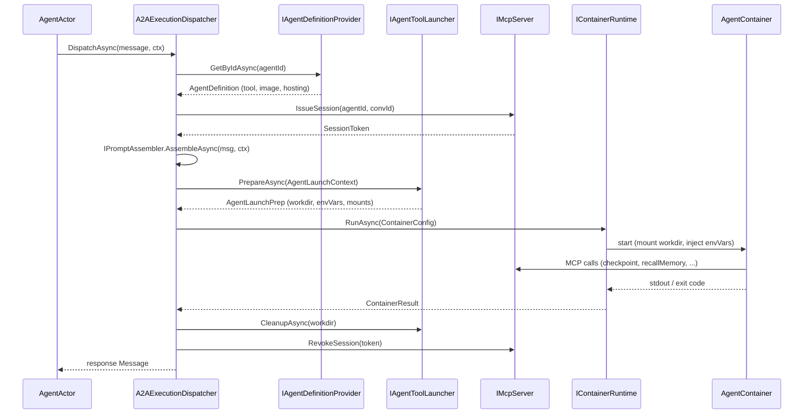
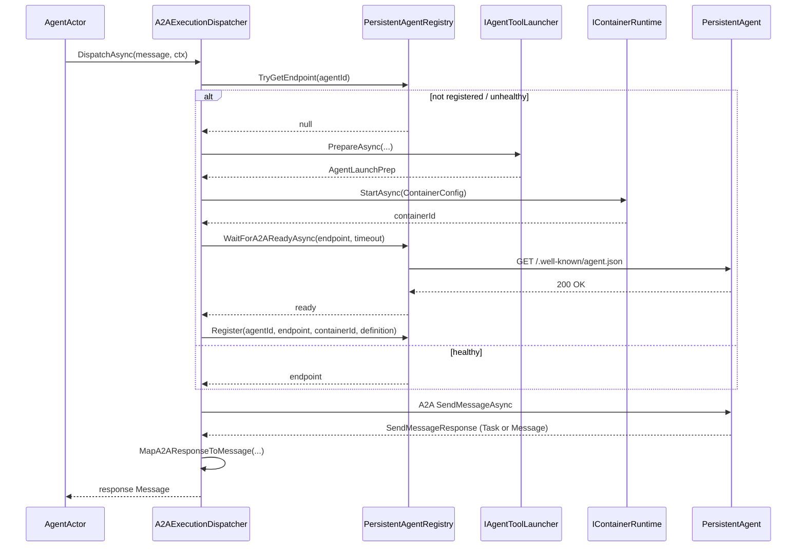

# Workflows

> **[Architecture Index](README.md)** | Related: [Units & Agents](units.md), [Infrastructure](infrastructure.md), [Connectors](connectors.md), [Deployment](deployment.md)

---

## Workflows & External Orchestration

The orchestration strategies defined in the [Units & Agents](units.md) document determine *how* a unit routes messages to members. This document covers:

- The two workflow models (container-based and platform-internal)
- External workflow engine integration via A2A
- **A2A execution dispatch**: how the platform ships the concrete agent runtime
- **Agent tool launchers**: one per supported CLI tool (Claude Code, Codex, Gemini, Dapr Agent / Ollama, custom)
- **The A2A sidecar protocol** that all container-backed agents speak

### Workflow-as-Container (Primary Model)

Domain workflows are deployed as **containers** — the same deployment model used for delegated agent execution environments. A workflow container runs its own Dapr sidecar and orchestrates by sending messages to agents in the unit. This decouples workflow evolution from platform releases: updating a workflow means deploying a new container image, not recompiling the host.

**How it works:**

1. The unit's `WorkflowOrchestrationStrategy` receives an incoming message.
2. The strategy launches the workflow container (optionally with a co-launched Dapr sidecar — see `ContainerLifecycleManager`).
3. The workflow container orchestrates the work — calling agents as activities, waiting for events, managing state.
4. The workflow communicates with agents via the Dapr sidecar (messages, pub/sub, state).
5. On completion, the workflow writes its decision to stdout; the strategy parses it and returns the routed message.

**Workflow containers can use any workflow engine:**

- **Dapr Workflows** (C# or Python) — durable orchestration with the Dapr Workflow SDK
- **Temporal** — if the team prefers Temporal's model
- **Custom** — any process that can speak to the Dapr sidecar

**Example Dapr Workflow in a container** (C#):

```csharp
public class SoftwareDevCycleWorkflow : Workflow<DevCycleInput, DevCycleOutput>
{
    public override async Task<DevCycleOutput> RunAsync(
        WorkflowContext ctx, DevCycleInput input)
    {
        // Triage and classify the issue
        var triage = await ctx.CallActivityAsync<TriageResult>(
            nameof(TriageActivity), input.Issue);

        // Select best-fit agent by expertise
        var agent = await ctx.CallActivityAsync<AgentRef>(
            nameof(AssignByExpertiseActivity), triage);

        // Agent creates implementation plan
        var plan = await ctx.CallActivityAsync<Plan>(
            nameof(CreatePlanActivity), new PlanInput(agent, triage));

        // Human-in-the-loop: wait for plan approval
        var approval = await ctx.WaitForExternalEventAsync<Approval>(
            "plan-approval", timeout: TimeSpan.FromHours(24));

        // Agent implements the plan
        var pr = await ctx.CallActivityAsync<PrResult>(
            nameof(ImplementActivity), new ImplInput(agent, plan));

        // Fan-out: multiple reviewers
        var reviews = await Task.WhenAll(
            ctx.CallActivityAsync<ReviewResult>(nameof(ReviewActivity), pr),
            ctx.CallActivityAsync<ReviewResult>(nameof(ReviewActivity), pr));

        // Merge if all approved
        if (reviews.All(r => r.Approved))
            await ctx.CallActivityAsync(nameof(MergeActivity), pr);

        return new DevCycleOutput(pr, reviews);
    }
}
```

The unit definition references the workflow container through its `ai` block — see [Units & Agents](units.md) for the full unit definition example.

### Platform-Internal Workflows (Dapr Workflows in Host)

A small set of workflows are compiled into the .NET host for platform-internal orchestration. These handle agent lifecycle, cloning lifecycle, and other platform concerns — not domain workflows.

Platform-internal workflows are **not** used for domain orchestration. Domain workflows always run in containers.

---

## A2A Execution Dispatch

Every agent call — ephemeral or persistent — flows through `A2AExecutionDispatcher` (`Cvoya.Spring.Dapr/Execution/A2AExecutionDispatcher.cs`). The dispatcher is registered as the default `IExecutionDispatcher` in `AddCvoyaSpringDapr`; it replaces the pre-A2A `DelegatedExecutionDispatcher`. The container still runs the same agent tool (Claude Code, Codex, Gemini CLI, Dapr Agent), but the dispatcher now communicates with the container via the A2A protocol instead of driving stdin/stdout directly.

### Dispatcher responsibilities

The dispatcher has one public entry point:

```csharp
Task<Message?> DispatchAsync(
    Message message,
    PromptAssemblyContext? context,
    CancellationToken cancellationToken);
```

At dispatch time it:

1. Resolves the target `AgentDefinition` via `IAgentDefinitionProvider` (rejects if `execution.tool` is not set).
2. Branches on `AgentExecutionConfig.Hosting` (`Ephemeral` or `Persistent`; see [Deployment](deployment.md)).
3. Looks up the `IAgentToolLauncher` whose `Tool` property matches `execution.tool`.
4. Issues a short-lived MCP session (`IMcpServer.IssueSession`) bound to `(agentId, conversationId)`.
5. Assembles the full four-layer prompt via `IPromptAssembler` (Layers 1–4; see [Units & Agents](units.md)).
6. Delegates filesystem preparation to the launcher, which returns the per-invocation working directory, env vars, and volume-mount specs.
7. Runs the container (`IContainerRuntime`) and either streams A2A messages (persistent) or collects stdout on exit (ephemeral today; see [Deployment](deployment.md) for the rolling move to A2A-everywhere).

### Launcher registry

`IAgentToolLauncher` (`Cvoya.Spring.Core/Execution/IAgentToolLauncher.cs`) is the per-tool extension point. Every launcher exposes:

- A unique `Tool` string that matches `execution.tool` in the agent YAML.
- `PrepareAsync(AgentLaunchContext, ct)` — materialises a per-invocation working directory and returns `AgentLaunchPrep` (working dir path, env vars, volume mounts).
- `CleanupAsync(workingDirectory, ct)` — removes the working directory when the container exits.

Launchers are enumerable-registered in `AddCvoyaSpringDapr`; `A2AExecutionDispatcher` indexes them by `Tool` using a case-insensitive dictionary built at construction time.

| Launcher                         | `Tool`           | Prompt file  | Container image shape                                  |
| -------------------------------- | ---------------- | ------------ | ------------------------------------------------------ |
| `ClaudeCodeLauncher`             | `claude-code`    | `CLAUDE.md`  | Anthropic Claude Code CLI behind the A2A sidecar       |
| `CodexLauncher`                  | `codex`          | `AGENTS.md`  | OpenAI Codex CLI behind the A2A sidecar                |
| `GeminiLauncher`                 | `gemini`         | `GEMINI.md`  | Google Gemini CLI behind the A2A sidecar               |
| `DaprAgentLauncher`              | `dapr-agent`     | (env var)    | Python Dapr Agent — A2A-native, no sidecar wrapper     |
| Custom A2A agent                 | operator-defined | n/a          | Any image that exposes A2A on `AGENT_PORT` (8999)      |

Every launcher materialises an MCP config file (`.mcp.json`) so the agent tool can call back into Spring Voyage's MCP server for checkpoints, peer discovery, memory, and skill invocation. The MCP endpoint and bearer token are injected via env vars (`SPRING_MCP_ENDPOINT`, `SPRING_AGENT_TOKEN`) plus the workspace-mounted config file.

Adding a new CLI-backed agent is a three-step job:

1. Implement `IAgentToolLauncher` (model on any of the CLI launchers — typically only the prompt filename and the env var shape change).
2. Register it via `services.AddSingleton<IAgentToolLauncher, MyLauncher>();`.
3. Build a container image that bundles the CLI plus the shared `agents/a2a-sidecar/` (or implement A2A natively like `DaprAgentLauncher`).

### A2A sidecar protocol (port 8999)

Most CLI tools (`claude`, `codex`, `gemini`) speak stdin/stdout, not A2A. To make them addressable by `A2AExecutionDispatcher` the platform ships a language-agnostic Python adapter under `agents/a2a-sidecar/`. The sidecar:

- Listens on `AGENT_PORT` (default **8999**).
- Serves an Agent Card at `/.well-known/agent.json`.
- On `message/send` (JSON-RPC) it spawns the wrapped CLI (`AGENT_CMD`) with `AGENT_ARGS`, pipes the user message to stdin, collects stdout/stderr, and returns an A2A task response.
- On `tasks/cancel` it sends `SIGTERM` to the running CLI process.
- Is agent-agnostic: change `AGENT_CMD` to wrap `claude`, `codex`, `gemini`, or any other stdin-driven binary.

`DaprAgentLauncher` is the exception: the Python Dapr Agent already exposes A2A natively, so no sidecar wrapper is needed — the launcher just sets `AGENT_PORT=8999` and the dispatcher dials the container directly.

Persistent agents are probed at `${endpoint}/.well-known/agent.json` during startup (see `PersistentAgentRegistry.WaitForA2AReadyAsync`) and on every health tick.

### Ephemeral dispatch sequence

`Launcher` is one of the concrete `IAgentToolLauncher` implementations (e.g. `ClaudeCodeLauncher`), and `Container` runs both the agent CLI and the A2A sidecar.



### Persistent dispatch sequence

Persistent agents live longer than a single call. The dispatcher reuses a running container across invocations and only starts one when the registry has no healthy endpoint for the agent id. `Container` here exposes A2A on port `8999`. See [Deployment](deployment.md#persistent-agent-hosting-lifecycle) for the full lifecycle, restart semantics, and registry state diagram.



If the A2A call fails mid-dispatch, the dispatcher marks the entry unhealthy via `PersistentAgentRegistry.MarkUnhealthy(agentId)`; the next background health sweep (every 30 s by default) will then attempt a restart.

---

## External Workflow Engines via A2A

The platform supports external workflow engines as unit orchestrators via the same A2A protocol. These participate as peers of native agents — they are indistinguishable at the messaging level because both surface as `IMessageReceiver` implementations inside the unit.

| Engine             | Integration Pattern                                                                                                                                  |
| ------------------ | ---------------------------------------------------------------------------------------------------------------------------------------------------- |
| **Google ADK**     | An ADK agent graph runs as a Python process. Participates as a unit member or orchestrator via A2A. ADK nodes can invoke Spring agents as A2A peers. |
| **LangGraph**      | A LangGraph graph runs as a Python process. Same A2A integration. Graph nodes can be Spring agents.                                                  |
| **Custom**         | Any process that speaks A2A can orchestrate a unit or participate as a member.                                                                       |

### A2A Protocol Integration

A2A (Agent-to-Agent) is an open protocol for cross-framework agent communication. It enables:

- **External agents as unit members** — an ADK agent, LangGraph node, or AutoGen agent participates in a Spring unit via A2A, wrapped as an `A2AAgentActor : IMessageReceiver`.
- **External orchestrators** — an external workflow engine drives a Spring unit's agents via A2A.
- **Cross-platform collaboration** — Spring agents collaborate with agents built on other frameworks.

Each unit can expose an A2A endpoint. Each external agent is wrapped as an `A2AAgentActor` implementing `IMessageReceiver`, making it indistinguishable from a native agent at the messaging level.

---

## Workflow Patterns

All workflow patterns below are supported regardless of which workflow engine runs inside the container:

| Pattern           | Description                        | Example                                  |
| ----------------- | ---------------------------------- | ---------------------------------------- |
| Sequential        | Steps execute one after another    | triage → assign → implement → review     |
| Parallel          | Multiple steps concurrently        | tests + linting + security scan          |
| Fan-out/Fan-in    | Distribute work, aggregate results | assign to 3 agents, collect PRs          |
| Conditional       | Branch based on state              | if complexity > threshold → human review |
| Loop              | Repeat until condition met         | review cycle until approved              |
| Human-in-the-loop | Pause, wait for human input        | approval before implementing             |
| Sub-workflow      | Delegate to nested workflow        | "implement feature" is multi-step        |
