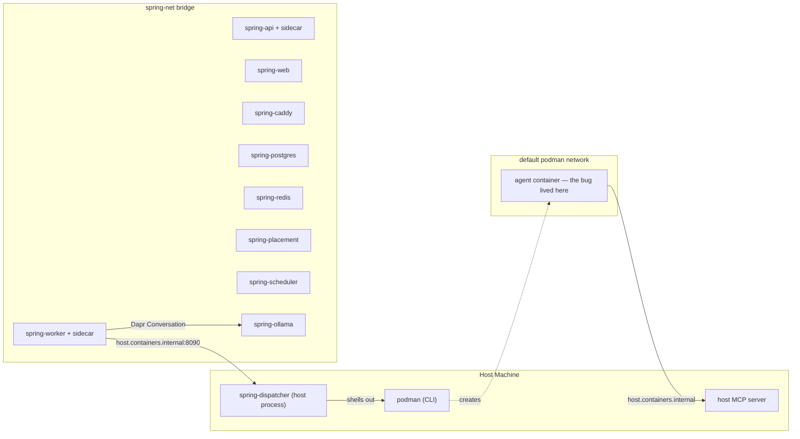
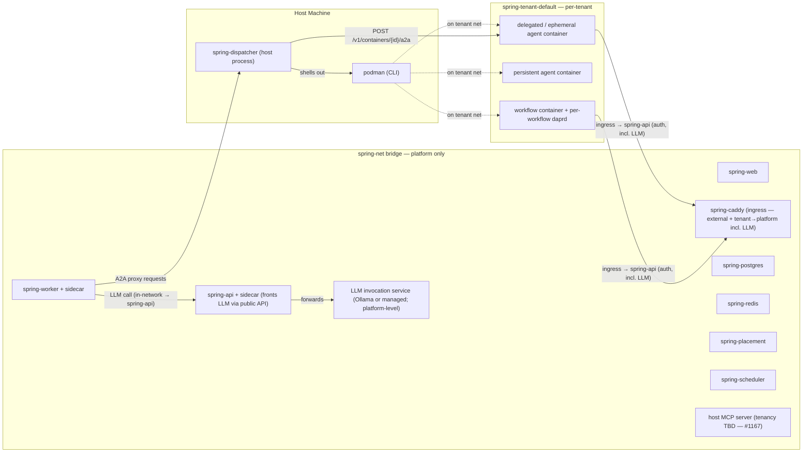

# 0028 — Tenant-scoped runtime topology

- **Status:** Accepted. **Amended 2026-04-26:** Decision C revised — LLM access is a platform-level capability exposed via the public API per [ADR 0029](0029-tenant-execution-boundary.md), not per-tenant infrastructure. Decision E updated and Decision B's LLM-proxy bullet retired (LLM calls flow through the public API, not the dispatcher). The per-tenant Ollama follow-ups originally tracked under #1164 are obsolete. *Operational interim:* selected platform services (`spring-placement`, `spring-scheduler`, `spring-redis`, `spring-postgres`) remain dual-attached to `spring-tenant-default` so per-launch daprd sidecars can reach control-plane / Redis state from their tenant-attached interface without the worker or dispatcher joining tenant networks. *Target architecture:* per-tenant networks (`spring-tenant-<id>`); agent and workflow containers on them; dispatcher as the only platform→tenant bridge; worker single-network on `spring-net`; tenant→platform (including LLM) via public Web API ingress. Terminal architecture (per-tenant agents-host container, encrypted `AgentActor` state) tracked separately.
- **Date:** 2026-04-23 (original); 2026-04-26 (amendment)
- **Related:** [#1165](https://github.com/cvoya-com/spring-voyage/issues/1165) (umbrella), [#1159](https://github.com/cvoya-com/spring-voyage/issues/1159) and [#1160](https://github.com/cvoya-com/spring-voyage/issues/1160) (origin bugs), [PR #1163](https://github.com/cvoya-com/spring-voyage/pull/1163) (readiness half of #1160), [#1166](https://github.com/cvoya-com/spring-voyage/issues/1166) (workflow containers on tenant networks), [#1167](https://github.com/cvoya-com/spring-voyage/issues/1167) (host MCP server tenancy story), [#1168](https://github.com/cvoya-com/spring-voyage/issues/1168) (LLM dispatch interface — reframed against the public API by the 2026-04-26 amendment), [#1169](https://github.com/cvoya-com/spring-voyage/issues/1169) (Caddy ingress for tenant→platform), [#1164](https://github.com/cvoya-com/spring-voyage/issues/1164) (per-tenant Ollama optimizations — **obsolete under the 2026-04-26 amendment**), [#1170](https://github.com/cvoya-com/spring-voyage/issues/1170) (terminal-architecture backlog tracker), [ADR 0012](0012-spring-dispatcher-service-extraction.md) (the dispatcher seam this builds on), [ADR 0029](0029-tenant-execution-boundary.md) (the boundary contract the amendment lines up to).
- **Related code:** `src/Cvoya.Spring.Dapr/Execution/A2AExecutionDispatcher.cs`, `src/Cvoya.Spring.Dapr/Execution/PersistentAgentRegistry.cs`, `src/Cvoya.Spring.Dapr/Execution/ContainerLifecycleManager.cs`, `src/Cvoya.Spring.Dapr/Execution/DaprSidecarManager.cs`, `src/Cvoya.Spring.Dispatcher/`, `deployment/deploy.sh`, `deployment/docker-compose.yml`, `docs/architecture/deployment.md` § *Topology*.

## Context

A user deployed the latest Spring Voyage on the local Podman stack and sent a message to `agent://qa-engineer` of `unit://sv-hosted-engineering` — a Dapr Python agent that uses the local Ollama container. The agent went silent from the user's point of view. Walking the stack from `podman ps` outward surfaced two coupled failure modes on the same dispatch:

1. **Agent container died ~40ms after start.** [`ContainerConfigBuilder`](../../src/Cvoya.Spring.Dapr/Execution/ContainerConfigBuilder.cs) defaulted `WorkingDirectory` to `WorkspaceMountPath` (`/workspace`) when the launcher (`DaprAgentLauncher`) explicitly left both `WorkingDirectory` and `WorkspaceFiles` empty — but the dapr-agent image expects `/app`. Container exited the moment podman tried to `chdir` into a missing path. Filed as #1159.
2. **Worker probed an unreachable URL for 60 s.** [`A2AExecutionDispatcher.WaitForA2AReadyAsync`](../../src/Cvoya.Spring.Dapr/Execution/A2AExecutionDispatcher.cs) constructed `http://localhost:8999/.well-known/agent.json` and probed from the worker's network namespace. After [#1063](https://github.com/cvoya-com/spring-voyage/issues/1063) split worker-in-container from dispatcher-on-host, `localhost` inside the worker is the worker's own loopback — not the agent's. The agent container was on the default podman network with no port mapping, and the worker had no path to reach it. Filed as #1160.

[PR #1163](https://github.com/cvoya-com/spring-voyage/pull/1163) fixed #1159 end-to-end and the *readiness* half of #1160 by routing the probe through `IContainerRuntime.ProbeContainerHttpAsync`, which executes `wget --spider` inside the agent's own network namespace via the dispatcher. The same change covered `PersistentAgentRegistry`'s recurring health sweeps. But `ProbeContainerHttpAsync` only solves readiness — the actual A2A *message send* from worker to agent still has to cross network namespaces, and that needed a design call.

The choice presented in #1160's "Suggested fix" section was:

- **Option 1 — co-locate agents on `spring-net`.** Cheapest. Worker dials the agent by container DNS name. Couples tenancy to platform topology and actively harms the multi-tenant cloud story.
- **Option 2 — proxy A2A through the dispatcher.** New endpoint on the dispatcher, in-network call from there. More moving parts up front, but the worker stays single-network and the cloud K8s shape (one namespace per tenant) falls out for free.

The narrow choice (option 2) opened a wider set of decisions: if agents move off `spring-net`, where do they go? If onto a tenant network, what else lives there? Ollama, in particular — agents reach Ollama today, and putting agents on a tenant network without putting Ollama there would force ad-hoc cross-network bridging that defeats the point. Cloud Ollama is "per-tenant" anyway because a single Ollama can't serve every tenant's models; OSS is single-tenant by design. So the per-tenant Ollama decision came along with the per-tenant network decision essentially for free.

Two further questions then surfaced. First: what about *workflow* containers? They run tenant-owned code on tenant data the same way agent containers do, and they currently get an ephemeral `spring-net-<guid>` per workflow with no path to tenant infrastructure. Second: what about *hosted* agents — the in-process LLM call path that runs in the worker via the Dapr Conversation building block? With Ollama on the tenant network and the worker single-network on `spring-net`, hosted agents lose direct access. Two shapes were on the table: restrict hosted agents to managed providers only, or proxy the LLM call through the dispatcher the same way A2A is proxied. The proxy shape won — splitting hosted-vs-delegated by LLM availability would have been a UX gotcha, and the dispatcher proxy generalizes from "A2A message" to "LLM call" without inventing new patterns.

The final question — what about *tenant→platform* traffic, e.g. an agent calling a `spring-api` endpoint? — has no current blocking use case but needs a normative answer recorded so no future implementation introduces a direct-infra-access shortcut. The answer is "the same authenticated path external clients use: Caddy ingress in OSS, K8s ingress in cloud."

This ADR records the decisions all of the above lines up to.

### Multi-tenancy and compliance pressure

The decisions below cost more than option 1 from #1160 would have. The reason to pay that cost now is that the project already treats tenancy as a first-class architectural concern (see [`docs/architecture/agent-runtimes-and-tenant-scoping.md`](../architecture/agent-runtimes-and-tenant-scoping.md), which makes every business-data row tenant-scoped at the EF layer): network-layer isolation is the **structural counterpart** to that application-layer scoping. Application-layer scoping requires auditors to trust the code; network and (eventually) crypto boundaries make the property self-evidently true.

The ultimate target is a multi-tenant platform where tenant-specific logic runs only on tenant-specific networks and platform infrastructure sees only encrypted tenant data. Compliance claims like "the platform cannot read tenant agent conversations" become enforceable by construction. v0.1 doesn't ship that target — the per-tenant agents-host container with encrypted-at-rest `AgentActor` state and KMS integration is multi-issue, multi-release work tracked under #1170. v0.1 ships the structural foundation (per-tenant networks, dispatcher-proxied platform→tenant traffic, pluggable LLM dispatch) so the migration is a scoped follow-up rather than a rewrite.

## Decision

**Five decisions, lettered for easy referencing from sub-issues and re-triage comments.**

### Decision A — Per-tenant networks

Agent containers (all hosting modes) and workflow containers live on `spring-tenant-<id>`. The worker stays single-network on `spring-net` as a structural constraint, not a policy: dual-homing would mean every actor in the worker reaches every tenant's namespace, collapsing the isolation. The dispatcher is the only process that reaches tenant networks, and it does so via `podman exec`-style mechanisms (or, in cloud, the K8s API) rather than by joining them — which keeps the dispatcher itself off the tenant networks.

OSS uses a single `spring-tenant-default` network. Cloud uses one `spring-tenant-<id>` per tenant.

**daprd sidecars stay off the tenant network.** For Dapr-fronted workflow and unit containers (those launched via `ContainerLifecycleManager.LaunchWithSidecarAsync`), the app container dual-attaches to the per-workflow `spring-net-<guid>` bridge *and* the tenant bridge, but the daprd sidecar stays on the per-workflow bridge only. Three reasons: (1) daprd exposes the Dapr HTTP/gRPC API surface, and putting that on a tenant network lets any tenant-network peer invoke the app's state store, pubsub, and service-invocation endpoints; (2) when configured with production components, daprd needs reach to platform control-plane services (`spring-redis`, `spring-postgres`, `spring-placement`) that live on `spring-net` — the per-workflow bridge preserves that path while keeping tenant peers out of it; (3) the per-workflow bridge is the isolated channel for app↔sidecar Dapr-protocol chatter.

The "no dual-homing" rule in this ADR is about *platform* processes (worker, dispatcher) whose dual-homing would span every tenant's namespace. A tenant-layer app container holding a private link to its own sidecar alongside its tenant home is internal plumbing, not a platform-isolation breach. See #1166 for the implementation.

### Decision B — Dispatcher-proxied platform→tenant traffic

All platform-initiated traffic into tenant networks routes through the dispatcher. Two cases:

- **Readiness probes.** Already shipped in [PR #1163](https://github.com/cvoya-com/spring-voyage/pull/1163) via `IContainerRuntime.ProbeContainerHttpAsync` → `POST /v1/containers/{id}/probe`.
- **A2A message send.** New endpoint `POST /v1/containers/{id}/a2a` that forwards the worker's A2A message to the in-container endpoint. Closes the message-send half of #1160.

This pattern generalizes to "full agent-execution RPC" in the terminal architecture (#1170): the same shape, larger payload.

Hosted-agent LLM calls were originally part of this pattern (dispatcher proxy → per-tenant Ollama). The 2026-04-26 amendment moves them onto the public API per Decision C; see Decision E.

### Decision C — Platform-level LLM invocation service, reached via the public API

LLM access is a platform-level capability, not per-tenant infrastructure. Tenants reach it through the same authenticated public Web API path as any other tenant→platform call (Decision D); the surface is normative under [ADR 0029](0029-tenant-execution-boundary.md)'s public-API bucket. The implementation behind that surface is opaque to tenants — Ollama today, possibly a managed-provider passthrough or a pool of internal models tomorrow, possibly renamed to a generic "LLM invocation service" — without breaking tenants.

Per-tenant LLM provisioning is **not** a deployment concern. The deployment layer provides one LLM service for the platform; tenants do not get their own. This removes the optimization-and-cost-control grab-bag (shared model blob cache, idle GC, lazy provisioning, free-tier-defaults-to-managed-providers) that was previously deferred under #1164 — the shape no longer requires it.

The dispatcher does not gain "LLM lifecycle" responsibility. Provisioning is a deployment concern, runtime container management is a dispatcher concern, and these stay separate.

### Decision D — Tenant→platform traffic flows via the public Web API through ingress

Tenant containers calling platform services use Caddy ingress (OSS) or cloud ingress, the same authenticated path external API clients use. Authorization is at the application layer (the existing API auth middleware); direct access from tenant networks to internal platform infrastructure (`spring-postgres`, `spring-redis`, internal Dapr endpoints) is forbidden by network layout.

OSS Caddy routing for the tenant→platform path is tracked in #1169. The pattern is normative from v0.1 so no future implementation introduces dual-homing or direct-infra-access shortcuts before the routing lands; the v0.1 bug fix doesn't exercise this path so it doesn't block v0.1.

### Decision E — Hosted and delegated agents have symmetric LLM access via the public API

Both modes reach the platform LLM service (Decision C) through the same authenticated public Web API path as any other tenant→platform call (Decision D). Hosted agents (in-process LLM call from the worker) and delegated / ephemeral agents (containers on the tenant network) make the same call against the same surface. There is no hosted-vs-delegated LLM-provider split.

The hosted-agent code path retains a pluggable LLM-dispatch interface (`ILlmDispatcher` or equivalent) targeting the public API surface, so the future migration of hosted execution out of the worker (#1170) is a swap, not a rewrite.

Tracked as #1168 (now framed against the public API surface rather than dispatcher-proxied tenant Ollama).

## Alternatives rejected

- **Co-locate agents on `spring-net`** — cheapest fix for the bug but couples tenancy to platform topology and actively harms the multi-tenant cloud story. Rejected because the project already treats tenancy as first-class (actor-layer scoping); network-layer tenancy is consistency, not speculative engineering.
- **Worker dual-homes onto tenant networks** — every actor in the worker process would reach every tenant's namespace, defeating the isolation that motivates per-tenant networks in the first place.
- **Per-tenant dispatchers** — the dispatcher is a platform component; per-tenant instances would multiply infrastructure without adding isolation, since the dispatcher is already tenant-aware via `Dispatcher__Tokens__<token>__TenantId` (see ADR 0012 § Worker binding).
- **Dispatcher as Ollama lifecycle manager** — Ollama provisioning is a deployment-layer concern, not a container-runtime concern. Conflating them grows the dispatcher's surface and breaks the responsibility split that ADR 0012 just established.
- **Restrict hosted-agent LLMs to managed providers only** — would create a UX gotcha where users pick hosting mode based on LLM availability rather than execution model. Decision E removes the restriction at the cost of introducing the dispatcher-proxied LLM path (#1168).
- **Ship the cheapest possible patch for #1160 and defer the topology call** — the topology decision is a forcing function for downstream choices (workflow networks, MCP tenancy, hosted-LLM access). Deferring it means re-deciding it under pressure later, with sunk-cost bias against changing whatever we shipped first.

## Consequences

### Topology

**As-is** (the state the bug exposed; included here as the historical record — `deployment.md` carries only the target):

**Target** (deliverables; same diagram lives in [`deployment.md`](../architecture/deployment.md) § Topology):

Properties: worker stays single-network; the dispatcher is the only cross-network bridge (platform→tenant); Caddy ingress is the only tenant→platform path; tenant traffic stays in the tenant namespace. The K8s cloud shape maps one-to-one (namespace per tenant, dispatcher = control-plane bridge, ingress = data-plane entry point).

### Service inventory

The full inventory and "why" for each service lives in [`deployment.md`](../architecture/deployment.md) § Topology. Summary: every business-tenant-aware container moves to the tenant network; every platform service stays on `spring-net`; the dispatcher (host process) and the MCP server (host service today, tenancy TBD per #1167) are the only cross-network endpoints.

### Worker role

The worker hosts every Dapr virtual actor (`AgentActor`, `UnitActor`, `ConnectorActor`, `HumanActor`), every Dapr workflow, the A2A execution dispatcher, the persistent agent registry, the in-process LLM call path for hosted agents (via Dapr Conversation today, via the dispatcher LLM proxy after #1168), EF migrations, default-tenant bootstrap, and the host MCP endpoint exposed to agent containers.

The worker must stay single-network as a structural constraint, not a policy: dual-homing would collapse the isolation the per-tenant network design establishes. The terminal architecture (#1170) goes further and moves hosted-agent execution out of the worker entirely.

### v0.1 deliverables

The umbrella issue [#1165](https://github.com/cvoya-com/spring-voyage/issues/1165) tracks the v0.1 work as native sub-issues:

- **#1160** — dispatcher-proxied A2A message send (Decision B's open half).
- **#1166** — attach workflow containers to tenant networks (Decision A applied to workflows).
- **#1167** — tenancy story for the host MCP server (`needs-thinking`; the answer constrains future MCP tools).
- **#1168** — dispatcher-proxied LLM calls from worker (Decision E).

The agent-container side of Decision A (move agents from the default podman network to `spring-tenant-<id>`) is part of the #1160 implementation since it's a precondition for the dispatcher proxy to reach them in-network.

OSS deployment-layer changes (rename network from `spring-net` for agent traffic to `spring-tenant-default`; add Ollama to the tenant network; add the uniform `tenant-ollama` DNS) land alongside the #1160 implementation in `deployment/deploy.sh` and `deployment/docker-compose.yml`.

### Follow-up deliverables (post-v0.1)

- **#1169** — Caddy ingress for tenant → spring-api (OSS routing — Decision D's OSS half; covers LLM-via-public-API under the 2026-04-26 amendment).

The per-tenant Ollama follow-up (#1164) is **obsolete under the 2026-04-26 amendment** and should be closed.

### Terminal architecture (not v0.1)

The shape is described inline in #1170. Summary: tenant-specific logic runs only on tenant networks; platform infrastructure sees only encrypted tenant data; per-tenant agents-host container replaces in-process hosted-agent execution; `AgentActor` state encrypted at rest with per-tenant keys; KMS / HSM integration. The v0.1 dispatcher-proxied traffic pattern, per-tenant networks, and pluggable LLM dispatch interface are deliberately chosen so this migration is a scoped follow-up rather than a rewrite.

### Costs accepted

- One additional HTTP hop for every worker→agent A2A message and every hosted-agent LLM call. Same shape as ADR 0012 already accepted for `IContainerRuntime` operations; the dispatcher runs on the same host so the latency cost is a local TCP call.
- Network-management complexity: per-tenant networks need to be provisioned and torn down by the deployment layer. OSS lifts this with a single `spring-tenant-default` network created by `deploy.sh`; cloud delegates to K8s namespace lifecycle.
- The MCP-server tenancy question (#1167) is unresolved — accepted as a `needs-thinking` follow-up rather than blocking v0.1 on a decision that doesn't have a current forcing function.
