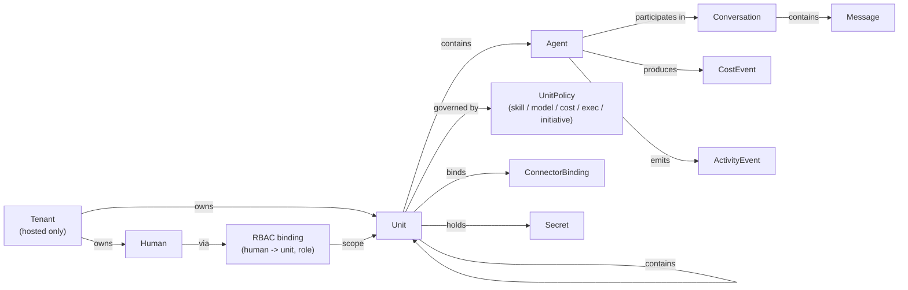

# Web Portal UX Exploration

> **Status:** Plan of record.
> **Umbrella:** [#434](https://github.com/cvoya-com/spring-voyage/issues/434) — tracks all sub-issues.
> **Source:** PR [#429](https://github.com/cvoya-com/spring-voyage/pull/429).
>
> **Closes:** [#406](https://github.com/cvoya-com/spring-voyage/issues/406)
>
> **Related:** [ADR 0001 — Web portal rendering strategy](../decisions/0001-web-portal-rendering-strategy.md) (superseded — see [#436](https://github.com/cvoya-com/spring-voyage/issues/436)), [Architecture: CLI & Web](../architecture/cli-and-web.md), [Guide: Observing](../guide/user/observing.md).

---

## 1. Scope & non-goals

This document is the plan of record for the portal redesign. Sub-issues under umbrella [#434](https://github.com/cvoya-com/spring-voyage/issues/434) drive execution. Amendments happen via new ADRs or design-doc updates, not ad-hoc proposals.

**In scope.**

- Portal information architecture for both the standalone (OSS) build and the hosted (multi-tenant) build.
- Direction for six key workflows: unit creation, agent monitoring, conversation interaction, cost management, RBAC (hosted), policy configuration.
- Standalone-vs-hosted divergences.
- Responsive / accessibility posture.
- Technology-stack decision.
- CLI-UI parity analysis — every portal action mapped to an existing or newly-tracked CLI command.

**Not in scope.**

- Pixel-perfect visual design or high-fidelity prototypes. Those are produced by a designer in whatever tool they prefer (Stitch, Figma, Penpot, plain markdown — see [`docs/design/README.md`](README.md)) and captured in [`src/Cvoya.Spring.Web/DESIGN.md`](../../src/Cvoya.Spring.Web/DESIGN.md). `DESIGN.md` is the agent-readable contract between design and code; see § 8.6.
- Code changes to the actual portal.
- Features not yet shipped on the platform (marked clearly as "future" where referenced for context).
- Branding, marketing site, public documentation site.

Every workflow in Section 5 includes a **Before** subsection (what exists today) and a **Direction** subsection. The aim is to show the smallest coherent set of portal shifts that unlocks the blocked implementation issues without reshuffling the tech stack.

---

## 2. Baseline: what the portal is today

The portal lives in `src/Cvoya.Spring.Web/`. It is a Next.js App Router project (`next@16`, `react@19`) configured with `output: "standalone"` (ADR 0001 once recommended static export; the runtime flipped to standalone and ADR 0001 is superseded per [#436](https://github.com/cvoya-com/spring-voyage/issues/436) — see §8.1). Styling is Tailwind 4. Icons come from `lucide-react`. The API contract is consumed via `openapi-typescript` generated from `src/Cvoya.Spring.Host.Api/openapi.json`; the client is `openapi-fetch`.

### Routes that exist today

Walked `src/Cvoya.Spring.Web/src/app/`:

| Route                       | Purpose                                                                                                                                       |
| --------------------------- | --------------------------------------------------------------------------------------------------------------------------------------------- |
| `/`                         | Dashboard. Stats header (units / agents / cost / health) + unit cards + agent cards + recent activity timeline (polled every 10 s).           |
| `/units`                    | Unit list. Rows with delete confirmation; link into each unit's config.                                                                       |
| `/units/create`             | Five-step wizard: Details → Mode (template / scratch / YAML) → Connector → Secrets → Finalize.                                                |
| `/units/[id]`               | Unit detail with tabs: Agents, Sub-units, Skills, Connector, Secrets, Activity. Start/stop, delete, readiness, cost.                          |
| `/agents/[id]`              | Agent detail: info, cost, clones list with create form, budget, recent activity filtered to this agent (via SSE stream), initiative/metadata. |
| `/activity`                 | Full activity query page with filters (source, event type, severity) and pagination.                                                          |
| `/initiative`               | Per-agent initiative policy editor (levels, tier-1/tier-2 configs, allow/block actions, require-unit-approval).                               |
| `/budgets`                  | Tenant-wide budget plus per-agent budget rows.                                                                                                |

### Shared UI

- `components/sidebar.tsx`: left nav (Dashboard, Units, Activity, Initiative, Budgets) with a mobile drawer and light/dark theme toggle. No user chip, no tenant switcher, no search.
- `components/app-shell.tsx`: thin wrapper that composes the sidebar and main content pane.
- `components/ui/*`: card, button, badge, table, tabs, dialog, confirm-dialog, skeleton, input, toast. Modest shadcn-style primitives.
- `lib/stream/use-activity-stream.ts`: SSE subscription to `/activity/stream`.

### What's **missing** from the portal today (confirmed by walking the tree)

- No Conversations surface (no `/conversations` route, no chat UI).
- No Policies surface (only `/initiative` exists; `UnitPolicy`'s Skill / Model / Cost / ExecutionMode dimensions described in `docs/architecture/units.md` § "Unit Policy Framework" are not exposed anywhere).
- No RBAC / members UI (the existing "members" tab on `/units/[id]` lists **unit membership** — agents and sub-units — not humans / roles).
- No Auth / user-profile surface (no sign-in UI, no token management page; the OSS runs in daemon mode without auth per `docs/architecture/security.md`).
- No Connectors catalog page (only per-unit binding inside `/units/[id]` → Connector tab).
- No Packages / Templates browser (templates are picked inline inside the create-unit wizard).
- No global search, no command palette, no tenant switcher, no notifications inbox.
- No breadcrumbs — deep links rely on `ArrowLeft` "Back" affordances hard-coded per page.

These gaps are the raw material the plan below operates on.

---

## 3. Information architecture

### 3.1 Core entity graph



Two facts shape the IA:

1. **A unit is both a composition node and a governance boundary.** It owns members (agents or sub-units), a connector binding, secrets, an RBAC ACL (hosted), and a `UnitPolicy`. Everything a unit *does* — dispatch, cost, initiative — flows through policies attached to some unit the agent is a member of.
2. **An agent's identity crosses unit boundaries.** An agent can be a member of multiple units (M:N); its cost, activity, and conversations are agent-scoped primary, unit-scoped as a rollup.

The portal should therefore privilege **two navigation lenses**: *by unit* (organizational view) and *by agent* (operational view), with conversations cutting across both and costs rolled up to either axis.

### 3.2 Top-level navigation

```
+------------------+----------------------------------------+
|  Spring Voyage   |   [search or cmd-palette]       [user] |
|                  |----------------------------------------|
|  Dashboard       |                                        |
|  Inbox           |   (main content pane)                  |
|  Units       >   |                                        |
|  Agents      >   |                                        |
|  Conversations>  |                                        |
|  Activity        |                                        |
|  Analytics   >   |                                        |
|      Costs       |                                        |
|      Throughput  |                                        |
|      Wait times  |                                        |
|  Policies        |                                        |
|  Connectors      |                                        |
|  Packages        |                                        |
|------------------|                                        |
|  [v] Settings    |                                        |
|      Tokens      |    (hosted adds: Tenant, Billing,      |
|      People      |     Members, Audit)                    |
|      Packages    |                                        |
+------------------+----------------------------------------+
```

Changes from current sidebar (Dashboard / Units / Activity / Initiative / Budgets):

- Add **Inbox** — a dedicated "things waiting on me (a human)" surface. See §3.4 below for the rationale and how it relates to Conversations. Tracked by [#447](https://github.com/cvoya-com/spring-voyage/issues/447).
- Add **Agents** as a first-class lens (today agents are only reachable by drilling from unit or dashboard). Tracked by [#450](https://github.com/cvoya-com/spring-voyage/issues/450).
- Add **Conversations** as a top-level surface — conversations are the artefact users most frequently want to inspect. Tracked by [#410](https://github.com/cvoya-com/spring-voyage/issues/410).
- Add **Analytics** as a new top-level surface (§5.7). **Costs** moves under it as a subsection and gains peers: throughput, wait times, interaction counts, utilization. The current sidebar's standalone "Budgets" entry folds into `Analytics → Costs`. Tracked by [#448](https://github.com/cvoya-com/spring-voyage/issues/448).
- Replace **Initiative** with a broader **Policies** surface covering all five `UnitPolicy` dimensions (Skill / Model / Cost / ExecutionMode / Initiative) plus the per-agent initiative policy that exists today. Initiative becomes a sub-view. Tracked by [#411](https://github.com/cvoya-com/spring-voyage/issues/411).
- Add **Connectors** and **Packages** as top-level browsers (catalogue of available connector types and installed packages / templates). Tracked by [#449](https://github.com/cvoya-com/spring-voyage/issues/449) and [#395](https://github.com/cvoya-com/spring-voyage/issues/395).
- Add a **Settings** drawer at the bottom: tokens, personal profile, installed packages. In hosted mode this gains Tenant, Billing, Members, Audit. Tracked by [#451](https://github.com/cvoya-com/spring-voyage/issues/451).
- Add a **search / command palette** triggered by `/` or `Cmd-K` so power users can jump to any unit, agent, conversation, or CLI-equivalent action from anywhere. Tracked by [#439](https://github.com/cvoya-com/spring-voyage/issues/439).

Sidebar restructure itself is tracked by [#444](https://github.com/cvoya-com/spring-voyage/issues/444).

### 3.3 Context rules

- **Breadcrumbs are mandatory** on any page two levels or deeper: `Units / engineering-team / backend / ada`. Today each page hard-codes an "← Back" chevron with inconsistent targets.
- **Cross-links are required, not optional.** Every unit card links to its conversations, costs, activity, policies. Every agent card links to its parent units and its conversations. Activity rows link to the agent / conversation that produced them.
- **Object cards are the primary unit of IA.** A unit card, agent card, and conversation card are reusable primitives (title, status, badge, quick actions, cost mini-sparkline, "open" affordance) — not bespoke layouts per page.

Tracked by [#443](https://github.com/cvoya-com/spring-voyage/issues/443).

### 3.4 Inbox: the human-facing "awaiting me" surface

Humans participate in Spring Voyage as first-class actors (`human:<32-hex-no-dash>`). They send work, they receive work, and — critically — agents frequently **wait on them**: approvals, clarifications, go/no-go decisions, escalations. Today the portal has no surface for "things pointed at me that I have not responded to". An operator opening the app has to know which unit / agent / conversation to drill into. That is a gap for the hosted story especially (many tenants, many concurrent asks) but it applies to standalone too.

**The Inbox is its own top-level surface, distinct from Conversations** (tracked by [#447](https://github.com/cvoya-com/spring-voyage/issues/447)).

- **Inbox** answers *"What is waiting on me?"* It is scoped to the current user and ordered by age / priority. Each row names the requesting unit/agent, the conversation, the ask, and the action (approve, reject, reply, open). Items drop off as soon as the user acts or the agent retracts.
- **Conversations** answers *"What threads have I been part of?"* It is the full-history lens, ordered by recency, filterable by unit/agent/participant. No action affordance is required for a row to appear.

One is a task queue; the other is an archive. They share the Conversation primitive (each Inbox row links to its parent conversation), but treating them as the same page conflates a blocker list with a journal and we lose the "what do I need to do right now" clarity.

**Smallest coherent v1:** Inbox page lists conversations where the latest event is a `MessageReceived` targeting the current `human:` address *and* no subsequent message from that human has shipped. Click → open the conversation with the reply box focused. Completion deletes the row.

**Hosted additions:** delegation ("assign this to another human in the tenant") and SLA badges ("waiting 4h"). Both layer cleanly once the base exists.

### 3.5 Analytics: a first-class surface, with Costs as a peer subsection

Cost is one lens on operational health. It is not the only one worth answering. An operator managing a running fleet of units and agents regularly wants to know:

- How long are units/agents **idle** waiting for work?
- How long are they **busy** per turn? Per conversation? Per day?
- How many **interactions** (messages, tool calls, handoffs) are they driving?
- How long are conversations **blocked on a human** vs blocked on an LLM vs blocked on an external tool?
- What fraction of work is coming in via which **surface** (CLI, portal, connector, scheduled)?

Today only cost exists as a sibling to everything else (portal `/budgets`, CLI `spring cost summary`). Treating cost as the whole of analytics limits the portal's ability to answer operational questions.

**Analytics is a top-level surface with Costs as one subsection. The other subsections are deliberately thin at v1 and grow over time** (tracked by [#448](https://github.com/cvoya-com/spring-voyage/issues/448)).

Initial subsections:

- **Costs** — what today's `/budgets` page is, promoted. Totals, breakdown by agent/unit/model/source, budget utilization, sparklines. Budget configuration lives here.
- **Throughput** — interaction counts over time: messages per agent, conversations per unit, turns per model. A single stacked chart per dimension.
- **Wait times** — time-in-state rollups derived from the `StateChanged` activity events the platform already emits. Idle time, busy time, waiting-on-human time (from conversations where the latest event awaits a `human:` address). This is where the inbox-style SLA metrics roll up.

Each analytics subsection is a filtered roll-up over the same activity event stream that feeds §3.2 Activity. That keeps implementation bounded — one query layer, many lenses — and the surface can grow (capacity, failure rates, policy-denial rates, connector-call rates) without adding new pipelines.

**Platform gaps this may surface:** wait-time analytics assumes the activity stream tags each state transition with enough detail to compute durations (e.g. `StateChanged` events must include both the previous and current state and be timestamped consistently). A short spike before implementation should verify this and file any gaps.

---

## 4. Standalone vs hosted — where they diverge

The OSS repository has no concept of a tenant (see `AGENTS.md` § "Open-Source Platform & Extensibility", `docs/architecture/security.md`). The private Spring Voyage Cloud repository layers tenancy, OAuth/SSO, billing, and premium features on top via git submodule and DI overrides.

The portal must cleanly support both. The core move: **all tenant-aware surfaces are mounted by the hosted build at known extension points, not bolted into the OSS routes.**

| Aspect                | Standalone (OSS)                                                             | Hosted (Cloud)                                                                                        |
| --------------------- | ---------------------------------------------------------------------------- | ----------------------------------------------------------------------------------------------------- |
| Authentication        | None (daemon mode, single implicit user).                                    | OAuth / SSO required before any route. Session cookie + refresh flow.                                 |
| Tenant switcher       | Hidden — there's no tenant.                                                  | Top-bar switcher (left of user chip) listing tenants the user has access to.                          |
| User chip             | Shows `local` placeholder, no avatar.                                        | Avatar + name + "Sign out".                                                                           |
| Billing               | Absent.                                                                      | Settings → Billing: plan, usage, invoices, payment method, budget alerts.                             |
| People / Members      | Absent (RBAC exists in core but has no UI target in OSS — see §5.5).         | Tenant-scoped People directory + per-unit Members tab with owner/operator/viewer role dropdowns.      |
| Audit log             | Absent (OSS emits activity events but not an explicit "audit" view).         | Settings → Audit: sign-ins, role changes, token issuance, policy overrides.                           |
| Onboarding            | Empty-state CTAs on dashboard ("Create your first unit").                    | First-run wizard: sign in → create or join tenant → invite teammates → create first unit.             |
| Tokens                | Token page present (CLI parity); no enforcement in daemon mode.              | Token page is identity-scoped; shows tokens, last-used, scopes, tenant attribution.                   |
| Feature flags         | None.                                                                        | Plan-gated features (e.g., premium connector types, custom models) show lock icon + upgrade CTA.      |
| Notifications         | Toasts + activity page.                                                      | Additionally: per-human notification settings (email / Slack / webhook) per the security doc.         |
| Theme                 | Light / dark toggle.                                                         | Same, plus tenant branding (logo in sidebar header) for enterprise plans.                             |

### Cleanly extending OSS into hosted

The portal should be structured so the private repository can extend it **without patching** OSS files:

1. **Extension slots.** Define named React component slots in the OSS shell (`TopBarLeft`, `TopBarRight`, `SidebarFooter`, `SettingsNav`, `UnitDetailHeader`). The OSS build renders a default — `null` for most tenant-only slots. The hosted build supplies alternates via a typed `PortalExtensions` context at shell boot.
2. **Route manifest.** Expose an `AdditionalRoutes` export (array of `{ path, element }`) that the hosted build can merge into the App Router at build time. Tenant / Billing / Members / Audit pages live entirely in the private repo.
3. **Auth adapter.** OSS ships an `AuthAdapter` with a no-op implementation and a typed `useSession()` hook that returns `{ user: "local" }`. Hosted swaps in an OAuth-backed adapter without touching call sites.
4. **API client seam.** The generated `openapi-fetch` client is wrapped in a `withAuth(client, adapter)` decorator so the hosted build attaches bearer tokens and tenant headers in one place.
5. **Tenancy-unaware OSS code.** No OSS component may reference `tenantId`. Tenant scoping is surfaced via the API client decorator (same pattern as the backend's tenant-scoped repository wrappers).

This mirrors the backend's DI pattern: OSS defines contracts and a single-tenant default; the private repo substitutes a tenant-aware implementation. If we honour the same rules on the frontend, the private repo never has to fork a page just to add a "Switch Tenant" chip.

---

## 5. Key workflows

Each workflow is presented as **Before → Direction**, with ASCII wireframes and, where useful, a mermaid diagram of the flow.

### 5.1 Unit creation

**Before.** `/units/create` is a 5-step wizard (Details → Mode → Connector → Secrets → Finalize). It already supports Template, YAML import, and scratch. CLI parity exists through `spring unit create` and `spring apply -f manifest.yaml`. Each step is a long form; no preview of what gets created; connector config is modal-ish inside the page.

**Shortcomings.** All five steps treat every field as equally important. Most users arrive wanting one of two things: (a) "run a pre-built team", (b) "apply a YAML manifest the CLI also accepts". The current wizard front-loads unit-level metadata before asking *what kind of unit* the user is creating, so a template mode's manifest-supplied name ends up being entered twice.

**Direction.** Invert the flow. Ask *what* first:

```
+------------------------------------------------------------+
| Create a unit                                     [ X ] |
|------------------------------------------------------------|
|                                                          |
|  How would you like to start?                            |
|                                                          |
|  +------------------+  +------------------+  +---------+ |
|  | From template    |  | From YAML        |  | Scratch | |
|  | Pre-built teams  |  | Import manifest  |  | Empty   | |
|  +------------------+  +------------------+  +---------+ |
|                                                          |
|  (once selected, remaining steps are inlined below)      |
|                                                          |
|   Template:  [ software-engineering/engineering-team v ] |
|                                                          |
|   Name (override): [ engineering-team        ]  optional |
|   Display name:    [ Engineering Team       ]           |
|                                                          |
|   [ + Connector (optional)      GitHub           v ]     |
|   [ + Secrets (optional)        0 secrets       v ]     |
|   [ + Policy preset (optional)  default         v ]     |
|                                                          |
|   Preview:                                               |
|   > unit: engineering-team                               |
|   > members: [ada, grace, linus]                         |
|   > connector: github (configured)                       |
|                                                          |
|   [ Cancel ]                            [ Create unit ]  |
+------------------------------------------------------------+
```

Key changes:

- Mode selector first, at the top, as three big cards.
- Optional steps (Connector, Secrets, Policy preset) collapse to accordion sections. The template's own defaults prefill, so the user can just click "Create".
- Right-hand (or bottom) panel shows the YAML that *would* be applied. This is the exact CLI invocation (`spring apply -f ...`) — we show it literally so the user can copy it and understand the CLI equivalent. This is the cheapest CLI-parity nudge we can build.
- **Policy preset** is new: the user picks `default` / `cost-capped` / `restricted-models` / `custom`. A `custom` choice drops into the per-dimension editor described in §5.6.

**CLI parity.** `spring unit create`, `spring apply -f`. Gap: `spring unit create-from-template` (the API supports it — the CLI currently doesn't surface template mode as a first-class command; flagged below).

### 5.2 Agent monitoring

**Before.** `/` dashboard has agent cards with role + last-activity snippet. `/agents/[id]` shows info, cost card, clones, budget, activity filtered to the agent via SSE, plus an initiative panel. There's no "agents list" page — the only way to reach an agent is by dashboard card or a deep link.

**Direction.** Add an `/agents` list page as peer of `/units`. The agent detail becomes the monitoring hub:

```
+-------------------------------------------------------------+
|  Agents                   [search...]   [ filter: unit v ]  |
|-------------------------------------------------------------|
|  name           role            units           cost/7d     |
|  ada            backend         eng-team        $4.12       |
|  grace          frontend        eng-team        $1.88       |
|  linus          ops             eng-team        $0.44       |
|  amelia         researcher      (none)          $0.00       |
+-------------------------------------------------------------+
```

Agent detail page, redesigned around three stable rails:

```
+--------------------------------------------------------------+
| < Agents / ada                             [Stop] [Clone] [v]|
|--------------------------------------------------------------|
| STATUS  Running     UNITS engineering-team                    |
| MODEL   claude-4    INITIATIVE  Attentive (max Proactive)     |
| COST (7d) $4.12  TOKENS 1.2M in / 400k out                    |
|--------------------------------------------------------------|
| [ Overview ] [ Conversations ] [ Activity ] [ Policies ]     |
| [ Clones   ] [ Cost           ] [ Budget   ] [ Config ]      |
|--------------------------------------------------------------|
|                                                              |
|  Overview                                                    |
|  - Current task: "Review PR #42" (conversation c-1834)       |
|  - Inbox depth: 3 messages                                   |
|  - Last 24h: 12 decisions, 2 errors, $0.88                   |
|  - Memory: 342 entries, last updated 5 min ago               |
|                                                              |
|  Recent conversations                                        |
|  c-1834  Review PR #42     4 min ago   active                |
|  c-1830  Answer #41        1 h ago     completed             |
|  c-1811  Daily standup     9 h ago     completed             |
|                                                              |
+--------------------------------------------------------------+
```

Key changes:

- Status rail (fixed top) always answers "what is this agent *doing right now* and *what does it cost*".
- Tabs extend the existing set with **Conversations** (currently missing) and **Policies** (read-only view of inherited unit policies).
- Each activity row deep-links to its conversation. This closes the gap flagged in #392.

**CLI parity.** `spring agent list`, `spring agent status`, `spring activity stream --agent ...`, `spring agent delete`. Gap: no `spring agent clone create` — the portal has a create-clone form but there is no CLI equivalent today. This is a parity gap to file.

### 5.3 Conversation interaction

**Before.** *There is no conversation surface in the portal today.* The architecture already defines conversations (messages between agents, with role attribution and outcomes — see `docs/architecture/messaging.md`) and the API exposes them, but the UI has no route. The CLI ships `spring message send` — there is no CLI conversation-read command either (shared gap).

**Direction.** Add `/conversations` (list) and `/conversations/[id]` (detail). Two personas:

1. **Observer.** A human who wants to read what agents said to each other — the most common case.
2. **Participant.** A human who wants to send a message into the conversation (available once the human has send-permission on the target agent or unit).

Conversations list:

```
+--------------------------------------------------------------+
| Conversations                  [filter: unit v] [status v]   |
|--------------------------------------------------------------|
| c-1834  Review PR #42       ada <-> grace     active    4m   |
| c-1830  Answer #41          ada              completed  1h   |
| c-1821  Triage bug #38      ada, grace, savasp active   3h   |
| c-1811  Daily standup       unit:eng-team    completed  9h   |
+--------------------------------------------------------------+
```

Conversation detail:

```
+--------------------------------------------------------------+
| < Conversations / c-1834       [ Status: active ]  [ Close ] |
|--------------------------------------------------------------|
| Participants:  ada (backend), grace (frontend), savasp (you) |
| Unit:          engineering-team                              |
| Origin:        GitHub PR #42                                 |
| Cost so far:   $0.31                                         |
|--------------------------------------------------------------|
|                                                              |
|  [ada   ]  Starting review. Checking test coverage.  2:03 PM |
|            tool_call: run_tests(backend/)                    |
|            tool_result: 142 pass, 0 fail                     |
|                                                              |
|  [ada   ]  Coverage looks good. Lint check next.      2:04   |
|                                                              |
|  [grace ]  Frontend tests also clean on my end.       2:05   |
|                                                              |
|  [savasp]  Looks good to me — ship it. (you)          2:06   |
|                                                              |
|                                                              |
|--------------------------------------------------------------|
|  Send message as:  [ savasp v ]                              |
|  [                                                         ] |
|  [ Compose...                                      ] [Send] |
+--------------------------------------------------------------+
```

Key changes:

- Messages render with role attribution, tool-call summaries, and outcomes. Tool I/O is collapsed by default; click to expand.
- A conversation shows its **origin** — the GitHub issue, CLI invocation, connector event, or message that started it. The conversation can always link back.
- The compose box is only rendered when the human has permission to send — checked via the permission service. In OSS (no auth), it is always available. In hosted, it respects role.
- Conversations must support **real-time updates** via SSE or the streaming route handler proposed in §8 (the platform already emits `MessageSent` / `MessageReceived` activity events — we subscribe and patch the thread).

**How this relates to the Activity log.** Reviewer question: should Conversations and Activity share a surface?

*Decision: keep them as separate surfaces, but share the underlying event stream and link each Activity row to its conversation.*

- **Activity** is the raw, chronologically-ordered stream of every event the platform emits (`MessageReceived`, `StateChanged`, `ToolCall`, `CostRecorded`, `ErrorOccurred`, …). It is a log — comprehensive, filterable, optimised for debugging and auditing. It spans agents, units, connectors, and cost events.
- **Conversations** is the narrative view of one specific event type — the message thread — rendered with role attribution, tool-call summaries, outcome, and reply affordance. It is a message log, not an event log, and is optimised for reading and responding.

They share a source (both derive from the activity bus) but serve different jobs. Treating them as one page would force every conversation view to carry event types that have nothing to do with the message thread (cost ticks, policy evaluations, container-lifecycle events), and force every activity row to render the conversation prose inline. The alignment we should enforce instead is **cross-linking**: every activity row that belongs to a conversation links into the conversation view; every conversation's "origin" shows the activity row that kicked it off. The Unit/Agent detail page already splits these into separate tabs — keep that split at the top level too.

A useful side effect of this split: it lets the **Inbox** (§3.4) stay lightweight. Inbox is derived from conversations where the latest event awaits a human — it does not need to rebuild the entire activity stream to answer "what is waiting on me?".

**CLI parity.** Gaps:

- `spring conversation list` — does not exist.
- `spring conversation show <id>` — does not exist.
- `spring message send` exists; it can target agent or unit addresses. That is effectively "compose into a conversation" but there's no way today to thread into an *existing* conversation from the CLI.

These are parity gaps to file (see §9).

### 5.4 Cost management

**Before.** `/budgets` page sets tenant budget + per-agent budgets. The dashboard stats header shows total cost as a single number. Cost breakdown per unit / per agent / per model is not visualised anywhere.

**Direction.** Replace `/budgets` with `/analytics/costs`. The page becomes the cost rollup that [#394](https://github.com/cvoya-com/spring-voyage/issues/394) asks for:

```
+--------------------------------------------------------------+
| Costs                       [24h][7d*][30d][custom]          |
|--------------------------------------------------------------|
|  Total       $31.44   ^  up 18% week-over-week               |
|  Budget used 62% of $50 monthly     [ Edit budget ]          |
|                                                              |
|  +------------------ spend over time -------------------+    |
|  |                                                     |    |
|  |    .__. .__.                                        |    |
|  |   /    V    \___  _.-'``'-._                        |    |
|  |__/              \/          `-.                     |    |
|  +-----------------------------------------------------+    |
|                                                              |
|  By unit                           By agent                  |
|  engineering-team  $22.10          ada        $10.02         |
|  ops-team          $ 6.44          grace      $ 5.91         |
|  research          $ 2.90          linus      $ 3.17         |
|                                    amelia     $ 2.90         |
|                                                              |
|  By model                          By source                 |
|  claude-sonnet-4   $27.02          work         $22.08       |
|  gpt-4o            $ 4.42          initiative   $ 7.36       |
|                                    tier1 screen $ 2.00       |
|--------------------------------------------------------------|
|  Budgets                                                     |
|  Tenant      $50 / month        62% used      [ Edit ]       |
|  eng-team    $30 / month        71% used      [ Edit ]       |
|  ada         $20 / month        50% used      [ Edit ]       |
+--------------------------------------------------------------+
```

- Sparklines on unit / agent detail cards (per-detail-page rollup, required by #394).
- Cost-policy breaches surface with a coloured badge linked to the `CostPolicy` that tripped.
- The cost page is filterable by window, unit, agent, and model — matches CLI `spring cost summary --unit ... --period ...`.

**CLI parity.** `spring cost summary`, `spring cost breakdown`, `spring cost budget` — all exist per `docs/guide/observing.md`. Gap: there is no `spring cost set-budget` CLI command today despite the portal having an "Edit budget" action. Parity gap to file.

### 5.5 RBAC (hosted-specific)

**Before.** The RBAC primitives exist in core (`IPermissionService`, unit-scoped owner / operator / viewer roles, `humans:` block in unit YAML). The *standalone* portal has no RBAC UI. This is stated explicitly in #393 and is consistent with walking the tree: no `people/`, no `members/`, no per-unit "humans" tab.

**Direction.** Add the Members surface **in the hosted extension**, not in OSS. OSS continues to rely on `spring apply -f unit.yaml` with a `humans:` block; the hosted portal exposes it via a Members tab on `/units/[id]` plus a tenant-scoped People directory.

Members tab on unit detail (hosted build):

```
+--------------------------------------------------------------+
| engineering-team / Members                        [+ Invite] |
|--------------------------------------------------------------|
|  name          email              role         notify        |
|  savasp        savas@...           owner        slack,email   |
|  alice         alice@...           operator     email         |
|  bob           bob@...             viewer       —             |
|                                                              |
|  Audit (last 5)                                              |
|  - alice promoted to operator by savasp     3 days ago       |
|  - bob invited as viewer by savasp          7 days ago       |
+--------------------------------------------------------------+
```

Invite dialog:

```
+--------------------------------------------------+
| Invite to engineering-team                       |
|--------------------------------------------------|
|  Email:  [ alice@example.com            ]        |
|  Role:   (o) owner  ( ) operator  ( ) viewer     |
|  Send invite email to join if not already member |
|    [x] yes                                       |
|                                                  |
|  [ Cancel ]                      [ Send invite ] |
+--------------------------------------------------+
```

Policy:

- Role-change dropdown is disabled unless the viewer is an owner. The frontend respects the viewer's own role (see #393 acceptance), but the server always re-checks.
- Every role change writes an audit event. The "Audit (last 5)" panel reads from the audit endpoint.

**CLI parity.** `spring unit humans add|remove|list` (gap — the observing guide mentions `spring unit humans add` syntax but the CLI source today lacks the `humans` command). Parity gap to file.

**Extension point.** The entire Members surface lives in the hosted route manifest; OSS ships neither the tab nor the dialog. OSS users who want humans-on-units today use `spring apply -f unit.yaml`.

### 5.6 Policy configuration

**Before.** Only per-agent initiative is surfaced (`/initiative`). Four of the five `UnitPolicy` dimensions (Skill / Model / Cost / ExecutionMode) are not exposed in the UI at all, even though the core enforces them.

**Direction.** A unified Policies surface at `/policies` with per-unit drill-down, and a **Policies tab on `/units/[id]`** that lets the owner edit the unit's `UnitPolicy` in-place.

Policies tab on unit detail:

```
+--------------------------------------------------------------+
| engineering-team / Policies                                  |
|--------------------------------------------------------------|
|                                                              |
|  SKILL    Allowed: [github, filesystem, http]                |
|           Blocked: [shell]                       [ Edit ]    |
|                                                              |
|  MODEL    Allowed: [claude-sonnet-4, gpt-4o]                 |
|           Blocked: (none)                        [ Edit ]    |
|                                                              |
|  COST     Per-invocation  $0.50    cap                       |
|           Per-hour        $5.00                               |
|           Per-day         $25.00                 [ Edit ]    |
|                                                              |
|  EXEC     Allowed: [Auto]          Forced: (none)[ Edit ]    |
|  MODE                                                        |
|                                                              |
|  INITI-   Blocked actions: [agent.spawn]                     |
|  ATIVE    Allowed actions: (none = default)     [ Edit ]    |
|                                                              |
|  Effective policy (this unit inherits from: /)               |
|  > (shows the merged decision tree)                          |
+--------------------------------------------------------------+
```

Edit dialog for a single dimension (example: Skill):

```
+-------------------------------------------------------+
| Edit Skill policy — engineering-team                  |
|-------------------------------------------------------|
|  Allowed skills (empty = allow all):                  |
|    [x] github       [x] filesystem                    |
|    [x] http         [ ] shell                         |
|    [ ] dapr-pubsub                                    |
|    [+ add skill by name   ]                           |
|                                                       |
|  Blocked skills (always deny):                        |
|    [x] shell                                          |
|                                                       |
|  Preview impact:                                      |
|   - ada: 3 skills enabled (was 4 — shell blocked)     |
|   - grace: 2 skills enabled (unchanged)               |
|                                                       |
|  [ Cancel ]                              [ Save ]     |
+-------------------------------------------------------+
```

Key changes:

- One tab, five panels, one shape: "allow list / block list / caps". The repetition is a feature — once the user learns one dimension, the others follow.
- An **Effective policy** block shows the final merged decision, including any deny from a parent unit. This matches the enforcement chain described in `docs/architecture/units.md` ("First deny short-circuits").
- Cost caps link back to the Costs page so the user can see their current spend relative to the cap.

**CLI parity.** The CLI does not expose unit-policy editing commands today — `spring unit policy set-skill ...` and friends don't exist. That's a major parity gap given the policy framework is in the core. Parity gap to file.

### 5.7 Analytics

**Before.** Costs are the only operational metric visualised today (dashboard stats header and `/budgets` page). No lens on throughput, utilization, wait times, or interaction counts exists in the portal. The CLI is similarly thin: `spring cost summary` exists; nothing else does.

**Direction.** `/analytics` is a new top-level surface with tabbed subsections. v1 ships three tabs; the rest are placeholders for future waves.

```
+----------------------------------------------------------------+
| Analytics                                                      |
|----------------------------------------------------------------|
| [ Costs | Throughput | Wait times ]   [ range: 7d v ]          |
|----------------------------------------------------------------|
|                                                                |
|  (Costs tab — what was /budgets, promoted)                     |
|                                                                |
|  Total spend (7d):  $42.18                                     |
|                                                                |
|  [======= area chart: daily spend, stacked by model =====]     |
|                                                                |
|  Breakdown                                                     |
|  by agent:  ada $18.30  grace $12.40  kay $11.48               |
|  by unit:   engineering-team $32.10  research-team $10.08      |
|  by model:  gpt-4o $22.40  sonnet $19.78                       |
|                                                                |
|  Budgets: tenant $100/mo ([==============        ] 42%)        |
|           ada    $25/mo  ([=========             ] 35%)        |
|                                                                |
+----------------------------------------------------------------+
```

Key changes and composition:

- **Costs tab** is `/budgets` expanded — stack chart, breakdown by agent/unit/model, budget progress bars. Budget configuration (tenant + per-agent) stays here.
- **Throughput tab** shows interaction counts over the selected window: messages per agent, turns per unit, tool calls by type. One stacked chart per dimension with a legend; click a series to filter.
- **Wait times tab** rolls up `StateChanged` event durations: Idle → Busy, Busy → Idle, Busy → WaitingForHuman. Reported per agent and per unit. This is the lens that answers "is the fleet bottlenecked on humans, tools, or inference?".

All three tabs use the same range picker (today / 7d / 30d / custom). All three derive from the activity bus — no new backend pipeline is required; only new query projections on top of the existing `ActivityEventPersister` storage.

**Progressive loading.** Analytics queries can be expensive; the page should render the tab shell immediately and stream each widget's result in as it arrives. Dovetails with the streaming proposal in §8.

**CLI parity.** `spring analytics costs --window 7d`, `spring analytics throughput --unit <name>`, `spring analytics waits --agent <name>`. None exist today. Cost summary is the only subset. The existing `spring cost summary` becomes the Costs tab's CLI equivalent; the other two are new commands to file as parity gaps (joining the set in §9).

**Future subsections (not in v1, but keep the IA open for them).**

- **Errors / retries** — failure rate per agent/model/tool, MTTR.
- **Policy denials** — which policies are firing, for whom, at what rate.
- **Connector activity** — per-connector call volume and latency.
- **Human-in-the-loop** — inbox depth, response times, stale asks.

Each is one more tab in `/analytics`; none requires re-architecting the query layer.

---

## 6. Responsive / mobile considerations

The sidebar already has a mobile drawer (see `components/sidebar.tsx`). Extend the mobile story:

- **Dashboard, Units, Agents, Conversations, Activity, Costs** should render on a phone as a single-column stack with the stats header as a 2x2 grid (not 1x4). Large tables collapse to card lists.
- **Detail pages with tabs** (unit, agent, conversation) should convert the tab bar into a horizontal scrollable chip row. Each tab's content stays single-column.
- **Wizards** (create unit, invite member) should render each step as a full-screen modal on mobile. No progress rail, just a step title + Back/Next.
- **Long forms** (policy editor, secrets tab) should use disclosure (accordion) rather than parallel columns.
- **Write-heavy actions** (send message in a conversation) should keep the compose box docked at bottom with a safe-area inset.
- **Touch targets** minimum 44x44 px. The current `ghost` icon buttons are borderline — should be audited.
- **Charts** should have a mobile variant that drops to sparkline-only.

The portal is a **support surface**, not a primary interaction for on-the-go users. The minimum bar: read-only monitoring, approve / reject human-in-the-loop steps, send a short reply to a conversation. Heavy configuration work is expected on desktop.

---

## 7. Accessibility

Baseline posture — the portal should match **WCAG 2.1 AA**.

- **Colour contrast.** Status dots (green/yellow/red) must never be the only signal. Pair every colour with a text label or icon — the current dashboard does this for unit status badges, should audit the rest.
- **Keyboard navigation.** All interactive elements tab-reachable. Command palette (`Cmd-K`) provides a keyboard-first path to any unit, agent, conversation, or CLI-equivalent action.
- **Screen reader labels.** Every icon-only button needs `aria-label` (today's sidebar toggle does — should audit per-page icons like agent delete / clone create).
- **Focus visible.** Current Tailwind config uses `focus-visible:ring-1 focus-visible:ring-ring` — keep. Explicit focus outlines on card links (Dashboard's unit cards today wrap whole cards in `<Link>` without a clear focus style).
- **Motion.** Polling / SSE updates must not shift layout abruptly. Respect `prefers-reduced-motion` for any animation we add.
- **Forms.** Every input labelled explicitly (`<label>` with `for`, not placeholder-only). The create-unit wizard mostly does this; the activity filter dropdowns mix `aria-label` patterns — should normalise.
- **Live regions.** The activity stream should announce new critical events (severity `Error`) via `aria-live="polite"` — today it silently appends.
- **Language.** `html lang="en"` already set.
- **Timeouts.** No session timeout in OSS. In hosted, any auth-timeout re-prompt must include a warning before forcing a redirect.

An accessibility audit should be commissioned after the next major visual change; it is out of scope to enumerate violations here.

---

## 8. Technology approach

**Decision: stay on Next.js (App Router) + Tailwind, `output: "standalone"` (the portal's *current* mode — keep it, don't revert to static export).**

### 8.1 Reality check on ADR 0001

ADR 0001 (2026-04-13) recommended `output: "export"` (pure static), but the portal's current `src/Cvoya.Spring.Web/next.config.ts` reads `output: "standalone"`. The flip happened after ADR 0001 was accepted and the ADR was not updated — so the document is stale, not the code. Concretely:

- **Current:** `output: "standalone"` → a Node runtime serves the app; SSR, streaming, server components, and route handlers are all available.
- **Still present from the export era:** `generateStaticParams` + `__placeholder__` guards in `/units/[id]/page.tsx`, `/agents/[id]/page.tsx`, and the matching `*-client.tsx` files. These are dead code in standalone mode (the source comment in `units/[id]/page.tsx` still says "The dashboard is exported as a static site").
- **ADR 0001 revisit criteria** (streaming, per-request personalization, server-held credentials) are exactly the capabilities the reviewer flagged as likely-wanted (activity feed streaming, conversation tailing, per-tenant shell personalization in hosted). The migration has effectively happened; only the documentation hasn't caught up.

ADR 0001 is superseded by a new ADR that records "standalone is the decision; static-export workarounds to be removed", and the dead `__placeholder__` pattern is removed. Tracked by [#436](https://github.com/cvoya-com/spring-voyage/issues/436).

### 8.2 Reasoning for staying on standalone

1. **Thin client over the API is still the shape.** Every page still fetches from the API on mount using the caller's auth context. The win of SSR over export in our case isn't "render data at the server for SEO" — it's that we unlock streaming, route handlers, and the ability to sink ad-hoc hosted-only concerns (tenant shell, auth callbacks, feature flags) into the Node process when we need them.
2. **Streaming enables the surfaces we actually want.**
   - **Activity feed** (§3.2, §5.2) — streaming the server's event stream to the client as it arrives removes the client-side `setInterval` polling we have today.
   - **Conversation tailing** (§5.3) — a live "watch the agent work" view is a natural fit for streaming message events into the open page.
   - **Long-running workflow status** (§5.2) — the same stream can feed the per-agent running-indicator without a polling loop.
   A follow-up section below proposes the concrete wiring.
3. **Hosted extension model works unchanged.** Spring Voyage Cloud (private repo) consumes the same Next.js app as a git submodule. Standalone mode means tenant-aware middleware + per-route server handlers can be added via the extension slots proposed in §4 without forking the web tier. Static export would have forced all of that into an external edge/CDN layer instead.
4. **Deployment story is not meaningfully worse.** The shipped `deployment/Dockerfile` already runs Node to serve the portal — this was the case before and after the flip. The ADR's original worry ("every self-hoster needs a Node process") was already invalidated by the existing container topology.
5. **Component vocabulary is in good shape.** `components/ui/*` is a reasonable shadcn-style primitive set. Tailwind 4 is current. `openapi-fetch` + `openapi-typescript` gives us fully-typed API calls. No framework-level change is warranted.
6. **Rejected alternatives.**
   - *Remix / React Router 7* — would be a Next.js replacement for functionality we already have.
   - *SvelteKit / SolidStart* — full rewrite, loss of openapi-fetch ergonomics.
   - *Blazor* — native .NET fit, but adds a CLR dependency to the web tier for no clear win.
   - *Revert to `output: "export"`* — gives up streaming and the hosted extension surface for a deployment simplicity we no longer gain (Node is already in the container).

### 8.3 Where streaming fits concretely

The server side already emits the events we want to stream: `ActivityEventPersister` writes to the activity bus; `AgentActor` publishes state transitions; `ConversationChannel` publishes message events. The current portal queries these via REST polling; a streaming upgrade would:

- Add a route handler at `/api/stream/activity` (server-side) that proxies the platform's activity stream into SSE or a readable stream.
- Introduce a small client hook (`useActivityStream`) that opens the stream and feeds a TanStack Query cache.
- Replace the `setInterval` polling in `page.tsx`, `/units/[id]/activity-tab`, and `/agents/[id]/activity-tab`. These three sites drop the poll loops and subscribe instead.
- Conversation tailing (§5.3) consumes the same stream filtered by `conversationId`.

This is a targeted change (one route handler, one hook, three consumers) and does not require a framework switch. It sits cleanly on top of what we already have.

### 8.4 Small adjustments, not a rewrite

- Introduce a lightweight **data-fetching layer** (TanStack Query) to replace the ad-hoc `useEffect` + `setInterval` polling we see in `page.tsx` and `/units/[id]` pages. Gives us cache invalidation, retries, deduplication, and pairs naturally with the streaming hook above. Tracked by [#438](https://github.com/cvoya-com/spring-voyage/issues/438).
- Introduce a **command palette** (e.g. `cmdk` package) to host the CLI-equivalent actions from §3.2. Tracked by [#439](https://github.com/cvoya-com/spring-voyage/issues/439).
- Adopt **Vitest browser mode** (we already use Vitest) or Playwright for accessibility smoke tests. The current `vitest` config is JSDOM only — not sufficient for keyboard / screen-reader regression. Tracked alongside the accessibility audit in [#446](https://github.com/cvoya-com/spring-voyage/issues/446).

### 8.5 Cleanup follow-ups

Tracked by:

- [#436](https://github.com/cvoya-com/spring-voyage/issues/436) — **Supersede ADR 0001** with an ADR that records "portal is on `output: 'standalone'`; static-export workarounds to be removed; streaming enabled for activity + conversation views". Includes removal of dead static-export scaffolding in `units/[id]/page.tsx`, `agents/[id]/page.tsx`, and the matching `*-client.tsx` files (`generateStaticParams`, `__placeholder__`, guards in the clients, stale source comments).
- [#437](https://github.com/cvoya-com/spring-voyage/issues/437) — **Wire the activity stream route handler** and migrate the three known polling sites off `setInterval`.

### 8.6 Design system and the design → code contract

**`src/Cvoya.Spring.Web/DESIGN.md` is the contract between design and code.** It is plain, agent-readable markdown that codifies the portal's colour palette, typography, spacing, component patterns, and voice & tone. Coding agents consume it. Designers produce it.

**The design tool is the designer's concern, not the repo's.** A designer may use Google Stitch ([stitch.withgoogle.com](https://stitch.withgoogle.com) — which also defines the [`DESIGN.md`](https://stitch.withgoogle.com/docs/design-md/overview/) schema we follow), Figma, Penpot, or plain markdown. Whichever tool they use, the **commit** is `DESIGN.md` in the form described by the Stitch schema. The tool choice is not version-controlled in this repo; see [`docs/design/README.md`](README.md) for the designer workflow in full.

We explicitly **do not** register a design-tool MCP server in this repo's `.mcp.json`. Wiring Stitch MCP (or any other design-tool MCP) at the repo level was considered and reverted (see [#471](https://github.com/cvoya-com/spring-voyage/issues/471) and [PR #478](https://github.com/cvoya-com/spring-voyage/pull/478)) because it imposes setup friction on every contributor, softly locks the repo to a specific tool, and would mask `DESIGN.md` drift rather than prevent it. Designers who want Stitch (or any MCP-capable tool) in their own Claude Code configure it at user-global scope.

**How it fits this project.**

- **Single source of visual truth.** `DESIGN.md` is the file every coding agent reads. No other design artefact needs to live in the repo.
- **Committed at `src/Cvoya.Spring.Web/DESIGN.md`.** `AGENTS.md` § "Documentation Updates" and the DoD bullets in `.claude/agents/dotnet-engineer.md`, `connector-engineer.md`, `devops-engineer.md` require agents to check `DESIGN.md` when touching portal code and update it when a change alters the visual system — same pattern as [#424](https://github.com/cvoya-com/spring-voyage/issues/424) for architecture docs.
- **Drift prevention is process, not tooling.** When a designer ships a change, they update `DESIGN.md` as part of the PR. An MCP server that bypasses `DESIGN.md` to read the design source directly would mask drift rather than prevent it.
- **Accessibility and responsive.** Design-tool output is a starting point, not a spec. The accessibility checklist in § 7 and the responsive rules in § 6 apply regardless.

**Tracking.**

- [#441](https://github.com/cvoya-com/spring-voyage/issues/441) — author the initial `DESIGN.md` (complete; landed via [PR #464](https://github.com/cvoya-com/spring-voyage/pull/464)).
- [#442](https://github.com/cvoya-com/spring-voyage/issues/442) — update `AGENTS.md` and agent DoDs to cite `DESIGN.md` (complete; landed via [PR #464](https://github.com/cvoya-com/spring-voyage/pull/464)).
- [#471](https://github.com/cvoya-com/spring-voyage/issues/471) — repo-level Stitch MCP wiring: **closed not-doing** per the reasoning above; see [`docs/design/README.md`](README.md).

---

## 9. CLI-UI parity: gaps surfaced

Every workflow above was matched against `src/Cvoya.Spring.Cli/Commands/*.cs`. Every gap has a tracking issue; the hard rule (UI and CLI stay in parity) means these ship together with the corresponding portal surfaces, not before / after.

| # | Gap                                                                                   | Surface it blocks               | Severity | Tracking |
|---|---------------------------------------------------------------------------------------|---------------------------------|----------|----------|
| 1 | No `spring conversation list` / `spring conversation show <id>` commands.             | §5.3 Conversation UI            | High     | [#452](https://github.com/cvoya-com/spring-voyage/issues/452) |
| 2 | No CLI way to send a message into an *existing* conversation thread (only to address).| §5.3 participant flow           | High     | [#452](https://github.com/cvoya-com/spring-voyage/issues/452) |
| 3 | No `spring agent clone create` CLI (portal has it).                                   | §5.2 agent detail Clone action  | Medium   | [#458](https://github.com/cvoya-com/spring-voyage/issues/458) |
| 4 | No `spring cost set-budget` CLI (portal has Edit budget).                             | §5.4 budgets                    | Medium   | [#459](https://github.com/cvoya-com/spring-voyage/issues/459) |
| 5 | No `spring unit humans add\|remove\|list` CLI despite docs referencing it.             | §5.5 Members (hosted)           | High     | [#454](https://github.com/cvoya-com/spring-voyage/issues/454) |
| 6 | No `spring unit policy ...` CLI — none of Skill/Model/Cost/ExecMode/Initiative exist. | §5.6 Policies                   | High     | [#453](https://github.com/cvoya-com/spring-voyage/issues/453) |
| 7 | No `spring unit create-from-template` first-class CLI (API exists).                   | §5.1 Unit creation              | Low      | [#460](https://github.com/cvoya-com/spring-voyage/issues/460) |
| 8 | No `spring connector ...` catalog / bind CLI surface.                                 | §3.2 Connectors top-level       | Medium   | [#455](https://github.com/cvoya-com/spring-voyage/issues/455) |
| 9 | No `spring package ...` list / install CLI despite `spring images list` hint in docs. | §3.2 Packages top-level         | Low      | [#395](https://github.com/cvoya-com/spring-voyage/issues/395) |
| 10 | No `spring inbox list` / `spring inbox show` / `spring inbox respond` CLI.           | §3.4 Inbox                      | High     | [#456](https://github.com/cvoya-com/spring-voyage/issues/456) |
| 11 | No `spring analytics costs --window ...` / `throughput` / `waits` CLI.               | §5.7 Analytics tabs             | Medium   | [#457](https://github.com/cvoya-com/spring-voyage/issues/457) |

---

## 10. What this doc explicitly defers

- **Final visual design.** No colour system, typography scale, or component-level spec. Those are produced in Google Stitch and captured in `DESIGN.md` (§8.6), tracked by [#441](https://github.com/cvoya-com/spring-voyage/issues/441).
- **Onboarding copy.** Empty-state text and first-run walkthrough are placeholder; real copy is a content-design pass.
- **Pricing-gated features.** Hosted plan tiers are not designed here — §4 only identifies where the "upgrade" affordance sits.
- **Offline / degraded modes.** The portal assumes the API is reachable. A fuller offline story (e.g. local CLI-driven mode with IndexedDB cache) is worth considering but out of scope.
- **Public / marketing surfaces.** No design for a non-authenticated landing page (hosted) or docs site integration.
- **AI-generated summaries in the UI.** A tempting addition — e.g. auto-summarise a conversation, auto-explain why a policy tripped — but every feature must map to already-shipped platform capability per the ground rules. Marked as future.
- **Multi-window / pop-out conversation view.** Useful for power users; deferred until usage justifies the complexity.

---

## 11. Next steps

This document is the plan. Sub-issues under umbrella [#434](https://github.com/cvoya-com/spring-voyage/issues/434) drive execution. The concrete action items below map directly to tracked issues:

1. **Foundation lands first** (Track A): supersede ADR 0001 and clean up static-export scaffolding ([#436](https://github.com/cvoya-com/spring-voyage/issues/436)); wire the activity-stream route handler and client hook ([#437](https://github.com/cvoya-com/spring-voyage/issues/437)); adopt TanStack Query across the portal ([#438](https://github.com/cvoya-com/spring-voyage/issues/438)); ship the command palette ([#439](https://github.com/cvoya-com/spring-voyage/issues/439)); introduce extension slots for standalone-vs-hosted ([#440](https://github.com/cvoya-com/spring-voyage/issues/440)); author `DESIGN.md` ([#441](https://github.com/cvoya-com/spring-voyage/issues/441)); update agent DoDs to cite it ([#442](https://github.com/cvoya-com/spring-voyage/issues/442)).
2. **IA + cross-cutting rules** (Track B): breadcrumbs and object-card primitives ([#443](https://github.com/cvoya-com/spring-voyage/issues/443)); nav restructure ([#444](https://github.com/cvoya-com/spring-voyage/issues/444)); responsive pass ([#445](https://github.com/cvoya-com/spring-voyage/issues/445)); accessibility audit ([#446](https://github.com/cvoya-com/spring-voyage/issues/446)).
3. **New surfaces** (Track C): Inbox ([#447](https://github.com/cvoya-com/spring-voyage/issues/447)); Analytics ([#448](https://github.com/cvoya-com/spring-voyage/issues/448)); Connectors ([#449](https://github.com/cvoya-com/spring-voyage/issues/449)); Agents lens ([#450](https://github.com/cvoya-com/spring-voyage/issues/450)); Settings drawer ([#451](https://github.com/cvoya-com/spring-voyage/issues/451)).
4. **Existing portal surfaces refit** (Track D): [#392](https://github.com/cvoya-com/spring-voyage/issues/392), [#393](https://github.com/cvoya-com/spring-voyage/issues/393), [#394](https://github.com/cvoya-com/spring-voyage/issues/394), [#395](https://github.com/cvoya-com/spring-voyage/issues/395), [#410](https://github.com/cvoya-com/spring-voyage/issues/410), [#411](https://github.com/cvoya-com/spring-voyage/issues/411) — each rescoped against this plan; see the "Aligned with #434" section on each issue.
5. **CLI parity** (Track E): every surface blocks its matching CLI verb per the hard UI/CLI parity rule — [#452](https://github.com/cvoya-com/spring-voyage/issues/452), [#453](https://github.com/cvoya-com/spring-voyage/issues/453), [#454](https://github.com/cvoya-com/spring-voyage/issues/454), [#455](https://github.com/cvoya-com/spring-voyage/issues/455), [#456](https://github.com/cvoya-com/spring-voyage/issues/456), [#457](https://github.com/cvoya-com/spring-voyage/issues/457), [#458](https://github.com/cvoya-com/spring-voyage/issues/458), [#459](https://github.com/cvoya-com/spring-voyage/issues/459), [#460](https://github.com/cvoya-com/spring-voyage/issues/460).

Dependency edges are recorded on GitHub's issue-dependency graph (`addSubIssue` and `addBlockedBy` mutations). Amendments to the plan happen via new ADRs or a follow-up design-doc update, not ad-hoc proposals.
