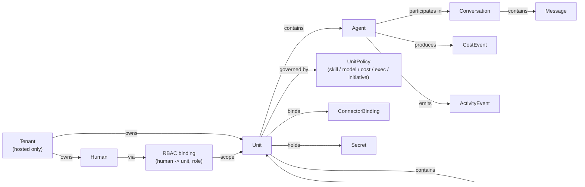

# Web Portal UX Exploration

> **Status:** Proposed — design direction for discussion. This is intentionally a direction doc, not a final spec. Expect iteration before individual workflows are implemented.
>
> **Closes:** [#406](https://github.com/savasp/spring-voyage/issues/406)
>
> **Unblocks (implementation issues that should cite this doc):** [#392](https://github.com/savasp/spring-voyage/issues/392) drill-down views, [#393](https://github.com/savasp/spring-voyage/issues/393) RBAC management UI, [#394](https://github.com/savasp/spring-voyage/issues/394) cost rollup.
>
> **Related:** [ADR 0001 — Web portal rendering strategy](../decisions/0001-web-portal-rendering-strategy.md), [Architecture: CLI & Web](../architecture/cli-and-web.md), [Guide: Observing](../guide/observing.md).

---

## 1. Scope & non-goals

**In scope.**

- Portal information architecture for both the standalone (OSS) build and the hosted (multi-tenant) build.
- Direction for six key workflows: unit creation, agent monitoring, conversation interaction, cost management, RBAC (hosted), policy configuration.
- Standalone-vs-hosted divergences.
- Responsive / accessibility posture.
- Technology-stack decision.
- CLI-UI parity analysis — every proposed portal action mapped to an existing or gap CLI command.

**Not in scope.**

- Pixel-perfect visual design or Figma prototypes.
- Code changes to the actual portal.
- Features not yet shipped on the platform (marked clearly as "future" where referenced for context).
- Branding, marketing site, public documentation site.

Every workflow in Section 5 includes a **Before** subsection (what exists today) and a **Proposed direction** subsection. The aim is to show the smallest coherent set of portal shifts that unlocks the blocked implementation issues without reshuffling the tech stack.

---

## 2. Baseline: what the portal is today

The portal lives in `src/Cvoya.Spring.Web/`. It is a Next.js App Router project (`next@16`, `react@19`) configured for static export (`output: "export"`, see ADR 0001). Styling is Tailwind 4. Icons come from `lucide-react`. The API contract is consumed via `openapi-typescript` generated from `src/Cvoya.Spring.Host.Api/openapi.json`; the client is `openapi-fetch`.

### Routes that exist today

Walked `src/Cvoya.Spring.Web/src/app/`:

| Route                       | Purpose                                                                                                                                       |
| --------------------------- | --------------------------------------------------------------------------------------------------------------------------------------------- |
| `/`                         | Dashboard. Stats header (units / agents / cost / health) + unit cards + agent cards + recent activity timeline (polled every 10 s).           |
| `/units`                    | Unit list. Rows with delete confirmation; link into each unit's config.                                                                       |
| `/units/create`             | Five-step wizard: Details → Mode (template / scratch / YAML) → Connector → Secrets → Finalize.                                                |
| `/units/[id]`               | Unit detail with tabs: Agents, Sub-units, Skills, Connector, Secrets, Activity. Start/stop, delete, readiness, cost.                          |
| `/agents/[id]`              | Agent detail: info, cost, clones list with create form, budget, recent activity filtered to this agent (via SSE stream), initiative/metadata. |
| `/activity`                 | Full activity query page with filters (source, event type, severity) and pagination.                                                          |
| `/initiative`               | Per-agent initiative policy editor (levels, tier-1/tier-2 configs, allow/block actions, require-unit-approval).                               |
| `/budgets`                  | Tenant-wide budget plus per-agent budget rows.                                                                                                |

### Shared UI

- `components/sidebar.tsx`: left nav (Dashboard, Units, Activity, Initiative, Budgets) with a mobile drawer and light/dark theme toggle. No user chip, no tenant switcher, no search.
- `components/app-shell.tsx`: thin wrapper that composes the sidebar and main content pane.
- `components/ui/*`: card, button, badge, table, tabs, dialog, confirm-dialog, skeleton, input, toast. Modest shadcn-style primitives.
- `hooks/use-activity-stream.ts`: SSE subscription to `/activity/stream`.

### What's **missing** from the portal today (confirmed by walking the tree)

- No Conversations surface (no `/conversations` route, no chat UI).
- No Policies surface (only `/initiative` exists; `UnitPolicy`'s Skill / Model / Cost / ExecutionMode dimensions described in `docs/architecture/units.md` § "Unit Policy Framework" are not exposed anywhere).
- No RBAC / members UI (the existing "members" tab on `/units/[id]` lists **unit membership** — agents and sub-units — not humans / roles).
- No Auth / user-profile surface (no sign-in UI, no token management page; the OSS runs in daemon mode without auth per `docs/architecture/security.md`).
- No Connectors catalog page (only per-unit binding inside `/units/[id]` → Connector tab).
- No Packages / Templates browser (templates are picked inline inside the create-unit wizard).
- No global search, no command palette, no tenant switcher, no notifications inbox.
- No breadcrumbs — deep links rely on `ArrowLeft` "Back" affordances hard-coded per page.

These gaps are the raw material the proposal below operates on.

---

## 3. Information architecture (proposed)

### 3.1 Core entity graph



Two facts shape the IA:

1. **A unit is both a composition node and a governance boundary.** It owns members (agents or sub-units), a connector binding, secrets, an RBAC ACL (hosted), and a `UnitPolicy`. Everything a unit *does* — dispatch, cost, initiative — flows through policies attached to some unit the agent is a member of.
2. **An agent's identity crosses unit boundaries.** An agent can be a member of multiple units (M:N); its cost, activity, and conversations are agent-scoped primary, unit-scoped as a rollup.

The portal should therefore privilege **two navigation lenses**: *by unit* (organizational view) and *by agent* (operational view), with conversations cutting across both and costs rolled up to either axis.

### 3.2 Proposed top-level navigation

```
+------------------+----------------------------------------+
|  Spring Voyage   |   [search or cmd-palette]       [user] |
|                  |----------------------------------------|
|  Dashboard       |                                        |
|  Units       >   |   (main content pane)                  |
|  Agents      >   |                                        |
|  Conversations>  |                                        |
|  Activity        |                                        |
|  Costs           |                                        |
|  Policies        |                                        |
|  Connectors      |                                        |
|  Packages        |                                        |
|------------------|                                        |
|  [v] Settings    |                                        |
|      Tokens      |                                        |
|      People      |    (hosted adds: Tenant, Billing,      |
|      Packages    |     Members, Audit)                    |
+------------------+----------------------------------------+
```

Proposed changes from current sidebar (Dashboard / Units / Activity / Initiative / Budgets):

- Rename **Budgets → Costs** (costs are the primary surface; budgets are a tool within it). Budgets landing keeps, but promote total/breakdown.
- Add **Agents** as a first-class lens (today agents are only reachable by drilling from unit or dashboard).
- Add **Conversations** as a top-level surface — conversations are the artefact users most frequently want to inspect (unblocks #392's "conversation detail").
- Replace **Initiative** with a broader **Policies** surface covering all five `UnitPolicy` dimensions (Skill / Model / Cost / ExecutionMode / Initiative) plus the per-agent initiative policy that exists today. Initiative becomes a sub-view.
- Add **Connectors** and **Packages** as top-level browsers (catalogue of available connector types and installed packages / templates). Today these exist only inside modals.
- Add a **Settings** drawer at the bottom: tokens, personal profile, installed packages. In hosted mode this gains Tenant, Billing, Members, Audit.
- Add a **search / command palette** triggered by `/` or `Cmd-K` so power users can jump to any unit, agent, conversation, or CLI-equivalent action from anywhere.

### 3.3 Context rules

- **Breadcrumbs are mandatory** on any page two levels or deeper: `Units / engineering-team / backend / ada`. Today each page hard-codes an "← Back" chevron with inconsistent targets.
- **Cross-links are required, not optional.** Every unit card links to its conversations, costs, activity, policies. Every agent card links to its parent units and its conversations. Activity rows link to the agent / conversation that produced them (gap flagged in #392).
- **Object cards are the primary unit of IA.** A unit card, agent card, and conversation card should be reusable primitives (title, status, badge, quick actions, cost mini-sparkline, "open" affordance) — not bespoke layouts per page.

---

## 4. Standalone vs hosted — where they diverge

The OSS repository has no concept of a tenant (see `AGENTS.md` § "Open-Source Platform & Extensibility", `docs/architecture/security.md`). The private Spring Voyage Cloud repository layers tenancy, OAuth/SSO, billing, and premium features on top via git submodule and DI overrides.

The portal must cleanly support both. The core move: **all tenant-aware surfaces are mounted by the hosted build at known extension points, not bolted into the OSS routes.**

| Aspect                | Standalone (OSS)                                                             | Hosted (Cloud)                                                                                        |
| --------------------- | ---------------------------------------------------------------------------- | ----------------------------------------------------------------------------------------------------- |
| Authentication        | None (daemon mode, single implicit user).                                    | OAuth / SSO required before any route. Session cookie + refresh flow.                                 |
| Tenant switcher       | Hidden — there's no tenant.                                                  | Top-bar switcher (left of user chip) listing tenants the user has access to.                          |
| User chip             | Shows `local` placeholder, no avatar.                                        | Avatar + name + "Sign out".                                                                           |
| Billing               | Absent.                                                                      | Settings → Billing: plan, usage, invoices, payment method, budget alerts.                             |
| People / Members      | Absent (RBAC exists in core but has no UI target in OSS — see §5.5).         | Tenant-scoped People directory + per-unit Members tab with owner/operator/viewer role dropdowns.      |
| Audit log             | Absent (OSS emits activity events but not an explicit "audit" view).         | Settings → Audit: sign-ins, role changes, token issuance, policy overrides.                           |
| Onboarding            | Empty-state CTAs on dashboard ("Create your first unit").                    | First-run wizard: sign in → create or join tenant → invite teammates → create first unit.             |
| Tokens                | Token page present (CLI parity); no enforcement in daemon mode.              | Token page is identity-scoped; shows tokens, last-used, scopes, tenant attribution.                   |
| Feature flags         | None.                                                                        | Plan-gated features (e.g., premium connector types, custom models) show lock icon + upgrade CTA.      |
| Notifications         | Toasts + activity page.                                                      | Additionally: per-human notification settings (email / Slack / webhook) per the security doc.         |
| Theme                 | Light / dark toggle.                                                         | Same, plus tenant branding (logo in sidebar header) for enterprise plans.                             |

### Cleanly extending OSS into hosted

The portal should be structured so the private repository can extend it **without patching** OSS files:

1. **Extension slots.** Define named React component slots in the OSS shell (`TopBarLeft`, `TopBarRight`, `SidebarFooter`, `SettingsNav`, `UnitDetailHeader`). The OSS build renders a default — `null` for most tenant-only slots. The hosted build supplies alternates via a typed `PortalExtensions` context at shell boot.
2. **Route manifest.** Expose an `AdditionalRoutes` export (array of `{ path, element }`) that the hosted build can merge into the App Router at build time. Tenant / Billing / Members / Audit pages live entirely in the private repo.
3. **Auth adapter.** OSS ships an `AuthAdapter` with a no-op implementation and a typed `useSession()` hook that returns `{ user: "local" }`. Hosted swaps in an OAuth-backed adapter without touching call sites.
4. **API client seam.** The generated `openapi-fetch` client is wrapped in a `withAuth(client, adapter)` decorator so the hosted build attaches bearer tokens and tenant headers in one place.
5. **Tenancy-unaware OSS code.** No OSS component may reference `tenantId`. Tenant scoping is surfaced via the API client decorator (same pattern as the backend's tenant-scoped repository wrappers).

This mirrors the backend's DI pattern: OSS defines contracts and a single-tenant default; the private repo substitutes a tenant-aware implementation. If we honour the same rules on the frontend, the private repo never has to fork a page just to add a "Switch Tenant" chip.

---

## 5. Key workflows

Each workflow is presented as **Before → Proposed**, with ASCII wireframes and, where useful, a mermaid diagram of the flow.

### 5.1 Unit creation

**Before.** `/units/create` is a 5-step wizard (Details → Mode → Connector → Secrets → Finalize). It already supports Template, YAML import, and scratch. CLI parity exists through `spring unit create` and `spring apply -f manifest.yaml`. Each step is a long form; no preview of what gets created; connector config is modal-ish inside the page.

**Shortcomings.** All five steps treat every field as equally important. Most users arrive wanting one of two things: (a) "run a pre-built team", (b) "apply a YAML manifest the CLI also accepts". The current wizard front-loads unit-level metadata before asking *what kind of unit* the user is creating, so a template mode's manifest-supplied name ends up being entered twice.

**Proposed direction.** Invert the flow. Ask *what* first:

```
+------------------------------------------------------------+
| Create a unit                                     [ X ] |
|------------------------------------------------------------|
|                                                          |
|  How would you like to start?                            |
|                                                          |
|  +------------------+  +------------------+  +---------+ |
|  | From template    |  | From YAML        |  | Scratch | |
|  | Pre-built teams  |  | Import manifest  |  | Empty   | |
|  +------------------+  +------------------+  +---------+ |
|                                                          |
|  (once selected, remaining steps are inlined below)      |
|                                                          |
|   Template:  [ software-engineering/engineering-team v ] |
|                                                          |
|   Name (override): [ engineering-team        ]  optional |
|   Display name:    [ Engineering Team       ]           |
|                                                          |
|   [ + Connector (optional)      GitHub           v ]     |
|   [ + Secrets (optional)        0 secrets       v ]     |
|   [ + Policy preset (optional)  default         v ]     |
|                                                          |
|   Preview:                                               |
|   > unit: engineering-team                               |
|   > members: [ada, grace, linus]                         |
|   > connector: github (configured)                       |
|                                                          |
|   [ Cancel ]                            [ Create unit ]  |
+------------------------------------------------------------+
```

Key changes:

- Mode selector first, at the top, as three big cards.
- Optional steps (Connector, Secrets, Policy preset) collapse to accordion sections. The template's own defaults prefill, so the user can just click "Create".
- Right-hand (or bottom) panel shows the YAML that *would* be applied. This is the exact CLI invocation (`spring apply -f ...`) — we show it literally so the user can copy it and understand the CLI equivalent. This is the cheapest CLI-parity nudge we can build.
- **Policy preset** is new: the user picks `default` / `cost-capped` / `restricted-models` / `custom`. A `custom` choice drops into the per-dimension editor described in §5.6.

**CLI parity.** `spring unit create`, `spring apply -f`. Gap: `spring unit create-from-template` (the API supports it — the CLI currently doesn't surface template mode as a first-class command; flagged below).

### 5.2 Agent monitoring

**Before.** `/` dashboard has agent cards with role + last-activity snippet. `/agents/[id]` shows info, cost card, clones, budget, activity filtered to the agent via SSE, plus an initiative panel. There's no "agents list" page — the only way to reach an agent is by dashboard card or a deep link.

**Proposed direction.** Add an `/agents` list page as peer of `/units`. The agent detail becomes the monitoring hub:

```
+-------------------------------------------------------------+
|  Agents                   [search...]   [ filter: unit v ]  |
|-------------------------------------------------------------|
|  name           role            units           cost/7d     |
|  ada            backend         eng-team        $4.12       |
|  grace          frontend        eng-team        $1.88       |
|  linus          ops             eng-team        $0.44       |
|  amelia         researcher      (none)          $0.00       |
+-------------------------------------------------------------+
```

Agent detail page, redesigned around three stable rails:

```
+--------------------------------------------------------------+
| < Agents / ada                             [Stop] [Clone] [v]|
|--------------------------------------------------------------|
| STATUS  Running     UNITS engineering-team                    |
| MODEL   claude-4    INITIATIVE  Attentive (max Proactive)     |
| COST (7d) $4.12  TOKENS 1.2M in / 400k out                    |
|--------------------------------------------------------------|
| [ Overview ] [ Conversations ] [ Activity ] [ Policies ]     |
| [ Clones   ] [ Cost           ] [ Budget   ] [ Config ]      |
|--------------------------------------------------------------|
|                                                              |
|  Overview                                                    |
|  - Current task: "Review PR #42" (conversation c-1834)       |
|  - Inbox depth: 3 messages                                   |
|  - Last 24h: 12 decisions, 2 errors, $0.88                   |
|  - Memory: 342 entries, last updated 5 min ago               |
|                                                              |
|  Recent conversations                                        |
|  c-1834  Review PR #42     4 min ago   active                |
|  c-1830  Answer #41        1 h ago     completed             |
|  c-1811  Daily standup     9 h ago     completed             |
|                                                              |
+--------------------------------------------------------------+
```

Key changes:

- Status rail (fixed top) always answers "what is this agent *doing right now* and *what does it cost*".
- Tabs extend the existing set with **Conversations** (currently missing) and **Policies** (read-only view of inherited unit policies).
- Each activity row deep-links to its conversation. This closes the gap flagged in #392.

**CLI parity.** `spring agent list`, `spring agent status`, `spring activity stream --agent ...`, `spring agent delete`. Gap: no `spring agent clone create` — the portal has a create-clone form but there is no CLI equivalent today. This is a parity gap to file.

### 5.3 Conversation interaction

**Before.** *There is no conversation surface in the portal today.* The architecture already defines conversations (messages between agents, with role attribution and outcomes — see `docs/architecture/messaging.md`) and the API exposes them, but the UI has no route. The CLI ships `spring message send` — there is no CLI conversation-read command either (shared gap).

**Proposed direction.** Add `/conversations` (list) and `/conversations/[id]` (detail). Two personas:

1. **Observer.** A human who wants to read what agents said to each other — the most common case.
2. **Participant.** A human who wants to send a message into the conversation (available once the human has send-permission on the target agent or unit).

Conversations list:

```
+--------------------------------------------------------------+
| Conversations                  [filter: unit v] [status v]   |
|--------------------------------------------------------------|
| c-1834  Review PR #42       ada <-> grace     active    4m   |
| c-1830  Answer #41          ada              completed  1h   |
| c-1821  Triage bug #38      ada, grace, savasp active   3h   |
| c-1811  Daily standup       unit:eng-team    completed  9h   |
+--------------------------------------------------------------+
```

Conversation detail:

```
+--------------------------------------------------------------+
| < Conversations / c-1834       [ Status: active ]  [ Close ] |
|--------------------------------------------------------------|
| Participants:  ada (backend), grace (frontend), savasp (you) |
| Unit:          engineering-team                              |
| Origin:        GitHub PR #42                                 |
| Cost so far:   $0.31                                         |
|--------------------------------------------------------------|
|                                                              |
|  [ada   ]  Starting review. Checking test coverage.  2:03 PM |
|            tool_call: run_tests(backend/)                    |
|            tool_result: 142 pass, 0 fail                     |
|                                                              |
|  [ada   ]  Coverage looks good. Lint check next.      2:04   |
|                                                              |
|  [grace ]  Frontend tests also clean on my end.       2:05   |
|                                                              |
|  [savasp]  Looks good to me — ship it. (you)          2:06   |
|                                                              |
|                                                              |
|--------------------------------------------------------------|
|  Send message as:  [ savasp v ]                              |
|  [                                                         ] |
|  [ Compose...                                      ] [Send] |
+--------------------------------------------------------------+
```

Key changes:

- Messages render with role attribution, tool-call summaries, and outcomes. Tool I/O is collapsed by default; click to expand.
- A conversation shows its **origin** — the GitHub issue, CLI invocation, connector event, or message that started it. The conversation can always link back.
- The compose box is only rendered when the human has permission to send — checked via the permission service. In OSS (no auth), it is always available. In hosted, it respects role.
- Conversations must support **real-time updates** via SSE (the platform already emits `MessageSent` / `MessageReceived` activity events — we subscribe and patch the thread).

**CLI parity.** Gaps:

- `spring conversation list` — does not exist.
- `spring conversation show <id>` — does not exist.
- `spring message send` exists; it can target agent or unit addresses. That is effectively "compose into a conversation" but there's no way today to thread into an *existing* conversation from the CLI.

These are parity gaps to file (see §9).

### 5.4 Cost management

**Before.** `/budgets` page sets tenant budget + per-agent budgets. The dashboard stats header shows total cost as a single number. Cost breakdown per unit / per agent / per model is not visualised anywhere.

**Proposed direction.** Replace `/budgets` with `/costs`. The page becomes the cost rollup that #394 asks for:

```
+--------------------------------------------------------------+
| Costs                       [24h][7d*][30d][custom]          |
|--------------------------------------------------------------|
|  Total       $31.44   ^  up 18% week-over-week               |
|  Budget used 62% of $50 monthly     [ Edit budget ]          |
|                                                              |
|  +------------------ spend over time -------------------+    |
|  |                                                     |    |
|  |    .__. .__.                                        |    |
|  |   /    V    \___  _.-'``'-._                        |    |
|  |__/              \/          `-.                     |    |
|  +-----------------------------------------------------+    |
|                                                              |
|  By unit                           By agent                  |
|  engineering-team  $22.10          ada        $10.02         |
|  ops-team          $ 6.44          grace      $ 5.91         |
|  research          $ 2.90          linus      $ 3.17         |
|                                    amelia     $ 2.90         |
|                                                              |
|  By model                          By source                 |
|  claude-sonnet-4   $27.02          work         $22.08       |
|  gpt-4o            $ 4.42          initiative   $ 7.36       |
|                                    tier1 screen $ 2.00       |
|--------------------------------------------------------------|
|  Budgets                                                     |
|  Tenant      $50 / month        62% used      [ Edit ]       |
|  eng-team    $30 / month        71% used      [ Edit ]       |
|  ada         $20 / month        50% used      [ Edit ]       |
+--------------------------------------------------------------+
```

- Sparklines on unit / agent detail cards (per-detail-page rollup, required by #394).
- Cost-policy breaches surface with a coloured badge linked to the `CostPolicy` that tripped.
- The cost page is filterable by window, unit, agent, and model — matches CLI `spring cost summary --unit ... --period ...`.

**CLI parity.** `spring cost summary`, `spring cost breakdown`, `spring cost budget` — all exist per `docs/guide/observing.md`. Gap: there is no `spring cost set-budget` CLI command today despite the portal having an "Edit budget" action. Parity gap to file.

### 5.5 RBAC (hosted-specific)

**Before.** The RBAC primitives exist in core (`IPermissionService`, unit-scoped owner / operator / viewer roles, `humans:` block in unit YAML). The *standalone* portal has no RBAC UI. This is stated explicitly in #393 and is consistent with walking the tree: no `people/`, no `members/`, no per-unit "humans" tab.

**Proposed direction.** Add the Members surface **in the hosted extension**, not in OSS. OSS continues to rely on `spring apply -f unit.yaml` with a `humans:` block; the hosted portal exposes it via a Members tab on `/units/[id]` plus a tenant-scoped People directory.

Members tab on unit detail (hosted build):

```
+--------------------------------------------------------------+
| engineering-team / Members                        [+ Invite] |
|--------------------------------------------------------------|
|  name          email              role         notify        |
|  savasp        savas@...           owner        slack,email   |
|  alice         alice@...           operator     email         |
|  bob           bob@...             viewer       —             |
|                                                              |
|  Audit (last 5)                                              |
|  - alice promoted to operator by savasp     3 days ago       |
|  - bob invited as viewer by savasp          7 days ago       |
+--------------------------------------------------------------+
```

Invite dialog:

```
+--------------------------------------------------+
| Invite to engineering-team                       |
|--------------------------------------------------|
|  Email:  [ alice@example.com            ]        |
|  Role:   (o) owner  ( ) operator  ( ) viewer     |
|  Send invite email to join if not already member |
|    [x] yes                                       |
|                                                  |
|  [ Cancel ]                      [ Send invite ] |
+--------------------------------------------------+
```

Policy:

- Role-change dropdown is disabled unless the viewer is an owner. The frontend respects the viewer's own role (see #393 acceptance), but the server always re-checks.
- Every role change writes an audit event. The "Audit (last 5)" panel reads from the audit endpoint.

**CLI parity.** `spring unit humans add|remove|list` (gap — the observing guide mentions `spring unit humans add` syntax but the CLI source today lacks the `humans` command). Parity gap to file.

**Extension point.** The entire Members surface lives in the hosted route manifest; OSS ships neither the tab nor the dialog. OSS users who want humans-on-units today use `spring apply -f unit.yaml`.

### 5.6 Policy configuration

**Before.** Only per-agent initiative is surfaced (`/initiative`). Four of the five `UnitPolicy` dimensions (Skill / Model / Cost / ExecutionMode) are not exposed in the UI at all, even though the core enforces them.

**Proposed direction.** A unified Policies surface at `/policies` with per-unit drill-down, and a **Policies tab on `/units/[id]`** that lets the owner edit the unit's `UnitPolicy` in-place.

Policies tab on unit detail:

```
+--------------------------------------------------------------+
| engineering-team / Policies                                  |
|--------------------------------------------------------------|
|                                                              |
|  SKILL    Allowed: [github, filesystem, http]                |
|           Blocked: [shell]                       [ Edit ]    |
|                                                              |
|  MODEL    Allowed: [claude-sonnet-4, gpt-4o]                 |
|           Blocked: (none)                        [ Edit ]    |
|                                                              |
|  COST     Per-invocation  $0.50    cap                       |
|           Per-hour        $5.00                               |
|           Per-day         $25.00                 [ Edit ]    |
|                                                              |
|  EXEC     Allowed: [Auto]          Forced: (none)[ Edit ]    |
|  MODE                                                        |
|                                                              |
|  INITI-   Blocked actions: [agent.spawn]                     |
|  ATIVE    Allowed actions: (none = default)     [ Edit ]    |
|                                                              |
|  Effective policy (this unit inherits from: /)               |
|  > (shows the merged decision tree)                          |
+--------------------------------------------------------------+
```

Edit dialog for a single dimension (example: Skill):

```
+-------------------------------------------------------+
| Edit Skill policy — engineering-team                  |
|-------------------------------------------------------|
|  Allowed skills (empty = allow all):                  |
|    [x] github       [x] filesystem                    |
|    [x] http         [ ] shell                         |
|    [ ] dapr-pubsub                                    |
|    [+ add skill by name   ]                           |
|                                                       |
|  Blocked skills (always deny):                        |
|    [x] shell                                          |
|                                                       |
|  Preview impact:                                      |
|   - ada: 3 skills enabled (was 4 — shell blocked)     |
|   - grace: 2 skills enabled (unchanged)               |
|                                                       |
|  [ Cancel ]                              [ Save ]     |
+-------------------------------------------------------+
```

Key changes:

- One tab, five panels, one shape: "allow list / block list / caps". The repetition is a feature — once the user learns one dimension, the others follow.
- An **Effective policy** block shows the final merged decision, including any deny from a parent unit. This matches the enforcement chain described in `docs/architecture/units.md` ("First deny short-circuits").
- Cost caps link back to the Costs page so the user can see their current spend relative to the cap.

**CLI parity.** The CLI does not expose unit-policy editing commands today — `spring unit policy set-skill ...` and friends don't exist. That's a major parity gap given the policy framework is in the core. Parity gap to file.

---

## 6. Responsive / mobile considerations

The sidebar already has a mobile drawer (see `components/sidebar.tsx`). Extend the mobile story:

- **Dashboard, Units, Agents, Conversations, Activity, Costs** should render on a phone as a single-column stack with the stats header as a 2x2 grid (not 1x4). Large tables collapse to card lists.
- **Detail pages with tabs** (unit, agent, conversation) should convert the tab bar into a horizontal scrollable chip row. Each tab's content stays single-column.
- **Wizards** (create unit, invite member) should render each step as a full-screen modal on mobile. No progress rail, just a step title + Back/Next.
- **Long forms** (policy editor, secrets tab) should use disclosure (accordion) rather than parallel columns.
- **Write-heavy actions** (send message in a conversation) should keep the compose box docked at bottom with a safe-area inset.
- **Touch targets** minimum 44x44 px. The current `ghost` icon buttons are borderline — should be audited.
- **Charts** should have a mobile variant that drops to sparkline-only.

The portal is a **support surface**, not a primary interaction for on-the-go users. The minimum bar: read-only monitoring, approve / reject human-in-the-loop steps, send a short reply to a conversation. Heavy configuration work is expected on desktop.

---

## 7. Accessibility

Baseline posture — the portal should match **WCAG 2.1 AA**.

- **Colour contrast.** Status dots (green/yellow/red) must never be the only signal. Pair every colour with a text label or icon — the current dashboard does this for unit status badges, should audit the rest.
- **Keyboard navigation.** All interactive elements tab-reachable. Command palette (`Cmd-K`) provides a keyboard-first path to any unit, agent, conversation, or CLI-equivalent action.
- **Screen reader labels.** Every icon-only button needs `aria-label` (today's sidebar toggle does — should audit per-page icons like agent delete / clone create).
- **Focus visible.** Current Tailwind config uses `focus-visible:ring-1 focus-visible:ring-ring` — keep. Explicit focus outlines on card links (Dashboard's unit cards today wrap whole cards in `<Link>` without a clear focus style).
- **Motion.** Polling / SSE updates must not shift layout abruptly. Respect `prefers-reduced-motion` for any animation we add.
- **Forms.** Every input labelled explicitly (`<label>` with `for`, not placeholder-only). The create-unit wizard mostly does this; the activity filter dropdowns mix `aria-label` patterns — should normalise.
- **Live regions.** The activity stream should announce new critical events (severity `Error`) via `aria-live="polite"` — today it silently appends.
- **Language.** `html lang="en"` already set.
- **Timeouts.** No session timeout in OSS. In hosted, any auth-timeout re-prompt must include a warning before forcing a redirect.

An accessibility audit should be commissioned after the next major visual change; it is out of scope to enumerate violations here.

---

## 8. Technology approach — recommendation

**Recommendation: stay on Next.js (App Router) + Tailwind, static export.**

Reasoning:

1. **ADR 0001 is recent (2026-04-13) and its constraints still hold.** The portal is a thin client over the API. No server-side data dependency. Static export gives OSS deployers the simplest possible hosting story (nginx / S3 / CDN / bundled in the container image). Moving to SSR would push every self-hoster onto a Node runtime and gain us nothing the browser couldn't already render.
2. **The extension model works.** Private Spring Voyage Cloud can consume the same Next.js app as a git submodule and layer tenant-aware middleware + route extensions without touching OSS files — if we honour the extension slots proposed in §4. No tech switch is needed to unlock hosted.
3. **The component vocabulary is in good shape.** `components/ui/*` is a reasonable shadcn-style primitive set. Tailwind 4 is current. `openapi-fetch` + `openapi-typescript` gives us fully-typed API calls. Replacing any of this would cost weeks with no user-facing benefit.
4. **Rejected alternatives.**
   - *Remix / React Router 7* — strictly strictly better for server-data workflows; we don't have server-data workflows.
   - *SvelteKit / SolidStart* — smaller bundle, but a full rewrite, loss of openapi-fetch ergonomics, and the team's React muscle memory.
   - *Blazor* — native .NET fit, but the portal is already shipping as static assets that integrate cleanly into the existing Dockerfile. Switching runtimes to match the backend language would add a new CLR dependency to the web tier for no clear win.
   - *Static marketing-style site + separate SPA* — this *is* the current architecture (SPA, no marketing copy); no change needed.

**Small adjustments to propose, not a rewrite.**

- Introduce a lightweight **data-fetching layer** (TanStack Query or similar) to replace the ad-hoc `useEffect` + `setInterval` polling we see in `page.tsx` and `/units/[id]` pages. This isn't a framework switch — just a library add that gives us cache invalidation, retries, and deduplication.
- Introduce a **command palette** (e.g. `cmdk` package) to host the CLI-equivalent actions from §3.2.
- Adopt **Vitest browser mode** (we already use Vitest) or Playwright for accessibility smoke tests. The current `vitest` config is JSDOM only — not sufficient for keyboard / screen-reader regression.

If (and only if) the revisit criteria in ADR 0001 become true (SEO for public pages, per-request personalization, streaming, server-held credentials), we reopen ADR 0001 and switch to `output: "standalone"`. That path is documented and cheap.

---

## 9. CLI-UI parity: gaps surfaced

Every workflow above was matched against `src/Cvoya.Spring.Cli/Commands/*.cs`. Gaps to file as follow-up issues:

| # | Gap                                                                                   | Surface it blocks               | Severity |
|---|---------------------------------------------------------------------------------------|---------------------------------|----------|
| 1 | No `spring conversation list` / `spring conversation show <id>` commands.             | §5.3 Conversation UI            | High     |
| 2 | No CLI way to send a message into an *existing* conversation thread (only to address).| §5.3 participant flow           | High     |
| 3 | No `spring agent clone create` CLI (portal has it).                                   | §5.2 agent detail Clone action  | Medium   |
| 4 | No `spring cost set-budget` CLI (portal has Edit budget).                             | §5.4 budgets                    | Medium   |
| 5 | No `spring unit humans add|remove|list` CLI despite docs referencing it.              | §5.5 Members (hosted)           | High     |
| 6 | No `spring unit policy ...` CLI — none of Skill/Model/Cost/ExecMode/Initiative exist. | §5.6 Policies                   | High     |
| 7 | No `spring unit create-from-template` first-class CLI (API exists).                   | §5.1 Unit creation              | Low      |
| 8 | No `spring connector ...` catalog / bind CLI surface.                                 | §3.2 Connectors top-level       | Medium   |
| 9 | No `spring package ...` list / install CLI despite `spring images list` hint in docs. | §3.2 Packages top-level         | Low      |

These are implementation gaps, not design gaps. They should be filed as individual issues once this direction is accepted. The hard rule from the repo's memory (UI and CLI stay in parity) means these must ship together with the corresponding portal surfaces, not before / after.

---

## 10. What this doc explicitly defers

- **Final visual design.** No colour system, typography scale, or component-level spec. Those follow once this direction is accepted.
- **Onboarding copy.** Empty-state text and first-run walkthrough are placeholder; real copy is a content-design pass.
- **Pricing-gated features.** Hosted plan tiers are not designed here — §4 only identifies where the "upgrade" affordance sits.
- **Offline / degraded modes.** The portal assumes the API is reachable. A fuller offline story (e.g. local CLI-driven mode with IndexedDB cache) is worth considering but out of scope.
- **Public / marketing surfaces.** No design for a non-authenticated landing page (hosted) or docs site integration.
- **AI-generated summaries in the UI.** A tempting addition — e.g. auto-summarise a conversation, auto-explain why a policy tripped — but every feature must map to already-shipped platform capability per the ground rules. Marked as future.
- **Multi-window / pop-out conversation view.** Useful for power users; deferred until usage justifies the complexity.

---

## 11. Proposed next steps

1. Review + revise this direction. Iteration is expected; this document is a branch point, not a decision.
2. File the CLI parity follow-up issues (§9) — one issue per gap, each referencing the workflow it blocks.
3. Re-scope #392 / #393 / #394 against this direction:
   - #392 absorbs the conversation detail page (§5.3) and IA breadcrumb rules (§3.3).
   - #393 scopes to the *hosted* Members extension (§5.5) and stays out of OSS routes.
   - #394 aligns with the `/costs` redesign (§5.4).
4. Split a small "plumbing PR" to introduce the extension slots (§4) so the hosted portal can start consuming them in parallel with OSS feature work.
5. Decide on TanStack Query adoption as a follow-up RFC; non-blocking.
