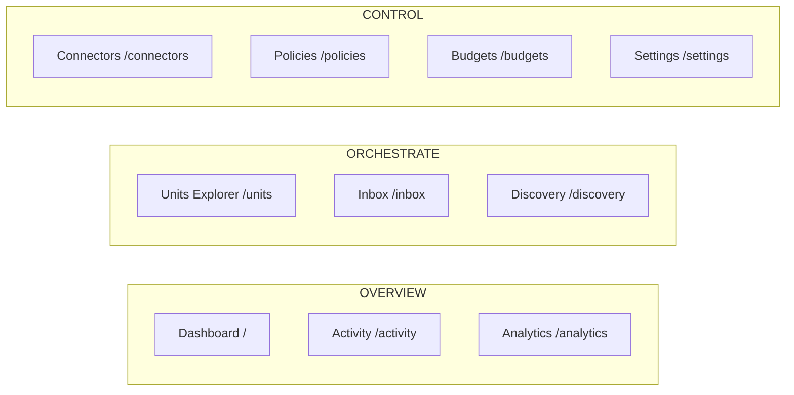

# Spring Voyage Portal — Design System

> **Status.** v2.0 — describes the portal as shipped on `main`. Every retained surface now speaks the v2 design language; no route ships tokens-only. Capability follow-ups (keyboard tree navigation, write API on the Memory tabs, real traces endpoint, lazy tenant-tree expansion) are scoped to v2.1 and noted where relevant.
>
> **Scope.** `src/Cvoya.Spring.Web/` — the Next.js 16 / React 19 / Tailwind 4 portal. The CLI and marketing surfaces consume the same token catalog (`--sv-*`) but are out of scope for this document.
>
> **Authority.** Read alongside `AGENTS.md` and `CONVENTIONS.md`. This file describes *what the code paints today*; update it in the same PR that changes a visual pattern.

---

## 1. Overview

The portal is a dark-first operations console for a platform engineer watching agents and units run. Ethos: **calm, terse, information-dense**.

- A neutral slate/zinc canvas so coloured signals (status, severity, cost) stay legible without fighting each other.
- A single blue accent (`--color-primary`, same as `--sv-primary`) for primary actions, active nav, links, and focus rings.
- A small brand-extension palette (voyage cyan, blossom pink, starfield / hull) used exclusively for marketing-derived chrome — logo, halo, brand-forward highlights.
- Short copy. No marketing voice. Empty states explain the next action in one sentence.
- Cards, tables, and tree rows over hero sections; lucide line icons at 3.5–5×5 for context.

The portal is **shadcn-flavoured** (class-variance-authority variants, `cn()` helper, `components/ui/*` primitives) but deliberately trimmed — no Radix-for-every-primitive. Dialogs are focus-trapped `<div>`s, tabs are an in-house ARIA-compliant implementation, and sidebar chrome is custom.

Canonical surfaces:

- **`/units`** — the Explorer. The single place to browse units, agents, and tenant-level rollups. Selection and active tab live in the URL.
- **`/settings`** — a dedicated hub route. Tenant-panel cards plus tile links into the catalog/admin subpages.
- **`/inbox`**, **`/discovery`**, **`/analytics`** and the Control surfaces (`/connectors`, `/policies`, `/budgets`) stay top-level. See § 3.

---

## 2. Tokens and Tailwind 4 `@theme` mapping

Defined in [`src/app/globals.css`](src/app/globals.css). Two token families coexist:

1. **Tailwind utility tokens** (`--color-*`, `--font-*`, `--radius-*`) inside a `@theme` block. Tailwind 4 derives its utility classes from these — every `--color-X` generates `bg-X`, `text-X`, `border-X`, `ring-X`, `from-X`, etc.; `--font-sans` drives `font-sans`; `--radius-lg` drives `rounded-lg`.
2. **Spring Voyage design-system tokens** (`--sv-*`) — a mirror catalog used by surfaces that can't reach through Tailwind (hand-written CSS for the terminal skin, marketing pages, CLI-adjacent chrome). Values are identical to the `@theme` palette so `bg-background` and `background: var(--sv-bg)` paint the same pixel.

### 2.1 Surface + action palette (dark default)

| Tailwind token                 | `--sv-*` mirror    | Hex       | Role                                                                 |
| ------------------------------ | ------------------ | --------- | -------------------------------------------------------------------- |
| `--color-background`           | `--sv-bg`          | `#09090b` | Page canvas. Pinned as the `themeColor` meta.                        |
| `--color-foreground`           | `--sv-fg`          | `#fafafa` | Default text.                                                        |
| `--color-card`                 | `--sv-card`        | `#0a0a0f` | Card, dialog, toast, sidebar surface.                                |
| `--color-card-foreground`      | `--sv-card-fg`     | `#fafafa` | Text on cards.                                                       |
| `--color-popover`              | `--sv-popover`     | `#0a0a0f` | Floating panel reserve — no popover primitive ships today.           |
| `--color-primary`              | `--sv-primary`     | `#3b82f6` | Primary action — buttons, active nav, links.                         |
| `--color-primary-foreground`   | `--sv-primary-fg`  | `#fafafa` | Text on primary surfaces.                                            |
| `--color-secondary`            | `--sv-secondary`   | `#1e1e2e` | Secondary buttons and badges.                                        |
| `--color-muted`                | `--sv-muted`       | `#18181b` | Skeleton loaders, tab-list background, inline `<pre>`.               |
| `--color-muted-foreground`     | `--sv-muted-fg`    | `#a1a1aa` | Labels, helper copy, inactive nav.                                   |
| `--color-accent`               | `--sv-accent`      | `#1e1e2e` | Hover surface for ghost / outline affordances.                       |
| `--color-destructive`          | `--sv-destructive` | `#ef4444` | Destructive button, error badge.                                     |
| `--color-border`               | `--sv-border`      | `#27272a` | Card borders, dividers, inputs, scrollbar thumb.                     |
| `--color-input`                | `--sv-input`       | `#27272a` | Input / select border.                                               |
| `--color-ring`                 | `--sv-ring`        | `#3b82f6` | Focus ring (matches primary).                                        |
| `--color-success`              | `--sv-success`     | `#22c55e` | Running / healthy badge.                                             |
| `--color-warning`              | `--sv-warning`     | `#eab308` | Starting / degraded badge.                                           |
| `--color-info`                 | `--sv-info`        | `#3b82f6` | Info-severity log rows.                                              |
| `--color-debug`                | `--sv-debug`       | `#a1a1aa` | Debug-severity log rows.                                             |
| `--color-brand`                | `--sv-primary`     | `#3b82f6` | Intent alias — `bg-brand` reads as "paint this brand-action blue".   |
| `--color-brand-fg`             | `--sv-primary-fg`  | `#fafafa` | Text on brand surfaces.                                              |

### 2.2 Brand-extension palette

Marketing-derived hues named after the design assets they originated from — `voyage` (halo cyan), `blossom` (cherry-blossom sail), `starfield` / `hull` (logo backdrop). Exposed both as Tailwind utilities (`bg-voyage`, `text-blossom-deep`) and as `--sv-*` variables.

| Tailwind token          | `--sv-*` mirror          | Hex       |
| ----------------------- | ------------------------ | --------- |
| `--color-voyage`        | `--sv-voyage-cyan`       | `#5ee8ee` |
| `--color-voyage-soft`   | `--sv-voyage-cyan-soft`  | `#8ff4f7` |
| `--color-blossom`       | `--sv-blossom`           | `#f4b6c9` |
| `--color-blossom-soft`  | `--sv-blossom-soft`      | `#ffd7e1` |
| `--color-blossom-deep`  | `--sv-blossom-deep`      | `#d87a9a` |
| `--color-starfield`     | `--sv-starfield`         | `#0b1028` |
| `--color-starfield-mid` | `--sv-starfield-mid`     | `#182044` |
| `--color-hull`          | `--sv-hull`              | `#0f1530` |

Brand hues carry the same values across themes on purpose — the halo and sail are identity, not chrome. Use them sparingly: the mark's backdrop, a one-off brand-forward highlight. Never substitute for `--color-primary` in interactive UI.

### 2.3 Light theme

Re-points the `--color-*` utilities and `--sv-*` mirrors together. The brand-extension hues stay; only the dark hulls keep their dark values so the logo still paints correctly on a light canvas.

| Token                          | Light hex |
| ------------------------------ | --------- |
| `--color-background`           | `#ffffff` |
| `--color-foreground`           | `#09090b` |
| `--color-card`                 | `#ffffff` |
| `--color-primary`              | `#2563eb` |
| `--color-secondary` / `muted`  | `#f4f4f5` |
| `--color-muted-foreground`     | `#71717a` |
| `--color-destructive`          | `#dc2626` |
| `--color-border` / `input`     | `#e4e4e7` |
| `--color-success`              | `#16a34a` |
| `--color-warning`              | `#ca8a04` |

### 2.4 Theme switching

Two conventions coexist and are kept in lockstep:

- **`<html class="dark|light">`** — the portal's `ThemeProvider` hydrates from `localStorage` (`spring-voyage-theme`). The root layout ships `class="dark"` as the SSR default so tokens paint consistently before hydration.
- **`[data-theme=dark|light]`** — the design-kit convention used by marketing/docs. The `globals.css` selectors `[data-theme="dark"]` and `[data-theme="light"]` mirror the class selectors so both mechanisms reach the same cascade.

A terminal-skin opt-in exists: `[data-theme="light"][data-term="light"]` swaps the `--sv-term-*` tokens to the Solarized-light palette. Default in light mode is still the dark terminal — teams keep their consoles dark.

### 2.5 Status + severity palette (applied, not tokenised)

Small non-interactive signals use Tailwind palette colours directly for visual punch where semantic tokens would look muddy. Keep this mapping consistent when adding indicators:

| Concept                                      | Applied colour                                                 |
| -------------------------------------------- | -------------------------------------------------------------- |
| Unit status — `running`                      | `bg-success` dot / `text-success` icon                         |
| Unit status — `starting`                     | `bg-warning` dot                                               |
| Unit status — `paused`                       | `bg-warning/70` dot                                            |
| Unit status — `error`                        | `bg-destructive` dot                                           |
| Unit status — `stopped`                      | `bg-debug` dot                                                 |
| Activity severity — `Info`                   | `bg-info` / `text-info`                                        |
| Activity severity — `Warning`                | `bg-warning` / `text-warning`                                  |
| Activity severity — `Error`                  | `bg-destructive` / `text-destructive`                          |
| Activity severity — `Debug`                  | `bg-debug` / `text-debug`                                      |

Prefer the semantic `success` / `warning` / `destructive` tokens for badges and buttons. Use the brand-extension palette only for brand-facing chrome.

---

## 3. Geist typography

The portal ships `next/font`-hosted Geist Sans and Geist Mono via the [`geist`](https://vercel.com/font) package.

### 3.1 Wiring

`src/app/layout.tsx` imports `GeistSans` and `GeistMono` from `geist/font/{sans,mono}` and attaches their CSS-variable wrappers to `<html>`:

```tsx
<html className={`dark ${GeistSans.variable} ${GeistMono.variable}`}>
```

That registers `--font-geist-sans` and `--font-geist-mono` on the element. The `@theme` block in `globals.css` then maps them to the Tailwind family tokens, each with a full system-stack fallback so the portal still renders if the Geist payload is blocked:

```css
--font-sans: var(--font-geist-sans), system-ui, -apple-system, "Segoe UI", Roboto, sans-serif;
--font-mono: var(--font-geist-mono), ui-monospace, "SF Mono", Menlo, Consolas, monospace;
```

The `--sv-font-sans` / `--sv-font-mono` / `--sv-font-display` mirrors carry the same stacks for non-Tailwind consumers.

### 3.2 Default application

`<body>` sets `font-family: var(--font-sans)` directly (plus the `font-sans` utility class, so Tailwind-aware children inherit through the utility namespace as well). Monospace is opt-in via `font-mono` — used for code, addresses (`agent://`, `unit://`, `from://`), env pills, and numeric columns that want tabular-nums rhythm.

### 3.3 Scale and weight

Tailwind 4 defaults are unchanged; `--sv-*` mirrors carry named sizes for non-Tailwind callers.

| Utility       | Size / line-height | Typical use                                                       |
| ------------- | ------------------ | ----------------------------------------------------------------- |
| `text-[10px]` | 10px               | Env pill, sidebar section labels, timestamp pills.                |
| `text-xs`     | 12px / 16px        | Helper text, card footers, meta rows, badge contents.             |
| `text-sm`     | 14px / 20px        | Body text, table cells, buttons, description under H1.            |
| `text-lg`     | 18px / 28px        | Sidebar brand, section H2s, dialog titles.                        |
| `text-2xl`    | 24px / 32px        | Page H1s (`text-2xl font-bold`), stat-card values.                |

Weights used: `font-medium` (500), `font-semibold` (600), `font-bold` (700). `font-regular` is the default. Do not introduce heavier weights.

The `.sv-h1` / `.sv-h2` / `.sv-h3` / `.sv-body` / `.sv-helper` / `.sv-code` helper classes in `globals.css` provide the same roles for hand-written non-Tailwind surfaces (CLI-adjacent marketing copy).

---

## 4. Information architecture

Ten items, three groups. The sidebar groups them visually; a hosted `settings` cluster is reserved for tenant-management surfaces that the hosted build layers on via `registerExtension(...)` — empty in the OSS build.



The `NavSection` union (`src/lib/extensions/types.ts`) declares the four groups (`overview | orchestrate | control | settings`) and `NAV_SECTION_ORDER` fixes their render order. Every route registers its membership via `navSection`; the sidebar groups routes by section, sorts within a section by `orderHint`, and renders the group header from `NAV_SECTION_LABEL`.

**Why the groups split this way.**

- **Overview** answers "what's happening?" — at-a-glance and deep-dive views.
- **Orchestrate** answers "what do I need to act on right now?" — the Explorer (the single surface where units and agents are acted on), Inbox (conversations awaiting a response), Discovery (the expertise directory).
- **Control** answers "what's the long-lived configuration?" — Connectors, Policies, Budgets, Settings. These are deliberately top-level because they're high-touch admin surfaces checked daily; burying them inside `/settings` would add friction.

`/inbox` lives with Orchestrate (not Overview) because it reads better next to the surface where the operator takes the next action. `/analytics` stays in Overview as the canonical deep-dive surface: the Tenant Budgets and Tenant Activity tabs inside the Explorer carry *summary* rollups; `/analytics`, `/analytics/costs`, `/analytics/throughput`, and `/analytics/waits` carry the full charts, filters, and per-axis breakdowns.

### 4.1 Route manifest

The OSS manifest lives in `src/lib/extensions/defaults.tsx` as `defaultRoutes`. Every entry carries `{ path, label, icon, navSection, orderHint?, permission?, keywords?, description? }`. Hosted extensions layer in additional entries through `registerExtension({ routes })` without patching OSS files — the sidebar reads the merged registry.

Palette actions (`defaultActions`) live next to the route manifest and use the same type shape, plus an optional `explorerNodeId`. When that field is set, activating the entry dispatches into a mounted `<UnitExplorer>` via the `<ExplorerSelectionProvider>` bridge; when no Explorer is mounted it falls through to `router.push("/units?node={id}")` so the Explorer picks the node up on first render.

---

## 5. Brand mark

A theme-aware sailboat mark rendered as a circular badge. Both assets ship at `public/brand/sailboat-{dark,light}.png` and depict the same cherry-blossom-sailed boat on a starfield-and-water disc — `sailboat-dark.png` sits on a deep purple/starfield disc tuned for dark surfaces, `sailboat-light.png` sits on a pale blossom-tinted disc tuned for light surfaces. Square PNGs, intended to be rendered at the source aspect (1:1) so the disc reads as a self-contained mark rather than an inset illustration.

`<BrandMark>` (`src/components/brand-mark.tsx`) reads the active theme from `useTheme()` and switches assets via an exhaustive `switch` over the `Theme` union:

```tsx
const src = (() => {
  switch (theme) {
    case "light": return "/brand/sailboat-light.png";
    case "dark":  return "/brand/sailboat-dark.png";
  }
})();
```

The exhaustive form — no `default:` branch — means adding a third theme value to the `Theme` union produces a compile error here, so the asset set is forced to keep up with the union. The component forwards `size`, `label` (default `"Spring Voyage"` for the alt text), and `className`.

The mark appears in the sidebar header at `size={24}`. Do not use it as a decorative flourish — it's identity, not chrome.

---

## 6. Sidebar chrome

`src/components/sidebar.tsx` renders the fixed left nav at **224px** expanded / **56px** collapsed. The collapse preference persists in `localStorage` under `spring-voyage-sidebar-collapsed`.

Layout:

- **Header** — `<BrandMark size={24}>` + wordmark ("Spring Voyage") + monospace env pill (`env · local-dev` in the OSS build). Collapses to the mark alone.
- **Nav** — one `<SidebarSection>` per populated group in `NAV_SECTION_ORDER`. Each section carries a `text-[10px] uppercase tracking-wider` label (hidden when collapsed) above its links. Active route uses `bg-primary/10 text-primary font-medium`; inactive uses `text-muted-foreground hover:bg-accent`.
- **Footer** — user block (initial avatar + display name + email + success dot), theme toggle (`Sun` / `Moon` at `h-3.5 w-3.5`), version pill (`v{version}` from `/platform/info`), collapse toggle. A `sidebarFooter` shell slot lets extensions render content above the user block.

Mobile (`<md`): the sidebar becomes a slide-over drawer triggered from a fixed `Menu` button at `top-3 left-3`. Backdrop is `bg-black/50`; drawer closes on route change.

Collapsed-rail polish (56 px):

- **Tooltips replace the native title.** When collapsed, each nav link is wrapped in `<Tooltip>` (`src/components/ui/tooltip.tsx`) with `side="right"`. Hover opens after a 200 ms delay; focus opens immediately so keyboard users get the label without waiting. The bubble fades + translates in over 150 ms, and `Esc` / blur / `mouseleave` dismiss it. `aria-describedby` wires the anchor to the bubble only while visible. The tooltip is disabled (not rendered) when the sidebar is expanded.
- **Status-dot / unread pattern.** `NavItemBadge` anchors badges at the top-right of the icon (`absolute -top-1 -right-1`) with a `ring-2 ring-card` outline that keeps them legible against hover states and the group divider. Callers pass `{ ariaLabel, tone, count? }`; omit `count` for a status dot (`h-2 w-2`), supply a number for a numeric pill (caps at `99+`). Tones map to `primary | success | warning | destructive`. Every badge carries `data-slot="badge"` — the CSS/testing hook. The footer user block's success dot uses the same slot contract.
- **Focus rings.** Collapsed nav links and the collapse / theme toggles use `focus-visible:ring-inset` so the 2 px outline doesn't get clipped by the 56 px rail's right border.

A11y:

- `role="tree"`-style landmarks aren't used for the sidebar — it's a list of links with `aria-current="page"` on the active entry.
- Skip link (`Skip to main content`) sits first in DOM order; visible on focus via `focus:not-sr-only`.
- The mobile trigger sets `aria-expanded` + `aria-controls="mobile-sidebar"`.
- Theme toggle and collapse toggle both ship `aria-label` describing the action (`"Switch to dark mode"`, `"Collapse sidebar"`). The collapse toggle also carries `aria-expanded` against the sidebar's collapsed/expanded state.
- Collapsed nav links surface their label via `<Tooltip>` + `aria-describedby` (visible only while the bubble is open) — AT hears the label on focus without duplicating it permanently.

Cross-cutting accessibility rules (landmarks, one `<h1>` per page, `aria-label` on every icon-only button, `aria-live` regions on streaming surfaces, reduced-motion guard) stay as documented in § 12 below.

---

## 7. The Explorer surface

`/units` *is* the Explorer. `src/app/units/page.tsx` mounts `<UnitExplorer>` (`src/components/units/unit-explorer.tsx`) inside a Suspense boundary. The Explorer is the canonical surface for browsing units and agents; there is no separate `/agents`, `/conversations`, or `/units/[id]` route.

### 7.1 URL contract

Selection and active tab live in the query string:

- `?node=<id>` — the selected node. Defaults to the tenant root.
- `?tab=<TabName>` — the active tab (one of the kind's catalog entries; see § 9). A stale `tab` value snaps to the kind's first visible tab.

The route writes both via `router.replace(?${qs}, { scroll: false })` so deep-links round-trip without a history push.

### 7.2 Shape

Two panes in a `grid-cols-[280px_minmax(0,1fr)]`:

- **Left** — a search input (`aria-label="Search units & agents"`, filter wiring follows in v2.1) above a scrollable `<UnitTree>`.
- **Right** — a `<DetailPane>` with breadcrumb + status dot + kind icon + title + status badge, the per-kind tab strip (visible tabs + an optional separator-prefixed overflow strip), and a `role="tabpanel"` body that renders the registered tab component (or a `<TabPlaceholder>` fallback).

### 7.3 ARIA contract

- The tree container carries `role="tree"` with an `aria-label`.
- Every row is `role="treeitem"` with `aria-level`, `aria-selected`, and (for branches) `aria-expanded`.
- The detail tab strip is `role="tablist"` (with a second tablist `aria-label="More detail tabs"` for overflow tabs). Each trigger is a `role="tab"` `<button>` with `aria-selected`, `aria-controls`, and a roving `tabIndex` (`0` on the selected tab, `-1` on the rest).
- The tab body is `role="tabpanel"` with `aria-labelledby` pointing to the active trigger's id, and `tabIndex={0}` so keyboard focus can land on the panel itself.

Arrow-key / Home / End navigation on the tree is intentionally deferred to v2.1 — the static roles ship now so screen readers work in v2.0.

### 7.4 Tree data — single-payload budget

`GET /api/v1/tenant/tree` returns the entire synthesized tenant tree in one response (no pagination, no lazy expand). The frontend calls it via `useTenantTree()` (`src/lib/api/queries.ts`) and pipes the result through `validateTenantTreeResponse` so stray `kind` / `status` values from the server coerce to safe defaults before the Explorer renders.

Budget for v2.0: **≤500 nodes per tenant** (units + agent membership rows). Above that the endpoint must keep working but the Explorer degrades — server-side flattening plus `?expand=<unitId>` lazy loading will land as a v2.1 follow-up. The endpoint pins `Cache-Control: private, max-age=15` to absorb Cmd-K bursts.

### 7.5 Cmd-K teleport bridge

`<ExplorerSelectionProvider>` (`src/components/units/explorer-selection-context.tsx`) sits inside the shell and exposes a ref-backed `registerListener` / `dispatchSelect` pair. When the Explorer mounts, it registers its `setSelected` callback in a `useEffect`; the callback unsubscribes on unmount.

The command palette routes node-targeted entries as follows:

- If `hasListener()` returns true (an Explorer is mounted on the current route), the palette calls `dispatchSelect(id)` — the Explorer snaps to the node without a navigation.
- Otherwise it pushes `/units?node=<id>` and lets the Explorer read the URL on first render.

Ref-backed, not React state — the palette reads the current listener synchronously at dispatch time without triggering re-renders on Explorer mount / unmount.

---

## 8. Agent membership rules

The backend contract that lets the Explorer be the canonical agent surface:

1. **Every agent has at least one parent unit.** The agent create / update API rejects empty `unitIds` with a 400. Multi-parent membership is allowed — an agent can belong to several units simultaneously.
2. **Membership is a first-class many-to-many.** Agents register via `unitIds[]: string[]` (non-empty). The persistence side is a dedicated `agent_unit_membership` table (`agent_id`, `unit_id`, `created_at`, `is_primary`); there is no `unitId` legacy alias on the agent row — the column was dropped in the membership migration and the CLI / OpenAPI / DTOs all speak the array shape.
3. **Tenant root is synthesized, not persisted.** A tenant can have many top-level units. `GET /api/v1/tenant/tree` builds a synthesized `kind: "Tenant"` root whose children are the tenant's top-level units. The Explorer renders the tree verbatim — it never synthesizes a root itself.
4. **`primaryParentId` disambiguates multi-parent aggregation.** When an agent belongs to multiple units, its `primaryParentId` marks the canonical parent whose subtree roll-ups count it. The response also includes alias edges so the same agent can surface under each parent in the tree, and selection by agent id always opens the single canonical detail regardless of which alias was clicked.

The aggregator (`src/components/units/aggregate.ts`) walks the tree along the canonical parent set only, so cost / message-volume roll-ups don't double-count multi-parent agents. `NodeStatus` is ranked `error > starting > paused > running > stopped`, and a collapsed branch paints its status dot with the *worst* descendant status — a failing agent buried four levels deep still paints the root row red.

---

## 9. Tab catalog

Per-kind tab sets are declared in `src/components/units/aggregate.ts` as `TENANT_TABS`, `UNIT_TABS`, and `AGENT_TABS`. Each catalog carries a `visible` strip and an `overflow` strip. The `TabsFor<K>` conditional type binds tabs to their kind, so every registry call (`registerTab`, `lookupTab`, card tab-row entry) is checked at compile time — `("Tenant", "Skills")` won't typecheck.

### 9.1 Per-kind disposition

**Tenant** — 5 visible, 0 overflow. Synthesized root only.

| Tab        | Content                                                                                                                         |
| ---------- | ------------------------------------------------------------------------------------------------------------------------------- |
| Overview   | Tenant-wide stat tiles + top-level units grid.                                                                                  |
| Activity   | Tenant-wide event feed. Deep-link to `/analytics/throughput` for the filterable view.                                           |
| Policies   | Tenant-wide policy rollup.                                                                                                      |
| Budgets    | Tenant-wide cost summary card (today / 7d / 30d + sparkline). Deep-link to `/analytics/costs`.                                  |
| Memory     | Cross-cutting tenant memory (empty in v2.0 — see § 10).                                                                          |

**Unit** — 7 visible + 1 overflow (`Config`).

| Tab           | Content                                                                                                                          |
| ------------- | -------------------------------------------------------------------------------------------------------------------------------- |
| Overview      | Stat tiles (cost 24h, msgs 24h, skills) + read-only Expertise card (own + deduped subtree chips, "Manage" deep-links to Config → Expertise). |
| Agents        | Child agents + child units in one grid; units carry an outlined card variant and a "unit" pill so they read distinct from agents. |
| Orchestration | Strategy selector (read-only today) + effective-strategy card + label-routing rule editor.                                        |
| Activity      | Unit-scoped event feed.                                                                                                          |
| Messages      | Inline master/detail: conversation list on the left; selecting a row mounts the thread + composer inline on the right. Selection is URL-owned via `?conversation=<id>`. |
| Memory        | Unit-scoped read-only memory inspector (see § 10).                                                                               |
| Policies      | Unit policies including the Initiative section.                                                                                  |
| **Config** (overflow) | Six sub-tabs: Boundary, Execution, Connector, Skills, Secrets, Expertise. Sub-tab selection is URL-owned via `?subtab=<name>`. Cross-links out to `/settings/skills` and `/connectors?unit=…`. |

**Agent** — 9 visible, 0 overflow.

| Tab       | Content                                                                                                                      |
| --------- | ---------------------------------------------------------------------------------------------------------------------------- |
| Overview  | Lifecycle + cost summary tiles.                                                                                              |
| Activity  | Cost-over-time + per-slice breakdown.                                                                                        |
| Messages  | Inline master/detail (same layout as the unit Messages tab); URL-owned via `?conversation=<id>`.                             |
| Memory    | Agent-scoped read-only memory inspector (see § 10).                                                                          |
| Skills    | Read from `/api/v1/agents/{id}/skills`.                                                                                      |
| Traces    | Mock-backed in v2.0; a real `/api/v1/traces?agent=…` endpoint is a v2.1 follow-up.                                           |
| Clones    | Per-agent clones table.                                                                                                      |
| Policies  | Agent Policies (symmetric with Unit Policies). Hosts the per-agent Initiative editor; other dimensions (cost, model, skill) are declared on the owning unit. |
| Config    | Merged info + daily-budget editor + execution editor, plus a collapsible Debug section with the status JSON. Initiative lives on the Policies tab; expertise lives on the owning unit. |

### 9.2 Registry

Each tab implementation is a dedicated module under `src/components/units/tabs/` (`unit-overview.tsx`, `agent-config.tsx`, etc.). Every module calls `registerTab(kind, tab, Component)` at top-level, and `src/components/units/tabs/register-all.ts` imports each module so the Explorer route mounts with every tab wired. `lookupTab(kind, tab)` returns the registered component or `null`; the `DetailPane` substitutes `<TabPlaceholder>` for the `null` case so the surface stays testable.

The overflow strip (Unit's `Config`) renders as a second `role="tablist"` after a `bg-border` separator. Triggers are functionally identical to visible tabs — same `onTabChange` callback, same URL shape — so a deep-link to `?tab=Config` just snaps to the overflow trigger.

---

## 10. Memory tab contract

The `GET /api/v1/units/{id}/memories` and `GET /api/v1/agents/{id}/memories` endpoints ship in v2.0 with the full read contract and a stub backing store that returns empty short-term + long-term lists. The frontend calls them via `useMemories(scope, id)` (`src/lib/api/queries.ts`).

The Memory tab bodies render a populated empty state in v2.0:

> No memory entries yet — write API ships in v2.1.

Read-only on purpose — no add / edit / evict / pin controls. The write API plus the editor UI are scoped as a v2.1 follow-up; the v2.0 contract exists so the tab's wiring is complete and the follow-up ships as a pure backend-plus-UI promotion.

---

## 11. Dashboard, Settings, and the Control cluster

### 11.1 Dashboard — `app/page.tsx`

Header, a four-card stat grid (Units, Agents, Running, Cost 24h), a two-column split with the **Top-level units** widget and the **Activity** card, and a **Budget (24h)** card at the bottom. Top-level unit cards come from the shared `<UnitCard>` primitive and deep-link into the Explorer via both a primary "Open" affordance and the `CardTabRow` footer chips. The "Open explorer →" header button routes to `/units`.

The standalone agent grid is not part of the dashboard — operators reach agents through the Explorer.

### 11.2 Settings hub — `app/settings/page.tsx`

`/settings` is the Control hub. No in-shell drawer; the hub is a plain page.

Layout:

1. **Tenant panels** — a responsive grid (`grid-cols-1 md:grid-cols-2`) of `<Card>`s, one per registered drawer-panel. The merged registry is read via `useDrawerPanels()`, so hosted extensions that register additional panels (tenant secrets, Members / RBAC, SSO) surface here too. OSS ships **Tenant budget**, **Tenant defaults**, **Account**, **About**.
2. **Catalog & admin tiles** — a `grid-cols-1 sm:grid-cols-2` tile set linking to the Settings subpages: `/settings/skills`, `/settings/packages`, `/settings/agent-runtimes`, `/settings/system-configuration`.

Each subpage hosts the content that used to live at the retired top-level `/skills`, `/packages`, `/admin/agent-runtimes`, and `/system/configuration` routes. The admin surfaces follow the AGENTS.md "admin is CLI-only" carve-out: the portal renders visibility-only tables plus a credential-health badge; install / configure / credential-validate ride `spring`. Shared chrome (CLI callout, credential-health badge, tables) lives in `src/components/admin/shared.tsx`; the page bodies live in `src/components/admin/agent-runtimes-page.tsx`, `packages-page.tsx`, `package-detail-client.tsx`, `template-detail-client.tsx`, and `system-configuration-page.tsx`.

### 11.3 Drawer-panel extension contract

Panels register via `registerExtension({ drawerPanels: [...] })`. Each `DrawerPanel` declares `{ id, label, icon, orderHint?, permission?, description?, component }`; OSS's defaults live in `src/lib/extensions/defaults.tsx` (`defaultDrawerPanels`).

- **Ordering.** `orderHint` alone; hosted panels conventionally use `>= 100` to sit after OSS defaults.
- **Permission gating.** Panels with a `permission` the active auth adapter rejects disappear silently. OSS's default adapter grants every permission, so OSS panels omit the field.
- **CLI parity rule.** Every interactive control in a panel must have a matching CLI verb. Budget ↔ `spring cost set-budget`; About ↔ `spring platform info`; Account's token list ↔ `spring auth token list`. Panels whose controls lack CLI parity are dropped and a CLI follow-up is filed first.

The registry key stays `drawerPanels` for backwards compatibility with hosted extensions — the name no longer implies a drawer surface.

### 11.4 Connectors, Policies, Budgets

All three stay at top-level under Control:

- **`/connectors`** — connector catalog + bindings. The credential-health content surfaces via an internal Health tab (`?tab=health`).
- **`/policies`** — tenant-wide policy rollup across every unit.
- **`/budgets`** — tenant-wide and per-unit spend caps, rendered with the same budget-bar + sparkline pattern as the Tenant Budgets tab.

### 11.5 Analytics as deep-dive

`/analytics` and its sub-routes (`/analytics/costs`, `/analytics/throughput`, `/analytics/waits`) are the canonical deep-dive surfaces. Charts adopt the brand palette and the brand-extension hues; KPIs use `<StatCard>`; tables match the Explorer chrome; filter chips replace the legacy chrome.

The Tenant Budgets and Tenant Activity tabs render *summary* rollups and cross-link into the matching `/analytics/*` view for the filterable version. Deep-dive lives in Analytics on purpose — the Explorer tabs are for "what do I see for this node right now?", not for per-axis breakdowns.

---

## 12. Component patterns

Primitive library: `src/components/ui/`. Composites: `src/components/`. Entity cards: `src/components/cards/`. Explorer bits: `src/components/units/` with per-tab modules under `src/components/units/tabs/`.

### 12.1 Core primitives

- **`button.tsx`** — CVA variants `default` / `destructive` / `outline` / `secondary` / `ghost` / `link`. Sizes `default` (`h-9 px-4`), `sm` (`h-8 px-3`), `lg` (`h-10 px-8`), `icon` (`h-9 w-9`). Always `rounded-md`, `text-sm`, `font-medium`, visible focus ring via `focus-visible:ring-2 focus-visible:ring-ring focus-visible:ring-offset-2`.
- **`input.tsx`** — Fixed `h-9`, `rounded-md`, `border border-input bg-background`, `text-sm`, thinner focus ring (`ring-1`) on purpose — inputs live in dense forms.
- **`card.tsx`** — `Card` is `rounded-lg border border-border bg-card text-card-foreground shadow-sm`. `CardHeader` is `p-4 space-y-1.5`, `CardContent` is `p-4 pt-0`, `CardTitle` is `text-sm font-semibold leading-none tracking-tight`.
- **`badge.tsx`** — `rounded-full px-2 py-0.5 text-xs font-medium`. Variants `default` / `success` / `warning` / `destructive` / `secondary` / `outline`. Semantic badges tint the background at 15 % opacity and paint text at full strength for legibility on dark.
- **`dialog.tsx`** / **`confirm-dialog.tsx`** — In-house modal (no Radix). `role="dialog" aria-modal="true"`, focus trap, ESC closes, backdrop mousedown closes, body scroll locked. Panel is `w-full max-w-lg rounded-lg border border-border bg-card p-6 shadow-xl`; backdrop is `bg-black/50 z-50`.
- **`table.tsx`** — Wrapped in `<div className="relative w-full overflow-auto">`; rows are `border-b border-border transition-colors hover:bg-muted/50`. For simple lists, prefer a `<ul className="divide-y divide-border">` inside a `Card`.
- **`tabs.tsx`** — In-house `Tabs` / `TabsList` / `TabsTrigger` / `TabsContent` with full WAI-ARIA roles, `aria-selected`, `aria-controls`, roving `tabindex`, and arrow-key / Home / End navigation. Controlled mode (`value` + `onValueChange`) is available for pages that mirror tab state into the URL.
- **`toast.tsx`** — `ToastProvider` at the root; `useToast()` returns `toast({ title, description?, variant })`. Stack at `fixed bottom-4 right-4 z-50`; auto-dismiss at 4 s; `animate-in slide-in-from-bottom-2`.
- **`skeleton.tsx`** — `animate-pulse rounded-md bg-muted`. Mirror the post-load layout so the page doesn't shift.

### 12.2 Entity cards — `src/components/cards/`

Every card in this directory composes the base `<Card>` chrome. Whole-card click targets stretch across the card via an `::after` overlay on a `relative` card; descendant interactive controls promote to `relative z-[1]` to stay reachable.

- **`<UnitCard>`** — Name + display name, registered-at, status dot, optional cost badge + sparkline. Tab-chip footer via `<CardTabRow>` with `UNIT_CARD_TABS = [Agents, Messages, Activity, Memory, Orchestration, Policies]` when `onOpenTab` is provided; the legacy cross-link strip renders as a fallback when the prop is omitted so non-dashboard callers keep working.
- **`<AgentCard>`** — Same chrome; tab set is `AGENT_CARD_TABS = [Messages, Activity, Memory, Skills, Traces, Clones, Config]`. `actions` prop appends caller-supplied controls (edit, remove, mute) alongside the primary "Open" link.
- **`<CostSummaryCard>`** — Three `<StatCard>` tiles (Today / 7 d / 30 d) with a sparkline on the 30 d tile by default. Read-only; "Open analytics" cross-links to `/analytics/costs`. Used on the dashboard, the Tenant Budgets tab, and `/budgets`.
- **`<InboxCard>`** — Inbox icon + summary + `Awaiting you` warning badge on the top row; **monospace `from://` address** on the meta row (cross-linked to `/units?node=<id>` when the scheme is `agent://` or `unit://`; `human://` stays plain mono). Drives `/inbox`, which is the portal counterpart of `spring inbox list`.
- **`<ConversationCard>`** — Title + status pill (status variant map: `open` → `default`, `active` → `success`, `waiting-on-human` / `waiting` / `blocked` → `warning`, `completed` → `secondary`, `error` → `destructive`), mono participants list, `timeAgo(lastActivityAt)` outline badge.

### 12.3 `<CardTabRow>` / `<TabChip>` — `src/components/cards/card-tab-row.tsx`

Icon-only footer chip row used by `<UnitCard>` / `<AgentCard>` (and the Explorer's `<ChildCard>`). Each chip renders a 28×28 ghost button with a lucide glyph; clicking dispatches `onOpenTab(id, tab)`. Chips `stopPropagation` so the chip click never also triggers the card's whole-card primary action.

Every chip carries an `aria-label` (default: `"Open {tab} tab"`) so screen readers hear the verb; the icon itself is `aria-hidden`. The chip `tab` type aliases `TabName`, so adding a tab to any per-kind catalog forces a matching entry in `TAB_ICON` — an unknown tab name fails type-checking rather than silently rendering an iconless chip.

### 12.4 Alert banners (shared pattern, not a component)

Shared banner styling for "this thing needs operator attention" callouts inside wizard steps and tab bodies. Same token pairs everywhere so one axe pass covers them:

- **Warning** — `rounded-md border border-warning/50 bg-warning/15 px-3 py-2 text-sm text-warning`, body copy in `text-foreground`. `role="alert"`. Prefix with `AlertTriangle` at `h-4 w-4 aria-hidden`. Include an actionable control when possible.
- **Success** — `rounded-md border border-emerald-500/40 bg-emerald-500/10 px-3 py-2 text-sm text-emerald-900 dark:text-emerald-200`. `role="status"`. Prefix with `CheckCircle2`. A success banner may carry a secondary "Override" `<button>` with `underline underline-offset-2` — never a `div` with `onClick` (axe catches that).

### 12.5 Multi-rule config editor

The canonical "N rules across M dimensions" chrome used inside `Config` tab sections (Unit Boundary, Unit Orchestration label-routing): a summary card on top with a `Transparent` / `Configured` badge and the primary Save / Clear buttons; one sub-card per dimension with a lucide icon + dimension name + effect pill; a `divide-y` `ul` of monospace rule rows with per-row `outline` trash buttons; a nested `rounded-md border border-border p-3` add-rule form below the list. Local edits are staged in `useState` and committed via one PUT; Clear rides the shared `<ConfirmDialog>` and DELETEs.

### 12.6 Inherit-from-parent indicator

Editors that resolve a blank value to a parent default at save time carry a reusable indicator shape:

- **Italic grey placeholder** on the field — `placeholder="inherited from unit: …"` plus `italic text-muted-foreground placeholder:italic`.
- **Help copy below** duplicates the value with `inherited from unit:` prefix and carries `data-testid="inherit-indicator"` for tests.
- **No visual lock** — the control stays editable. Leaving blank on save persists `null`; the backend resolves the parent default at runtime.
- **A11y** — placeholder is decorative (intentionally low-contrast); the help copy carries the real text so assistive tech never depends on the placeholder.

The card header carries an `Inherits` outline badge when no own declarations exist, flipping to a solid `Configured` badge once any override is persisted.

---

## 13. Icons, layout primitives, and spacing

- **Icons.** [`lucide-react`](https://lucide.dev) at `h-3 w-3` (inline meta), `h-3.5 w-3.5` (theme toggle, tab chip), `h-4 w-4` (button icons, card section icons), `h-5 w-5` (mobile menu, page H1 icon, kind icon), `h-10 w-10` (empty-state hero). Icons inherit `currentColor`; decorative glyphs carry `aria-hidden="true"`. Icon-only buttons carry an `aria-label`.
- **Radii.** `--radius-sm` (4 px) for chips / scrollbar thumbs, `--radius-md` (6 px) for buttons / inputs / nav items / tab triggers, `--radius-lg` (8 px) for cards / dialogs / toasts, `rounded-full` for badges and status dots. Nothing rounder than `lg` except `full`.
- **Shadows.** `shadow-sm` on cards + active tab triggers, `shadow-lg` on toasts, `shadow-xl` on dialog panels. Elevation stays flat otherwise.
- **Spacing vocabulary.** Tailwind defaults. Card padding is `p-4`; page sections use `space-y-6`; dashboard grids use `gap-4` (stats) and `gap-6` (main columns). Sidebar width is `224` / `56`. Fixed-menu mobile top padding is `pt-14`.

---

## 14. Accessibility

The portal targets **WCAG 2.1 AA**. Regression harness lives in `src/test/a11y-routes.test.tsx` (axe-core via `vitest-axe`); contrast + rendered-geometry rules that JSDOM can't compute are handled manually through the § 2 token locks + a responsive review pass.

Contract:

- **Skip link** — every page starts with a visually-hidden "Skip to main content" anchor; the `<main id="main-content" tabIndex={-1}>` landmark in `AppShell` is the target.
- **Landmarks** — one `<main>` per page. Pages use `<section>` / `<nav>` / `<aside>` for sub-landmarks.
- **One `<h1>` per page**, matching the sidebar label. Section titles are `<h2>`; card titles are `<h3>` via `CardTitle`.
- **Icon-only buttons** carry a concise `aria-label` describing the action; the icon itself is `aria-hidden`.
- **Disclosures** — mobile sidebar trigger uses `aria-expanded` + `aria-controls`; modal triggers use `aria-haspopup="dialog"`.
- **Tab primitives** expose full WAI-ARIA roles (`tablist` / `tab` / `tabpanel`) with keyboard support. New callers get the contract for free by composing the primitives.
- **Live regions** — `<ActivityFeed>` is `role="log" aria-live="polite" aria-relevant="additions"`; streaming surfaces (conversation threads, tree loading state) use `aria-live="polite"`.
- **Focus management** — dialogs move focus into the panel on open, trap Tab / Shift+Tab, and return focus to the opener on close. New overlays must preserve this.
- **Forms** — every `<input>` / `<select>` / `<textarea>` has either a wrapping `<label>` or an explicit `aria-label`. Placeholders are never the only label.
- **Reduced motion** — `globals.css` ships a `@media (prefers-reduced-motion: reduce)` block that drops animation / transition durations to ~0. Never override this with inline styles on critical-path elements.

---

## 15. Voice and tone

- **Imperative, not descriptive.** "Create your first unit." "Start a unit to see activity here."
- **No marketing copy.** No emoji in UI strings, no exclamation marks, no adjectives like "powerful" / "seamless".
- **Be short.** H1s are two words when possible. Empty-state body copy is one sentence.
- **Be literal.** Use domain nouns verbatim (`unit`, `agent`, `connector`, `skill`, `initiative`, `budget`). Never euphemise; "delete" is "Delete", not "Remove" — unless the semantics are actually "remove from list".
- **Portal actions match CLI vocabulary.** When naming a portal action, check `spring <verb>` first; UI / CLI parity is mandatory.

---

## 16. Updating this file

Update `DESIGN.md` in the same PR that introduces, modifies, or removes a visual pattern in `src/Cvoya.Spring.Web/`. Examples that require an update:

- A new token or an existing token re-pointing.
- A new component variant (a new Button variant, a new Badge variant).
- A new composite (an empty-state pattern, a new editor chrome) other pages should copy.
- A new top-level route, tab, or Settings panel.
- A radius / shadow / spacing change that affects multiple surfaces.

Examples that do **not** require an update:

- Copy tweaks inside an existing tone pattern.
- Swapping one existing token for another semantically equivalent one in a single file.
- Per-page layout tweaks that don't define a new reusable shape.

If in doubt, record the pattern. This file is meant to be edited.
